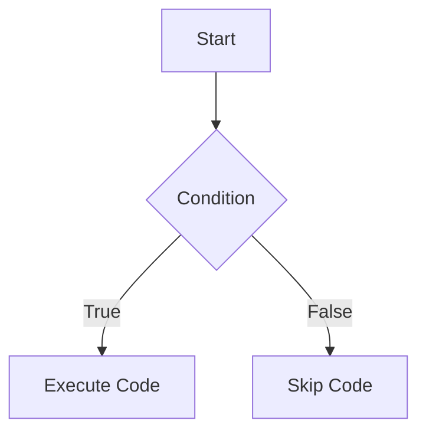

## 2.2.2 Comparison and Logical Operators

In the journey from zero to app store, understanding how to make decisions in your code is crucial. This section will guide you through the use of comparison and logical operators in Dart, the language used for Flutter development. These operators are fundamental for constructing logical expressions and controlling the flow of your application.

### Understanding Comparison Operators

Comparison operators are used to compare two values. The result of a comparison is a Boolean value: `true` or `false`. Here are the primary comparison operators in Dart:

- **Equality (`==`)**: Checks if two values are equal.
- **Inequality (`!=`)**: Checks if two values are not equal.
- **Greater than (`>`)**: Checks if the left value is greater than the right value.
- **Less than (`<`)**: Checks if the left value is less than the right value.
- **Greater than or equal to (`>=`)**: Checks if the left value is greater than or equal to the right value.
- **Less than or equal to (`<=`)**: Checks if the left value is less than or equal to the right value.

#### Code Examples

Let's look at some examples to see these operators in action:

```dart
void main() {
  bool isEqual = (5 == 5); // true
  bool isNotEqual = (5 != 3); // true
  bool isGreater = (5 > 3); // true
  bool isLess = (3 < 5); // true
  bool isGreaterOrEqual = (5 >= 5); // true
  bool isLessOrEqual = (3 <= 5); // true

  print('isEqual: $isEqual');
  print('isNotEqual: $isNotEqual');
  print('isGreater: $isGreater');
  print('isLess: $isLess');
  print('isGreaterOrEqual: $isGreaterOrEqual');
  print('isLessOrEqual: $isLessOrEqual');
}
```

### Logical Operators

Logical operators are used to combine multiple Boolean expressions. Dart provides three logical operators:

- **Logical AND (`&&`)**: Returns `true` if both operands are true.
- **Logical OR (`||`)**: Returns `true` if at least one operand is true.
- **Logical NOT (`!`)**: Inverts the Boolean value.

#### Truth Tables

Understanding truth tables can help you grasp how logical operators work:

| A     | B     | A && B | A || B | !A    |
|-------|-------|--------|-------|-------|
| true  | true  | true   | true  | false |
| true  | false | false  | true  | false |
| false | true  | false  | true  | true  |
| false | false | false  | false | true  |

#### Code Examples

Here are some examples of logical operators:

```dart
void main() {
  bool result = (5 > 3) && (2 < 4); // true
  bool anotherResult = (5 > 3) || (2 > 4); // true
  bool notTrue = !(5 == 5); // false

  print('result: $result');
  print('anotherResult: $anotherResult');
  print('notTrue: $notTrue');
}
```

### Combining Expressions

You can combine comparison and logical operators to form complex expressions. This is particularly useful in control flow statements like `if` statements and loops.

#### Example: User Authentication

Consider a scenario where you need to check if a user is logged in and has the correct permissions:

```dart
void main() {
  bool isLoggedIn = true;
  bool hasPermission = false;

  if (isLoggedIn && hasPermission) {
    print('Access granted.');
  } else {
    print('Access denied.');
  }
}
```

### Usage in Control Flow

Comparison and logical operators are integral to control flow in programming. They help determine which path of execution your program should take.

#### If Statements

The `if` statement is used to execute code based on a condition. If the condition evaluates to `true`, the code block inside the `if` statement is executed.

```dart
void main() {
  int age = 20;

  if (age >= 18) {
    print('You are an adult.');
  } else {
    print('You are a minor.');
  }
}
```

#### Loops

Logical operators can also be used in loops to control the iteration process.

```dart
void main() {
  int count = 0;

  while (count < 5) {
    print('Count is $count');
    count++;
  }
}
```

### Visualizing Control Flow with Mermaid.js

To better understand how logical flow works in an `if` statement, let's visualize it using a Mermaid.js diagram:



### Best Practices and Common Pitfalls

- **Use Parentheses for Clarity**: When combining multiple logical operators, use parentheses to make the order of operations clear.
- **Avoid Assignment in Comparisons**: Remember that `=` is for assignment, while `==` is for comparison. Mixing these up can lead to bugs.
- **Test Your Expressions**: Use a Dart console or REPL to test your expressions and understand their behavior.

### Encouragement for Hands-On Practice

I encourage you to try these examples in a Dart environment. Experiment with different values and conditions to see how the operators work. This hands-on practice will solidify your understanding and prepare you for more complex programming challenges.

## Quiz Time!



### Which operator checks for equality between two values?

- [x] ==
- [ ] !=
- [ ] >
- [ ] <

> **Explanation:** The `==` operator is used to check if two values are equal.

### What is the result of the expression `(5 != 3)`?

- [x] true
- [ ] false

> **Explanation:** The expression `(5 != 3)` evaluates to `true` because 5 is not equal to 3.

### Which logical operator returns `true` if both operands are true?

- [x] &&
- [ ] ||
- [ ] !

> **Explanation:** The `&&` operator returns `true` only if both operands are true.

### What does the expression `!(5 == 5)` evaluate to?

- [x] false
- [ ] true

> **Explanation:** The expression `!(5 == 5)` evaluates to `false` because `5 == 5` is `true`, and the `!` operator inverts it.

### Which of the following expressions evaluates to `true`?

- [x] (5 > 3) || (2 > 4)
- [ ] (5 < 3) && (2 < 4)
- [ ] !(5 > 3)
- [ ] (5 == 3)

> **Explanation:** The expression `(5 > 3) || (2 > 4)` evaluates to `true` because `5 > 3` is `true`.

### What is the result of the expression `(3 <= 5)`?

- [x] true
- [ ] false

> **Explanation:** The expression `(3 <= 5)` evaluates to `true` because 3 is less than or equal to 5.

### Which operator is used to check if two values are not equal?

- [x] !=
- [ ] ==
- [ ] >
- [ ] <

> **Explanation:** The `!=` operator is used to check if two values are not equal.

### In the expression `(5 > 3) && (2 < 4)`, what is the result?

- [x] true
- [ ] false

> **Explanation:** Both `(5 > 3)` and `(2 < 4)` are true, so the entire expression evaluates to `true`.

### Which logical operator returns `true` if at least one operand is true?

- [x] ||
- [ ] &&
- [ ] !

> **Explanation:** The `||` operator returns `true` if at least one operand is true.

### True or False: The expression `(5 >= 5)` evaluates to `false`.

- [ ] True
- [x] False

> **Explanation:** The expression `(5 >= 5)` evaluates to `true` because 5 is equal to 5.



By mastering comparison and logical operators, you are well-equipped to handle decision-making in your Flutter applications. These tools will enable you to create more dynamic and responsive apps, paving the way for your journey from zero to the app store.
