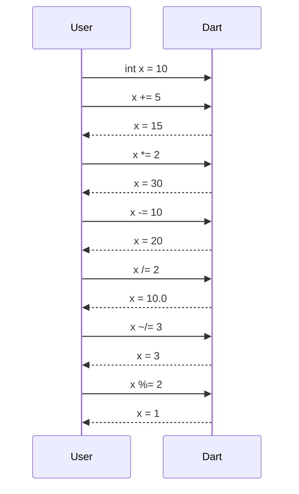
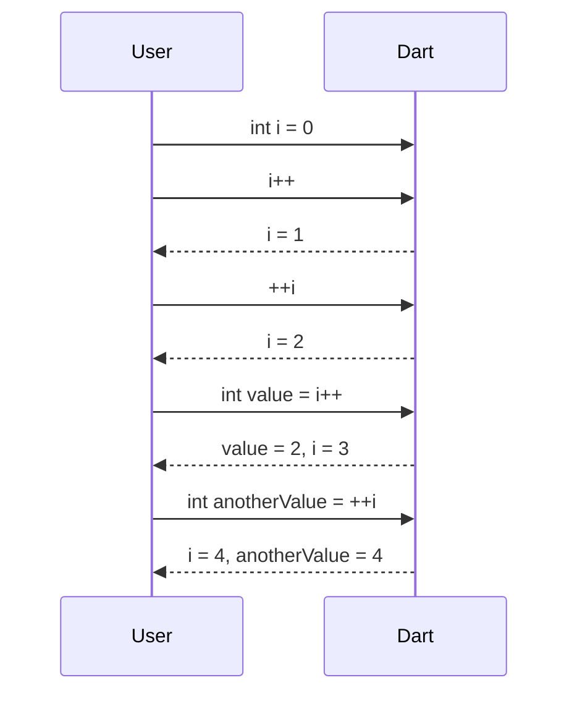

## 2.2.3 Assignment Operators

In the journey from zero to the App Store with your first Flutter app, understanding the nuances of Dart's assignment operators is crucial. These operators not only allow you to assign values to variables but also enable you to write more concise and efficient code. This section will delve into basic and compound assignment operators, as well as increment and decrement operators, providing you with the tools to optimize your code.

### Basic Assignment

At the heart of any programming language is the ability to assign values to variables. In Dart, the basic assignment operator is `=`. This operator assigns the value on the right to the variable on the left.

```dart
int age = 25;
String name = 'Flutter Developer';
bool isActive = true;
```

In these examples, the variables `age`, `name`, and `isActive` are assigned the values `25`, `'Flutter Developer'`, and `true`, respectively. The `=` operator is straightforward, but its simplicity belies its importance in setting up the initial state of your variables.

### Compound Assignment Operators

Compound assignment operators provide a shorthand way to perform an operation on a variable and assign the result back to that variable. These operators include `+=`, `-=`, `*=`, `/=`, `~/=`, and `%=`, each combining an arithmetic operation with assignment.

#### Examples of Compound Assignments

Let's explore these operators with practical examples:

```dart
int x = 10;
x += 5; // x is now 15
x *= 2; // x is now 30
x -= 10; // x is now 20
x /= 2; // x is now 10.0
x ~/= 3; // x is now 3 (integer division)
x %= 2; // x is now 1 (remainder of division by 2)
```

Each of these operations modifies the value of `x` by performing the specified arithmetic operation and then assigning the result back to `x`. This approach reduces verbosity and enhances readability, especially in complex calculations.

#### Sequence Diagram for Compound Assignments

To visualize how compound assignments work, consider the following sequence diagram:



This diagram illustrates the step-by-step transformation of the variable `x` as different compound assignments are applied.

### Increment and Decrement Operators

Increment (`++`) and decrement (`--`) operators are used to increase or decrease a variable's value by one, respectively. These operators can be used in both prefix and postfix forms, which can lead to different outcomes.

#### Prefix vs. Postfix

- **Prefix (`++i` or `--i`)**: The operation is performed before the value is used in an expression.
- **Postfix (`i++` or `i--`)**: The operation is performed after the value is used in an expression.

#### Examples of Increment and Decrement

Consider the following examples to understand the difference:

```dart
int i = 0;
i++; // i is now 1
++i; // i is now 2
int value = i++; // value is 2, i is now 3
int anotherValue = ++i; // i is now 4, anotherValue is 4
```

In these examples, notice how the prefix and postfix forms affect the value of `i` and the assigned values of `value` and `anotherValue`.

#### Sequence Diagram for Increment Operations

To further clarify, here is a sequence diagram illustrating increment operations:



This diagram helps visualize how the increment operations modify the variable `i` and affect the assignment of `value` and `anotherValue`.

### Best Practices and Common Pitfalls

#### Best Practices

- **Clarity Over Brevity**: While compound assignments and increment/decrement operators can make code concise, prioritize clarity. If an expression becomes difficult to understand, consider breaking it down into simpler statements.
- **Consistent Use**: Stick to a consistent style when using these operators to improve code readability and maintainability.

#### Common Pitfalls

- **Misunderstanding Prefix and Postfix**: Confusion often arises from the difference between prefix and postfix forms. Always verify the intended behavior in your code.
- **Integer Division**: The `~/=` operator performs integer division, which can lead to unexpected results if floating-point division is intended.

### Hands-On Practice

To solidify your understanding, try rewriting the following expressions using different operators:

1. Convert `x = x + 10` using a compound assignment.
2. Rewrite `i = i - 1` using a decrement operator.
3. Use a prefix increment to simplify `i = i + 1`.

### Conclusion

Mastering assignment operators in Dart is a fundamental skill for any Flutter developer. These operators not only streamline your code but also enhance its efficiency and readability. By understanding and practicing these concepts, you'll be well-equipped to tackle more complex programming challenges as you progress in your Flutter app development journey.

## Quiz Time!



### What does the `=` operator do in Dart?

- [x] Assigns a value to a variable
- [ ] Compares two values
- [ ] Increments a variable
- [ ] Divides two numbers

> **Explanation:** The `=` operator is used to assign a value to a variable in Dart.

### Which of the following is a compound assignment operator?

- [x] `+=`
- [ ] `==`
- [ ] `<>`
- [ ] `&&`

> **Explanation:** `+=` is a compound assignment operator that adds a value to a variable and assigns the result back to the variable.

### What is the result of `x *= 3` if `x` is initially `4`?

- [x] 12
- [ ] 7
- [ ] 1
- [ ] 9

> **Explanation:** `x *= 3` multiplies `x` by `3` and assigns the result back to `x`, resulting in `12`.

### What is the difference between `i++` and `++i`?

- [x] `i++` returns the original value before incrementing, `++i` increments first then returns the value
- [ ] `i++` increments by 2, `++i` increments by 1
- [ ] `i++` decrements, `++i` increments
- [ ] There is no difference

> **Explanation:** `i++` is the postfix form, which returns the original value before incrementing, while `++i` is the prefix form, which increments first then returns the value.

### Which operator would you use for integer division in Dart?

- [x] `~/=`
- [ ] `/=`
- [ ] `%=`
- [ ] `*=`

> **Explanation:** The `~/=` operator is used for integer division in Dart.

### What does `x %= 3` do if `x` is initially `10`?

- [x] Sets `x` to `1`
- [ ] Sets `x` to `3`
- [ ] Sets `x` to `0`
- [ ] Sets `x` to `10`

> **Explanation:** `x %= 3` calculates the remainder of `x` divided by `3`, which is `1`.

### How does `int value = i++` differ from `int value = ++i`?

- [x] `value` is assigned before incrementing in `i++`, after incrementing in `++i`
- [ ] Both result in the same value
- [ ] `i++` results in a syntax error
- [ ] `++i` results in a syntax error

> **Explanation:** In `int value = i++`, `value` is assigned the original value of `i` before incrementing. In `int value = ++i`, `value` is assigned after incrementing `i`.

### What is the purpose of the `--` operator?

- [x] Decreases a variable's value by one
- [ ] Increases a variable's value by one
- [ ] Multiplies a variable by two
- [ ] Divides a variable by two

> **Explanation:** The `--` operator decreases a variable's value by one.

### Which of the following statements is true about compound assignments?

- [x] They combine an arithmetic operation with assignment
- [ ] They are used to compare two values
- [ ] They are only used with strings
- [ ] They cannot be used with integers

> **Explanation:** Compound assignments combine an arithmetic operation with assignment, allowing for more concise code.

### True or False: The `+=` operator can be used to concatenate strings in Dart.

- [x] True
- [ ] False

> **Explanation:** In Dart, the `+=` operator can be used to concatenate strings, appending the right-hand string to the left-hand string.


