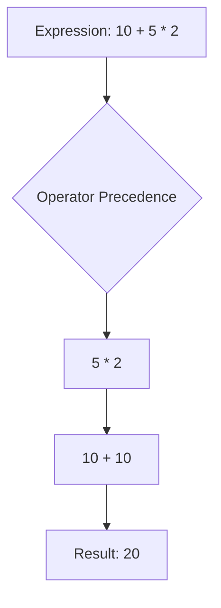

## 2.2.4 Operator Precedence

In the journey from zero to publishing your first Flutter app, understanding how Dart evaluates expressions is crucial for writing accurate and predictable code. Operator precedence determines the order in which parts of an expression are evaluated. Misunderstanding this concept can lead to unexpected results and bugs that are difficult to trace. This section will guide you through the intricacies of operator precedence in Dart, using practical examples and visual aids to solidify your understanding.

### Explanation of Precedence

Operator precedence in Dart, as in many programming languages, dictates the order in which different operations are performed in an expression. Operators with higher precedence are evaluated before those with lower precedence. For instance, multiplication and division have higher precedence than addition and subtraction, meaning they are executed first in an expression without parentheses.

Understanding operator precedence is essential for writing expressions that behave as intended. Without this knowledge, you might find your code producing unexpected results, leading to errors and bugs that can be challenging to debug.

### Operator Precedence Table

Below is a simplified table listing some of the most common operators in Dart, ordered from highest to lowest precedence:

| Precedence Level | Operators                             |
|------------------|---------------------------------------|
| 1                | `[]`, `()`, `.`                       |
| 2                | `++`, `--`, `-` (unary), `!`, `~`     |
| 3                | `*`, `/`, `%`, `~/`                   |
| 4                | `+`, `-`                              |
| 5                | `<<`, `>>`, `>>>`                     |
| 6                | `&`                                   |
| 7                | `^`                                   |
| 8                | `|`                                   |
| 9                | `&&`                                  |
| 10               | `||`                                  |
| 11               | `??`                                  |
| 12               | `?:` (conditional expressions)        |
| 13               | `=`, `+=`, `-=`, `*=`, `/=`, `%=`     |

This table is not exhaustive but covers the operators you will frequently encounter in Flutter development. Understanding this hierarchy allows you to predict how expressions are evaluated and ensures your code behaves as expected.

### Use of Parentheses

Parentheses are a powerful tool in programming, allowing you to override the default precedence rules to ensure expressions are evaluated in the order you intend. By grouping parts of an expression with parentheses, you can make your code more readable and maintainable, reducing the likelihood of errors.

#### Code Example Without Parentheses

Consider the following Dart code:

```dart
int result = 10 + 5 * 2; // result is 20
```

In this expression, the multiplication operator (`*`) has higher precedence than the addition operator (`+`). Therefore, `5 * 2` is evaluated first, resulting in `10`, and then `10 + 10` is evaluated, giving a final result of `20`.

#### Code Example With Parentheses

By using parentheses, you can change the order of evaluation:

```dart
int result = (10 + 5) * 2; // result is 30
```

Here, the expression inside the parentheses is evaluated first, resulting in `15`. Then, `15 * 2` is evaluated, giving a final result of `30`.

#### Logical Operators Precedence

Logical operators also follow precedence rules, which can affect the outcome of boolean expressions:

```dart
bool value = true || false && false; // value is true
bool anotherValue = (true || false) && false; // anotherValue is false
```

In the first expression, the `&&` operator has higher precedence than `||`, so `false && false` is evaluated first, resulting in `false`. Then, `true || false` is evaluated, resulting in `true`.

In the second expression, the parentheses force the `||` operation to be evaluated first, resulting in `true`. Then, `true && false` is evaluated, resulting in `false`.

### Common Pitfalls

Misunderstanding operator precedence can lead to subtle bugs that are difficult to diagnose. Here are some common pitfalls to watch out for:

- **Assuming Left-to-Right Evaluation**: While many operators are evaluated left to right, this is not always the case. Always refer to the precedence table when in doubt.
- **Neglecting Parentheses**: Failing to use parentheses can lead to unexpected results, especially in complex expressions involving multiple operators.
- **Logical Operator Confusion**: Logical operators (`&&`, `||`) can be particularly tricky. Always double-check your logic and consider using parentheses for clarity.

### Visual Aids

To further illustrate the concept of operator precedence, let's use a Mermaid.js flowchart to visualize the evaluation order of an expression:



This flowchart shows the evaluation order for the expression `10 + 5 * 2`. The multiplication is performed first, followed by the addition.

### Best Practices

- **Use Parentheses for Clarity**: Even when parentheses are not strictly necessary, using them can make your code more readable and easier to understand.
- **Test Complex Expressions**: Break down complex expressions into smaller parts and test them step by step to ensure they behave as expected.
- **Prioritize Readability**: Write code that is easy to read and understand, especially if you are working in a team or plan to maintain the code in the future.

### Conclusion

Understanding operator precedence is crucial for writing correct and efficient Dart code. By mastering this concept, you can avoid common pitfalls and ensure your Flutter applications behave as intended. Remember to use parentheses to clarify complex expressions and test your code thoroughly to catch any unexpected behavior.

## Quiz Time!



### What is operator precedence?

- [x] The order in which operators are evaluated in an expression.
- [ ] The order in which variables are declared.
- [ ] The order in which functions are called.
- [ ] The order in which classes are defined.

> **Explanation:** Operator precedence determines the order in which operations are performed in an expression.

### Which operator has higher precedence, `*` or `+`?

- [x] `*`
- [ ] `+`

> **Explanation:** The multiplication operator (`*`) has higher precedence than the addition operator (`+`).

### How can you override the default operator precedence?

- [x] By using parentheses.
- [ ] By using brackets.
- [ ] By using curly braces.
- [ ] By using semicolons.

> **Explanation:** Parentheses can be used to override the default precedence and dictate the order of evaluation.

### What is the result of `10 + 5 * 2` without parentheses?

- [x] 20
- [ ] 30
- [ ] 25
- [ ] 15

> **Explanation:** The multiplication is performed first, resulting in `10 + 10`, which equals `20`.

### What is the result of `(10 + 5) * 2`?

- [x] 30
- [ ] 20
- [ ] 25
- [ ] 15

> **Explanation:** The expression inside the parentheses is evaluated first, resulting in `15 * 2`, which equals `30`.

### Which logical operator has higher precedence, `&&` or `||`?

- [x] `&&`
- [ ] `||`

> **Explanation:** The logical AND operator (`&&`) has higher precedence than the logical OR operator (`||`).

### What is the result of `true || false && false`?

- [x] true
- [ ] false

> **Explanation:** The `&&` operation is evaluated first, resulting in `false`, then `true || false` is evaluated, resulting in `true`.

### What is the result of `(true || false) && false`?

- [x] false
- [ ] true

> **Explanation:** The expression inside the parentheses is evaluated first, resulting in `true`, then `true && false` is evaluated, resulting in `false`.

### Why is it important to understand operator precedence?

- [x] To ensure expressions are evaluated as intended.
- [ ] To declare variables correctly.
- [ ] To define functions properly.
- [ ] To organize classes efficiently.

> **Explanation:** Understanding operator precedence helps in writing expressions that behave as expected, avoiding bugs.

### True or False: Using parentheses can make code more readable.

- [x] True
- [ ] False

> **Explanation:** Parentheses can clarify the intended order of operations, making code easier to read and understand.


