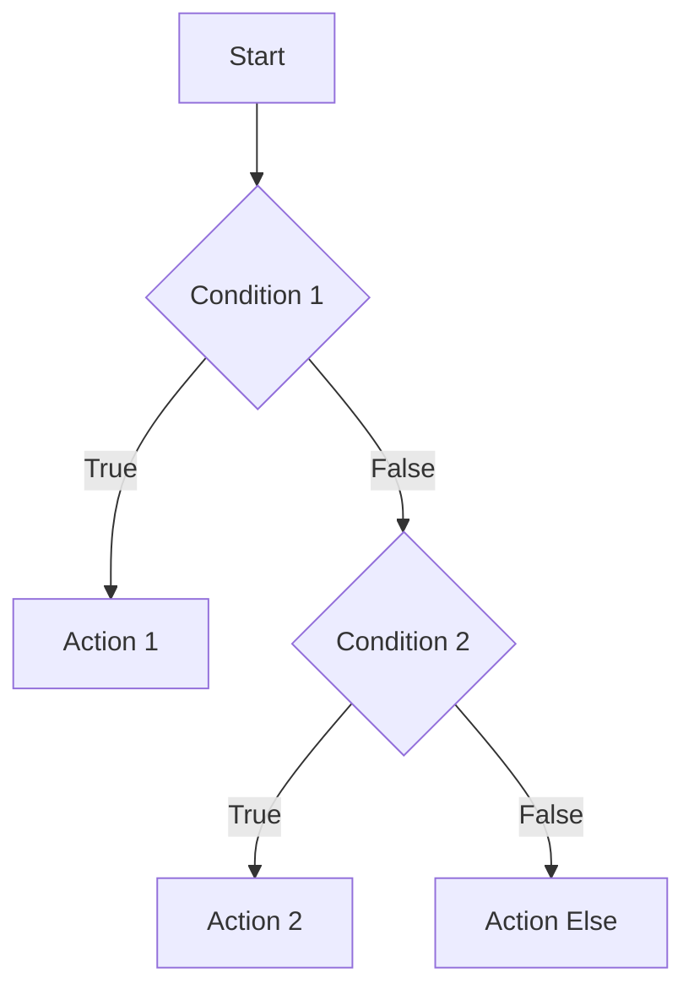

## 2.3.1 Conditional Statements (if/else)

In the journey from zero to the app store, understanding how to control the flow of your application is crucial. Conditional statements, particularly `if`, `else if`, and `else`, are foundational tools that allow you to execute code based on specific conditions. This section will guide you through mastering these constructs in Flutter, using Dart as the programming language.

### Understanding Conditional Statements

Conditional statements are the backbone of decision-making in programming. They allow your application to react differently based on varying inputs or states. Imagine an app that needs to display different messages based on the user's age or a weather app that changes its interface according to the temperature. These scenarios are made possible through conditional logic.

#### Basic `if` Statement

The `if` statement is the simplest form of conditional execution. It evaluates a condition that results in a boolean value (`true` or `false`). If the condition is `true`, the code block inside the `if` statement is executed.

**Example:**

```dart
int age = 20;
if (age >= 18) {
  print('You are an adult.');
}
```

In this example, the condition `age >= 18` is evaluated. If `age` is 18 or more, the message "You are an adult." is printed.

#### `else` Clause

The `else` clause provides an alternative path when the `if` condition is `false`. This is useful for handling binary decisions.

**Example:**

```dart
int score = 55;
if (score >= 60) {
  print('Passed');
} else {
  print('Failed');
}
```

Here, if the `score` is 60 or above, "Passed" is printed. Otherwise, "Failed" is printed.

#### `else if` for Multiple Conditions

When you need to check multiple conditions, `else if` comes into play. It allows you to evaluate additional conditions if the previous ones are `false`.

**Example:**

```dart
int temperature = 25;
if (temperature > 30) {
  print('It\'s hot outside.');
} else if (temperature >= 20) {
  print('The weather is nice.');
} else {
  print('It\'s cold outside.');
}
```

This example checks if the temperature is above 30, between 20 and 30, or below 20, printing a corresponding message for each range.

### Visualizing Conditional Logic

To better understand the flow of an `if/else if/else` statement, let's look at a flowchart representation:



This flowchart illustrates how the program evaluates conditions sequentially, executing the corresponding action when a condition is met.

### Nested Conditions

Sometimes, you may need to nest `if` statements within each other. This can be useful for more complex decision-making processes.

**Example:**

```dart
int age = 25;
bool hasID = true;

if (age >= 18) {
  if (hasID) {
    print('You are allowed to enter.');
  } else {
    print('ID is required.');
  }
} else {
  print('You are not old enough to enter.');
}
```

In this example, the program first checks if the person is 18 or older. If true, it then checks if the person has an ID. Nested conditions should be used judiciously to maintain code readability.

### Best Practices for Conditional Statements

1. **Clarity and Readability**: Always aim for clear and readable code. Use meaningful variable names and keep your conditions straightforward.

2. **Consistent Formatting**: Use consistent indentation and formatting to make your code easier to read and maintain.

3. **Avoid Deep Nesting**: Deeply nested conditions can become difficult to follow. Consider refactoring your code or using logical operators to simplify conditions.

4. **Test Thoroughly**: Ensure you test your conditions with various inputs to cover all possible scenarios.

5. **Use Logical Operators**: Combine conditions using logical operators (`&&`, `||`) to reduce nesting and improve readability.

### Real-World Scenarios

Let's explore a real-world scenario where conditional statements play a crucial role:

#### Scenario: User Authentication

Imagine an app that requires user authentication. You need to check if the user is logged in and has the necessary permissions to access a feature.

**Example:**

```dart
bool isLoggedIn = true;
bool hasPermission = false;

if (isLoggedIn) {
  if (hasPermission) {
    print('Access granted.');
  } else {
    print('Permission denied.');
  }
} else {
  print('Please log in.');
}
```

In this scenario, the app checks if the user is logged in first. If true, it then checks for the necessary permissions.

### Troubleshooting Tips

- **Common Pitfall**: Forgetting to use curly braces `{}` for multi-line statements. Always use them to avoid logical errors.
- **Logical Errors**: Double-check your conditions and ensure they logically represent the intended decision-making process.
- **Debugging**: Use print statements or a debugger to trace the flow of your program and verify that conditions are evaluated as expected.

### Encouragement for Practice

To master conditional statements, practice is key. Try implementing different scenarios and test your code with various inputs. Experiment with nested conditions and logical operators to see how they affect the flow of your program.

### Conclusion

Conditional statements are a fundamental part of programming that allow you to control the flow of your application. By mastering `if`, `else if`, and `else`, you can create dynamic and responsive applications that react to different inputs and states. Remember to follow best practices for clarity and readability, and always test your code thoroughly.

## Quiz Time!



### What is the primary purpose of an `if` statement in programming?

- [x] To execute code based on a condition that evaluates to true or false.
- [ ] To create loops in a program.
- [ ] To declare variables.
- [ ] To handle exceptions.

> **Explanation:** The `if` statement is used to execute code conditionally, based on whether a given condition evaluates to true or false.

### How does an `else` clause function in a conditional statement?

- [x] It provides an alternative path when the `if` condition is false.
- [ ] It executes code when the `if` condition is true.
- [ ] It is used to terminate a loop.
- [ ] It defines a new variable scope.

> **Explanation:** The `else` clause is executed when the `if` condition is false, providing an alternative path in the program flow.

### Which statement is used to check multiple conditions in sequence?

- [x] `else if`
- [ ] `switch`
- [ ] `for`
- [ ] `while`

> **Explanation:** The `else if` statement allows you to check multiple conditions in sequence, executing the corresponding block of code when a condition is true.

### What is a potential downside of deeply nested `if` statements?

- [x] They can make the code difficult to read and maintain.
- [ ] They execute faster than flat conditions.
- [ ] They reduce the number of lines of code.
- [ ] They are easier to debug.

> **Explanation:** Deeply nested `if` statements can make the code difficult to read and maintain, which is why it's often better to refactor or simplify them.

### In the following code, what will be printed if `temperature` is 25?

```dart
int temperature = 25;
if (temperature > 30) {
  print('It\'s hot outside.');
} else if (temperature >= 20) {
  print('The weather is nice.');
} else {
  print('It\'s cold outside.');
}
```

- [ ] It's hot outside.
- [x] The weather is nice.
- [ ] It's cold outside.
- [ ] No output.

> **Explanation:** Since `temperature` is 25, the condition `temperature >= 20` is true, so "The weather is nice." is printed.

### What should you use to combine multiple conditions in a single `if` statement?

- [x] Logical operators (`&&`, `||`)
- [ ] Arithmetic operators (`+`, `-`)
- [ ] Assignment operators (`=`, `+=`)
- [ ] Comparison operators (`==`, `!=`)

> **Explanation:** Logical operators like `&&` (and) and `||` (or) are used to combine multiple conditions in a single `if` statement.

### Which of the following is a best practice for writing conditional statements?

- [x] Use consistent indentation and formatting.
- [ ] Avoid using curly braces for single-line statements.
- [ ] Nest conditions as deeply as possible.
- [ ] Use global variables for all conditions.

> **Explanation:** Consistent indentation and formatting improve code readability and maintainability, which is a best practice in programming.

### What is the output of the following code if `age` is 17 and `hasID` is true?

```dart
int age = 17;
bool hasID = true;

if (age >= 18) {
  if (hasID) {
    print('You are allowed to enter.');
  } else {
    print('ID is required.');
  }
} else {
  print('You are not old enough to enter.');
}
```

- [ ] You are allowed to enter.
- [ ] ID is required.
- [x] You are not old enough to enter.
- [ ] No output.

> **Explanation:** Since `age` is 17, the outer `if` condition `age >= 18` is false, so the `else` block is executed, printing "You are not old enough to enter."

### Which of the following scenarios is best handled by using conditional statements?

- [x] Displaying different messages based on user input.
- [ ] Iterating over a list of items.
- [ ] Declaring a constant value.
- [ ] Importing a library.

> **Explanation:** Conditional statements are ideal for scenarios where different actions need to be taken based on user input or other conditions.

### True or False: Conditional statements can only be used with numeric data types.

- [ ] True
- [x] False

> **Explanation:** Conditional statements can be used with any data type that can be evaluated to a boolean value, not just numeric types.


