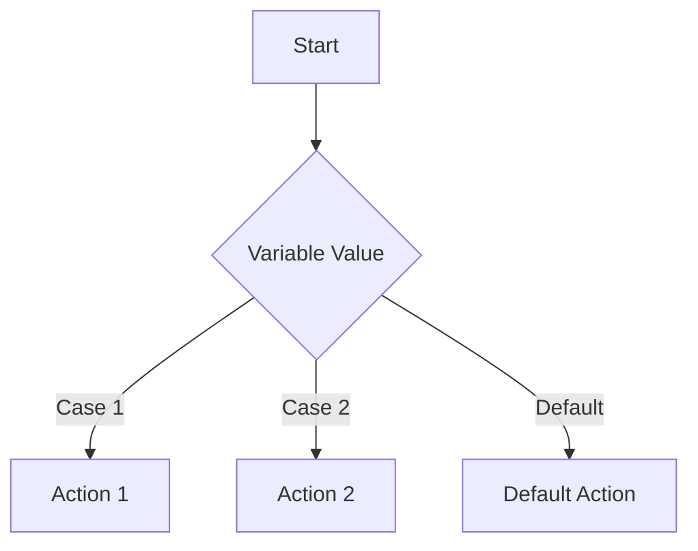

## 2.3.2 Switch Statements

In the realm of programming, decision-making structures are pivotal for controlling the flow of execution. Among these structures, the `switch` statement stands out as a powerful tool for handling multiple conditional branches based on discrete values. In this section, we will delve into the intricacies of `switch` statements in Dart, a language that powers Flutter, and explore how they can be utilized effectively in your app development journey.

### When to Use `switch`

The `switch` statement is an ideal choice when you need to compare a single variable against multiple constant values. It provides a cleaner and more readable alternative to lengthy `if/else if` chains, especially when dealing with numerous conditions. Here are some scenarios where `switch` is particularly beneficial:

- **Discrete Value Comparison**: When you have a variable that can take on a limited set of known values, such as days of the week or command strings.
- **Enhanced Readability**: When the logic involves multiple branches that are easier to understand when visually separated by cases.
- **Performance Considerations**: In some cases, `switch` statements can be more performant than `if/else` chains, though this depends on the specific implementation and compiler optimizations.

### Syntax and Structure

Understanding the syntax and structure of a `switch` statement is crucial for its effective use. Let's break down the components:

- **Switch Expression**: The variable or expression being evaluated.
- **Case Clauses**: Each `case` clause represents a potential match for the switch expression.
- **Default Clause**: The `default` clause is executed if none of the `case` clauses match.

Here is the basic structure of a `switch` statement in Dart:

```dart
switch (expression) {
  case value1:
    // Code to execute if expression == value1
    break;
  case value2:
    // Code to execute if expression == value2
    break;
  // Additional cases...
  default:
    // Code to execute if no case matches
}
```

#### Example: Days of the Week

Consider an example where you want to print the name of the day based on an integer value:

```dart
void printDayOfWeek(int dayOfWeek) {
  switch (dayOfWeek) {
    case 1:
      print('Monday');
      break;
    case 2:
      print('Tuesday');
      break;
    case 3:
      print('Wednesday');
      break;
    case 4:
      print('Thursday');
      break;
    case 5:
      print('Friday');
      break;
    case 6:
      print('Saturday');
      break;
    case 7:
      print('Sunday');
      break;
    default:
      print('Invalid day');
  }
}
```

In this example, the `switch` statement evaluates the `dayOfWeek` variable and executes the corresponding `case` block. The `default` case handles any values outside the expected range.

### Using `break` and `continue`

The `break` statement is essential in `switch` statements to prevent fall-through, where execution continues into the next `case` block even if a match is found. Without `break`, all subsequent cases would be executed, leading to unintended behavior. Here's why `break` is crucial:

- **Prevents Fall-Through**: Ensures that only the matched case is executed.
- **Enhances Readability**: Makes the code easier to follow by clearly delineating case boundaries.

In Dart, the `continue` statement is not used within `switch` statements as it is in some other languages. Instead, `continue` is typically used in loops to skip the current iteration and proceed to the next.

### Limitations of `switch` Statements

While `switch` statements are powerful, they come with certain limitations:

- **Type Restrictions**: In Dart, `switch` statements can only be used with specific types, such as `int`, `String`, and enum types. This limitation ensures that the values being compared are discrete and constant.
- **No Range Checks**: Unlike `if` statements, `switch` cannot perform range checks or complex conditions. Each `case` must match a specific value.

### Best Practices for `switch` Statements

To make the most out of `switch` statements, consider these best practices:

- **Always Include a `default` Case**: Even if you believe all possible values are covered by `case` clauses, including a `default` case ensures that unexpected values are handled gracefully.
- **Keep Cases Simple**: Avoid complex logic within `case` blocks. If necessary, delegate complex operations to separate functions.
- **Use Enums for Clarity**: When possible, use enums instead of integers or strings for `switch` expressions. Enums provide better type safety and readability.

### Code Examples

#### Basic `switch` Statement

Here is a simple example of a `switch` statement that prints the name of the day based on an integer input:

```dart
void printDayOfWeek(int dayOfWeek) {
  switch (dayOfWeek) {
    case 1:
      print('Monday');
      break;
    case 2:
      print('Tuesday');
      break;
    case 3:
      print('Wednesday');
      break;
    case 4:
      print('Thursday');
      break;
    case 5:
      print('Friday');
      break;
    case 6:
      print('Saturday');
      break;
    case 7:
      print('Sunday');
      break;
    default:
      print('Invalid day');
  }
}
```

#### Using Strings in `switch`

Switch statements can also be used with strings, making them versatile for command processing:

```dart
void executeCommand(String command) {
  switch (command) {
    case 'OPEN':
      executeOpen();
      break;
    case 'CLOSE':
      executeClose();
      break;
    default:
      print('Unknown command');
  }
}

void executeOpen() {
  print('Executing open command...');
}

void executeClose() {
  print('Executing close command...');
}
```

### Visual Aids: Switch-Case Flow

To better understand the flow of a `switch` statement, consider the following Mermaid.js flowchart:



This diagram illustrates how the `switch` statement evaluates the variable and directs the flow to the appropriate action based on the matched case or the default action if no match is found.

### Writing Tips

When deciding between `switch` and `if` statements, consider the following:

- **Readability**: If the logic involves multiple discrete values, `switch` can enhance readability by clearly separating each case.
- **Complex Conditions**: For complex conditions involving ranges or multiple variables, `if` statements may be more appropriate.
- **Performance**: While performance differences are typically negligible, `switch` statements can offer slight optimizations in some scenarios.

### Practical Applications

To solidify your understanding, try implementing a simple command-line application that uses `switch` statements to handle user input. For example, create a menu-driven program that performs different actions based on the user's choice.

```dart
import 'dart:io';

void main() {
  while (true) {
    print('Menu:');
    print('1. Say Hello');
    print('2. Say Goodbye');
    print('3. Exit');
    stdout.write('Enter your choice: ');
    String? input = stdin.readLineSync();

    if (input == null) continue;

    switch (input) {
      case '1':
        print('Hello!');
        break;
      case '2':
        print('Goodbye!');
        break;
      case '3':
        print('Exiting...');
        return;
      default:
        print('Invalid choice. Please try again.');
    }
  }
}
```

This example demonstrates how `switch` statements can be used to create a simple interactive menu, showcasing their utility in real-world applications.

### Troubleshooting Tips

- **Missing `break` Statements**: If your `switch` statement is executing multiple cases, ensure that each `case` block ends with a `break` statement.
- **Unhandled Values**: Always include a `default` case to handle unexpected values gracefully.
- **Type Mismatches**: Ensure that the type of the switch expression matches the types of the case values.

### Conclusion

Switch statements are a powerful tool in Dart, offering a clean and efficient way to handle multi-way branching based on discrete values. By understanding their syntax, limitations, and best practices, you can leverage `switch` statements to enhance the clarity and maintainability of your Flutter applications. As you continue your journey from zero to the app store, mastering these fundamental constructs will serve you well in building robust and user-friendly apps.

## Quiz Time!



### What is the primary advantage of using a `switch` statement over an `if/else if` chain?

- [x] Improved readability for multi-way branching
- [ ] Ability to handle complex conditions
- [ ] Faster execution in all scenarios
- [ ] Support for all data types

> **Explanation:** The primary advantage of a `switch` statement is improved readability when dealing with multiple discrete values. It provides a cleaner structure compared to lengthy `if/else if` chains.

### Which types are supported by `switch` statements in Dart?

- [x] int
- [x] String
- [x] enum types
- [ ] double

> **Explanation:** In Dart, `switch` statements support `int`, `String`, and enum types. They do not support `double` or other complex types.

### What is the purpose of the `break` statement in a `switch` case?

- [x] To prevent fall-through to subsequent cases
- [ ] To exit the program
- [ ] To skip the current iteration
- [ ] To handle exceptions

> **Explanation:** The `break` statement is used to prevent fall-through, ensuring that only the matched case is executed and the flow does not continue to subsequent cases.

### What happens if no `case` matches and there is no `default` clause in a `switch` statement?

- [x] No action is taken
- [ ] The first case is executed
- [ ] An error is thrown
- [ ] The program exits

> **Explanation:** If no `case` matches and there is no `default` clause, no action is taken, and the program continues execution after the `switch` statement.

### In which scenario is a `switch` statement more appropriate than an `if` statement?

- [x] When comparing a variable to multiple constant values
- [ ] When checking for complex conditions
- [ ] When handling exceptions
- [ ] When performing range checks

> **Explanation:** A `switch` statement is more appropriate when comparing a variable to multiple constant values, providing a clearer and more structured approach than `if` statements.

### What is a limitation of `switch` statements in Dart?

- [x] They only work with certain types like `int`, `String`, and enums
- [ ] They cannot be nested
- [ ] They are slower than `if` statements
- [ ] They require a `default` case

> **Explanation:** A limitation of `switch` statements in Dart is that they only work with certain types, such as `int`, `String`, and enums, and cannot handle complex conditions or types.

### Why is it recommended to include a `default` case in a `switch` statement?

- [x] To handle unexpected values gracefully
- [ ] To improve performance
- [ ] To reduce code size
- [ ] To ensure type safety

> **Explanation:** Including a `default` case is recommended to handle unexpected values gracefully, ensuring that the program can respond appropriately even if an unanticipated value is encountered.

### How does the `switch` statement enhance code clarity?

- [x] By clearly separating each case with distinct blocks
- [ ] By allowing complex conditions
- [ ] By supporting all data types
- [ ] By reducing the number of lines of code

> **Explanation:** The `switch` statement enhances code clarity by clearly separating each case with distinct blocks, making it easier to read and understand compared to `if/else if` chains.

### Can `switch` statements in Dart handle range checks?

- [ ] Yes
- [x] No

> **Explanation:** `Switch` statements in Dart cannot handle range checks; they are designed for discrete value comparisons only.

### True or False: The `continue` statement can be used within a `switch` statement in Dart.

- [ ] True
- [x] False

> **Explanation:** In Dart, the `continue` statement is not used within `switch` statements. Instead, it is typically used in loops to skip the current iteration.


