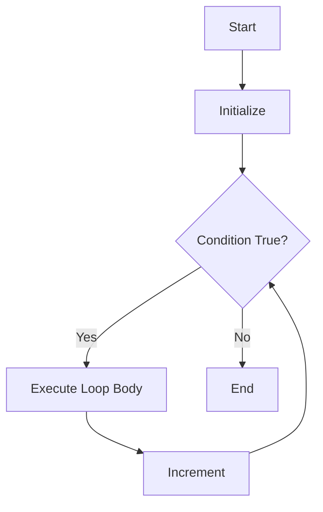
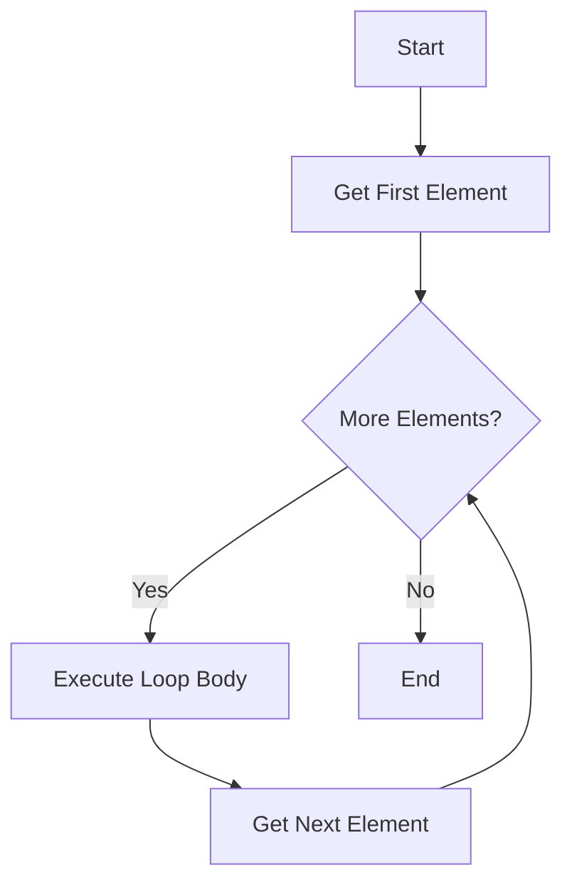
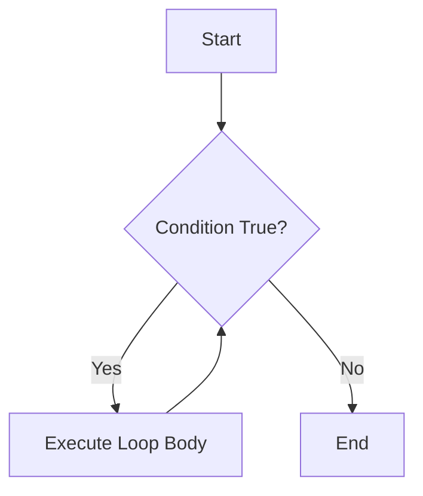
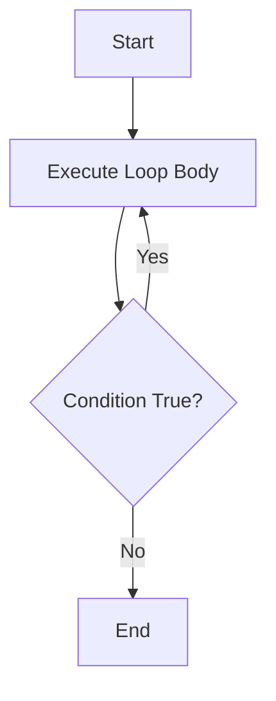

## 2.3.3 Loops: For and While

In the journey of developing your first Flutter app, understanding loops is crucial. Loops allow you to execute a block of code repeatedly, which is essential for tasks such as iterating over collections, managing repetitive tasks, and controlling the flow of your application. In this section, we will delve into the world of loops in Dart, including `for`, `for-in`, `while`, and `do-while` loops. We will explore their syntax, use cases, and best practices to ensure you can harness their full potential in your Flutter applications.

### Understanding the Basics of Loops

Loops are fundamental constructs in programming that allow you to repeat a block of code multiple times. They are particularly useful when you need to perform repetitive tasks, iterate over collections, or manage complex control flows. In Dart, you have several types of loops at your disposal, each with its unique characteristics and use cases.

### The For Loop

The `for` loop is one of the most commonly used loops in programming. It provides a concise way to iterate over a range of values or execute a block of code a specific number of times. The basic syntax of a `for` loop in Dart consists of three components: an initializer, a condition, and an increment (or decrement) expression.

#### Syntax and Components

```dart
for (initializer; condition; increment) {
  // Code to be executed
}
```

- **Initializer**: This is executed once at the beginning of the loop. It typically initializes a counter variable.
- **Condition**: This is evaluated before each iteration. If the condition is true, the loop body is executed. If false, the loop terminates.
- **Increment**: This is executed after each iteration of the loop body. It usually updates the counter variable.

#### Example: Basic For Loop

Let's look at a simple example of a `for` loop that prints numbers from 0 to 4:

```dart
for (int i = 0; i < 5; i++) {
  print('Iteration $i');
}
```

In this example:
- The loop starts with `i` initialized to 0.
- The condition `i < 5` ensures the loop runs as long as `i` is less than 5.
- After each iteration, `i` is incremented by 1.

#### Practical Use Case

A common use case for a `for` loop is iterating over a range of numbers, such as generating a sequence of numbers for indexing or processing elements in an array.

### The For-In Loop

The `for-in` loop is a specialized loop designed for iterating over collections, such as lists or sets. It simplifies the process of accessing each element in a collection without needing an explicit counter.

#### Syntax and Components

```dart
for (var element in collection) {
  // Code to be executed
}
```

- **Element**: Represents the current element in the collection.
- **Collection**: The collection being iterated over.

#### Example: For-In Loop

Consider a list of numbers, and we want to print each number:

```dart
var numbers = [1, 2, 3];
for (var number in numbers) {
  print(number);
}
```

In this example, the `for-in` loop iterates over each element in the `numbers` list, printing each one.

#### Practical Use Case

The `for-in` loop is ideal for scenarios where you need to process each element in a collection, such as filtering, transforming, or aggregating data.

### The While Loop

The `while` loop is used when you want to execute a block of code as long as a specified condition is true. Unlike the `for` loop, the `while` loop does not require an initializer or increment expression.

#### Syntax and Components

```dart
while (condition) {
  // Code to be executed
}
```

- **Condition**: Evaluated before each iteration. If true, the loop body is executed. If false, the loop terminates.

#### Example: While Loop

Here's an example of a `while` loop that prints numbers from 0 to 2:

```dart
int count = 0;
while (count < 3) {
  print('Count is $count');
  count++;
}
```

In this example:
- The loop continues as long as `count` is less than 3.
- The `count` variable is incremented after each iteration.

#### Practical Use Case

The `while` loop is useful when the number of iterations is not known beforehand, such as reading data from a stream until a certain condition is met.

### The Do-While Loop

The `do-while` loop is similar to the `while` loop, but it guarantees that the loop body is executed at least once. This is because the condition is evaluated after the loop body.

#### Syntax and Components

```dart
do {
  // Code to be executed
} while (condition);
```

- **Condition**: Evaluated after each iteration. If true, the loop continues. If false, the loop terminates.

#### Example: Do-While Loop

Here's an example of a `do-while` loop that prints numbers from 0 to 2:

```dart
int index = 0;
do {
  print('Index is $index');
  index++;
} while (index < 3);
```

In this example:
- The loop body is executed first, and then the condition `index < 3` is checked.

#### Practical Use Case

The `do-while` loop is useful when you need to ensure that a block of code is executed at least once, such as prompting a user for input until a valid response is received.

### Visualizing Loop Execution with Flowcharts

To better understand the flow of each loop type, let's visualize their execution using flowcharts.

#### For Loop Flowchart



#### For-In Loop Flowchart



#### While Loop Flowchart



#### Do-While Loop Flowchart



### Avoiding Infinite Loops

Infinite loops occur when the loop's terminating condition is never met, causing the loop to run indefinitely. This can lead to performance issues or application crashes. Here are some tips to avoid infinite loops:

- **Ensure Proper Initialization**: Initialize loop variables correctly.
- **Update Conditions Appropriately**: Ensure the loop condition will eventually become false.
- **Use Break Statements**: Use `break` statements to exit loops if necessary.

### Common Mistakes and Best Practices

#### Off-by-One Errors

Off-by-one errors occur when the loop iterates one time too many or one time too few. To avoid this, carefully consider the loop's starting and ending conditions.

#### Best Practices

- **Use Descriptive Variable Names**: Use meaningful names for loop variables to improve code readability.
- **Keep Loop Bodies Short**: Aim for concise loop bodies to enhance maintainability.
- **Consider Loop Alternatives**: Use Dart's collection methods (e.g., `map`, `forEach`) for more expressive code when appropriate.

### Conclusion

Mastering loops is a fundamental skill in Dart programming and Flutter app development. By understanding the nuances of `for`, `for-in`, `while`, and `do-while` loops, you can write more efficient and effective code. Remember to practice writing loops for various scenarios and always be mindful of potential pitfalls like infinite loops and off-by-one errors.

## Quiz Time!



### Which loop is best suited for iterating over a collection in Dart?

- [ ] for loop
- [x] for-in loop
- [ ] while loop
- [ ] do-while loop

> **Explanation:** The `for-in` loop is specifically designed for iterating over collections in Dart.

### What is the main difference between a while loop and a do-while loop?

- [x] A do-while loop executes the loop body at least once.
- [ ] A while loop executes the loop body at least once.
- [ ] A do-while loop never executes the loop body.
- [ ] There is no difference.

> **Explanation:** A `do-while` loop guarantees at least one execution of the loop body because the condition is checked after the loop body.

### How can you prevent an infinite loop?

- [x] Ensure the loop's condition will eventually become false.
- [ ] Use a `continue` statement.
- [ ] Use a `return` statement.
- [ ] Use a `goto` statement.

> **Explanation:** To prevent an infinite loop, ensure that the loop's condition will eventually become false.

### What is the purpose of the increment expression in a for loop?

- [ ] To initialize the loop variable.
- [ ] To terminate the loop.
- [x] To update the loop variable after each iteration.
- [ ] To execute the loop body.

> **Explanation:** The increment expression updates the loop variable after each iteration.

### Which loop type is most appropriate when the number of iterations is unknown?

- [ ] for loop
- [ ] for-in loop
- [x] while loop
- [ ] do-while loop

> **Explanation:** A `while` loop is suitable when the number of iterations is not known beforehand.

### What is a common mistake when using loops?

- [ ] Using descriptive variable names
- [ ] Keeping loop bodies short
- [x] Off-by-one errors
- [ ] Using break statements

> **Explanation:** Off-by-one errors are common mistakes when using loops.

### What is the role of the initializer in a for loop?

- [x] To set the initial value of the loop variable
- [ ] To check the loop condition
- [ ] To execute the loop body
- [ ] To terminate the loop

> **Explanation:** The initializer sets the initial value of the loop variable.

### Which loop guarantees at least one execution of the loop body?

- [ ] for loop
- [ ] for-in loop
- [ ] while loop
- [x] do-while loop

> **Explanation:** A `do-while` loop guarantees at least one execution of the loop body.

### What is the risk of not updating the loop condition?

- [x] Infinite loop
- [ ] Syntax error
- [ ] Compilation error
- [ ] Logical error

> **Explanation:** Not updating the loop condition can lead to an infinite loop.

### True or False: A for-in loop requires an explicit counter variable.

- [ ] True
- [x] False

> **Explanation:** A `for-in` loop does not require an explicit counter variable; it iterates directly over elements in a collection.


