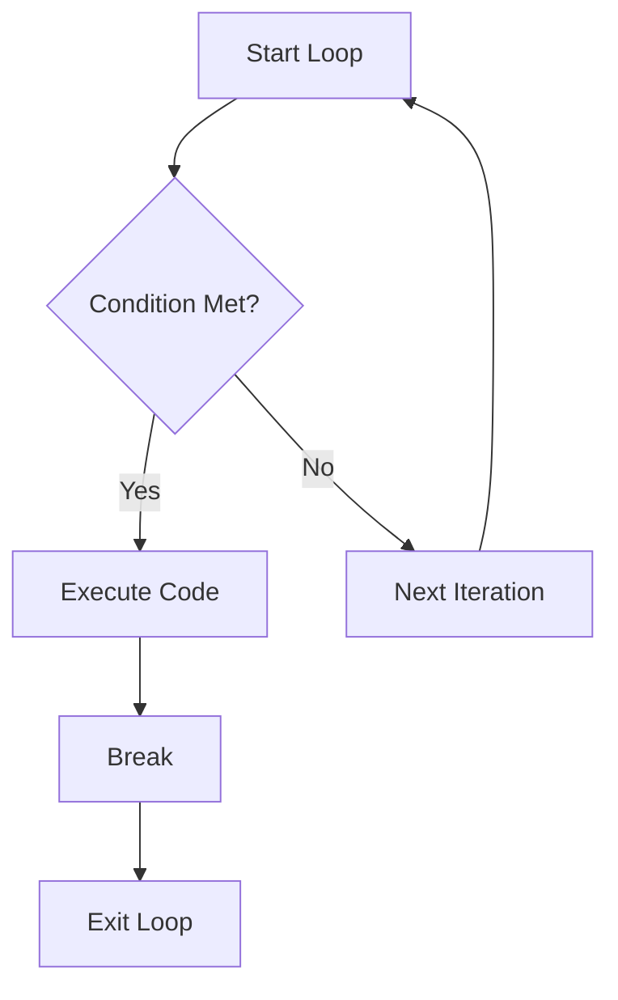
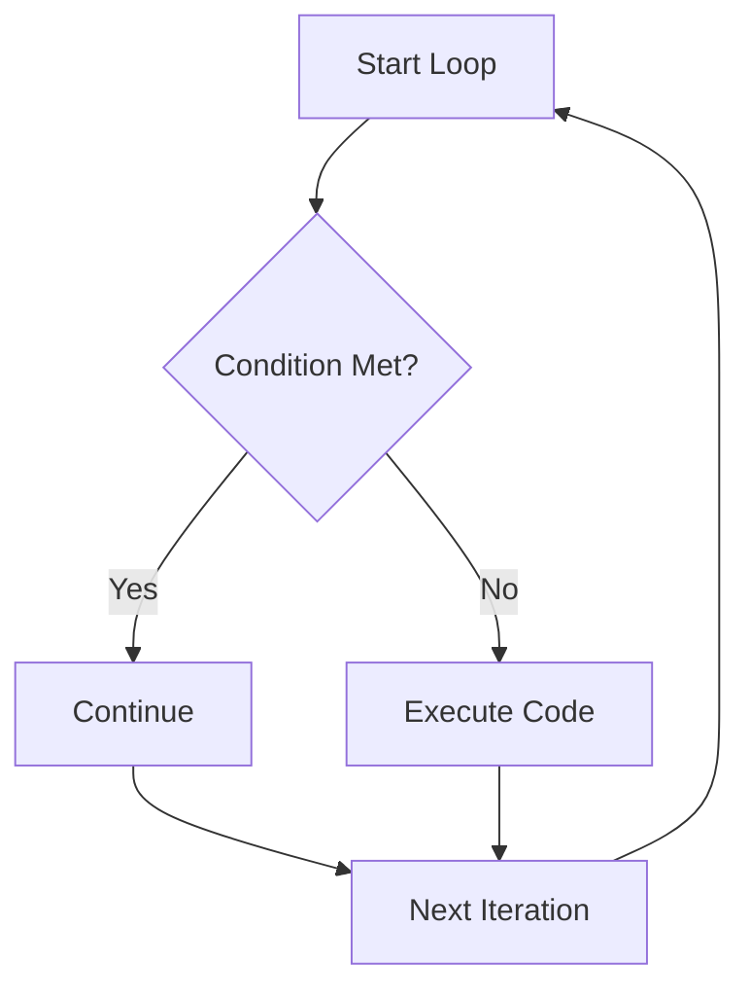

## 2.3.4 Break and Continue

In the journey of developing a Flutter application, understanding how to control the flow of loops is crucial. The `break` and `continue` statements in Dart, the language behind Flutter, provide powerful tools for managing loop execution. This section will delve into the mechanics of these statements, offering practical examples, best practices, and insights into their optimal use.

### Understanding Loop Control

Loops are fundamental constructs in programming, allowing you to execute a block of code multiple times. However, there are scenarios where you might want to exit a loop prematurely or skip certain iterations. This is where `break` and `continue` come into play.

#### The `break` Statement

The `break` statement is used to exit the nearest enclosing loop immediately. When a `break` is encountered, the loop terminates, and the program control moves to the statement following the loop.

**Example of Using `break`:**

Consider a scenario where you are searching for a specific item in a list. Once the item is found, there is no need to continue checking the remaining elements.

```dart
void main() {
  List<String> items = ['apple', 'banana', 'cherry', 'date', 'elderberry'];
  String searchItem = 'cherry';

  for (String item in items) {
    if (item == searchItem) {
      print('Found $searchItem!');
      break; // Exit the loop once the item is found
    }
    print('Checking $item...');
  }
}
```

In this example, the loop will terminate as soon as 'cherry' is found, preventing unnecessary iterations over the remaining items.

#### The `continue` Statement

The `continue` statement skips the current iteration and proceeds to the next one. This is useful when you want to skip certain conditions within a loop without terminating it.

**Example of Using `continue`:**

Imagine you are processing a list of numbers and want to skip even numbers.

```dart
void main() {
  for (int i = 0; i < 5; i++) {
    if (i % 2 == 0) {
      continue; // Skip even numbers
    }
    print('i is $i'); // Will print only odd numbers
  }
}
```

Here, the loop skips the iteration whenever it encounters an even number, thus only processing odd numbers.

### Visualizing Loop Control

To better understand how `break` and `continue` affect loop execution, let's visualize these concepts using flowcharts.

#### Flowchart for `break`



#### Flowchart for `continue`



### Best Practices for Using `break` and `continue`

While `break` and `continue` are powerful, they should be used judiciously to maintain code readability and prevent unexpected behaviors.

#### Impact on Readability

- **Clarity**: Overusing these statements can make code harder to follow. Ensure that their use is well-documented and justified.
- **Structure**: Consider alternative loop structures, such as `while` or `do-while`, which might offer a more natural flow for certain problems.

#### When to Use

- **`break`**: Use when you have a clear exit condition, such as finding a match in a search operation.
- **`continue`**: Use when you need to skip specific iterations, like filtering out unwanted data.

#### Alternatives and Considerations

- **Avoid Overuse**: If you find yourself using `break` or `continue` frequently, consider refactoring your code to improve its logic and structure.
- **Documentation**: Always document the reason for using these statements to aid future maintenance and collaboration.

### Practical Applications in Flutter

In Flutter, controlling loops effectively can enhance performance and user experience. Let's explore some practical applications.

#### Example: Filtering User Input

Suppose you are developing a form where users can input multiple fields. You might want to skip processing invalid inputs.

```dart
void processInput(List<String> inputs) {
  for (String input in inputs) {
    if (input.isEmpty) {
      continue; // Skip empty inputs
    }
    // Process valid input
    print('Processing $input');
  }
}
```

#### Example: Early Exit on Error

In a network request loop, you might want to stop further requests if an error occurs.

```dart
void fetchData(List<String> urls) {
  for (String url in urls) {
    try {
      // Simulate network request
      if (url.contains('error')) {
        throw Exception('Network error');
      }
      print('Fetched data from $url');
    } catch (e) {
      print('Error fetching $url: $e');
      break; // Exit loop on error
    }
  }
}
```

### Conclusion

Mastering the use of `break` and `continue` in loops is an essential skill for any Flutter developer. These statements provide fine-grained control over loop execution, allowing you to optimize performance and enhance code clarity. Remember to use them sparingly and document their purpose to maintain a clean and maintainable codebase.

### Further Reading and Resources

- [Dart Language Tour](https://dart.dev/guides/language/language-tour#break-and-continue)
- [Effective Dart: Usage](https://dart.dev/guides/language/effective-dart/usage)
- [Flutter Documentation](https://flutter.dev/docs)

## Quiz Time!



### What does the `break` statement do in a loop?

- [x] Exits the nearest enclosing loop immediately.
- [ ] Skips the current iteration and proceeds to the next one.
- [ ] Restarts the loop from the beginning.
- [ ] Continues the loop without any changes.

> **Explanation:** The `break` statement exits the nearest enclosing loop immediately, transferring control to the statement following the loop.

### What is the purpose of the `continue` statement?

- [ ] Exits the loop immediately.
- [x] Skips the current iteration and proceeds to the next one.
- [ ] Restarts the loop from the beginning.
- [ ] Ends the loop execution entirely.

> **Explanation:** The `continue` statement skips the current iteration and proceeds to the next one, allowing the loop to continue running.

### In which scenario is using `break` most appropriate?

- [x] When a specific condition is met and no further iterations are needed.
- [ ] When you want to skip certain iterations.
- [ ] When you need to restart the loop.
- [ ] When you want to execute the loop indefinitely.

> **Explanation:** `break` is most appropriate when a specific condition is met and no further iterations are needed, such as finding a match in a search operation.

### How does `continue` affect loop execution?

- [ ] It exits the loop immediately.
- [x] It skips the rest of the current iteration and moves to the next one.
- [ ] It restarts the loop from the beginning.
- [ ] It ends the loop execution entirely.

> **Explanation:** `continue` skips the rest of the current iteration and moves to the next one, allowing the loop to continue running.

### Which statement should you use to skip processing invalid input in a loop?

- [ ] break
- [x] continue
- [ ] return
- [ ] exit

> **Explanation:** Use `continue` to skip processing invalid input in a loop, as it allows the loop to proceed to the next iteration without executing the remaining code for the current iteration.

### What is a potential downside of overusing `break` and `continue`?

- [ ] They make code execution faster.
- [x] They can make code harder to read and follow.
- [ ] They increase memory usage.
- [ ] They reduce code functionality.

> **Explanation:** Overusing `break` and `continue` can make code harder to read and follow, as they disrupt the natural flow of loops.

### How can you improve code readability when using `break` and `continue`?

- [x] Document the reason for using them.
- [ ] Use them as frequently as possible.
- [ ] Avoid using them altogether.
- [ ] Place them at the beginning of the loop.

> **Explanation:** Documenting the reason for using `break` and `continue` helps improve code readability and maintainability by explaining their purpose.

### What is a common use case for `continue` in a loop?

- [ ] Exiting the loop when a condition is met.
- [x] Skipping iterations based on a condition.
- [ ] Restarting the loop from the beginning.
- [ ] Ending the loop execution entirely.

> **Explanation:** A common use case for `continue` is skipping iterations based on a condition, such as filtering out unwanted data.

### Which of the following is a best practice when using `break` and `continue`?

- [ ] Use them frequently to control loop execution.
- [x] Use them sparingly and document their purpose.
- [ ] Avoid using them in any scenario.
- [ ] Use them only in nested loops.

> **Explanation:** It is best practice to use `break` and `continue` sparingly and document their purpose to maintain code readability and clarity.

### True or False: The `break` statement can be used to exit a loop and continue executing the rest of the program.

- [x] True
- [ ] False

> **Explanation:** True. The `break` statement exits the loop and allows the program to continue executing the rest of the code following the loop.


