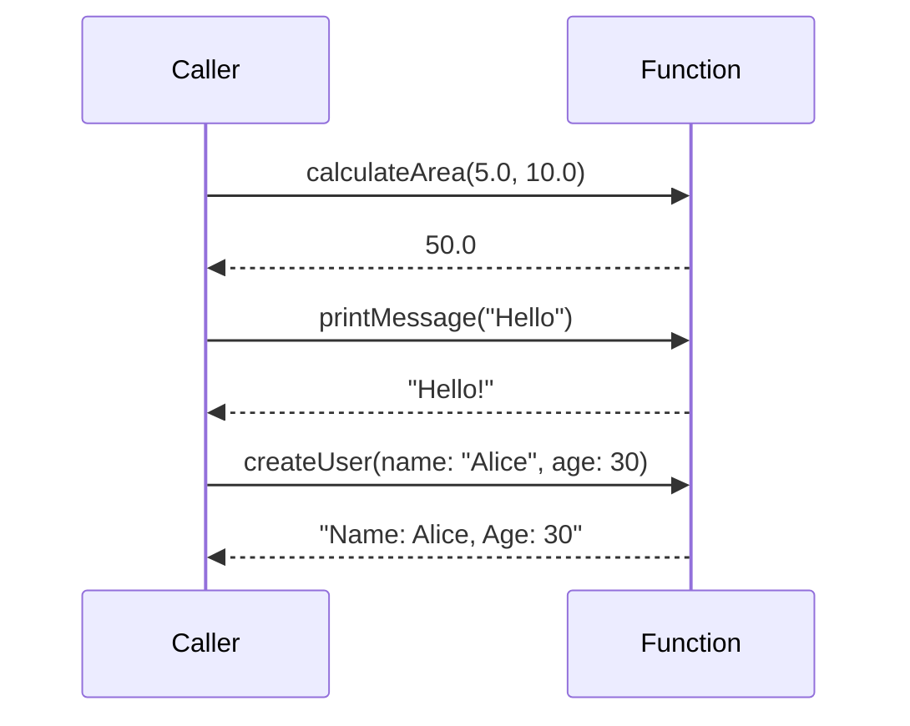

## 2.4.2 Parameters and Return Types

In the journey of developing a Flutter application, understanding how to effectively use function parameters and return types is crucial. This section will delve into the intricacies of positional parameters, optional parameters, named parameters, and return types in Dart, the language that powers Flutter. By mastering these concepts, you'll be able to write more readable, maintainable, and efficient code.

### Positional Parameters

Positional parameters are the most straightforward type of parameters in Dart. They are defined in a specific order, and when you call a function, you must provide arguments in that exact order. This is similar to how functions work in many other programming languages.

#### Defining and Using Positional Parameters

Let's start with a simple example:

```dart
double calculateArea(double width, double height) {
  return width * height;
}
```

In the `calculateArea` function, `width` and `height` are positional parameters. When calling this function, you must provide the width first, followed by the height:

```dart
void main() {
  double area = calculateArea(5.0, 10.0);
  print('The area is $area');
}
```

#### Best Practices

- **Consistency**: Always maintain a consistent order of parameters across similar functions to avoid confusion.
- **Documentation**: Clearly document the expected order of parameters in your function comments.

### Optional Positional Parameters

Dart allows you to define optional positional parameters using square brackets `[]`. These parameters are not required when calling the function, and you can provide default values for them.

#### Using Optional Positional Parameters

Consider the following example:

```dart
void printMessage(String message, [String suffix = '!']) {
  print(message + suffix);
}
```

Here, `suffix` is an optional positional parameter with a default value of `'!'`. You can call `printMessage` with or without the `suffix`:

```dart
void main() {
  printMessage('Hello'); // Output: Hello!
  printMessage('Hello', '?'); // Output: Hello?
}
```

#### Benefits and Considerations

- **Flexibility**: Optional parameters provide flexibility in function calls.
- **Default Values**: Default values help prevent errors by ensuring that a parameter always has a value.

### Named Parameters

Named parameters are defined using curly braces `{}` and are called by name, which improves code readability and reduces errors, especially when dealing with functions that have multiple parameters.

#### Defining and Using Named Parameters

Here's how you can define and use named parameters:

```dart
void createUser({required String name, int age = 0}) {
  print('Name: $name, Age: $age');
}

void main() {
  createUser(name: 'Alice', age: 30);
}
```

In this example, `name` is a required named parameter, while `age` is optional with a default value of `0`. Named parameters make the function call more readable and self-documenting:

```dart
createUser(name: 'Bob');
```

#### Required Named Parameters

To make a named parameter required, use the `required` keyword. This ensures that the caller must provide a value for that parameter:

```dart
void createUser({required String name, required int age}) {
  print('Name: $name, Age: $age');
}
```

#### Advantages

- **Readability**: Named parameters make function calls more readable.
- **Error Reduction**: By specifying required parameters, you reduce the risk of missing critical data.

### Return Types

Specifying return types in Dart functions is crucial for code clarity and type safety. While Dart can infer return types, explicitly declaring them is a good practice.

#### Specifying Return Types

Here's an example of a function with a specified return type:

```dart
bool isEven(int number) {
  return number % 2 == 0;
}
```

In this function, `bool` is the return type, indicating that the function returns a boolean value.

#### Type Inference

If you omit the return type, Dart will infer it based on the return statement. However, explicitly specifying the return type is recommended for clarity and to avoid unexpected behavior.

#### Implications of Omitting Return Types

- **Readability**: Explicit return types make your code easier to read and understand.
- **Type Safety**: They help catch errors at compile time rather than runtime.

### Visualizing Function Calls with Mermaid.js

To better understand how different parameter types work in practice, let's visualize function calls using a Mermaid.js sequence diagram:



### Conclusion

Understanding and effectively using parameters and return types in Dart is essential for any Flutter developer. By mastering these concepts, you can write more robust, readable, and maintainable code. Remember to:

- Use positional parameters for simple functions with a clear argument order.
- Leverage optional positional parameters for flexibility.
- Opt for named parameters to enhance readability and reduce errors.
- Specify return types to improve code clarity and type safety.

### Troubleshooting Tips

- **Missing Required Parameters**: If you encounter an error about missing required parameters, ensure all required named parameters are provided when calling the function.
- **Unexpected Return Types**: If a function returns an unexpected type, check the return type specification and the return statements within the function.

### Hands-On Practice

To reinforce your understanding, try creating a Dart function that calculates the volume of a box using positional, optional, and named parameters. Experiment with different parameter types and return types to see how they affect the function's behavior.

## Quiz Time!



### What is a positional parameter?

- [x] A parameter that must be provided in a specific order.
- [ ] A parameter that can be omitted.
- [ ] A parameter that is called by name.
- [ ] A parameter with a default value.

> **Explanation:** Positional parameters are those that must be provided in a specific order when calling a function.

### How do you define an optional positional parameter in Dart?

- [ ] Using curly braces `{}`.
- [x] Using square brackets `[]`.
- [ ] Using the `required` keyword.
- [ ] Using parentheses `()`.

> **Explanation:** Optional positional parameters are defined using square brackets `[]`.

### What is the benefit of using named parameters?

- [ ] They allow parameters to be omitted.
- [x] They improve code readability.
- [ ] They enforce parameter order.
- [ ] They automatically provide default values.

> **Explanation:** Named parameters improve code readability by allowing parameters to be called by name.

### How do you make a named parameter required in Dart?

- [ ] By using square brackets `[]`.
- [ ] By using curly braces `{}`.
- [x] By using the `required` keyword.
- [ ] By omitting the parameter.

> **Explanation:** The `required` keyword is used to make a named parameter required.

### What is the default value of a named parameter if not specified?

- [ ] `null`
- [x] It must be explicitly set.
- [ ] `0`
- [ ] An empty string `""`

> **Explanation:** If a default value is not specified, the parameter must be explicitly set when calling the function.

### Why is it important to specify return types in Dart?

- [ ] To reduce code size.
- [x] To improve code clarity and type safety.
- [ ] To increase execution speed.
- [ ] To allow for optional parameters.

> **Explanation:** Specifying return types improves code clarity and type safety, helping to catch errors at compile time.

### What happens if you omit the return type in Dart?

- [ ] The function will not compile.
- [ ] The function will return `null`.
- [x] Dart will infer the return type.
- [ ] The function will return an empty string.

> **Explanation:** If the return type is omitted, Dart will infer it based on the return statement.

### What is the purpose of default values in optional parameters?

- [ ] To enforce parameter order.
- [ ] To make parameters required.
- [x] To prevent errors by ensuring a parameter always has a value.
- [ ] To increase code complexity.

> **Explanation:** Default values ensure that a parameter always has a value, preventing errors.

### How can you improve the readability of function calls with multiple parameters?

- [ ] By using positional parameters.
- [ ] By omitting return types.
- [x] By using named parameters.
- [ ] By using optional parameters.

> **Explanation:** Named parameters improve the readability of function calls by allowing parameters to be called by name.

### True or False: Named parameters in Dart can only be optional.

- [ ] True
- [x] False

> **Explanation:** Named parameters can be made required by using the `required` keyword.



By understanding and applying these concepts, you'll be well-equipped to handle complex functions in your Flutter applications, paving the way for more sophisticated and user-friendly apps.
