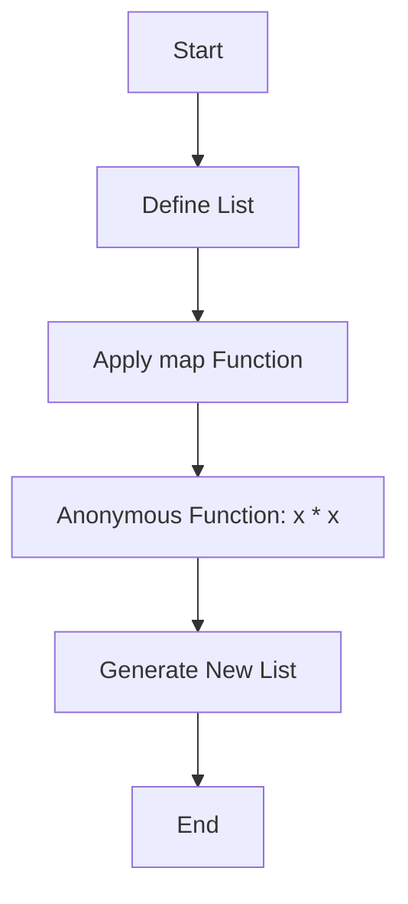

## 2.4.3 Anonymous Functions and Lambdas

In the world of programming, particularly in Dart and Flutter development, anonymous functions, also known as lambdas or closures, play a pivotal role. They offer a way to write concise, readable, and functional code. This section will delve into the nuances of anonymous functions, their syntax, use cases, and how they can be leveraged to build efficient Flutter applications.

### Understanding Anonymous Functions

Anonymous functions are functions without a name. They are often used as arguments to other functions or assigned to variables. In Dart, these functions are first-class citizens, meaning they can be passed around just like any other object. This flexibility allows developers to write more modular and reusable code.

#### Defining Anonymous Functions

Anonymous functions can be defined in two primary ways in Dart:

1. **Long-form Syntax**: This is similar to defining a regular function but without a name.
2. **Arrow Function Syntax**: A shorthand syntax for functions that contain a single expression.

Let's explore these in detail.

### Syntax of Anonymous Functions

#### Long-form Syntax

The long-form syntax of an anonymous function is straightforward. It includes the function's parameters and body, enclosed within curly braces.

```dart
var multiply = (int a, int b) {
  return a * b;
};
int result = multiply(3, 4); // result is 12
```

In this example, `multiply` is an anonymous function that takes two integers and returns their product. The function is assigned to a variable, which can then be used to invoke the function.

#### Arrow Function Syntax

The arrow function syntax is a more concise way to define functions that consist of a single expression. The `=>` symbol is used to separate the parameters from the expression.

```dart
var subtract = (int a, int b) => a - b;
int difference = subtract(10, 3); // difference is 7
```

Here, `subtract` is an anonymous function that calculates the difference between two integers. The arrow syntax makes the code more compact and readable.

### Use Cases for Anonymous Functions

Anonymous functions are versatile and can be used in various scenarios in Dart and Flutter development. Some common use cases include:

#### Event Handlers

In Flutter, anonymous functions are often used as event handlers. For example, when a button is pressed, an anonymous function can be used to define the action that should occur.

```dart
ElevatedButton(
  onPressed: () {
    print('Button pressed!');
  },
  child: Text('Press Me'),
)
```

In this example, the `onPressed` property of the `ElevatedButton` widget is assigned an anonymous function that prints a message to the console.

#### Functional Programming Constructs

Anonymous functions are integral to functional programming constructs such as `map`, `filter`, and `reduce`. These constructs allow for concise and expressive data manipulation.

```dart
List<int> numbers = [1, 2, 3, 4, 5];
List<int> squaredNumbers = numbers.map((number) => number * number).toList();
```

In this example, the `map` function is used to apply an anonymous function to each element of the list, resulting in a new list of squared numbers.

#### Closures

Closures are a special type of anonymous function that can capture variables from their surrounding scope. This feature is particularly useful for maintaining state across function calls.

```dart
Function makeAdder(int addBy) {
  return (int i) => addBy + i;
}

var add2 = makeAdder(2);
print(add2(3)); // 5
```

In this example, `makeAdder` returns a closure that captures the `addBy` variable. The returned function can then be used to add a specific value to its argument.

### Visualizing Anonymous Functions with Mermaid.js

To better understand how anonymous functions are used in higher-order functions, consider the following diagram:



This diagram illustrates the process of applying an anonymous function to each element of a list using the `map` function, resulting in a new list.

### Best Practices and Tips

When working with anonymous functions in Dart, consider the following best practices:

- **Use Arrow Syntax for Simplicity**: When a function consists of a single expression, use the arrow syntax for brevity and clarity.
- **Avoid Overly Complex Anonymous Functions**: If a function becomes too complex, consider defining it as a named function for better readability.
- **Leverage Closures for State Management**: Use closures to maintain state across function calls, especially in scenarios where state needs to be encapsulated.

### Common Pitfalls

While anonymous functions are powerful, they can also lead to issues if not used correctly:

- **Overuse of Anonymous Functions**: Using anonymous functions excessively can make code difficult to read and maintain. Balance their use with named functions.
- **Capturing Unintended Variables**: Be cautious when using closures, as they can capture unintended variables from their surrounding scope, leading to unexpected behavior.

### Experimenting with Anonymous Functions

To truly master anonymous functions, it's essential to experiment with them in different contexts. Try writing functions in both long-form and arrow syntax, and use them in various scenarios such as event handling and data manipulation.

### Conclusion

Anonymous functions and lambdas are indispensable tools in Dart and Flutter development. They enable developers to write concise, expressive, and functional code. By understanding their syntax, use cases, and best practices, you can harness their full potential to build robust Flutter applications.

## Quiz Time!



### What is an anonymous function?

- [x] A function without a name
- [ ] A function that is always asynchronous
- [ ] A function that cannot be assigned to a variable
- [ ] A function that only exists in JavaScript

> **Explanation:** An anonymous function is a function without a name, often used as an argument to other functions or assigned to variables.

### How can you define an anonymous function in Dart using the long-form syntax?

- [x] By using the `var` keyword followed by the function parameters and body
- [ ] By using the `function` keyword followed by the function parameters and body
- [ ] By using the `def` keyword followed by the function parameters and body
- [ ] By using the `let` keyword followed by the function parameters and body

> **Explanation:** In Dart, you define an anonymous function using the `var` keyword, followed by the function parameters and body enclosed in curly braces.

### What is the arrow function syntax used for in Dart?

- [x] To define a function with a single expression concisely
- [ ] To define a function that returns a list
- [ ] To define a function that is asynchronous
- [ ] To define a function that takes no parameters

> **Explanation:** The arrow function syntax is used to define a function with a single expression concisely, using the `=>` symbol.

### Which of the following is a common use case for anonymous functions in Flutter?

- [x] Event handlers
- [ ] Database queries
- [ ] Network requests
- [ ] File I/O operations

> **Explanation:** Anonymous functions are commonly used as event handlers in Flutter, such as defining actions for button presses.

### What is a closure in Dart?

- [x] An anonymous function that captures variables from its surrounding scope
- [ ] A function that cannot be called
- [ ] A function that only exists within a class
- [ ] A function that is always asynchronous

> **Explanation:** A closure is an anonymous function that can capture variables from its surrounding scope, allowing it to maintain state across function calls.

### How can you use an anonymous function as a callback in Dart?

- [x] By passing it as an argument to another function
- [ ] By defining it inside a class
- [ ] By using the `callback` keyword
- [ ] By assigning it to a global variable

> **Explanation:** Anonymous functions can be used as callbacks by passing them as arguments to other functions, such as event handlers or functional programming constructs.

### What is a potential pitfall of using closures in Dart?

- [x] Capturing unintended variables from the surrounding scope
- [ ] Making the code synchronous
- [ ] Preventing the function from being called
- [ ] Causing syntax errors

> **Explanation:** A potential pitfall of using closures is capturing unintended variables from the surrounding scope, which can lead to unexpected behavior.

### Why should you avoid overly complex anonymous functions?

- [x] They can make the code difficult to read and maintain
- [ ] They can cause syntax errors
- [ ] They are not supported in Dart
- [ ] They can only be used in event handlers

> **Explanation:** Overly complex anonymous functions can make the code difficult to read and maintain, so it's better to use named functions in such cases.

### What is the benefit of using arrow syntax for anonymous functions?

- [x] It makes the code more concise and readable
- [ ] It makes the function asynchronous
- [ ] It allows the function to return multiple values
- [ ] It prevents the function from capturing variables

> **Explanation:** The arrow syntax makes the code more concise and readable, especially for functions with a single expression.

### True or False: Anonymous functions in Dart can be assigned to variables and passed as arguments.

- [x] True
- [ ] False

> **Explanation:** True. Anonymous functions in Dart are first-class citizens, meaning they can be assigned to variables and passed as arguments to other functions.


