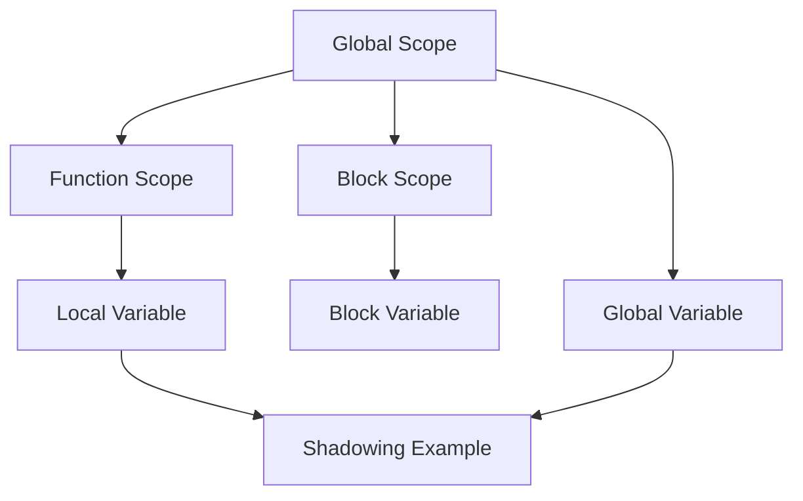

## 2.4.4 Variable Scope

Understanding variable scope is crucial for any programmer, especially when developing applications in Dart for Flutter. Variable scope determines where a variable can be accessed within your code, which is essential for maintaining clean, efficient, and bug-free code. In this section, we'll delve into the different types of variable scopes in Dart, including local, global, and block scopes, and discuss the concept of shadowing. We'll also provide best practices to help you manage variable accessibility effectively.

### Local Scope

Local scope refers to variables that are declared within a function or a block. These variables are only accessible within the context in which they are declared. This means that once the function or block execution is complete, the variables are no longer accessible.

#### Example of Local Scope

Let's consider a simple example where a variable is declared inside a function:

```dart
void main() {
  int x = 10; // x is local to main
  print(x); // This will print 10
}

// Trying to access x outside the main function will result in an error
// print(x); // Error: x is not defined in this scope
```

In this example, the variable `x` is declared inside the `main` function, making it local to that function. Attempting to access `x` outside of `main` will result in an error because `x` is not defined in the global scope.

### Global Scope

Global scope refers to variables that are declared outside of any function or block. These variables are accessible throughout the entire file, making them available to any function or block within that file.

#### Example of Global Scope

Here's an example demonstrating a global variable:

```dart
int globalCounter = 0;

void increment() {
  globalCounter++;
}

void main() {
  increment();
  print(globalCounter); // This will print 1
}
```

In this example, `globalCounter` is declared outside of any function, making it a global variable. It can be accessed and modified by any function within the file, such as `increment` and `main`.

### Block Scope

Block scope refers to variables that are declared within a set of curly braces `{}`. These variables are only accessible within that block of code. This is particularly useful in loops and conditional statements where you want to limit the scope of a variable to a specific block.

#### Example of Block Scope

Consider the following example using a `for` loop:

```dart
void main() {
  for (int i = 0; i < 5; i++) {
    int square = i * i; // square is scoped to the loop block
    print(square); // This will print the square of i
  }
  // print(square); // Error: square is not defined here
}
```

In this example, the variable `square` is declared within the `for` loop block, making it accessible only within that block. Attempting to access `square` outside the loop will result in an error.

### Variable Shadowing

Variable shadowing occurs when a variable declared within a certain scope has the same name as a variable declared in an outer scope. The inner variable "shadows" the outer variable, meaning that within the inner scope, the outer variable is inaccessible.

#### Example of Variable Shadowing

Here's an example illustrating variable shadowing:

```dart
int value = 100;

void someFunction() {
  int value = 200; // This value shadows the global value
  print(value); // Prints 200
}

void main() {
  someFunction();
  print(value); // Prints 100
}
```

In this example, the global variable `value` is shadowed by the local variable `value` inside `someFunction`. Within `someFunction`, the local `value` is used, while outside, the global `value` remains unaffected.

### Best Practices for Variable Scope

Understanding and managing variable scope is vital for writing clean and maintainable code. Here are some best practices to consider:

1. **Minimize Global Variables**: Global variables can lead to dependencies that are hard to track and manage. Use them sparingly and only when necessary.

2. **Use Descriptive Names**: Choose meaningful and descriptive names for your variables to avoid confusion, especially when dealing with shadowing.

3. **Limit Scope**: Declare variables in the smallest possible scope to reduce the risk of unintended interactions and side effects.

4. **Avoid Shadowing**: While shadowing can be useful, it can also lead to confusion. Avoid it unless absolutely necessary, and ensure that variable names are clear and distinct.

5. **Trace Variable Usage**: Regularly trace the usage of your variables to understand their scope and lifecycle, which can help in debugging and optimizing your code.

### Visualizing Variable Scope

To better understand variable scope, let's visualize it using a Mermaid.js diagram. This diagram illustrates the different scopes and how variables are accessible within them.



In this diagram, the global scope encompasses both function and block scopes. Variables declared in the global scope are accessible throughout, while those in function or block scopes are limited to their respective contexts.

### Conclusion

Understanding variable scope is essential for effective programming in Dart and Flutter. By mastering local, global, and block scopes, as well as the concept of shadowing, you can write more efficient and bug-free code. Remember to follow best practices, such as minimizing global variables and using descriptive names, to maintain clean and maintainable code.

## Quiz Time!



### What is a local variable?

- [x] A variable declared inside a function or block, accessible only within that context.
- [ ] A variable declared outside any function, accessible throughout the file.
- [ ] A variable that can be accessed globally.
- [ ] A variable that shadows another variable.

> **Explanation:** A local variable is one that is declared within a function or block and is only accessible within that context.

### What is a global variable?

- [x] A variable declared outside any function, accessible throughout the file.
- [ ] A variable declared inside a function or block.
- [ ] A variable that shadows another variable.
- [ ] A variable that is only accessible within a loop.

> **Explanation:** A global variable is declared outside any function or block and is accessible throughout the file.

### What is block scope?

- [x] Variables declared within curly braces `{}` are scoped to that block.
- [ ] Variables declared outside any function.
- [ ] Variables that can be accessed globally.
- [ ] Variables that are only accessible within a function.

> **Explanation:** Block scope refers to variables declared within curly braces `{}`, making them accessible only within that block.

### What happens when a variable is shadowed?

- [x] An inner variable with the same name as an outer variable makes the outer variable inaccessible within the inner scope.
- [ ] The outer variable is deleted.
- [ ] The inner variable is deleted.
- [ ] Both variables are accessible.

> **Explanation:** Shadowing occurs when an inner variable with the same name as an outer variable makes the outer variable inaccessible within the inner scope.

### Which of the following is a best practice for variable scope?

- [x] Minimize the use of global variables.
- [ ] Use the same variable names in different scopes.
- [x] Use descriptive names for variables.
- [ ] Declare all variables globally.

> **Explanation:** Minimizing global variables and using descriptive names are best practices for managing variable scope effectively.

### What is the main risk of using global variables excessively?

- [x] It can lead to dependencies that are hard to track and manage.
- [ ] It makes the code faster.
- [ ] It simplifies debugging.
- [ ] It reduces the number of variables needed.

> **Explanation:** Excessive use of global variables can lead to dependencies that are hard to track and manage, making the code more complex.

### How can you avoid variable shadowing?

- [x] Use distinct and meaningful variable names.
- [ ] Use the same variable names in different scopes.
- [x] Limit the scope of variables.
- [ ] Declare all variables globally.

> **Explanation:** Avoiding variable shadowing can be achieved by using distinct and meaningful names and limiting the scope of variables.

### What is the benefit of using block scope?

- [x] It limits the accessibility of variables to a specific block, reducing unintended interactions.
- [ ] It makes variables accessible globally.
- [ ] It allows variables to be reused in different functions.
- [ ] It simplifies variable declaration.

> **Explanation:** Block scope limits the accessibility of variables to a specific block, reducing unintended interactions and side effects.

### Why is it important to trace variable usage in your code?

- [x] To understand their scope and lifecycle, aiding in debugging and optimization.
- [ ] To make the code more complex.
- [ ] To increase the number of variables.
- [ ] To make variables globally accessible.

> **Explanation:** Tracing variable usage helps understand their scope and lifecycle, which aids in debugging and optimizing the code.

### True or False: A variable declared inside a loop is accessible outside the loop.

- [ ] True
- [x] False

> **Explanation:** A variable declared inside a loop is only accessible within that loop's block scope and not outside it.


