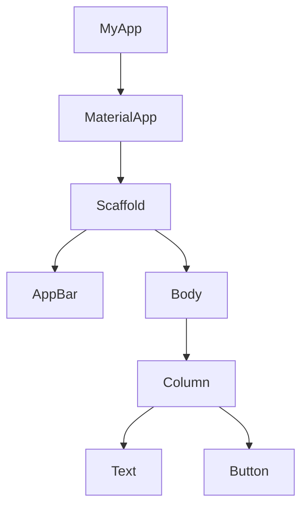

## 3.1.1 The Widget Tree

In the world of Flutter development, understanding the widget tree is akin to mastering the alphabet before writing a novel. It forms the very foundation of building user interfaces (UIs) in Flutter applications. This section will delve into the concept of the widget tree, explaining its significance, structure, and how it powers the rendering process of your app's UI.

### Definition of Widgets

In Flutter, **everything is a widget**. Whether it's a simple text display, a button, or a complex layout, each element you see on the screen is a widget. Widgets are the fundamental building blocks of a Flutter app's UI. They describe what their view should look like given their current configuration and state.

Widgets can be classified into two main types:

1. **Stateless Widgets**: These widgets are immutable, meaning their properties can't change once they're built. They are ideal for static content that doesn't change over time.

2. **Stateful Widgets**: These widgets maintain a mutable state that can change during the widget's lifetime. They are used for dynamic content that can change in response to user interactions or other factors.

### Widget Hierarchy

Widgets in Flutter are organized in a hierarchical tree structure, known as the **widget tree**. This hierarchy is similar to a family tree or an organizational chart, where each widget can have one or more child widgets. The root of this tree is the top-most widget, and it branches out to include all other widgets.

#### The Widget Tree Structure

The widget tree is a conceptual model that represents the organization of widgets in a Flutter app. Here's a simple illustration of a widget tree:



In this diagram:

- **MyApp** is the root widget.
- **MaterialApp** is a convenience widget that wraps several widgets commonly required for material design applications.
- **Scaffold** provides a framework for implementing the basic material design layout structure.
- **AppBar** represents the top app bar.
- **Body** is the main content area.
- **Column** is a layout widget that arranges its children vertically.
- **Text** and **Button** are leaf nodes that display text and a clickable button, respectively.

### Rendering Process

The widget tree plays a crucial role in how Flutter renders the UI onto the screen. When you build a Flutter app, the framework constructs a widget tree and uses it to determine how to paint the UI. The rendering process involves several steps:

1. **Building the Widget Tree**: The framework calls the `build()` method of each widget to construct the widget tree.

2. **Element Tree Creation**: Flutter creates an element tree, which is a parallel structure that maintains the state of the widgets.

3. **Render Tree Construction**: The framework constructs a render tree from the element tree. This tree is used to compute the layout and paint the UI.

4. **Layout and Painting**: Flutter calculates the layout of each widget and paints them onto the screen.

Understanding this process is vital for debugging UI issues and optimizing performance.

### Importance of the Widget Tree

Understanding the widget tree is crucial for several reasons:

- **Designing Layouts**: By visualizing the widget tree, developers can design complex layouts more effectively. The hierarchical structure helps in organizing widgets logically.

- **Debugging UI Issues**: When something goes wrong in the UI, examining the widget tree can help identify the source of the problem. Flutter's `Flutter Inspector` tool is invaluable for this purpose.

- **Optimizing Performance**: Efficient use of the widget tree can lead to better performance. For example, minimizing the depth of the tree can reduce the complexity of the rendering process.

### Code Example: Building a Simple Widget Tree

Let's look at a basic example of a Flutter app's `main.dart` file, which demonstrates a simple widget tree structure:

```dart
import 'package:flutter/material.dart';

void main() => runApp(MyApp());

class MyApp extends StatelessWidget {
  @override
  Widget build(BuildContext context) {
    return MaterialApp(
      home: Scaffold(
        appBar: AppBar(
          title: Text('Widget Tree Example'),
        ),
        body: Center(
          child: Column(
            children: <Widget>[
              Text('Hello, Flutter!'),
              ElevatedButton(
                onPressed: () {},
                child: Text('Click Me'),
              ),
            ],
          ),
        ),
      ),
    );
  }
}
```

#### Explanation of the Code

- **MyApp**: This is the root widget of our application. It extends `StatelessWidget`, indicating that it doesn't maintain any state.

- **MaterialApp**: This widget provides the basic material design visual structure.

- **Scaffold**: It provides a default app bar, title, and a body property that holds the primary content of the screen.

- **AppBar**: Displays a title at the top of the app.

- **Center**: Centers its child widget within itself.

- **Column**: Arranges its children vertically. Here, it contains a `Text` widget and an `ElevatedButton`.

- **Text**: Displays a simple string of text.

- **ElevatedButton**: A material design button that responds to touches by filling with color.

This code snippet corresponds to the earlier diagram, illustrating how widgets are nested within each other to form a cohesive UI.

### Visualizing the Widget Tree

Visualizing the widget tree as you code can greatly enhance your understanding and efficiency. Consider using tools like the **Flutter Inspector** in Android Studio or Visual Studio Code, which provides a visual representation of the widget tree and allows you to explore the hierarchy interactively.

### Best Practices

- **Keep the Tree Manageable**: Avoid overly deep widget trees, as they can complicate the rendering process and make the code harder to maintain.

- **Use Composition Over Inheritance**: Flutter encourages the use of composition to build UIs. Instead of creating a single complex widget, break it down into smaller, reusable widgets.

- **Leverage Stateless and Stateful Widgets Appropriately**: Use stateless widgets for static content and stateful widgets for dynamic content that changes over time.

### Common Pitfalls

- **Overusing Stateful Widgets**: While stateful widgets are powerful, overusing them can lead to unnecessary complexity. Use them only when the widget's state changes.

- **Ignoring Performance Implications**: A poorly structured widget tree can lead to performance issues. Pay attention to the depth and complexity of your widget tree.

- **Not Utilizing Flutter Tools**: Tools like the Flutter Inspector are invaluable for debugging and optimizing your widget tree. Make sure to use them effectively.

### Encouragement for Hands-On Practice

The best way to master the widget tree is through hands-on practice. Experiment with different widget combinations, explore the Flutter documentation, and build small projects to reinforce your understanding. As you become more comfortable with the widget tree, you'll find it easier to design complex UIs and troubleshoot issues.

### Conclusion

The widget tree is the backbone of any Flutter application. By understanding its structure and role in the rendering process, you can design efficient, responsive, and visually appealing UIs. Remember, the widget tree is not just a concept—it's a powerful tool that, when mastered, can significantly enhance your Flutter development skills.

## Quiz Time!



### What is a widget in Flutter?

- [x] A fundamental building block of a Flutter app's UI
- [ ] A tool for debugging Flutter applications
- [ ] A type of database used in Flutter
- [ ] A programming language

> **Explanation:** In Flutter, everything is a widget. Widgets are the fundamental building blocks of a Flutter app's UI.

### How are widgets organized in Flutter?

- [x] In a hierarchical tree structure
- [ ] In a linear list
- [ ] In a circular graph
- [ ] In a random order

> **Explanation:** Widgets in Flutter are organized in a hierarchical tree structure, known as the widget tree.

### What is the role of the widget tree in rendering the UI?

- [x] It helps Flutter determine how to paint the UI
- [ ] It stores user data
- [ ] It manages network requests
- [ ] It compiles the Dart code

> **Explanation:** The widget tree helps Flutter determine how to paint the UI by organizing widgets in a hierarchical structure.

### What is the root widget in a Flutter app?

- [x] The top-most widget in the widget tree
- [ ] The last widget added to the tree
- [ ] A widget that manages state
- [ ] A widget that handles user input

> **Explanation:** The root widget is the top-most widget in the widget tree, from which all other widgets branch out.

### Which widget provides a framework for implementing the basic material design layout structure?

- [x] Scaffold
- [ ] AppBar
- [ ] Column
- [ ] Center

> **Explanation:** The Scaffold widget provides a framework for implementing the basic material design layout structure.

### What is the purpose of the Flutter Inspector?

- [x] To provide a visual representation of the widget tree
- [ ] To compile Dart code
- [ ] To manage app state
- [ ] To handle network requests

> **Explanation:** The Flutter Inspector provides a visual representation of the widget tree and allows developers to explore the hierarchy interactively.

### What is a common pitfall when using stateful widgets?

- [x] Overusing them, leading to unnecessary complexity
- [ ] Not using them enough
- [ ] Using them for static content
- [ ] Ignoring them completely

> **Explanation:** A common pitfall is overusing stateful widgets, which can lead to unnecessary complexity.

### What is a best practice for managing the widget tree?

- [x] Keep the tree manageable and avoid overly deep structures
- [ ] Use as many widgets as possible
- [ ] Ignore the depth of the tree
- [ ] Use inheritance over composition

> **Explanation:** Keeping the widget tree manageable and avoiding overly deep structures is a best practice for efficient Flutter development.

### What is the difference between stateless and stateful widgets?

- [x] Stateless widgets are immutable, while stateful widgets maintain a mutable state
- [ ] Stateless widgets are faster than stateful widgets
- [ ] Stateful widgets are used for static content
- [ ] Stateless widgets can change over time

> **Explanation:** Stateless widgets are immutable, meaning their properties can't change once they're built, while stateful widgets maintain a mutable state that can change during the widget's lifetime.

### True or False: The widget tree is only important for debugging UI issues.

- [ ] True
- [x] False

> **Explanation:** The widget tree is important for designing layouts, debugging UI issues, and optimizing performance, not just for debugging.


