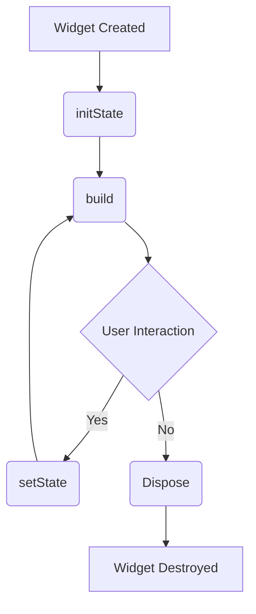

---

linkTitle: "3.1.2 Stateless vs. Stateful Widgets"
title: "Understanding Stateless vs. Stateful Widgets in Flutter"
description: "Dive deep into the differences between stateless and stateful widgets in Flutter, learn when to use each, and explore practical code examples and lifecycle methods."
categories:
- Flutter Development
- Mobile App Development
- Software Engineering
tags:
- Flutter
- Widgets
- Stateless
- Stateful
- State Management
date: 2024-10-25
type: docs
nav_weight: 3120

canonical: "https://fluttermasterylibrary.com/2/3/1/2"
license: "© 2023 Tokenizer Inc. CC BY-NC-SA 4.0"
---

## 3.1.2 Stateless vs. Stateful Widgets

In the world of Flutter development, understanding the distinction between stateless and stateful widgets is crucial for building efficient and responsive applications. These two types of widgets form the backbone of Flutter's UI framework, and knowing when and how to use each can significantly impact your app's performance and user experience.

### Definition of Stateless Widgets

Stateless widgets are the simplest form of widgets in Flutter. They are immutable, meaning that once they are created, their properties cannot change. A stateless widget is like a static image—it remains constant and does not react to user interactions or other changes in the app's state. This immutability makes stateless widgets ideal for displaying static content or UI elements that do not need to update dynamically.

#### Example of a Stateless Widget

Here is a simple example of a stateless widget:

```dart
class GreetingWidget extends StatelessWidget {
  final String name;

  GreetingWidget({required this.name});

  @override
  Widget build(BuildContext context) {
    return Text('Hello, $name!');
  }
}
```

In this example, `GreetingWidget` is a stateless widget that takes a `name` as a parameter and displays a greeting message. Once created, the widget cannot change its `name` property. This makes it perfect for displaying static content.

### Definition of Stateful Widgets

Stateful widgets, on the other hand, are dynamic. They can change their internal state during their lifetime, allowing them to react to user interactions, network requests, or other events. A stateful widget is like a video that can change over time, updating its content as needed.

Stateful widgets are composed of two classes: the `StatefulWidget` class and the `State` class. The `StatefulWidget` class is immutable, while the `State` class holds the mutable state and logic.

#### Example of a Stateful Widget

Here is an example of a stateful widget:

```dart
class CounterWidget extends StatefulWidget {
  @override
  _CounterWidgetState createState() => _CounterWidgetState();
}

class _CounterWidgetState extends State<CounterWidget> {
  int _counter = 0;

  void _incrementCounter() {
    setState(() {
      _counter++;
    });
  }

  @override
  Widget build(BuildContext context) {
    return Column(
      children: [
        Text('Counter: $_counter'),
        ElevatedButton(
          onPressed: _incrementCounter,
          child: Text('Increment'),
        ),
      ],
    );
  }
}
```

In this example, `CounterWidget` is a stateful widget that maintains a counter. The `_CounterWidgetState` class holds the mutable state (`_counter`) and provides a method (`_incrementCounter`) to update it. The `setState` method is crucial here, as it tells Flutter to rebuild the widget tree with the updated state.

### Comparison: Stateless vs. Stateful Widgets

Understanding when to use stateless versus stateful widgets is key to efficient Flutter development. Here are some key differences and scenarios for each:

#### Key Differences

- **Immutability**: Stateless widgets are immutable, while stateful widgets can change their state over time.
- **Reactivity**: Stateless widgets are not reactive and do not update in response to changes. Stateful widgets can update dynamically in response to user interactions or other events.
- **Complexity**: Stateless widgets are simpler and require less boilerplate code. Stateful widgets involve more complexity due to the need to manage state.

#### Appropriate Scenarios

- **Stateless Widgets**: Use stateless widgets for UI elements that do not change, such as static text, images, or icons. They are also suitable for parent widgets that pass data to child widgets without needing to manage state.
- **Stateful Widgets**: Use stateful widgets for interactive elements that need to update, such as buttons, forms, or animations. They are also necessary when the widget needs to maintain a state that changes over time.

### State Management Basics

State management is a crucial aspect of Flutter development, particularly when dealing with stateful widgets. It involves managing the state of your application in a way that is efficient, scalable, and easy to maintain.

In Flutter, state management can be handled in various ways, ranging from simple `setState` calls to more complex solutions like Provider, Bloc, or Riverpod. The choice of state management solution depends on the complexity of your app and your specific requirements.

### Lifecycle Methods of Stateful Widgets

Stateful widgets have a lifecycle that consists of several methods that can be overridden to execute code at different stages of the widget's life. Understanding these methods is essential for managing resources and optimizing performance.

#### Key Lifecycle Methods

- **`initState`**: Called when the widget is first created. This is where you can initialize state variables or start animations.
- **`build`**: Called every time the widget needs to be rebuilt. This is where you define the widget's UI.
- **`setState`**: Used to update the widget's state and trigger a rebuild.
- **`dispose`**: Called when the widget is removed from the widget tree. This is where you can clean up resources, such as stopping animations or closing streams.

Here is a flowchart illustrating the lifecycle of stateful widgets:



### Common Misconceptions

A common misconception is that all widgets need to be stateful to handle user interactions. However, many interactions can be managed using stateless widgets by passing callbacks or using inherited widgets for state management.

### Conclusion

Understanding the differences between stateless and stateful widgets is fundamental to building efficient Flutter applications. By choosing the right type of widget for each scenario, you can create responsive and performant apps that provide a seamless user experience.

### Best Practices

- Use stateless widgets whenever possible to reduce complexity and improve performance.
- Manage state efficiently using appropriate state management solutions for your app's needs.
- Clean up resources in the `dispose` method to prevent memory leaks.

## Quiz Time!



### What is a key characteristic of a stateless widget?

- [x] It is immutable and cannot change once built.
- [ ] It can change its state over time.
- [ ] It requires a `State` class to manage its state.
- [ ] It is always interactive.

> **Explanation:** Stateless widgets are immutable, meaning their properties cannot change once they are built.

### Which method is used to update the state of a stateful widget?

- [ ] initState
- [ ] dispose
- [x] setState
- [ ] build

> **Explanation:** The `setState` method is used to update the state of a stateful widget and trigger a rebuild.

### When should you use a stateful widget?

- [x] When the widget needs to update dynamically in response to user interactions.
- [ ] When the widget displays static content.
- [ ] When the widget is part of the app's navigation.
- [ ] When the widget is a parent widget passing data to children.

> **Explanation:** Stateful widgets are used when the widget needs to update dynamically, such as in response to user interactions.

### What is the purpose of the `dispose` method in a stateful widget?

- [ ] To initialize state variables.
- [ ] To build the widget's UI.
- [ ] To update the widget's state.
- [x] To clean up resources when the widget is removed.

> **Explanation:** The `dispose` method is used to clean up resources, such as stopping animations or closing streams, when the widget is removed.

### Which of the following is a lifecycle method of a stateful widget?

- [x] initState
- [ ] buildContext
- [ ] onCreate
- [ ] onDestroy

> **Explanation:** `initState` is a lifecycle method of a stateful widget, called when the widget is first created.

### What is a common misconception about stateful widgets?

- [x] That all widgets need to be stateful to handle user interactions.
- [ ] That stateful widgets cannot update their state.
- [ ] That stateful widgets do not have lifecycle methods.
- [ ] That stateful widgets are always more efficient than stateless widgets.

> **Explanation:** A common misconception is that all widgets need to be stateful to handle user interactions, but many interactions can be managed with stateless widgets.

### What is the role of the `build` method in a stateful widget?

- [x] To define the widget's UI.
- [ ] To initialize state variables.
- [ ] To clean up resources.
- [ ] To update the widget's state.

> **Explanation:** The `build` method is used to define the widget's UI and is called every time the widget needs to be rebuilt.

### Which widget type is more suitable for displaying static text?

- [x] Stateless widget
- [ ] Stateful widget
- [ ] Both are equally suitable
- [ ] Neither is suitable

> **Explanation:** Stateless widgets are more suitable for displaying static text, as they do not need to update dynamically.

### What does the `setState` method do in a stateful widget?

- [x] It updates the widget's state and triggers a rebuild.
- [ ] It initializes state variables.
- [ ] It cleans up resources.
- [ ] It defines the widget's UI.

> **Explanation:** The `setState` method updates the widget's state and triggers a rebuild of the widget tree.

### True or False: Stateless widgets can change their properties after they are built.

- [ ] True
- [x] False

> **Explanation:** Stateless widgets are immutable, meaning their properties cannot change after they are built.


