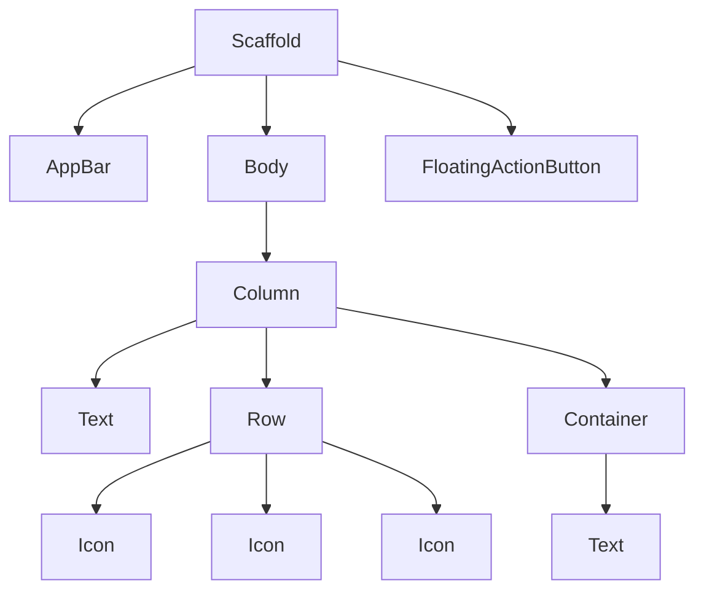

## 3.1.3 Commonly Used Widgets

In the world of Flutter, widgets are the fundamental building blocks of your application's user interface. Understanding and mastering these widgets is crucial for any developer aiming to create dynamic and responsive apps. This section introduces you to some of the most commonly used widgets in Flutter, providing you with the tools to build complex and beautiful UIs.

### Overview

Flutter's widget-centric approach allows developers to create highly customizable and performant applications. Widgets in Flutter are immutable, meaning they cannot change once created. Instead, when a widget's properties change, Flutter creates a new widget to reflect the changes. This approach ensures that the UI remains consistent and performant.

Familiarizing yourself with core Flutter widgets is essential because they form the basis of any Flutter application. By understanding how to use these widgets effectively, you can create intricate layouts and interactive interfaces with ease.

### List of Common Widgets

Let's dive into some of the most frequently used widgets in Flutter, exploring their functionalities, properties, and usage through practical examples.

#### Text Widget

The `Text` widget is one of the simplest yet most essential widgets in Flutter. It is used to display a string of text with various styling options.

**Description**: The `Text` widget is used for displaying text in your application. It supports rich text styling, allowing you to customize fonts, colors, sizes, and more.

**Code Example**:
```dart
Text(
  'Hello, Flutter!',
  style: TextStyle(fontSize: 24, color: Colors.blue),
);
```

**Common Properties**:
- `data`: The string of text to display.
- `style`: A `TextStyle` object that allows customization of the text's appearance.
- `textAlign`: Aligns the text within its parent widget.
- `overflow`: Handles how text overflow is managed.

**Usage Tips**:
- Use `TextStyle` to customize the appearance of your text.
- Consider using `RichText` for more complex text styling needs.

#### Container Widget

The `Container` widget is a versatile widget used for layout, styling, and positioning.

**Description**: The `Container` widget can be used to create rectangular visual elements. It supports padding, margins, borders, and background colors.

**Code Example**:
```dart
Container(
  padding: EdgeInsets.all(16.0),
  margin: EdgeInsets.symmetric(vertical: 10.0),
  color: Colors.amber,
  child: Text('This is a container'),
);
```

**Common Properties**:
- `padding`: Adds space inside the container.
- `margin`: Adds space outside the container.
- `color`: Sets the background color.
- `decoration`: Allows for more complex styling, such as gradients and borders.

**Usage Tips**:
- Use `BoxDecoration` for advanced styling.
- Combine `Container` with other widgets to create complex layouts.

#### Row and Column Widgets

The `Row` and `Column` widgets are used for arranging widgets horizontally and vertically, respectively.

**Description**: `Row` and `Column` are layout widgets that arrange their children in a linear fashion.

**Code Example**:
```dart
Row(
  children: [
    Icon(Icons.star),
    Icon(Icons.star),
    Icon(Icons.star),
  ],
);

Column(
  children: [
    Text('Line 1'),
    Text('Line 2'),
    Text('Line 3'),
  ],
);
```

**Common Properties**:
- `children`: A list of widgets to display.
- `mainAxisAlignment`: Aligns children along the main axis.
- `crossAxisAlignment`: Aligns children along the cross axis.

**Usage Tips**:
- Use `Expanded` and `Flexible` to control how children are sized within a `Row` or `Column`.
- Nest `Row` and `Column` to create complex layouts.

#### Stack Widget

The `Stack` widget allows for overlapping widgets, creating layered layouts.

**Description**: The `Stack` widget positions its children relative to the edges of its box. It allows for overlapping widgets, useful for creating complex designs.

**Code Example**:
```dart
Stack(
  children: <Widget>[
    Container(
      width: 100,
      height: 100,
      color: Colors.red,
    ),
    Positioned(
      top: 10,
      left: 10,
      child: Container(
        width: 50,
        height: 50,
        color: Colors.blue,
      ),
    ),
  ],
);
```

**Common Properties**:
- `children`: A list of widgets to display.
- `alignment`: Aligns the children within the stack.
- `fit`: Determines how the stack should size itself.

**Usage Tips**:
- Use `Positioned` to place widgets precisely within a `Stack`.
- Be mindful of performance when using many overlapping widgets.

#### Image Widget

The `Image` widget is used for displaying images in your application.

**Description**: The `Image` widget can display images from various sources, including assets, network, and memory.

**Code Example**:
```dart
Image.asset('assets/images/flutter_logo.png');
```

**Common Properties**:
- `image`: The image to display.
- `fit`: How the image should be inscribed into the box.
- `width` and `height`: The dimensions of the image.

**Usage Tips**:
- Use `Image.network` for displaying images from the internet.
- Optimize image sizes for better performance.

#### Scaffold Widget

The `Scaffold` widget provides a default app structure, including an app bar, body, and floating action button.

**Description**: The `Scaffold` widget is a high-level widget that provides a framework for implementing the basic material design visual layout structure.

**Code Example**:
```dart
Scaffold(
  appBar: AppBar(
    title: Text('My App'),
  ),
  body: Center(
    child: Text('Hello, world!'),
  ),
  floatingActionButton: FloatingActionButton(
    onPressed: () {},
    child: Icon(Icons.add),
  ),
);
```

**Common Properties**:
- `appBar`: A top app bar.
- `body`: The primary content of the scaffold.
- `floatingActionButton`: A button displayed above the body.

**Usage Tips**:
- Use `Scaffold` to create a consistent layout across your app.
- Customize the `AppBar` for navigation and actions.

#### AppBar Widget

The `AppBar` widget is a horizontal bar at the top of the app, typically used for navigation and actions.

**Description**: The `AppBar` widget is a material design app bar that can be used to display titles, navigation icons, and actions.

**Code Example**:
```dart
AppBar(
  title: Text('My App'),
  actions: <Widget>[
    IconButton(
      icon: Icon(Icons.search),
      onPressed: () {},
    ),
  ],
);
```

**Common Properties**:
- `title`: The primary widget displayed in the app bar.
- `actions`: A list of widgets to display in a row after the `title`.
- `leading`: A widget to display before the `title`.

**Usage Tips**:
- Use `actions` for icons and buttons that perform actions.
- Customize the `leading` widget for navigation.

#### ListView Widget

The `ListView` widget is used for creating scrollable lists.

**Description**: The `ListView` widget is a scrollable list of widgets, commonly used for displaying a large number of items.

**Code Example**:
```dart
ListView(
  children: [
    ListTile(
      leading: Icon(Icons.map),
      title: Text('Map'),
    ),
    ListTile(
      leading: Icon(Icons.photo_album),
      title: Text('Album'),
    ),
  ],
);
```

**Common Properties**:
- `children`: A list of widgets to display.
- `scrollDirection`: The axis along which the list scrolls.
- `padding`: Adds space around the list.

**Usage Tips**:
- Use `ListView.builder` for dynamic lists with many items.
- Optimize performance with `ListView.separated` for lists with separators.

### Visual Aids

To better understand how these widgets can be combined, consider the following diagram illustrating a simple Flutter UI layout using these widgets:



### Encouragement to Experiment

As you explore these widgets, remember that experimentation is key to mastering Flutter. Try combining different widgets, adjusting their properties, and observing how they interact. This hands-on approach will deepen your understanding and enable you to create more complex and engaging UIs.

### Common Pitfalls and Best Practices

- **Avoid Overlapping Widgets**: When using `Stack`, ensure that overlapping widgets do not cause performance issues.
- **Optimize Images**: Use appropriately sized images to prevent memory issues.
- **Consistent Layouts**: Use `Scaffold` to maintain a consistent layout across different screens.

### Conclusion

By understanding and utilizing these commonly used widgets, you can create robust and visually appealing Flutter applications. These widgets serve as the foundation for more complex UI elements and interactions, enabling you to bring your app ideas to life.

## Quiz Time!



### What is the primary purpose of the `Text` widget in Flutter?

- [x] Displaying strings of text
- [ ] Creating buttons
- [ ] Displaying images
- [ ] Managing state

> **Explanation:** The `Text` widget is specifically designed for displaying strings of text in Flutter applications.

### Which widget is used to arrange its children horizontally?

- [x] Row
- [ ] Column
- [ ] Stack
- [ ] Container

> **Explanation:** The `Row` widget arranges its children horizontally, while `Column` arranges them vertically.

### What property of the `Container` widget adds space inside the container?

- [x] padding
- [ ] margin
- [ ] color
- [ ] alignment

> **Explanation:** The `padding` property adds space inside the container, while `margin` adds space outside.

### How do you display an image from assets using the `Image` widget?

- [x] Image.asset('assets/images/flutter_logo.png')
- [ ] Image.network('assets/images/flutter_logo.png')
- [ ] Image.memory('assets/images/flutter_logo.png')
- [ ] Image.file('assets/images/flutter_logo.png')

> **Explanation:** `Image.asset` is used to display images from the app's assets.

### Which widget provides a default app structure including an app bar and body?

- [x] Scaffold
- [ ] Container
- [ ] Column
- [ ] ListView

> **Explanation:** The `Scaffold` widget provides a default app structure, including an app bar, body, and more.

### What is the role of the `AppBar` widget?

- [x] A horizontal bar at the top of the app
- [ ] A vertical list of items
- [ ] A button at the bottom of the screen
- [ ] A container for text

> **Explanation:** The `AppBar` widget is a horizontal bar typically used for navigation and actions at the top of the app.

### Which widget allows for overlapping widgets?

- [x] Stack
- [ ] Row
- [ ] Column
- [ ] ListView

> **Explanation:** The `Stack` widget allows for overlapping widgets, creating layered layouts.

### How can you create a scrollable list in Flutter?

- [x] ListView
- [ ] Row
- [ ] Column
- [ ] Stack

> **Explanation:** The `ListView` widget is used to create scrollable lists in Flutter.

### What is the purpose of the `mainAxisAlignment` property in `Row` and `Column` widgets?

- [x] Aligns children along the main axis
- [ ] Aligns children along the cross axis
- [ ] Sets the background color
- [ ] Adds padding to the widget

> **Explanation:** The `mainAxisAlignment` property aligns children along the main axis of the `Row` or `Column`.

### True or False: The `Container` widget can only be used for styling and cannot contain other widgets.

- [ ] True
- [x] False

> **Explanation:** The `Container` widget can be used for styling and can also contain other widgets as its child.


