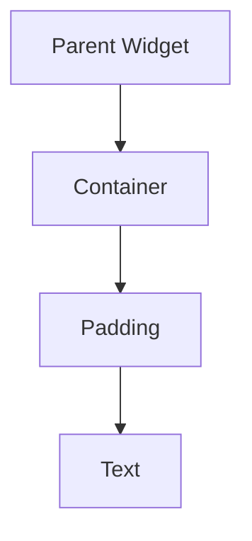

## 3.2.1 Mastering Single-Child Layout Widgets in Flutter

In the journey of developing a Flutter application, understanding how to manage the layout of your widgets is crucial. Single-child layout widgets are fundamental building blocks that allow you to control the positioning and size of a single child widget within its parent. This section will delve into the world of single-child layout widgets, exploring their uses, properties, and how they can be combined to create sophisticated and responsive user interfaces.

### Introduction to Single-Child Layout Widgets

Single-child layout widgets are a category of widgets in Flutter that are designed to contain and manage the layout of a single child widget. These widgets are essential for controlling the size, alignment, and positioning of their child, providing a flexible and powerful way to design your app's UI.

Unlike multi-child layout widgets, which can manage multiple children (like `Column` or `Row`), single-child layout widgets focus on a single widget, making them simpler to use and understand. They are often used in combination with other widgets to create complex layouts.

### Common Single-Child Layout Widgets

Let's explore some of the most commonly used single-child layout widgets in Flutter, each serving a unique purpose in managing the layout of its child.

#### Container

The `Container` widget is one of the most versatile and commonly used widgets in Flutter. It can be used to apply padding, margins, borders, and background colors to its child. Additionally, it allows you to control the size and alignment of the child widget.

**Common Properties:**
- `padding`: Adds space inside the container, around the child.
- `margin`: Adds space outside the container.
- `alignment`: Aligns the child within the container.
- `width` and `height`: Sets the size of the container.
- `color`: Sets the background color of the container.

**Example:**

```dart
Container(
  width: 200,
  height: 200,
  alignment: Alignment.bottomRight,
  color: Colors.green,
  child: Text('Aligned Text'),
);
```

In this example, the `Container` is given a fixed size of 200x200 pixels, with the child text aligned to the bottom-right corner.

#### Center

The `Center` widget is used to center its child within the available space. It is a simple yet powerful widget that ensures the child is always centered, regardless of the parent's size.

**Example:**

```dart
Center(
  child: Text('Centered Text'),
);
```

Here, the `Text` widget is centered within its parent, making it a straightforward choice for centering content.

#### Padding

The `Padding` widget adds space around its child, effectively increasing the space between the child and its parent. This widget is crucial for creating visually appealing layouts by ensuring that elements are not cramped together.

**Example:**

```dart
Padding(
  padding: EdgeInsets.all(16.0),
  child: Text('Padded Text'),
);
```

In this example, 16 pixels of padding are added around the `Text` widget, providing a comfortable amount of space.

#### Align

The `Align` widget allows you to position its child within itself according to an `Alignment` geometry. This widget is particularly useful when you need precise control over the child's position.

**Example:**

```dart
Align(
  alignment: Alignment.topLeft,
  child: Text('Top Left Aligned Text'),
);
```

This example demonstrates how the `Align` widget positions the `Text` widget at the top-left corner of the available space.

#### SizedBox

The `SizedBox` widget is used to give a widget a specific size. It can be used to create empty space or to constrain the size of its child.

**Example:**

```dart
SizedBox(
  width: 100,
  height: 100,
  child: Text('Sized Box Text'),
);
```

Here, the `SizedBox` constrains the `Text` widget to a size of 100x100 pixels.

### Examples of Use

Let's explore how these widgets can be used in practice to create various layouts.

#### Example 1: Combining Container and Padding

```dart
Container(
  padding: EdgeInsets.all(20.0),
  margin: EdgeInsets.all(10.0),
  color: Colors.blue,
  child: Padding(
    padding: EdgeInsets.all(8.0),
    child: Text('Nested Padding'),
  ),
);
```

In this example, a `Container` with padding and margin is used to wrap a `Padding` widget, demonstrating how these widgets can be combined to create nested layouts.

#### Example 2: Using Align and SizedBox

```dart
Align(
  alignment: Alignment.centerRight,
  child: SizedBox(
    width: 150,
    height: 50,
    child: Text('Aligned and Sized'),
  ),
);
```

This example shows how `Align` and `SizedBox` can be used together to position and size a widget precisely.

### Visual Aids

To better understand how these widgets affect the layout, let's visualize the hierarchy using Mermaid.js diagrams.



This diagram represents a simple widget tree where a `Container` contains a `Padding` widget, which in turn contains a `Text` widget.

### Best Practices and Tips

- **Experiment with Properties**: Don't hesitate to experiment with different properties of these widgets to see their effects. This hands-on approach will deepen your understanding.
- **Combine Widgets**: Use these widgets in combination to achieve complex layouts. For example, a `Container` with `Padding` can create a card-like effect.
- **Understand Alignment**: Mastering alignment properties will give you precise control over your UI's appearance.
- **Use SizedBox for Spacing**: `SizedBox` is not only for sizing but also useful for creating space between widgets.

### Troubleshooting Common Issues

- **Overlapping Widgets**: If widgets overlap unexpectedly, check the alignment and padding properties.
- **Unwanted Space**: Ensure that padding and margin values are set correctly to avoid unwanted space around widgets.
- **Layout Overflow**: If you encounter layout overflow errors, consider using `Expanded` or `Flexible` widgets in combination with single-child layout widgets.

### Conclusion

Mastering single-child layout widgets is a foundational skill in Flutter development. These widgets provide the flexibility and control needed to create beautiful and responsive user interfaces. By understanding their properties and experimenting with different combinations, you can design layouts that are both functional and aesthetically pleasing.

## Quiz Time!



### What is the primary purpose of single-child layout widgets in Flutter?

- [x] To control the positioning and size of a single child widget
- [ ] To manage multiple child widgets
- [ ] To handle user input
- [ ] To create animations

> **Explanation:** Single-child layout widgets are designed to control the positioning and size of a single child widget within its parent.

### Which widget is used to center its child within the available space?

- [ ] Container
- [x] Center
- [ ] Padding
- [ ] Align

> **Explanation:** The `Center` widget is used to center its child within the available space.

### How can you add padding around a child widget?

- [ ] Using Align
- [ ] Using SizedBox
- [x] Using Padding
- [ ] Using Center

> **Explanation:** The `Padding` widget is used to add space around its child.

### What property of the Container widget is used to align its child?

- [ ] padding
- [ ] margin
- [x] alignment
- [ ] color

> **Explanation:** The `alignment` property of the `Container` widget is used to align its child within the container.

### Which widget can be used to give a widget a specific size?

- [ ] Align
- [ ] Padding
- [x] SizedBox
- [ ] Center

> **Explanation:** The `SizedBox` widget is used to give a widget a specific size.

### What is the effect of setting a margin on a Container widget?

- [ ] It adds space inside the container around the child.
- [x] It adds space outside the container.
- [ ] It changes the background color.
- [ ] It aligns the child within the container.

> **Explanation:** Setting a margin on a `Container` widget adds space outside the container.

### How can you position a child widget at the top-left corner of its parent?

- [x] Using Align with alignment: Alignment.topLeft
- [ ] Using Center
- [ ] Using Padding
- [ ] Using SizedBox

> **Explanation:** The `Align` widget with `alignment: Alignment.topLeft` positions the child at the top-left corner.

### What is a common use case for the SizedBox widget?

- [ ] To add padding
- [x] To create empty space or constrain size
- [ ] To center a widget
- [ ] To change text color

> **Explanation:** The `SizedBox` widget is commonly used to create empty space or constrain the size of a widget.

### Which widget would you use to ensure a widget is always centered?

- [ ] Align
- [x] Center
- [ ] Padding
- [ ] Container

> **Explanation:** The `Center` widget ensures its child is always centered within the available space.

### True or False: The Container widget can only have one child.

- [x] True
- [ ] False

> **Explanation:** The `Container` widget is a single-child layout widget, meaning it can only have one child.


