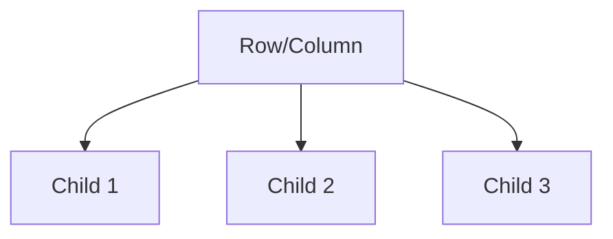
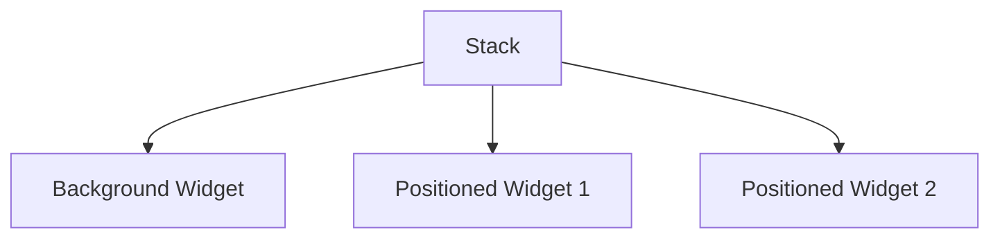

## 3.2.2 Multi-Child Layout Widgets

In the world of Flutter development, creating a visually appealing and functional user interface is paramount. Multi-child layout widgets are the backbone of arranging multiple widgets on the screen, enabling developers to design complex and responsive UIs. This section will delve into the intricacies of these widgets, providing you with the knowledge and tools to harness their full potential.

### Introduction to Multi-Child Layout Widgets

Multi-child layout widgets in Flutter are designed to hold and arrange multiple child widgets. Unlike single-child widgets, which manage only one child, multi-child widgets provide the flexibility to organize several widgets in a structured manner. These widgets are essential for creating sophisticated layouts that adapt to different screen sizes and orientations.

The primary purpose of multi-child layout widgets is to control the positioning and sizing of their children. By understanding how these widgets work, you can create layouts that are both aesthetically pleasing and functionally robust.

### Common Multi-Child Layout Widgets

Flutter offers several multi-child layout widgets, each serving a unique purpose. Let's explore the most commonly used ones: Row, Column, Stack, and Wrap.

#### Row and Column

**Row** and **Column** are the most fundamental multi-child layout widgets in Flutter. They allow you to arrange widgets horizontally and vertically, respectively.

- **Row**: Aligns its children in a horizontal array.
- **Column**: Aligns its children in a vertical array.

Both Row and Column have several properties that control the alignment and spacing of their children:

- **`mainAxisAlignment`**: Determines how the children are aligned along the main axis (horizontal for Row, vertical for Column).
- **`crossAxisAlignment`**: Determines how the children are aligned along the cross axis (vertical for Row, horizontal for Column).
- **`children`**: A list of widgets to be displayed.

##### Row Widget Example

```dart
Row(
  mainAxisAlignment: MainAxisAlignment.spaceAround,
  children: <Widget>[
    Icon(Icons.star),
    Icon(Icons.favorite),
    Icon(Icons.person),
  ],
);
```

In this example, the `Row` widget arranges three icons horizontally, with equal space around them.

##### Column Widget Example

```dart
Column(
  crossAxisAlignment: CrossAxisAlignment.start,
  children: <Widget>[
    Text('First Line'),
    Text('Second Line'),
    Text('Third Line'),
  ],
);
```

Here, the `Column` widget arranges three text widgets vertically, aligning them to the start of the cross axis.

#### Stack

The **Stack** widget allows you to overlay widgets on top of each other. This is useful for creating complex designs where widgets need to overlap.

- **`children`**: A list of widgets to be stacked.
- **`Positioned`**: A widget that controls the position of a child within the Stack.

##### Stack Widget Example

```dart
Stack(
  children: <Widget>[
    Container(
      width: 200,
      height: 200,
      color: Colors.blue,
    ),
    Positioned(
      top: 50,
      left: 50,
      child: Container(
        width: 100,
        height: 100,
        color: Colors.red,
      ),
    ),
  ],
);
```

In this example, a smaller red container is positioned on top of a larger blue container, demonstrating how Stack can be used to layer widgets.

#### Wrap

The **Wrap** widget is similar to Row and Column but with the added ability to move to the next line or column when there is not enough space.

- **`direction`**: Determines the direction of the wrap (horizontal or vertical).
- **`alignment`**: Controls the alignment of children within each run.
- **`spacing`**: Adds spacing between children.

##### Wrap Widget Example

```dart
Wrap(
  spacing: 8.0,
  runSpacing: 4.0,
  children: <Widget>[
    Chip(label: Text('Flutter')),
    Chip(label: Text('Dart')),
    Chip(label: Text('Programming')),
  ],
);
```

This example shows how the `Wrap` widget arranges `Chip` widgets horizontally, wrapping to the next line when needed.

### Layout Constraints

Understanding Flutter's layout constraints is crucial for effectively using multi-child layout widgets. Flutter's layout system is based on a constraint-based model, where parent widgets impose constraints on their children, dictating how they can be sized and positioned.

- **Constraints**: Define the minimum and maximum width and height a widget can have.
- **Intrinsic Dimensions**: Widgets can measure their content to determine their size.
- **Flexibility**: Widgets like Row and Column can flexibly distribute space among their children using properties like `flex`.

### Visual Aids

To further illustrate how these widgets arrange their children, let's use some diagrams.

#### Row and Column Diagram



This diagram shows a simple hierarchy where a Row or Column widget contains three children.

#### Stack Diagram



The Stack diagram illustrates how widgets are layered, with Positioned widgets on top of a background widget.

### Best Practices and Common Pitfalls

- **Avoid Overflows**: Ensure that your widgets do not exceed the available space, which can cause overflow errors.
- **Use Flex Wisely**: When using Row and Column, leverage the `flex` property to distribute space proportionally.
- **Optimize for Performance**: Minimize the number of widgets in a Stack to avoid performance issues.

### Hands-On Practice

To solidify your understanding, try building a simple layout using each of these widgets. Experiment with different properties and observe how they affect the layout.

### Troubleshooting Tips

- **Overflow Errors**: Check the constraints and ensure that your widgets fit within the available space.
- **Alignment Issues**: Use `mainAxisAlignment` and `crossAxisAlignment` to adjust the positioning of children.
- **Layering Problems**: In Stack, ensure that Positioned widgets are correctly placed to avoid unintended overlaps.

## Quiz Time!



### What is the primary purpose of multi-child layout widgets in Flutter?

- [x] To arrange multiple widgets in a structured manner
- [ ] To manage a single widget
- [ ] To handle user input
- [ ] To perform animations

> **Explanation:** Multi-child layout widgets are designed to arrange multiple widgets in a structured manner, allowing for complex UI designs.

### Which property of Row and Column controls the alignment of children along the main axis?

- [x] `mainAxisAlignment`
- [ ] `crossAxisAlignment`
- [ ] `alignment`
- [ ] `flex`

> **Explanation:** The `mainAxisAlignment` property controls how the children are aligned along the main axis in Row and Column.

### What widget is used within a Stack to position a child at a specific location?

- [x] `Positioned`
- [ ] `Align`
- [ ] `Center`
- [ ] `Container`

> **Explanation:** The `Positioned` widget is used within a Stack to specify the position of a child widget.

### How does the Wrap widget differ from Row and Column?

- [x] It can wrap to the next line or column when there is not enough space.
- [ ] It arranges children horizontally only.
- [ ] It arranges children vertically only.
- [ ] It does not allow for spacing between children.

> **Explanation:** The Wrap widget can move to the next line or column when there is insufficient space, unlike Row and Column.

### What is a common cause of overflow errors in Flutter layouts?

- [x] Widgets exceeding the available space
- [ ] Incorrect widget alignment
- [ ] Using too many Positioned widgets
- [ ] Lack of flex properties

> **Explanation:** Overflow errors occur when widgets exceed the available space, often due to incorrect constraints.

### Which property in Row and Column can be used to distribute space among children?

- [x] `flex`
- [ ] `spacing`
- [ ] `alignment`
- [ ] `position`

> **Explanation:** The `flex` property allows for proportional distribution of space among children in Row and Column.

### What is a key consideration when using the Stack widget?

- [x] Minimizing the number of layers for performance
- [ ] Ensuring all children are the same size
- [ ] Using only Positioned widgets
- [ ] Avoiding any alignment properties

> **Explanation:** Minimizing the number of layers in a Stack is important for maintaining performance.

### Which property of Wrap controls the spacing between children?

- [x] `spacing`
- [ ] `alignment`
- [ ] `flex`
- [ ] `position`

> **Explanation:** The `spacing` property in Wrap controls the space between children.

### What is the role of constraints in Flutter's layout system?

- [x] To define the size and position limits for widgets
- [ ] To handle user input
- [ ] To perform animations
- [ ] To manage state

> **Explanation:** Constraints define the size and position limits for widgets, guiding how they are laid out.

### True or False: The Stack widget is used to arrange widgets in a linear fashion.

- [ ] True
- [x] False

> **Explanation:** False. The Stack widget is used to overlay widgets, not to arrange them linearly.



By mastering multi-child layout widgets, you unlock the ability to create dynamic and responsive user interfaces in Flutter. These tools are essential for any developer aiming to build professional-grade applications. Happy coding!
