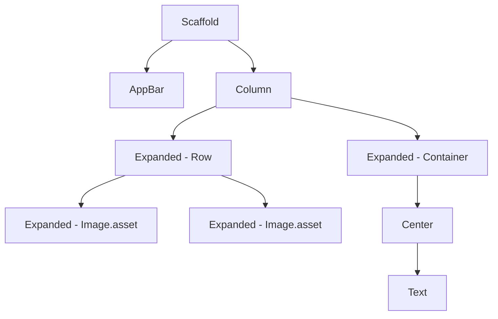

## 3.2.4 Building Complex Layouts

Creating complex layouts in Flutter is both an art and a science. It involves a deep understanding of how widgets work together, how constraints are managed, and how to ensure that your UI is responsive across various devices. In this section, we will guide you through the process of building intricate and responsive UIs using Flutter's powerful layout system.

### Planning Layouts

Before diving into code, it's crucial to plan your layout. Planning helps you visualize the end product and identify potential challenges early on. Here are some strategies to consider:

- **Sketch Your Layout**: Use pen and paper or digital tools like Sketch, Figma, or Adobe XD to create wireframes. This step helps in visualizing the structure and flow of your UI.
- **Define the Hierarchy**: Identify the main components of your layout and their relationships. Determine which elements are primary and which are secondary.
- **Consider User Interaction**: Think about how users will interact with your app. This includes navigation, input fields, and interactive elements.

### Breaking Down the Layout

Complex UIs can be overwhelming if viewed as a whole. Breaking them down into smaller, manageable parts makes the development process more straightforward:

- **Identify Sections**: Divide your layout into logical sections. For example, a typical app might have a header, content area, and footer.
- **Componentize**: Create reusable components for repeated UI elements. This not only saves time but also ensures consistency across your app.
- **Use Flutter's Widget Tree**: Leverage Flutter's widget tree structure to organize your components hierarchically.

### Nesting Widgets

Nesting widgets is a fundamental concept in Flutter. It allows you to build complex UIs by combining simple widgets:

- **Containers and Rows/Columns**: Use `Container`, `Row`, and `Column` widgets to create basic structures. Nest these widgets to build more complex layouts.
- **Stack and Positioned**: For overlapping elements, use the `Stack` widget. The `Positioned` widget allows precise control over the position of child widgets within a `Stack`.
- **Custom Widgets**: Create custom widgets to encapsulate complex logic or UI components. This promotes reusability and cleaner code.

### Handling Constraints

Understanding how constraints work in Flutter is key to building flexible layouts:

- **Constraint Propagation**: Constraints flow down the widget tree, and sizes flow back up. A widget tells its children how much space they can have, and the children tell the widget how much space they need.
- **Flexible and Expanded Widgets**: Use `Flexible` and `Expanded` widgets to control how much space a widget should take relative to its siblings.
- **Intrinsic Dimensions**: Widgets like `IntrinsicWidth` and `IntrinsicHeight` can be used when you need a widget to size itself based on its content.

### Responsive Design

Responsive design ensures that your app looks good on all devices, regardless of screen size:

- **MediaQuery**: Use `MediaQuery` to get information about the device's screen size and orientation. This allows you to adjust your layout dynamically.
- **LayoutBuilder**: The `LayoutBuilder` widget provides constraints that can be used to build responsive layouts based on the available space.
- **AspectRatio and FittedBox**: Use `AspectRatio` to maintain a widget's aspect ratio, and `FittedBox` to scale widgets to fit within a given space.

### Example of a Complex Layout

Let's walk through a practical example of building a complex layout in Flutter:

```dart
Scaffold(
  appBar: AppBar(title: Text('Complex Layout')),
  body: Column(
    children: [
      Expanded(
        child: Row(
          children: [
            Expanded(child: Image.asset('assets/image1.png')),
            Expanded(child: Image.asset('assets/image2.png')),
          ],
        ),
      ),
      Expanded(
        child: Container(
          color: Colors.blueGrey,
          child: Center(
            child: Text('Bottom Section'),
          ),
        ),
      ),
    ],
  ),
);
```

#### Step-by-Step Breakdown

1. **Scaffold**: The `Scaffold` widget provides a basic material design layout structure. It includes an `AppBar` and a `body`.

2. **Column**: The `Column` widget arranges its children vertically. Here, it's used to stack the image row and the bottom section.

3. **Expanded**: The `Expanded` widget tells its child to take up the remaining space in the parent widget. In this example, both the `Row` and the `Container` are wrapped in `Expanded` widgets to fill the available vertical space.

4. **Row**: The `Row` widget arranges its children horizontally. It's used here to display two images side by side.

5. **Image.asset**: This widget displays an image from the asset bundle. Each image is wrapped in an `Expanded` widget to ensure they take equal space.

6. **Container and Center**: The `Container` widget holds the bottom section, and the `Center` widget centers its child within the container.

#### Visual Representation

Below is a visual representation of the widget tree for the above layout using Mermaid.js:



### Best Practices and Tips

- **Test on Multiple Devices**: Always test your layouts on different devices and orientations to ensure they are responsive.
- **Use Debugging Tools**: Flutter provides tools like the Flutter Inspector to help you debug layout issues.
- **Keep It Simple**: Avoid over-nesting widgets. Simplicity often leads to better performance and easier maintenance.
- **Stay Updated**: Flutter is constantly evolving. Keep up with the latest updates and best practices by following the [official Flutter documentation](https://flutter.dev/docs).

### Troubleshooting Common Layout Problems

- **Overflow Errors**: These occur when a widget doesn't fit within its constraints. Use `Flexible` or `Expanded` to manage space better.
- **Alignment Issues**: Use alignment properties in widgets like `Container` and `Stack` to position children correctly.
- **Performance Concerns**: Excessive nesting can lead to performance issues. Consider flattening your widget tree where possible.

By following these guidelines and practices, you can create complex and responsive layouts that enhance the user experience and make your app stand out.

## Quiz Time!



### What is the first step in planning a complex layout in Flutter?

- [x] Sketching the layout or using wireframes
- [ ] Writing the code immediately
- [ ] Testing on multiple devices
- [ ] Deploying the app

> **Explanation:** Sketching the layout or using wireframes helps visualize the structure and flow of the UI before coding.

### How can you break down a complex UI into manageable parts?

- [x] Identify sections and componentize
- [ ] Use only one widget for the entire UI
- [ ] Ignore the hierarchy
- [ ] Focus on styling first

> **Explanation:** Breaking down a UI into sections and creating reusable components makes the development process more manageable.

### Which widget is used to arrange children vertically?

- [x] Column
- [ ] Row
- [ ] Stack
- [ ] Container

> **Explanation:** The `Column` widget arranges its children vertically.

### What is the purpose of the Expanded widget?

- [x] To make a widget take up the remaining space in its parent
- [ ] To add padding around a widget
- [ ] To change the color of a widget
- [ ] To align a widget to the center

> **Explanation:** The `Expanded` widget tells its child to take up the remaining space in the parent widget.

### How can you ensure a layout is responsive to different screen sizes?

- [x] Use MediaQuery and LayoutBuilder
- [ ] Use only fixed sizes
- [ ] Ignore device orientation
- [ ] Use hardcoded pixel values

> **Explanation:** `MediaQuery` and `LayoutBuilder` provide information about the device's screen size and constraints, enabling responsive design.

### What is a common cause of overflow errors in Flutter layouts?

- [x] Widgets not fitting within their constraints
- [ ] Using too many colors
- [ ] Incorrect imports
- [ ] Using too few widgets

> **Explanation:** Overflow errors occur when a widget doesn't fit within its constraints.

### Which widget allows overlapping of child widgets?

- [x] Stack
- [ ] Column
- [ ] Row
- [ ] Container

> **Explanation:** The `Stack` widget allows overlapping of child widgets.

### What tool can help debug layout issues in Flutter?

- [x] Flutter Inspector
- [ ] Android Studio
- [ ] Xcode
- [ ] Visual Studio Code

> **Explanation:** The Flutter Inspector is a tool that helps debug layout issues in Flutter.

### Why is it important to test layouts on multiple devices?

- [x] To ensure responsiveness and compatibility
- [ ] To increase development time
- [ ] To reduce code complexity
- [ ] To avoid using widgets

> **Explanation:** Testing on multiple devices ensures that the layout is responsive and compatible across different screen sizes and orientations.

### True or False: Over-nesting widgets can lead to performance issues.

- [x] True
- [ ] False

> **Explanation:** Over-nesting widgets can lead to performance issues, so it's important to keep the widget tree as flat as possible.


