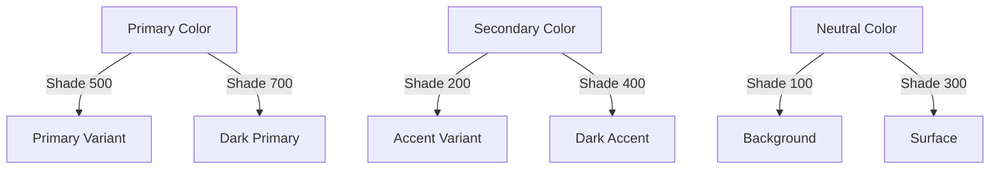

## 3.3.2 Colors and Material Themes

In the world of mobile app development, the visual appeal of an application is paramount. Colors and themes are not just aesthetic choices; they are essential components of user experience and brand identity. In this section, we will explore how to harness the power of colors and themes in Flutter to create visually stunning and consistent applications. We will delve into the `Color` class, the Material Design color palette, defining and applying themes, and supporting dark mode. By the end of this section, you'll be equipped to create a cohesive and engaging user interface for your Flutter app.

### Understanding the Color Class

Flutter provides a robust `Color` class that allows you to define colors in various ways. Understanding how to use this class is crucial for customizing the look of your app.

#### Defining Colors

Colors in Flutter can be defined using ARGB values, hex codes, or predefined colors available in the `Colors` class.

- **ARGB Values**: ARGB stands for Alpha, Red, Green, and Blue. The `Color` class accepts a 32-bit integer where the first 8 bits represent the alpha channel (opacity), followed by red, green, and blue channels.

  ```dart
  Color colorWithARGB = Color.fromARGB(255, 66, 165, 245); // Fully opaque blue
  ```

- **Hex Codes**: Hexadecimal color codes are a common way to define colors. In Flutter, you can use hex codes by prefixing them with `0xFF` for full opacity.

  ```dart
  Color colorWithHex = Color(0xFF42A5F5); // Hex color code for blue
  ```

- **Predefined Colors**: Flutter's `Colors` class provides a wide range of predefined colors that you can use directly.

  ```dart
  Color predefinedColor = Colors.blue;
  ```

#### Practical Example: Using Custom Colors

Here's a simple example of how to use a custom color in a Flutter widget:

```dart
Color customColor = Color(0xFF42A5F5); // Hex color code

Container(
  color: customColor,
  child: Text('Custom Color'),
);
```

### The Material Design Color Palette

Material Design, developed by Google, is a design language that emphasizes clean, modern aesthetics. It provides a comprehensive color system that helps maintain visual consistency across different platforms and devices.

#### Significance of Material Design Colors

Material Design colors are organized into primary, secondary, and accent colors, each with varying shades. These colors are designed to work harmoniously together, ensuring that your app's UI is both attractive and functional.

- **Primary Colors**: Used for key components like the app bar and floating action button.
- **Secondary (Accent) Colors**: Used to highlight elements and provide visual interest.
- **Neutral Colors**: Used for backgrounds, surfaces, and text.

#### Visual Aid: Material Design Color Palette

Here's a visual representation of the Material Design color palette:



### Defining Themes in Flutter

Themes allow you to define the colors, fonts, and shapes that your app's widgets will inherit. This ensures a consistent look and feel across your application.

#### Creating a ThemeData Object

The `ThemeData` object is where you define your app's theme. You can specify primary and accent colors, text themes, icon themes, and more.

```dart
ThemeData appTheme = ThemeData(
  primarySwatch: Colors.blue,
  accentColor: Colors.orange,
  textTheme: TextTheme(
    bodyText2: TextStyle(fontSize: 18),
  ),
);
```

#### Setting a Theme in MaterialApp

Once you've defined your `ThemeData`, you can apply it to your app by passing it to the `MaterialApp` widget.

```dart
MaterialApp(
  theme: appTheme,
  home: MyHomePage(),
);
```

### Applying Themes to Widgets

In Flutter, widgets automatically inherit theme data from their parent widgets, making it easy to maintain consistency.

#### Inheriting Theme Data

Most widgets in Flutter will automatically use the colors and styles defined in your app's theme. For example, a `Text` widget will use the `TextTheme` defined in `ThemeData`.

```dart
Text(
  'Hello, Flutter!',
  style: Theme.of(context).textTheme.bodyText2,
);
```

#### Overriding Theme Data Locally

Sometimes, you may want to override the global theme settings for specific widgets. You can do this by wrapping the widget in a `Theme` widget and providing a new `ThemeData`.

```dart
Theme(
  data: ThemeData(
    primaryColor: Colors.green,
  ),
  child: AppBar(
    title: Text('Custom Themed AppBar'),
  ),
);
```

### Supporting Dark Mode

With the increasing popularity of dark mode, it's essential to support both light and dark themes in your app.

#### Defining Light and Dark Themes

You can define separate `ThemeData` objects for light and dark themes and switch between them based on user preference or system settings.

```dart
ThemeData lightTheme = ThemeData.light().copyWith(
  primaryColor: Colors.blue,
  accentColor: Colors.orange,
);

ThemeData darkTheme = ThemeData.dark().copyWith(
  primaryColor: Colors.blueGrey,
  accentColor: Colors.teal,
);
```

#### Switching Themes Dynamically

Flutter makes it easy to switch between themes using the `themeMode` property of `MaterialApp`.

```dart
MaterialApp(
  theme: lightTheme,
  darkTheme: darkTheme,
  themeMode: ThemeMode.system, // Automatically switch based on system settings
  home: MyHomePage(),
);
```

### Best Practices for Theming

- **Consistency**: Ensure that your theme is applied consistently across all screens and widgets.
- **Material Design Guidelines**: Follow Material Design guidelines to create a modern and intuitive UI.
- **Early Definition**: Define your theme early in the development process to avoid inconsistencies.
- **Accessibility**: Consider color contrast and accessibility when choosing colors.

### Common Pitfalls and Troubleshooting

- **Inconsistent Theming**: Ensure that all widgets are using the theme by checking their `style` or `color` properties.
- **Dark Mode Issues**: Test your app in both light and dark modes to ensure readability and usability.
- **Performance**: Avoid creating new `ThemeData` objects frequently, as this can impact performance.

### Conclusion

Mastering colors and themes in Flutter is essential for creating visually appealing and consistent applications. By understanding the `Color` class, leveraging the Material Design color palette, and defining comprehensive themes, you can ensure that your app not only looks great but also provides a seamless user experience. Remember to support both light and dark modes to cater to user preferences and enhance accessibility.

Now that you have a solid understanding of colors and themes in Flutter, you're ready to apply these concepts to your own projects. Experiment with different color combinations and theme settings to find the perfect look for your app.

## Quiz Time!



### What is the purpose of the `Color` class in Flutter?

- [x] To define colors using ARGB values, hex codes, or predefined colors.
- [ ] To create animations.
- [ ] To manage state in a Flutter app.
- [ ] To handle network requests.

> **Explanation:** The `Color` class in Flutter is used to define colors using various methods such as ARGB values, hex codes, or predefined colors in the `Colors` class.

### How can you define a fully opaque color using ARGB values?

- [x] By setting the alpha channel to 255.
- [ ] By setting the alpha channel to 0.
- [ ] By using a hex code.
- [ ] By using a predefined color.

> **Explanation:** In ARGB values, the alpha channel controls opacity. Setting it to 255 makes the color fully opaque.

### What is the significance of Material Design colors?

- [x] They ensure visual consistency across different platforms.
- [ ] They are only used for branding purposes.
- [ ] They are used to create animations.
- [ ] They are specific to Android apps only.

> **Explanation:** Material Design colors are designed to ensure visual consistency across different platforms and devices, making them suitable for modern UI design.

### How do you apply a theme to a Flutter app?

- [x] By passing a `ThemeData` object to the `MaterialApp` widget.
- [ ] By using a `Container` widget.
- [ ] By setting the `color` property of each widget.
- [ ] By using a `Scaffold` widget.

> **Explanation:** A theme is applied to a Flutter app by passing a `ThemeData` object to the `MaterialApp` widget, which then propagates the theme to all descendant widgets.

### What is the benefit of supporting dark mode in your app?

- [x] It enhances user experience by providing a visually comfortable option.
- [ ] It increases app performance.
- [ ] It reduces app size.
- [ ] It is only beneficial for Android apps.

> **Explanation:** Supporting dark mode enhances user experience by providing a visually comfortable option, especially in low-light environments.

### How can you override theme data for a specific widget?

- [x] By wrapping the widget in a `Theme` widget with a new `ThemeData`.
- [ ] By using a `Container` widget.
- [ ] By setting the `color` property of the widget.
- [ ] By using a `Scaffold` widget.

> **Explanation:** You can override theme data for a specific widget by wrapping it in a `Theme` widget and providing a new `ThemeData`.

### Which property allows a Flutter app to switch themes based on system settings?

- [x] `themeMode`
- [ ] `colorScheme`
- [ ] `primaryColor`
- [ ] `accentColor`

> **Explanation:** The `themeMode` property of `MaterialApp` allows the app to switch themes based on system settings, supporting light and dark modes.

### What is a common pitfall when implementing themes in Flutter?

- [x] Inconsistent theming across widgets.
- [ ] Using too many colors.
- [ ] Not using enough animations.
- [ ] Overusing predefined colors.

> **Explanation:** A common pitfall is inconsistent theming across widgets, which can occur if widgets do not properly inherit or apply the theme.

### Why is it important to define a theme early in the development process?

- [x] To avoid inconsistencies and ensure a cohesive design.
- [ ] To reduce app size.
- [ ] To improve app performance.
- [ ] To make the app compatible with older devices.

> **Explanation:** Defining a theme early helps avoid inconsistencies and ensures a cohesive design throughout the app.

### True or False: Material Design colors are only applicable to Android apps.

- [ ] True
- [x] False

> **Explanation:** Material Design colors are not limited to Android apps; they are applicable to any platform that follows Material Design guidelines, including iOS and web.


