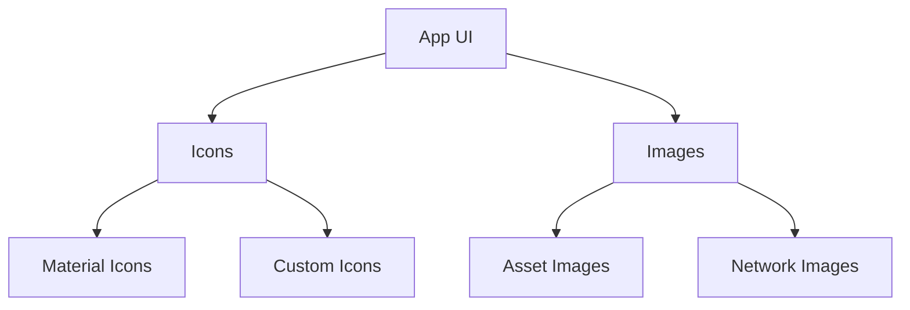

## 3.3.3 Icons and Images

In the world of mobile app development, icons and images play a crucial role in enhancing the user interface and overall user experience. They not only make your app visually appealing but also help in conveying information quickly and efficiently. In this section, we'll delve into the intricacies of incorporating icons and images into your Flutter apps, ensuring you have the skills to make your app stand out on the App Store.

### Using Icons in Flutter

Icons are a fundamental part of any app's design. In Flutter, the `Icon` widget is used to display icons from the Material Design library. This library provides a comprehensive set of icons that can be customized to fit your app's theme.

#### The `Icon` Widget

The `Icon` widget is straightforward to use. Here's a basic example:

```dart
Icon(
  Icons.home,
  size: 30.0,
  color: Colors.blue,
);
```

In this example, we're using the `Icons.home` icon, setting its size to 30.0, and coloring it blue. The `Icons` class provides a wide range of icons that you can use in your app.

#### Customizing Icons

Customization is key to ensuring that the icons fit seamlessly into your app's design. You can modify various properties such as size, color, and more:

- **Size**: Adjust the size of the icon to fit different parts of your UI.
- **Color**: Change the color to match your app's theme.
- **Semantic Label**: Provide a semantic label for accessibility purposes.

Here's how you can customize an icon further:

```dart
Icon(
  Icons.favorite,
  size: 40.0,
  color: Colors.red,
  semanticLabel: 'Favorite',
);
```

#### Introducing Custom Icons

While Material Icons cover a broad spectrum, there might be scenarios where you need custom icons. Flutter allows you to use custom icons by creating an `IconData` object. This is particularly useful when you have a unique design language or branding.

To use custom icons, you typically include them as fonts in your project. Here's a step-by-step guide:

1. **Add the Font File**: Place your custom icon font file in the `assets/fonts` directory.
2. **Update `pubspec.yaml`**: Register the font in your `pubspec.yaml` file:

   ```yaml
   flutter:
     fonts:
       - family: CustomIcons
         fonts:
           - asset: assets/fonts/CustomIcons.ttf
   ```

3. **Use the Custom Icon**: Create an `IconData` object and use it in the `Icon` widget:

   ```dart
   Icon(
     IconData(0xe900, fontFamily: 'CustomIcons'),
     size: 30.0,
     color: Colors.green,
   );
   ```

### Displaying Images in Flutter

Images are another critical component of app design. Flutter provides several ways to display images, whether they're local assets or loaded from the network.

#### Loading Images from Assets

To include images in your app, you need to add them to your project's assets and register them in the `pubspec.yaml` file.

1. **Add Images to Assets**: Place your images in the `assets/images` directory.
2. **Update `pubspec.yaml`**: Register the images:

   ```yaml
   flutter:
     assets:
       - assets/images/logo.png
       - assets/images/background.jpg
   ```

3. **Use `Image.asset`**: Display the image in your app:

   ```dart
   Image.asset(
     'assets/images/logo.png',
     width: 100,
     height: 100,
   );
   ```

#### Displaying Network Images

For images hosted online, use the `Image.network` widget. This widget fetches the image from the internet and displays it in your app.

```dart
Image.network(
  'https://example.com/image.jpg',
  loadingBuilder: (context, child, loadingProgress) {
    if (loadingProgress == null) return child;
    return CircularProgressIndicator();
  },
);
```

The `loadingBuilder` parameter allows you to show a loading indicator while the image is being fetched.

### Image Properties

Flutter's `Image` widget comes with several properties that allow you to control how images are displayed.

- **Fit**: Determines how the image should be inscribed into the space allocated during layout.

  ```dart
  Image.asset(
    'assets/images/logo.png',
    fit: BoxFit.cover,
  );
  ```

- **Alignment**: Specifies how the image should be aligned within its bounds.

  ```dart
  Image.asset(
    'assets/images/logo.png',
    alignment: Alignment.center,
  );
  ```

- **ColorBlendMode**: Applies a color filter to the image.

  ```dart
  Image.asset(
    'assets/images/logo.png',
    color: Colors.red,
    colorBlendMode: BlendMode.colorBurn,
  );
  ```

### Best Practices for Icons and Images

To ensure your app performs well and provides a great user experience, consider the following best practices:

#### Image Optimization

- **Use Appropriate Formats**: Use PNG for images with transparency and JPEG for photos.
- **Compress Images**: Reduce file size without compromising quality.
- **Use Vector Graphics**: For icons and simple graphics, use vector formats like SVG to ensure scalability.

#### Caching Strategies

- **Cache Network Images**: Use caching libraries to store images locally and reduce network calls.
- **Handle Image Loading Failures**: Provide fallback images or error messages if an image fails to load.

### Visual Aids and Practical Implementation

To better understand how icons and images fit into your app, let's visualize their placement and usage.



This diagram illustrates the relationship between your app's UI and the icons and images it uses. Icons can be either Material or custom, while images can be loaded from assets or the network.

### Organizing Image Assets

Proper organization of your image assets is crucial for maintainability:

- **Directory Structure**: Use a clear directory structure, such as `assets/images`, `assets/icons`, etc.
- **Naming Conventions**: Use descriptive names for your image files to make them easily identifiable.

### Handling Image Load Failures

It's essential to handle scenarios where images fail to load, especially for network images. You can use the `errorBuilder` parameter in `Image.network` to display an alternative widget or message.

```dart
Image.network(
  'https://example.com/image.jpg',
  errorBuilder: (context, error, stackTrace) {
    return Text('Failed to load image');
  },
);
```

### Conclusion

Mastering the use of icons and images in Flutter is a vital skill for any app developer. By understanding how to customize icons, manage image assets, and optimize performance, you can create visually stunning apps that provide an excellent user experience. Remember to follow best practices for image optimization and caching to ensure your app runs smoothly.

## Quiz Time!



### What widget is used to display icons in Flutter?

- [x] Icon
- [ ] Image
- [ ] IconData
- [ ] IconButton

> **Explanation:** The `Icon` widget is used to display icons in Flutter, utilizing the Material Design library.

### How do you register an image asset in Flutter?

- [x] By adding it to the `pubspec.yaml` file under the `assets` section.
- [ ] By placing it in the `lib` directory.
- [ ] By using the `Image.asset` widget directly.
- [ ] By importing it in the main Dart file.

> **Explanation:** To use an image asset in Flutter, it must be registered in the `pubspec.yaml` file under the `assets` section.

### Which property adjusts how an image is inscribed into its allocated space?

- [x] fit
- [ ] alignment
- [ ] colorBlendMode
- [ ] semanticLabel

> **Explanation:** The `fit` property determines how an image should be inscribed into the space allocated during layout.

### What is the purpose of the `loadingBuilder` parameter in `Image.network`?

- [x] To show a loading indicator while the image is being fetched.
- [ ] To cache the image locally.
- [ ] To handle image load failures.
- [ ] To adjust the image's alignment.

> **Explanation:** The `loadingBuilder` parameter allows you to show a loading indicator while the image is being fetched from the network.

### What is a best practice for handling network images?

- [x] Use caching to store images locally.
- [ ] Always load images synchronously.
- [ ] Avoid using network images.
- [ ] Use only PNG format for network images.

> **Explanation:** Using caching to store images locally is a best practice for handling network images, as it reduces network calls and improves performance.

### How can you provide a semantic label for an icon?

- [x] By using the `semanticLabel` property.
- [ ] By using the `label` property.
- [ ] By using the `tooltip` property.
- [ ] By using the `description` property.

> **Explanation:** The `semanticLabel` property is used to provide a semantic label for an icon, which is important for accessibility.

### What should you do if an image fails to load?

- [x] Use the `errorBuilder` parameter to display an alternative widget.
- [ ] Ignore the failure and proceed.
- [ ] Retry loading the image indefinitely.
- [ ] Display a blank space.

> **Explanation:** The `errorBuilder` parameter allows you to handle image load failures by displaying an alternative widget or message.

### Which image format is recommended for photos?

- [x] JPEG
- [ ] PNG
- [ ] SVG
- [ ] BMP

> **Explanation:** JPEG is recommended for photos due to its ability to compress images with minimal quality loss.

### What is the advantage of using vector graphics for icons?

- [x] They are scalable without losing quality.
- [ ] They load faster than raster images.
- [ ] They are easier to animate.
- [ ] They require less memory.

> **Explanation:** Vector graphics are scalable without losing quality, making them ideal for icons and simple graphics.

### True or False: The `IconData` class is used to create custom icons in Flutter.

- [x] True
- [ ] False

> **Explanation:** The `IconData` class is used to create custom icons in Flutter, allowing you to use your own icon fonts.


