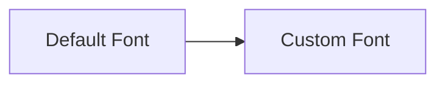

## 3.3.4 Using Custom Fonts

Typography is a powerful tool in app design, influencing both aesthetics and usability. Custom fonts can set the tone of your application, enhance brand identity, and improve readability. In this section, we'll explore how to integrate custom fonts into your Flutter app, ensuring your text elements are as engaging as your app's functionality.

### Why Use Custom Fonts?

The choice of typography can significantly impact the user experience. Here's why custom fonts are essential:

- **Brand Identity**: Fonts can convey the personality of your brand. A unique typeface can make your app instantly recognizable.
- **Aesthetic Appeal**: Custom fonts can enhance the visual appeal of your app, making it more attractive to users.
- **Readability**: Choosing the right font can improve readability, especially for users with visual impairments.
- **User Engagement**: Well-chosen typography can make your content more engaging, keeping users on your app longer.

### Adding Fonts to Your Project

To use custom fonts in Flutter, you need to include the font files in your project and update the `pubspec.yaml` file. Here’s a step-by-step guide:

#### Step 1: Source Your Fonts

Before adding fonts, you need to source them. Websites like [Google Fonts](https://fonts.google.com/), [Font Squirrel](https://www.fontsquirrel.com/), and [Adobe Fonts](https://fonts.adobe.com/) offer a wide range of free and licensed fonts. Ensure you have the necessary licenses to use the fonts in your app.

#### Step 2: Add Font Files to Your Project

Create a directory in your Flutter project to store your font files. A common practice is to create a `fonts` directory at the root level of your project:

```
my_flutter_app/
  ├── lib/
  ├── assets/
  │   └── fonts/
  │       ├── OpenSans-Regular.ttf
  │       └── OpenSans-Bold.ttf
  ├── pubspec.yaml
  └── ...
```

#### Step 3: Update `pubspec.yaml`

Next, you need to declare your font assets in the `pubspec.yaml` file. This file tells Flutter where to find your font files and how to use them.

```yaml
flutter:
  fonts:
    - family: OpenSans
      fonts:
        - asset: assets/fonts/OpenSans-Regular.ttf
        - asset: assets/fonts/OpenSans-Bold.ttf
          weight: 700
```

In this example, we have added two font files: `OpenSans-Regular.ttf` and `OpenSans-Bold.ttf`. The `weight` parameter specifies the font weight for the bold variant.

### Applying Custom Fonts

Once your fonts are added to the project, you can apply them to your text widgets or set them as the default font for your app.

#### Using Custom Fonts in Text Widgets

To use a custom font in a specific text widget, specify the `fontFamily` property in the `TextStyle`:

```dart
Text(
  'Custom Font Text',
  style: TextStyle(
    fontFamily: 'OpenSans',
    fontSize: 18,
  ),
);
```

This code snippet applies the `OpenSans` font to the text "Custom Font Text" with a font size of 18.

#### Setting a Default Font in ThemeData

To set a custom font as the default for your entire app, update the `ThemeData` in your `MaterialApp` widget:

```dart
MaterialApp(
  theme: ThemeData(
    fontFamily: 'OpenSans',
  ),
  home: MyHomePage(),
);
```

By setting the `fontFamily` in `ThemeData`, all text widgets in your app will use the `OpenSans` font unless otherwise specified.

### Font Variants and Weights

Custom fonts often come with multiple variants, such as regular, bold, italic, etc. Handling these variants in Flutter is straightforward.

#### Specifying Font Weights

When you have multiple font weights, specify them in the `pubspec.yaml` file as shown earlier. You can then use these weights in your `TextStyle`:

```dart
Text(
  'Bold Text',
  style: TextStyle(
    fontFamily: 'OpenSans',
    fontWeight: FontWeight.bold,
  ),
);
```

In this example, `FontWeight.bold` will use the `OpenSans-Bold.ttf` file specified in the `pubspec.yaml`.

#### Handling Italics and Other Styles

If your font includes italic or other styles, you can specify these in the `pubspec.yaml` as well:

```yaml
flutter:
  fonts:
    - family: OpenSans
      fonts:
        - asset: assets/fonts/OpenSans-Regular.ttf
        - asset: assets/fonts/OpenSans-Italic.ttf
          style: italic
```

Then, apply the style in your `TextStyle`:

```dart
Text(
  'Italic Text',
  style: TextStyle(
    fontFamily: 'OpenSans',
    fontStyle: FontStyle.italic,
  ),
);
```

### Visual Aids: Before and After

To truly appreciate the impact of custom fonts, compare your app's appearance before and after applying them. Here’s a simple illustration:



This diagram represents the transition from a default system font to a custom font, highlighting the visual transformation.

### Best Practices and Tips

- **Respect Font Licensing**: Always ensure you have the appropriate licenses for any fonts you use in your app.
- **Test Across Devices**: Fonts may render differently on various devices. Test your app on multiple devices to ensure consistency.
- **Prioritize Readability**: While aesthetic appeal is important, readability should never be compromised. Choose fonts that are easy to read, especially for body text.
- **Optimize Performance**: Large font files can impact app performance. Use only the font weights and styles you need to minimize file size.

### Troubleshooting Common Issues

- **Font Not Displaying**: Ensure the font file paths in `pubspec.yaml` are correct and that the files are included in your project.
- **Inconsistent Appearance**: Check for device-specific rendering issues and test on different screen sizes and resolutions.
- **Licensing Errors**: Verify that you have the correct licenses for all fonts used in your app.

### Conclusion

Integrating custom fonts into your Flutter app is a powerful way to enhance your app's design and user experience. By following the steps outlined in this section, you can effectively incorporate custom typography, ensuring your app stands out both visually and functionally.

## Quiz Time!



### Why is typography important in app design?

- [x] It influences aesthetics and usability.
- [ ] It only affects the app's performance.
- [ ] It is not important at all.
- [ ] It only affects the app's color scheme.

> **Explanation:** Typography affects both the look and feel of an app, influencing aesthetics and usability.

### What is the first step in adding custom fonts to a Flutter project?

- [ ] Update the `pubspec.yaml` file.
- [x] Source the font files.
- [ ] Create a new Flutter project.
- [ ] Test the app on different devices.

> **Explanation:** The first step is to source the font files you want to use in your project.

### Where should you place your font files in a Flutter project?

- [x] In a directory, commonly named `fonts`, at the root level.
- [ ] In the `lib` directory.
- [ ] In the `test` directory.
- [ ] In the `build` directory.

> **Explanation:** Font files are typically placed in a `fonts` directory at the root level of the project.

### How do you specify a custom font in a `TextStyle`?

- [ ] By setting the `fontWeight` property.
- [ ] By setting the `fontSize` property.
- [x] By setting the `fontFamily` property.
- [ ] By setting the `color` property.

> **Explanation:** The `fontFamily` property in `TextStyle` is used to specify a custom font.

### How can you set a default font for your entire Flutter app?

- [ ] By updating the `pubspec.yaml` file.
- [x] By setting the `fontFamily` in `ThemeData`.
- [ ] By using a `CustomFont` widget.
- [ ] By modifying the `main.dart` file directly.

> **Explanation:** Setting the `fontFamily` in `ThemeData` applies the font across the entire app.

### What should you consider when choosing a custom font?

- [x] Readability and licensing.
- [ ] Only the aesthetic appeal.
- [ ] The font's popularity.
- [ ] The font's color.

> **Explanation:** Readability and licensing are crucial when choosing a custom font.

### How do you handle different font weights in Flutter?

- [ ] By using different `Text` widgets.
- [x] By specifying weights in `pubspec.yaml` and using `fontWeight` in `TextStyle`.
- [ ] By creating separate Flutter projects.
- [ ] By using a different `MaterialApp` for each weight.

> **Explanation:** Specify weights in `pubspec.yaml` and use `fontWeight` in `TextStyle` to handle different font weights.

### What is a common issue when fonts do not display correctly?

- [ ] Incorrect `MaterialApp` configuration.
- [x] Incorrect file paths in `pubspec.yaml`.
- [ ] Incorrect Dart syntax.
- [ ] Incorrect use of `Text` widgets.

> **Explanation:** Incorrect file paths in `pubspec.yaml` often cause fonts not to display correctly.

### Why should you test fonts on different devices?

- [x] Fonts may render differently on various devices.
- [ ] It is not necessary to test on different devices.
- [ ] To increase the app's loading time.
- [ ] To ensure the app crashes on all devices.

> **Explanation:** Testing on different devices ensures consistent font rendering across platforms.

### True or False: Custom fonts can improve app performance.

- [ ] True
- [x] False

> **Explanation:** While custom fonts enhance aesthetics, they can increase app size and potentially affect performance if not optimized.


