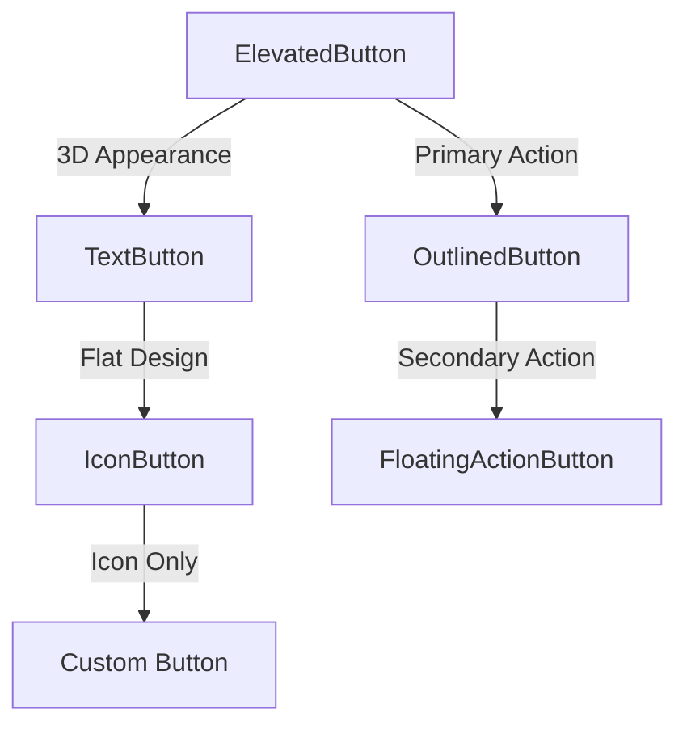
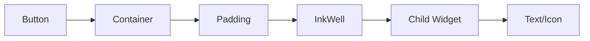

## 3.4.1 Flutter Buttons: ElevatedButton, TextButton, and More

In the world of mobile app development, buttons are a fundamental component of user interaction. They serve as the primary means for users to execute commands, navigate through the app, and trigger various functionalities. Flutter, a popular framework for building cross-platform mobile applications, offers a rich set of button widgets that cater to different design needs and use cases. In this section, we will delve into the various button widgets available in Flutter, explore their properties, and learn how to customize them to create visually appealing and functional user interfaces.

### Types of Buttons in Flutter

Flutter provides several types of button widgets, each with its own characteristics and use cases. Understanding these different types will help you choose the right button for your application's needs.

#### ElevatedButton

The `ElevatedButton` is a material design button that is elevated above the surface, giving it a three-dimensional appearance. It is typically used for actions that are primary or important within the app.

**Code Example:**

```dart
ElevatedButton(
  onPressed: () {
    print('Elevated Button Pressed');
  },
  child: Text('Elevated Button'),
);
```

#### TextButton

The `TextButton` is a flat button without elevation. It is often used for less prominent actions, such as those within dialogs or cards.

**Code Example:**

```dart
TextButton(
  onPressed: () {
    print('Text Button Pressed');
  },
  child: Text('Text Button'),
);
```

#### OutlinedButton

The `OutlinedButton` is similar to the `TextButton` but with an outline border. It is used for secondary actions that need to stand out without being too prominent.

**Code Example:**

```dart
OutlinedButton(
  onPressed: () {
    print('Outlined Button Pressed');
  },
  child: Text('Outlined Button'),
);
```

#### IconButton

The `IconButton` is a button that contains an icon instead of text. It is commonly used in toolbars, navigation bars, and other places where space is limited.

**Code Example:**

```dart
IconButton(
  icon: Icon(Icons.volume_up),
  onPressed: () {
    print('Icon Button Pressed');
  },
);
```

#### FloatingActionButton

The `FloatingActionButton` is a circular button that floats above the content. It is used for primary actions that are frequently accessed, such as adding a new item.

**Code Example:**

```dart
FloatingActionButton(
  onPressed: () {
    print('Floating Action Button Pressed');
  },
  child: Icon(Icons.add),
);
```

### Common Properties of Buttons

Each button widget in Flutter shares a set of common properties that define its behavior and appearance. Understanding these properties is crucial for effectively using buttons in your app.

#### `onPressed`

The `onPressed` property is a callback function that is executed when the button is pressed. It is typically used to handle user interactions and trigger actions within the app.

**Example:**

```dart
ElevatedButton(
  onPressed: () {
    // Perform some action
  },
  child: Text('Press Me'),
);
```

#### `child`

The `child` property defines the content of the button, which can be a `Text`, `Icon`, or any other widget. It determines what the user sees on the button.

**Example:**

```dart
TextButton(
  onPressed: () {},
  child: Text('Click Here'),
);
```

#### `style`

The `style` property allows you to customize the appearance of the button, such as its color, shape, and elevation. This is done using the `ButtonStyle` class.

**Example:**

```dart
OutlinedButton(
  onPressed: () {},
  child: Text('Styled Button'),
  style: OutlinedButton.styleFrom(
    primary: Colors.red,
    side: BorderSide(color: Colors.red),
  ),
);
```

### Styling Buttons with ButtonStyle

Flutter provides the `ButtonStyle` class to customize the appearance of buttons. This class offers a wide range of properties that allow you to tailor the button's look and feel to match your app's design.

#### Customizing Colors

You can customize the button's colors, including the foreground (text or icon color) and background color, using the `primary` and `backgroundColor` properties.

**Example:**

```dart
TextButton(
  onPressed: () {},
  child: Text('Custom Color Button'),
  style: TextButton.styleFrom(
    primary: Colors.white,
    backgroundColor: Colors.blue,
  ),
);
```

#### Adjusting Shape and Elevation

The shape and elevation of a button can be customized to create different visual effects. The `shape` property allows you to define the button's shape, while the `elevation` property controls the shadow beneath the button.

**Example:**

```dart
ElevatedButton(
  onPressed: () {},
  child: Text('Custom Shape Button'),
  style: ElevatedButton.styleFrom(
    shape: RoundedRectangleBorder(
      borderRadius: BorderRadius.circular(20),
    ),
    elevation: 5,
  ),
);
```

#### Adding Visual Feedback

Providing visual feedback when a button is pressed enhances the user experience. You can achieve this by customizing the `overlayColor` property, which defines the color overlay applied when the button is pressed.

**Example:**

```dart
OutlinedButton(
  onPressed: () {},
  child: Text('Feedback Button'),
  style: OutlinedButton.styleFrom(
    primary: Colors.black,
    side: BorderSide(color: Colors.black),
    overlayColor: Colors.grey.withOpacity(0.1),
  ),
);
```

### Handling Button Presses

Handling button presses involves defining functions that execute specific actions when a button is pressed. This is typically done by assigning a callback function to the `onPressed` property.

#### Defining Callback Functions

A callback function is a function that is passed as an argument to another function. In the context of buttons, it is the function that gets called when the button is pressed.

**Example:**

```dart
void _showMessage() {
  print('Button was pressed!');
}

ElevatedButton(
  onPressed: _showMessage,
  child: Text('Show Message'),
);
```

#### Using Anonymous Functions

Anonymous functions, also known as lambda functions, can be used directly within the `onPressed` property to define inline actions.

**Example:**

```dart
TextButton(
  onPressed: () {
    print('Anonymous Function Pressed');
  },
  child: Text('Press Me'),
);
```

### Visual Aids: Button Styles and Hierarchies

To better understand the structure and styling of buttons, let's explore some visual aids that illustrate different button styles and their widget hierarchies.

#### Button Styles

Below is a diagram showing various button styles and their appearances:



#### Widget Hierarchy

Understanding the widget hierarchy within a button can help you grasp how buttons are constructed and customized.



### Best Practices for Using Buttons

When designing and implementing buttons in your Flutter app, consider the following best practices to ensure a consistent and user-friendly experience:

- **Consistency**: Use consistent styles for buttons throughout your app to create a cohesive look and feel.
- **Accessibility**: Ensure buttons are accessible by providing appropriate labels and maintaining sufficient touch targets.
- **Feedback**: Provide visual feedback for button presses to enhance the user experience.
- **Hierarchy**: Use different button types to convey the hierarchy of actions, such as primary, secondary, and tertiary actions.

### Common Pitfalls and Troubleshooting

When working with buttons in Flutter, you may encounter some common pitfalls. Here are a few tips to help you troubleshoot and avoid these issues:

- **Null `onPressed`**: If a button's `onPressed` property is set to `null`, the button will be disabled. Ensure that the `onPressed` property is assigned a valid callback function.
- **Button Overlapping**: If buttons overlap with other UI elements, use `Padding` or `SizedBox` to create sufficient space around them.
- **Style Conflicts**: When customizing button styles, ensure that the style properties do not conflict with each other, such as setting both `primary` and `backgroundColor` for a `TextButton`.

### Conclusion

Buttons are a crucial component of any mobile application, serving as the primary means for users to interact with the app. Flutter provides a rich set of button widgets that cater to various design needs and use cases. By understanding the different types of buttons, their properties, and how to customize them, you can create visually appealing and functional user interfaces that enhance the overall user experience.

## Quiz Time!



### Which button in Flutter is typically used for primary actions and has a three-dimensional appearance?

- [x] ElevatedButton
- [ ] TextButton
- [ ] OutlinedButton
- [ ] IconButton

> **Explanation:** The `ElevatedButton` is used for primary actions and has a three-dimensional appearance due to its elevation.

### What property of a button widget defines the action to be taken when the button is pressed?

- [x] onPressed
- [ ] child
- [ ] style
- [ ] overlayColor

> **Explanation:** The `onPressed` property is a callback function that defines the action to be taken when the button is pressed.

### How can you customize the appearance of a button in Flutter?

- [x] Using the ButtonStyle class
- [ ] By changing the child property
- [ ] By modifying the onPressed property
- [ ] By using a different widget

> **Explanation:** The `ButtonStyle` class allows you to customize the appearance of a button, including its color, shape, and elevation.

### Which button type is commonly used in toolbars and navigation bars due to its space-saving design?

- [x] IconButton
- [ ] ElevatedButton
- [ ] TextButton
- [ ] OutlinedButton

> **Explanation:** The `IconButton` is commonly used in toolbars and navigation bars because it contains an icon and is space-saving.

### What is the purpose of the `overlayColor` property in a button's style?

- [x] To provide visual feedback when the button is pressed
- [ ] To change the button's text color
- [ ] To set the button's background color
- [ ] To define the button's shape

> **Explanation:** The `overlayColor` property provides visual feedback by applying a color overlay when the button is pressed.

### Which button type is used for secondary actions and features an outline border?

- [x] OutlinedButton
- [ ] ElevatedButton
- [ ] TextButton
- [ ] FloatingActionButton

> **Explanation:** The `OutlinedButton` is used for secondary actions and features an outline border.

### What is a common use case for the `FloatingActionButton` in a Flutter app?

- [x] For primary actions that are frequently accessed
- [ ] For secondary actions within dialogs
- [ ] For displaying icons in toolbars
- [ ] For submitting forms

> **Explanation:** The `FloatingActionButton` is used for primary actions that are frequently accessed, such as adding a new item.

### How can you ensure that buttons are accessible to all users?

- [x] By providing appropriate labels and maintaining sufficient touch targets
- [ ] By using only IconButton widgets
- [ ] By setting the onPressed property to null
- [ ] By using different colors for each button

> **Explanation:** Ensuring accessibility involves providing appropriate labels and maintaining sufficient touch targets for buttons.

### What happens if the `onPressed` property of a button is set to `null`?

- [x] The button will be disabled
- [ ] The button will change color
- [ ] The button will execute a default action
- [ ] The button will become invisible

> **Explanation:** If the `onPressed` property is set to `null`, the button will be disabled and unresponsive to user interactions.

### True or False: The `child` property of a button can only contain text.

- [ ] True
- [x] False

> **Explanation:** The `child` property of a button can contain any widget, not just text. It can include icons, images, or custom widgets.


