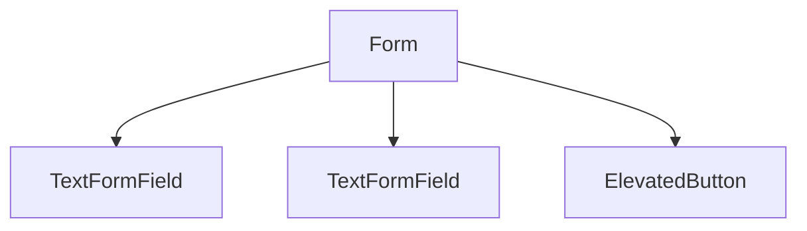

## 3.4.2 Input Fields

In the journey of developing a mobile application, capturing user input is a fundamental task. Flutter, with its rich set of widgets, provides powerful tools to create intuitive and responsive input fields. In this section, we will delve into the `TextField` and `Form` widgets, exploring their properties, usage, and best practices to effectively capture and validate user input.

### Understanding the `TextField` Widget

The `TextField` widget is the primary way to capture user input in Flutter. It is versatile and highly customizable, allowing developers to tailor it to fit the design and functionality of their application.

#### Basic Usage of `TextField`

The simplest form of a `TextField` can be created with minimal code. Here’s a basic example:

```dart
TextField(
  decoration: InputDecoration(
    labelText: 'Enter your name',
  ),
);
```

In this example, the `TextField` is wrapped with an `InputDecoration` to provide a label. The `labelText` is a property that floats above the field when it is focused, providing a clear indication of what the user should input.

#### Key Properties of `TextField`

1. **Controller**: The `TextEditingController` is used to retrieve the current value of the input field and to listen for changes.

   ```dart
   final TextEditingController _controller = TextEditingController();

   TextField(
     controller: _controller,
   );

   // Retrieving the value
   String value = _controller.text;
   ```

   The controller is essential for managing the state of the input field, especially when you need to read the input or reset the field.

2. **Decoration**: The `InputDecoration` property allows you to style the `TextField`.

   ```dart
   TextField(
     decoration: InputDecoration(
       labelText: 'Enter your email',
       hintText: 'example@example.com',
       icon: Icon(Icons.email),
     ),
   );
   ```

   The `InputDecoration` can include icons, hint texts, labels, and error messages, enhancing the user experience by making the input field more informative and visually appealing.

3. **Keyboard Type**: The `keyboardType` property specifies the type of keyboard to display.

   ```dart
   TextField(
     keyboardType: TextInputType.emailAddress,
   );
   ```

   This property is crucial for improving user input efficiency by providing the appropriate keyboard layout, such as numeric, email, or text.

#### Managing Input with `TextEditingController`

The `TextEditingController` is a powerful tool for managing the input state. It allows you to programmatically set and retrieve the text value, as well as listen for changes.

```dart
final TextEditingController _controller = TextEditingController();

TextField(
  controller: _controller,
  onChanged: (text) {
    print("Current input: $text");
  },
);

// To clear the input
_controller.clear();
```

By attaching a listener to the controller, you can respond to changes in real-time, which is useful for features like live validation or dynamic UI updates.

#### Handling Focus and Keyboard Actions

Managing focus is an essential aspect of user input. Flutter provides the `FocusNode` class to control the focus state of input fields.

```dart
final FocusNode _focusNode = FocusNode();

TextField(
  focusNode: _focusNode,
  onEditingComplete: () {
    _focusNode.unfocus(); // Dismiss the keyboard
  },
);
```

Using `FocusNode`, you can programmatically request or release focus, which is particularly useful in forms where you want to move focus to the next field automatically.

### Styling Input Fields with `InputDecoration`

The `InputDecoration` class is a comprehensive way to style `TextField` widgets. It provides numerous properties to customize the appearance and behavior of input fields.

#### Common Styling Properties

- **Label Text**: A floating label that appears above the input when focused.
- **Hint Text**: A placeholder that appears inside the input field when it is empty.
- **Icon**: An icon displayed inside the input field.
- **Error Text**: A message displayed below the input field when validation fails.

```dart
TextField(
  decoration: InputDecoration(
    labelText: 'Password',
    hintText: 'Enter your password',
    icon: Icon(Icons.lock),
    errorText: 'Password is required',
  ),
);
```

The `InputDecoration` not only enhances the visual appeal but also improves usability by providing contextual information.

### Working with Forms in Flutter

While individual `TextField` widgets are useful, managing multiple inputs can become cumbersome. This is where the `Form` widget comes into play. It provides a convenient way to group and validate multiple input fields.

#### Introducing the `Form` Widget

The `Form` widget acts as a container for grouping multiple `FormField` widgets, such as `TextFormField`. It provides a unified way to manage validation and submission.

```dart
final _formKey = GlobalKey<FormState>();

Form(
  key: _formKey,
  child: Column(
    children: <Widget>[
      TextFormField(
        validator: (value) {
          if (value == null || value.isEmpty) {
            return 'Please enter some text';
          }
          return null;
        },
      ),
      ElevatedButton(
        onPressed: () {
          if (_formKey.currentState!.validate()) {
            // Process data
          }
        },
        child: Text('Submit'),
      ),
    ],
  ),
);
```

In this example, the `Form` widget uses a `GlobalKey` to manage its state. The `TextFormField` widget, a specialized version of `TextField`, includes a `validator` function to handle input validation.

#### Validation and Submission

Validation is a critical aspect of form handling. The `Form` widget provides a straightforward way to validate all fields at once.

```dart
if (_formKey.currentState!.validate()) {
  // All fields are valid
} else {
  // Some fields are invalid
}
```

The `validate` method checks each `FormField` and returns `true` if all fields are valid. This centralized validation logic simplifies error handling and ensures consistency.

#### Handling Secure Inputs

For sensitive information, such as passwords, it’s important to handle input securely. The `obscureText` property of `TextField` is used to mask input.

```dart
TextField(
  obscureText: true,
  decoration: InputDecoration(
    labelText: 'Password',
  ),
);
```

By setting `obscureText` to `true`, the input is obscured, providing a layer of security for sensitive data.

### Best Practices for Input Fields

1. **Clear Labels and Placeholders**: Use descriptive labels and placeholders to guide users.
2. **Consistent Validation**: Implement consistent validation logic to ensure data integrity.
3. **Responsive Design**: Ensure input fields are responsive and adapt to different screen sizes.
4. **Accessibility**: Use accessible labels and hints to support users with disabilities.

### Common Pitfalls and Troubleshooting

- **Unresponsive Keyboard**: Ensure `FocusNode` is correctly managed to avoid unresponsive keyboards.
- **Validation Errors**: Double-check validation logic to prevent false negatives.
- **State Management**: Use controllers and keys to manage state effectively.

### Visual Aids

Below is a diagram illustrating the hierarchy of a form with multiple input fields:



This diagram shows a simple form structure with two input fields and a submit button.

### Conclusion

Mastering input fields in Flutter involves understanding the capabilities of `TextField` and `Form` widgets. By leveraging these tools, you can create intuitive and efficient user interfaces that capture and validate user input effectively. Remember to focus on usability, accessibility, and security to provide the best user experience.

## Quiz Time!



### What is the primary widget used to capture user input in Flutter?

- [x] TextField
- [ ] InputField
- [ ] TextInput
- [ ] FormField

> **Explanation:** The `TextField` widget is the primary widget used in Flutter to capture user input.

### Which property of `TextField` is used to manage the state of the input?

- [x] controller
- [ ] decoration
- [ ] keyboardType
- [ ] focusNode

> **Explanation:** The `controller` property is used to manage the state of the input, allowing you to retrieve and set the text value.

### How can you style a `TextField` in Flutter?

- [x] Using InputDecoration
- [ ] Using TextStyle
- [ ] Using BoxDecoration
- [ ] Using FormDecoration

> **Explanation:** The `InputDecoration` class is used to style `TextField` widgets, providing properties for labels, icons, and more.

### What is the purpose of the `Form` widget in Flutter?

- [x] To group and validate multiple input fields
- [ ] To style input fields
- [ ] To manage focus states
- [ ] To handle keyboard actions

> **Explanation:** The `Form` widget is used to group and validate multiple input fields, providing a unified way to manage form submissions.

### Which property of `TextField` specifies the type of keyboard to display?

- [x] keyboardType
- [ ] inputType
- [ ] textType
- [ ] keyType

> **Explanation:** The `keyboardType` property specifies the type of keyboard to display, such as numeric or email.

### How can you retrieve the current value of a `TextField`?

- [x] Using a TextEditingController
- [ ] Using a FormKey
- [ ] Using a FocusNode
- [ ] Using a ValueNotifier

> **Explanation:** A `TextEditingController` is used to retrieve the current value of a `TextField`.

### What method is used to validate all fields in a `Form` widget?

- [x] validate()
- [ ] check()
- [ ] verify()
- [ ] confirm()

> **Explanation:** The `validate()` method is used to validate all fields in a `Form` widget.

### How can you obscure the input in a `TextField` for secure data entry?

- [x] Set obscureText to true
- [ ] Use a SecureTextField
- [ ] Set secureInput to true
- [ ] Use a PasswordField

> **Explanation:** Setting `obscureText` to `true` obscures the input in a `TextField`, making it suitable for secure data entry like passwords.

### What is a common use case for the `FocusNode` class?

- [x] To manage focus and keyboard actions
- [ ] To style input fields
- [ ] To validate input fields
- [ ] To retrieve input values

> **Explanation:** The `FocusNode` class is used to manage focus and keyboard actions, allowing you to programmatically control focus states.

### True or False: The `TextFormField` widget is a specialized version of the `TextField` that includes validation capabilities.

- [x] True
- [ ] False

> **Explanation:** True. The `TextFormField` widget is a specialized version of the `TextField` that includes validation capabilities, making it ideal for use within a `Form`.


