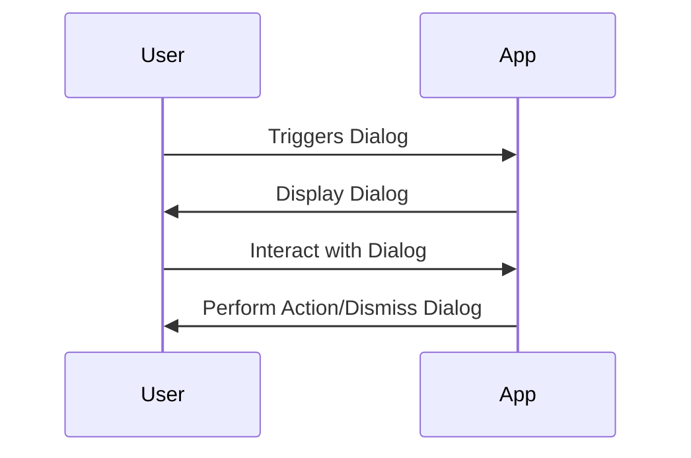
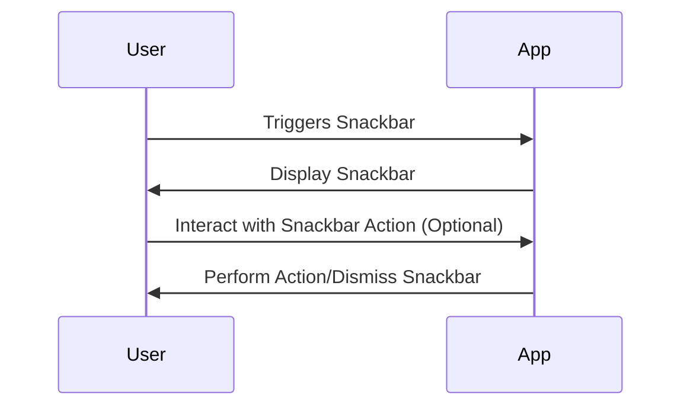

## 3.4.4 Dialogs and Snackbars

In the realm of mobile app development, providing timely feedback and prompts to users is crucial for a seamless user experience. Flutter, with its rich set of widgets, offers powerful tools like dialogs and snackbars to achieve this. This section will guide you through the implementation of dialogs and snackbars, ensuring that your app communicates effectively with its users.

### Understanding Dialogs in Flutter

Dialogs are modal windows that appear on top of the app's content, requiring user interaction before proceeding. They are typically used to alert users, confirm actions, or gather input. Flutter provides a straightforward way to implement dialogs using the `showDialog` function and the `AlertDialog` widget.

#### Displaying an AlertDialog

An `AlertDialog` is a simple dialog that can display a title, content, and actions. Here’s how you can create and display an `AlertDialog`:

```dart
showDialog(
  context: context,
  builder: (BuildContext context) {
    return AlertDialog(
      title: Text('Alert'),
      content: Text('This is an alert dialog.'),
      actions: [
        TextButton(
          onPressed: () {
            Navigator.of(context).pop();
          },
          child: Text('OK'),
        ),
      ],
    );
  },
);
```

In this example, `showDialog` is a function that takes a `BuildContext` and a builder function that returns an `AlertDialog`. The dialog contains a title, content, and an action button that dismisses the dialog when pressed.

#### Types of Dialogs

1. **Alert Dialogs**: Used to alert users about a situation. They are simple and usually contain a message and one or more action buttons.

2. **Confirmation Dialogs**: These dialogs ask users to confirm an action. They typically have two buttons, such as "Confirm" and "Cancel".

3. **Custom Dialogs**: For more complex interactions, you can create custom dialogs using the `Dialog` widget or by customizing the `AlertDialog`.

##### Example of a Confirmation Dialog

```dart
showDialog(
  context: context,
  builder: (BuildContext context) {
    return AlertDialog(
      title: Text('Confirm'),
      content: Text('Are you sure you want to proceed?'),
      actions: [
        TextButton(
          onPressed: () {
            Navigator.of(context).pop();
          },
          child: Text('Cancel'),
        ),
        TextButton(
          onPressed: () {
            // Perform the action
            Navigator.of(context).pop();
          },
          child: Text('Confirm'),
        ),
      ],
    );
  },
);
```

##### Creating a Custom Dialog

For a more tailored user experience, you can design custom dialogs:

```dart
showDialog(
  context: context,
  builder: (BuildContext context) {
    return Dialog(
      shape: RoundedRectangleBorder(
        borderRadius: BorderRadius.circular(20.0),
      ),
      child: Container(
        height: 200,
        child: Column(
          mainAxisAlignment: MainAxisAlignment.center,
          children: [
            Text('Custom Dialog'),
            SizedBox(height: 20),
            ElevatedButton(
              onPressed: () {
                Navigator.of(context).pop();
              },
              child: Text('Close'),
            ),
          ],
        ),
      ),
    );
  },
);
```

### Using Snackbars for Brief Messages

Snackbars are lightweight, non-intrusive messages that appear at the bottom of the screen. They are ideal for brief notifications or actions, such as confirming a save or undoing an action.

#### Introducing `ScaffoldMessenger` and `SnackBar`

In Flutter, `ScaffoldMessenger` is used to display snackbars. Here’s how you can show a snackbar:

```dart
ScaffoldMessenger.of(context).showSnackBar(
  SnackBar(
    content: Text('This is a snackbar'),
    action: SnackBarAction(
      label: 'Undo',
      onPressed: () {
        // Code to execute.
      },
    ),
  ),
);
```

In this example, `ScaffoldMessenger.of(context).showSnackBar` is used to display a `SnackBar` with a message and an optional action.

#### Best Practices for Using Snackbars

- **Keep Messages Concise**: Snackbars should convey information succinctly.
- **Provide Actions Sparingly**: Only include actions that are relevant and necessary.
- **Avoid Overuse**: Too many snackbars can overwhelm users and reduce their effectiveness.

### Best Practices for Dialogs and Snackbars

#### Appropriate Use Cases

- **Dialogs**: Use dialogs for critical interactions that require user attention, such as confirmations, alerts, or input requests.
- **Snackbars**: Use snackbars for non-critical notifications that do not require immediate user interaction.

#### Handling User Actions

- Ensure that dialogs and snackbars are dismissible, allowing users to easily return to the main content.
- For dialogs, handle user actions appropriately by performing necessary operations or navigating to different screens.

#### Testing and Optimization

- Test dialogs and snackbars on different screen sizes and orientations to ensure they display correctly.
- Consider accessibility by providing clear and descriptive text for screen readers.

### Visualizing Dialog and Snackbar Flow

To better understand the flow of dialogs and snackbars, consider the following sequence diagrams:

#### Dialog Flow



#### Snackbar Flow



### Conclusion

Dialogs and snackbars are essential tools in Flutter for providing feedback and prompts to users. By understanding their implementation and best practices, you can enhance the user experience in your app. Remember to use dialogs for critical interactions and snackbars for brief notifications, always keeping the user experience in mind.

## Quiz Time!



### What is the primary purpose of using dialogs in a Flutter app?

- [x] To alert users and gather input
- [ ] To display advertisements
- [ ] To navigate between screens
- [ ] To play audio files

> **Explanation:** Dialogs are used to alert users, confirm actions, or gather input, making them essential for critical interactions.

### How do you dismiss an `AlertDialog` in Flutter?

- [x] Using `Navigator.of(context).pop()`
- [ ] Using `ScaffoldMessenger.of(context).hideCurrentSnackBar()`
- [ ] Using `Navigator.of(context).push()`
- [ ] Using `Scaffold.of(context).close()`

> **Explanation:** `Navigator.of(context).pop()` is used to dismiss dialogs in Flutter.

### Which widget is used to display snackbars in Flutter?

- [x] ScaffoldMessenger
- [ ] AlertDialog
- [ ] Dialog
- [ ] AppBar

> **Explanation:** `ScaffoldMessenger` is used to display snackbars in Flutter.

### What is a common use case for a snackbar?

- [x] Displaying brief notifications
- [ ] Gathering user input
- [ ] Navigating to a new screen
- [ ] Playing a video

> **Explanation:** Snackbars are ideal for displaying brief notifications or actions.

### How can you make a dialog in Flutter dismissible?

- [x] By using `Navigator.of(context).pop()`
- [ ] By setting `dismissible: true`
- [ ] By using `ScaffoldMessenger.of(context).hideCurrentSnackBar()`
- [ ] By using `Dialog.dismiss()`

> **Explanation:** `Navigator.of(context).pop()` is used to dismiss dialogs, making them dismissible.

### What is the recommended way to handle user actions in a dialog?

- [x] Perform necessary operations or navigate to different screens
- [ ] Ignore user actions
- [ ] Display another dialog
- [ ] Log the action and do nothing

> **Explanation:** Handling user actions appropriately involves performing necessary operations or navigating to different screens.

### Which of the following is NOT a type of dialog in Flutter?

- [x] Navigation Dialog
- [ ] Alert Dialog
- [ ] Confirmation Dialog
- [ ] Custom Dialog

> **Explanation:** Navigation Dialog is not a recognized type of dialog in Flutter.

### What should you consider when using snackbars in your app?

- [x] Keep messages concise and avoid overuse
- [ ] Use them for critical alerts
- [ ] Display them for long durations
- [ ] Include multiple actions

> **Explanation:** Snackbars should be concise and not overused to maintain their effectiveness.

### How can you customize the appearance of a dialog in Flutter?

- [x] By using the `Dialog` widget and customizing its content
- [ ] By using `ScaffoldMessenger`
- [ ] By setting `dialogStyle: custom`
- [ ] By using `AppBar`

> **Explanation:** The `Dialog` widget allows for customization of dialogs in Flutter.

### True or False: Snackbars should be used for critical interactions that require user attention.

- [ ] True
- [x] False

> **Explanation:** Snackbars are meant for brief, non-critical notifications, not for critical interactions.


