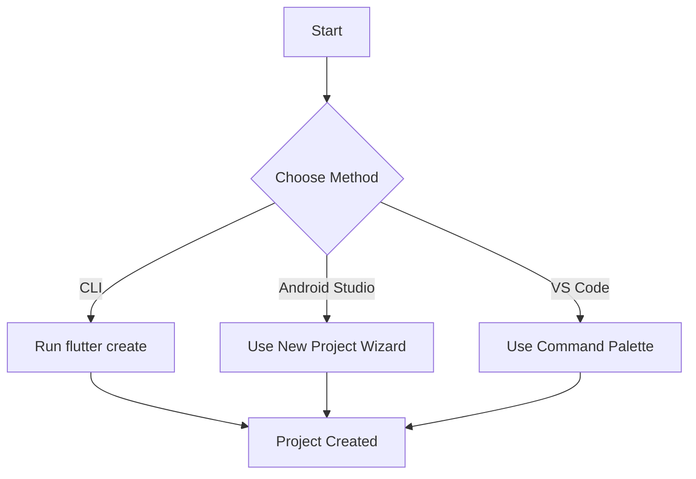

## 4.1.1 Creating a New Flutter Project

Embarking on your journey to publish a Flutter app begins with creating a new project. Flutter provides robust tools to generate a boilerplate project structure, equipping you with all the necessary files and directories to kickstart your app development. This section will guide you through creating a new Flutter project using both the command-line interface (CLI) and Integrated Development Environments (IDEs) like Android Studio and Visual Studio Code.

### Understanding Project Creation

When you create a new Flutter project, you are essentially setting up a scaffold that includes a predefined directory structure, essential configuration files, and a sample application that you can immediately run and modify. This boilerplate setup is crucial as it ensures consistency and provides a solid foundation for your app development.

### Using the Flutter CLI

The Flutter CLI is a powerful tool that allows you to create and manage Flutter projects directly from your terminal or command prompt. This method is particularly useful for developers who prefer a lightweight setup without the overhead of a full-fledged IDE.

#### Step-by-Step Instructions

1. **Open Terminal/Command Prompt**: Start by opening your terminal (on macOS/Linux) or command prompt (on Windows).

2. **Navigate to Your Desired Directory**: Use the `cd` command to navigate to the directory where you want to create your new Flutter project.

   ```bash
   cd path/to/your/directory
   ```

3. **Run the `flutter create` Command**: Use the `flutter create` command followed by your desired project name. Ensure that your project name follows the naming conventions (lowercase_with_underscores).

   ```bash
   flutter create my_first_app
   ```

   This command will generate a new Flutter project in a directory named `my_first_app`.

4. **Specify Additional Options**: You can customize your project further by specifying options such as the organization and description.

   ```bash
   flutter create --org com.example --description "My First Flutter App" my_first_app
   ```

5. **Explore Templates**: Flutter allows you to specify templates for different types of projects, such as `app`, `plugin`, or `package`.

   ```bash
   flutter create --template app my_first_app
   ```

#### Troubleshooting Tips

- **Command Not Found**: If you encounter a "command not found" error, ensure that Flutter is installed correctly and added to your system's PATH.
- **Invalid Project Name**: Avoid using uppercase letters or spaces in your project name to prevent errors.

### Using an IDE

For developers who prefer a graphical interface, IDEs like Android Studio and Visual Studio Code offer seamless integration with Flutter, providing tools and wizards to simplify project creation.

#### Android Studio

1. **Open Android Studio**: Launch Android Studio and select "Start a new Flutter project" from the welcome screen.

2. **Select Project Type**: Choose "Flutter Application" as the project type.

3. **Configure Project Settings**: Enter your project name, location, and package name. Ensure that the project name follows the naming conventions.

4. **Set Flutter SDK Path**: If prompted, set the path to your Flutter SDK.

5. **Finish the Wizard**: Click "Finish" to create your new Flutter project.

#### Visual Studio Code

1. **Install Flutter Extension**: Ensure that the Flutter extension is installed in Visual Studio Code.

2. **Open Command Palette**: Press `Ctrl+Shift+P` (Windows/Linux) or `Cmd+Shift+P` (macOS) to open the command palette.

3. **Select 'Flutter: New Project'**: Type "Flutter: New Project" and select it from the list.

4. **Enter Project Name**: Provide a valid project name following the naming conventions.

5. **Choose Project Location**: Select the directory where you want to create your project.

6. **Complete the Setup**: VS Code will generate the project structure and open it in the editor.

### Understanding Project Naming Conventions

Flutter project names must adhere to specific conventions to ensure compatibility and avoid errors. Use lowercase letters, numbers, and underscores. Avoid uppercase letters, spaces, and special characters. For example, `my_first_app` is a valid name, while `MyFirstApp` or `my first app` are not.

### Project Structure Overview

Once your project is created, you'll notice a structured directory layout. Here's a brief overview of the key files and directories:

- **`lib/`**: Contains the main Dart code for your application. The `main.dart` file is the entry point of your app.
- **`pubspec.yaml`**: A configuration file where you specify your app's dependencies, assets, and metadata.
- **`android/`** and **`ios/`**: Platform-specific directories containing native code and configurations for Android and iOS.
- **`test/`**: Contains test files for your application.

Understanding this structure is crucial as it helps you navigate and manage your project efficiently.

### Visual Aids

To better illustrate the process of creating a new Flutter project, let's look at a diagram that summarizes the steps involved:



This diagram provides a visual representation of the different methods you can use to create a new Flutter project, ultimately leading to a successfully created project.

### Writing Tips

- **Clear Instructions**: Use numbered steps for clarity and ease of following.
- **Anticipate Issues**: Provide solutions for common problems, such as installation errors or naming issues.
- **Encourage Exploration**: Suggest trying both CLI and IDE methods to determine personal preference.

By following these guidelines, you'll be well-equipped to create a new Flutter project, setting the stage for your app development journey.

## Quiz Time!



### What is the primary purpose of creating a new Flutter project?

- [x] To generate a boilerplate structure with necessary files and directories for app development.
- [ ] To immediately publish an app to the App Store.
- [ ] To create a backup of existing code.
- [ ] To install Flutter on your system.

> **Explanation:** Creating a new Flutter project sets up a boilerplate structure that includes essential files and directories for starting app development.

### Which command is used to create a new Flutter project via CLI?

- [ ] flutter init
- [x] flutter create
- [ ] flutter start
- [ ] flutter new

> **Explanation:** The `flutter create` command is used to generate a new Flutter project from the command line.

### What is a valid naming convention for Flutter projects?

- [x] lowercase_with_underscores
- [ ] UppercaseWithSpaces
- [ ] camelCase
- [ ] snake_case

> **Explanation:** Flutter projects should be named using lowercase letters with underscores, such as `my_first_app`.

### Which file in a Flutter project specifies dependencies and metadata?

- [ ] main.dart
- [ ] README.md
- [x] pubspec.yaml
- [ ] config.json

> **Explanation:** The `pubspec.yaml` file is used to specify dependencies, assets, and metadata for a Flutter project.

### What is the entry point of a Flutter application?

- [ ] pubspec.yaml
- [ ] index.html
- [x] main.dart
- [ ] app.js

> **Explanation:** The `main.dart` file in the `lib/` directory is the entry point of a Flutter application.

### Which IDE offers a 'New Flutter Project' wizard?

- [x] Android Studio
- [ ] Eclipse
- [ ] Sublime Text
- [ ] Atom

> **Explanation:** Android Studio provides a 'New Flutter Project' wizard to help create a new Flutter project with a graphical interface.

### How can you create a new Flutter project in Visual Studio Code?

- [ ] By selecting 'New File' from the menu.
- [x] By using the 'Flutter: New Project' command in the command palette.
- [ ] By running 'flutter init' in the terminal.
- [ ] By opening a new terminal window.

> **Explanation:** In Visual Studio Code, you can create a new Flutter project by selecting 'Flutter: New Project' from the command palette.

### What should you do if the 'flutter create' command is not found?

- [ ] Reinstall your operating system.
- [ ] Ignore the error and proceed.
- [x] Ensure Flutter is installed and added to your system's PATH.
- [ ] Use a different programming language.

> **Explanation:** If the 'flutter create' command is not found, ensure that Flutter is installed correctly and added to your system's PATH.

### What is the purpose of the `lib/` directory in a Flutter project?

- [ ] To store images and assets.
- [ ] To contain platform-specific code.
- [x] To hold the main Dart code for the application.
- [ ] To manage configuration files.

> **Explanation:** The `lib/` directory contains the main Dart code for the Flutter application, including the entry point `main.dart`.

### True or False: You can specify a template when creating a new Flutter project with the CLI.

- [x] True
- [ ] False

> **Explanation:** True. You can specify a template, such as `app`, `plugin`, or `package`, when creating a new Flutter project using the CLI.


