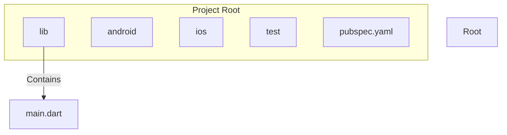

## 4.1.2 Understanding Project Structure

Embarking on the journey of developing a Flutter app involves understanding the project's structure. This knowledge is crucial as it lays the foundation for efficient development, maintenance, and scalability. In this section, we will delve into the default Flutter project structure, exploring the purpose of each key file and directory, and how they fit into the overall development process.

### High-Level Overview

When you create a new Flutter project, it comes with a predefined structure. This structure is designed to organize your code and resources effectively. Let's start by examining the root-level directories and files:

| Component        | Description                                                                 |
|------------------|-----------------------------------------------------------------------------|
| `lib/`           | Main directory for Dart source code.                                         |
| `test/`          | Contains unit and widget tests.                                              |
| `android/`       | Platform-specific code and configuration for Android.                        |
| `ios/`           | Platform-specific code and configuration for iOS.                            |
| `web/` (optional)| Contains files for Flutter web apps.                                         |
| `pubspec.yaml`   | Manages dependencies and assets.                                             |
| `README.md`      | Documentation file for the project.                                          |
| `.gitignore`     | Specifies files and directories to be ignored by Git.                        |

#### Key Directories

##### `lib/`

The `lib/` directory is the heart of your Flutter application. It contains all the Dart source code files. The most critical file here is `lib/main.dart`, which serves as the entry point of your app.

- **`main.dart`**: This file contains the `main()` function, which is the starting point of every Flutter app. It calls `runApp()`, which takes a `Widget` and makes it the root of the widget tree.

```dart
import 'package:flutter/material.dart';

void main() {
  runApp(MyApp());
}

class MyApp extends StatelessWidget {
  @override
  Widget build(BuildContext context) {
    return MaterialApp(
      title: 'My First App',
      home: Scaffold(
        appBar: AppBar(
          title: Text('Home Page'),
        ),
        body: Center(
          child: Text('Hello, world!'),
        ),
      ),
    );
  }
}
```

In this example, `MyApp` is a `StatelessWidget` that builds a `MaterialApp`. The `MaterialApp` widget is the top-level widget that provides material design functionalities. The `Scaffold` widget provides a framework for implementing the basic material design layout structure.

##### `test/`

The `test/` directory is where you should place your unit and widget tests. Testing is a crucial part of software development, ensuring that your app behaves as expected. Flutter provides a robust testing framework that allows you to write tests for your app's functionality.

- **Best Practice**: Regularly write tests as you develop your app. This practice not only helps in catching bugs early but also ensures that new changes do not break existing functionality.

##### `android/` and `ios/`

These directories contain platform-specific code and configurations. They are essential for integrating your Flutter app with Android and iOS platforms.

- **`android/`**: Contains Gradle scripts and Android-specific resources. You might need to modify files here to configure permissions, integrate native libraries, or customize the app's appearance on Android devices.
  
- **`ios/`**: Contains Xcode project files and iOS-specific resources. Similar to the Android directory, you may need to adjust settings here for permissions, native integrations, or UI customizations.

##### `web/` (if applicable)

If your project is set up for Flutter web, the `web/` directory will be present. It contains files necessary for running your Flutter app in a web environment.

#### Key Files

##### `pubspec.yaml`

The `pubspec.yaml` file is a crucial component of your Flutter project. It manages your app's dependencies, assets, and metadata. Here's an example of how you might configure this file:

```yaml
name: my_first_app
description: A new Flutter project.

dependencies:
  flutter:
    sdk: flutter
  cupertino_icons: ^0.1.3

dev_dependencies:
  flutter_test:
    sdk: flutter

flutter:
  assets:
    - assets/images/
```

- **Dependencies**: Specify the packages your app depends on. You can add third-party packages from [pub.dev](https://pub.dev/).
- **Assets**: Define any assets your app uses, such as images or fonts.

##### `README.md`

This file is for documenting your project. Good documentation practices are essential, especially if you plan to share your code with others or work in a team. A well-documented `README.md` can provide an overview of the project, setup instructions, and any other relevant information.

##### Hidden Files

- **`.gitignore`**: This file specifies which files and directories should be ignored by Git. It's crucial for keeping unnecessary files out of your version control system, such as build artifacts or sensitive information.

### Understanding `main.dart`

The `lib/main.dart` file is the starting point of your Flutter application. Let's break down the example code provided earlier:

```dart
import 'package:flutter/material.dart';

void main() {
  runApp(MyApp());
}

class MyApp extends StatelessWidget {
  @override
  Widget build(BuildContext context) {
    return MaterialApp(
      title: 'My First App',
      home: Scaffold(
        appBar: AppBar(
          title: Text('Home Page'),
        ),
        body: Center(
          child: Text('Hello, world!'),
        ),
      ),
    );
  }
}
```

- **`main()` Function**: This is the entry point of the app. It calls `runApp()`, which inflates the given widget and attaches it to the screen.
- **`MyApp` Class**: A `StatelessWidget` that represents the app itself. It returns a `MaterialApp` widget, which is the root of the widget tree.
- **`MaterialApp` Widget**: Provides material design functionalities and acts as the top-level widget.
- **`Scaffold` Widget**: Implements the basic material design visual layout structure.
- **`AppBar` and `Text` Widgets**: Used to create a simple UI with a title and a centered text.

### Visual Aids

To better understand the project structure, let's visualize it using a Mermaid.js diagram:



This diagram represents the hierarchical structure of a Flutter project, highlighting the relationship between the root directory and its subcomponents.

### Writing Tips

- **Beginner-Friendly Explanations**: While diving into the technical details, ensure that explanations remain accessible to beginners. Avoid overwhelming detail and focus on the essentials.
- **Real-World Analogies**: Relate the project structure to real-world concepts. For example, think of the `lib/` directory as your creative workspace where you build the app's functionality.
- **Encourage Exploration**: Motivate readers to explore the files and directories on their own systems. Hands-on practice is invaluable for solidifying understanding.

By understanding the default Flutter project structure, you equip yourself with the knowledge needed to navigate and manage your app's codebase effectively. This foundational understanding is crucial as you progress from development to deployment, ultimately bringing your app to the App Store.

## Quiz Time!



### What is the main purpose of the `lib/` directory in a Flutter project?

- [x] It contains the Dart source code for the app.
- [ ] It contains platform-specific code for Android.
- [ ] It contains configuration files for the app.
- [ ] It contains assets like images and fonts.

> **Explanation:** The `lib/` directory is where all the Dart source code for the Flutter app resides, including the `main.dart` file, which is the entry point of the application.

### Which file in a Flutter project is responsible for managing dependencies and assets?

- [ ] `README.md`
- [ ] `main.dart`
- [x] `pubspec.yaml`
- [ ] `.gitignore`

> **Explanation:** The `pubspec.yaml` file is used to manage the project's dependencies, assets, and metadata.

### What is the role of the `main()` function in `main.dart`?

- [x] It serves as the entry point of the Flutter app.
- [ ] It defines the app's theme.
- [ ] It configures platform-specific settings.
- [ ] It manages the app's state.

> **Explanation:** The `main()` function is the entry point of every Dart application, and in Flutter, it calls `runApp()` to start the app.

### What does the `Scaffold` widget provide in a Flutter app?

- [ ] It manages the app's state.
- [ ] It provides routing capabilities.
- [x] It implements the basic material design layout structure.
- [ ] It handles network requests.

> **Explanation:** The `Scaffold` widget provides a framework for implementing the basic material design layout structure, including an app bar, drawer, and body.

### Which directories contain platform-specific code and configuration in a Flutter project?

- [x] `android/` and `ios/`
- [ ] `lib/` and `test/`
- [ ] `web/` and `assets/`
- [ ] `pubspec.yaml` and `README.md`

> **Explanation:** The `android/` and `ios/` directories contain platform-specific code and configuration for Android and iOS, respectively.

### What is the purpose of the `.gitignore` file in a Flutter project?

- [x] It specifies files and directories to be ignored by Git.
- [ ] It manages the project's dependencies.
- [ ] It contains the app's main entry point.
- [ ] It provides documentation for the project.

> **Explanation:** The `.gitignore` file is used to specify which files and directories should be ignored by Git, preventing them from being tracked in version control.

### What is the role of the `MaterialApp` widget in a Flutter app?

- [x] It provides material design functionalities and acts as the top-level widget.
- [ ] It manages the app's state.
- [ ] It handles network requests.
- [ ] It provides routing capabilities.

> **Explanation:** The `MaterialApp` widget is the top-level widget that provides material design functionalities, such as theme and routing.

### How can you add a new dependency to a Flutter project?

- [ ] By modifying the `main.dart` file.
- [ ] By creating a new file in the `lib/` directory.
- [x] By adding it to the `pubspec.yaml` file.
- [ ] By configuring the `README.md` file.

> **Explanation:** To add a new dependency, you modify the `pubspec.yaml` file, specifying the package and its version.

### What is the significance of the `test/` directory in a Flutter project?

- [ ] It contains platform-specific code.
- [x] It contains unit and widget tests.
- [ ] It manages the app's state.
- [ ] It provides routing capabilities.

> **Explanation:** The `test/` directory is where you place your unit and widget tests, which are essential for ensuring the app's functionality and reliability.

### True or False: The `web/` directory is always present in every Flutter project.

- [ ] True
- [x] False

> **Explanation:** The `web/` directory is only present if the Flutter project is configured for web development. It is not included by default in all Flutter projects.


