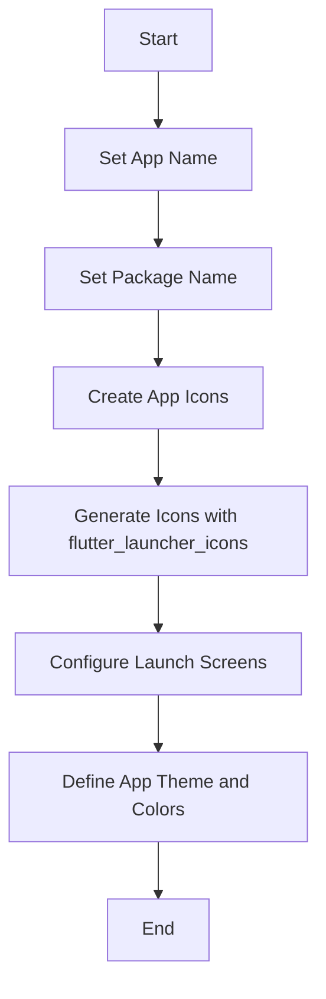

## 4.1.3 Configuring App Metadata

In the journey of publishing your Flutter app to the app store, configuring app metadata is a crucial step that ensures your app is not only identifiable but also aligns with your brand's identity. This section will guide you through the process of setting up essential metadata such as the app name, package name, app icons, and launch screens. We'll also touch on establishing a consistent app theme and color scheme to reinforce your brand's presence.

### Understanding App Metadata

App metadata encompasses all the information that helps identify and brand your app. This includes:

- **App Name**: The name displayed on the user's device.
- **Package Name**: A unique identifier for your app.
- **App Icons**: Visual representation of your app on the device.
- **Launch Screens**: Initial screens displayed when the app is launched.
- **App Theme and Colors**: Consistent visual elements that reflect your brand.

Each of these components plays a vital role in how users perceive and interact with your app. Let's dive into each aspect in detail.

### App Name and Package Name

#### The Significance of App Name and Package Name

The app name is the first point of interaction with users, appearing beneath the app icon on their devices. It's crucial that the app name is not only catchy but also reflective of the app's purpose.

The package name, on the other hand, is a unique identifier used by app stores to distinguish your app from others. It follows a reverse domain name notation, such as `com.example.myapp`, ensuring global uniqueness.

#### Changing the App Name

To change the app name, you need to modify platform-specific files. Here's how you can do it:

**For Android:**

Edit the `AndroidManifest.xml` file located at `android/app/src/main/AndroidManifest.xml`:

```xml
<application
    android:label="My First App"
    ...>
```

**For iOS:**

Update the `CFBundleDisplayName` in `ios/Runner/Info.plist`:

```xml
<key>CFBundleDisplayName</key>
<string>My First App</string>
```

#### Setting the Package Name

The package name is typically set during project creation. However, if you need to change it later, follow these steps:

1. **Android**: Update the package name in the `AndroidManifest.xml` and rename the package directories in `android/app/src/main/java`.
2. **iOS**: Change the `PRODUCT_BUNDLE_IDENTIFIER` in `ios/Runner.xcodeproj/project.pbxproj`.

**Best Practices for Package Naming:**

- Use reverse domain name notation (e.g., `com.example.myapp`).
- Ensure the package name is unique and not used by another app.
- Avoid using special characters or spaces.

### Changing App Icons

#### Importance of App Icons

App icons are a critical branding element, serving as the visual representation of your app. A well-designed icon can significantly impact user engagement and app recognition.

#### Using `flutter_launcher_icons` Package

The `flutter_launcher_icons` package simplifies the process of setting up app icons across different platforms. Here's how to use it:

1. **Add the package to `pubspec.yaml`:**

```yaml
dev_dependencies:
  flutter_launcher_icons: "^0.9.0"

flutter_icons:
  android: true
  ios: true
  image_path: "assets/icon/icon.png"
```

2. **Generate the icons:**

Run the following command in your terminal:

```bash
flutter pub run flutter_launcher_icons:main
```

This command will automatically generate and apply the icons for both Android and iOS platforms.

#### Creating Custom Icons

To create professional-looking icons, consider using design tools like Adobe Illustrator, Sketch, or online services like Canva. Ensure that your icons are clear, scalable, and reflective of your brand identity.

### Launch Screens/Splash Screens

Launch screens provide a seamless transition between the app launch and the app's main interface. They are also an opportunity to reinforce your brand.

#### Setting Up Launch Screens

**For Android:**

Modify the `launch_background.xml` file located at `android/app/src/main/res/drawable/launch_background.xml`:

```xml
<layer-list xmlns:android="http://schemas.android.com/apk/res/android">
    <item android:drawable="@color/launch_background" />
    <item>
        <bitmap
            android:gravity="center"
            android:src="@drawable/launch_image" />
    </item>
</layer-list>
```

**For iOS:**

Update the `LaunchScreen.storyboard` or use images in `Assets.xcassets`. You can customize the storyboard in Xcode to include your brand's logo or colors.

### App Theme and Colors

A consistent theme and color scheme enhance user experience and reinforce brand identity. In Flutter, you can define themes in the `ThemeData` class within your `MaterialApp` widget.

```dart
MaterialApp(
  theme: ThemeData(
    primaryColor: Colors.blue,
    accentColor: Colors.orange,
    fontFamily: 'Montserrat',
  ),
  home: MyHomePage(),
);
```

### Visual Aids

To better understand the process of configuring app metadata, let's visualize the steps using a Mermaid.js flowchart:



### Best Practices and Tips

- **Backup Files**: Always back up your files before making changes to platform directories.
- **Consistency**: Ensure consistency in branding elements across all platforms.
- **Professional Icons**: Invest time in creating professional-looking icons.
- **Resources**: Utilize resources like [Iconfinder](https://www.iconfinder.com/) or [Flaticon](https://www.flaticon.com/) for icon inspiration.

### Troubleshooting Common Issues

- **Icon Not Updating**: Ensure the `flutter_launcher_icons` package is correctly configured and run the generation command again.
- **Package Name Conflicts**: Double-check the package name for uniqueness and correctness.
- **Launch Screen Not Displaying**: Verify the configurations in the respective platform files.

By following these guidelines, you can ensure that your app's metadata is configured correctly, providing a professional and cohesive brand experience for your users.

## Quiz Time!



### What is the significance of the app name in app metadata?

- [x] It is the name displayed on the user's device.
- [ ] It is the unique identifier for the app.
- [ ] It determines the app's theme.
- [ ] It is used for internal app configurations.

> **Explanation:** The app name is the name displayed on the user's device, making it a crucial element for user recognition.

### How is the package name typically formatted?

- [x] Reverse domain name notation
- [ ] CamelCase
- [ ] Snake_case
- [ ] PascalCase

> **Explanation:** The package name follows reverse domain name notation, such as `com.example.myapp`, ensuring global uniqueness.

### Which file is modified to change the app name for Android?

- [x] `AndroidManifest.xml`
- [ ] `build.gradle`
- [ ] `MainActivity.java`
- [ ] `strings.xml`

> **Explanation:** The app name for Android is changed by modifying the `android:label` attribute in the `AndroidManifest.xml` file.

### What command is used to generate app icons using `flutter_launcher_icons`?

- [x] `flutter pub run flutter_launcher_icons:main`
- [ ] `flutter build icons`
- [ ] `flutter create icons`
- [ ] `flutter run icons`

> **Explanation:** The command `flutter pub run flutter_launcher_icons:main` is used to generate app icons using the `flutter_launcher_icons` package.

### What is the purpose of a launch screen?

- [x] To provide a seamless transition between app launch and the main interface
- [ ] To display advertisements
- [ ] To collect user data
- [ ] To update app settings

> **Explanation:** A launch screen provides a seamless transition between the app launch and the main interface, enhancing user experience.

### Which file is used to configure the launch screen for iOS?

- [x] `LaunchScreen.storyboard`
- [ ] `Info.plist`
- [ ] `Main.storyboard`
- [ ] `AppDelegate.swift`

> **Explanation:** The `LaunchScreen.storyboard` file is used to configure the launch screen for iOS.

### What is a best practice for creating app icons?

- [x] Use professional design tools or services
- [ ] Use random images from the internet
- [ ] Create icons in a text editor
- [ ] Use only black and white colors

> **Explanation:** Using professional design tools or services ensures that your app icons are clear, scalable, and reflective of your brand identity.

### How can you ensure consistency in app branding?

- [x] Use a consistent theme and color scheme
- [ ] Change the app's theme frequently
- [ ] Use different icons for each platform
- [ ] Avoid using a launch screen

> **Explanation:** Consistency in theme and color scheme across all platforms reinforces brand identity and enhances user experience.

### What should you do before making changes to platform directories?

- [x] Backup files
- [ ] Delete unnecessary files
- [ ] Install new software
- [ ] Change file permissions

> **Explanation:** Backing up files ensures that you can restore previous configurations if something goes wrong during the modification process.

### True or False: The package name can be changed after the app is published to the app store.

- [ ] True
- [x] False

> **Explanation:** Once the app is published, changing the package name is not recommended as it acts as a unique identifier for the app in the app store.


