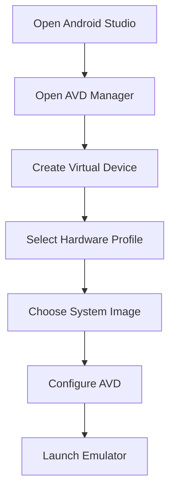

## 4.1.4 Running the App on a Device

In this section, we will guide you through the process of running your Flutter app on both emulators/simulators and physical devices for Android and iOS platforms. This is a crucial step in the app development lifecycle, as it allows you to test and debug your application in environments that closely mimic real-world usage.

### Setting Up Emulators/Simulators

#### Android Emulators

To run your Flutter app on an Android emulator, you'll need to set up an Android Virtual Device (AVD) using the AVD Manager in Android Studio. Here's a step-by-step guide:

1. **Open Android Studio**: Launch Android Studio and navigate to the "AVD Manager" from the "Tools" menu.

2. **Create a New Virtual Device**:
   - Click on "Create Virtual Device".
   - Choose a hardware profile that suits your testing needs. Common choices include Pixel devices due to their standard configurations.

3. **Select a System Image**:
   - Choose a system image. It's recommended to select an image with Google Play services for better compatibility.
   - Download the image if it's not already available.

4. **Configure AVD**:
   - Set up the AVD configuration, including the device name, orientation, and additional settings like RAM and storage.
   - Click "Finish" to create the emulator.

5. **Launch the Emulator**:
   - Click the "Play" button next to your newly created AVD to start the emulator.

Here's a visual representation of the process:



#### iOS Simulators

For iOS, the process involves using the iOS Simulator available through Xcode:

1. **Install Xcode**: Ensure you have Xcode installed on your Mac. You can download it from the Mac App Store.

2. **Open Xcode**: Launch Xcode and navigate to "Xcode" -> "Open Developer Tool" -> "Simulator".

3. **Select a Device**:
   - In the Simulator, go to "Hardware" -> "Device" and choose the iOS device you wish to simulate.

4. **Run the Simulator**: The selected device will boot up, and you can use it to run your Flutter app.

### Running the App on an Emulator/Simulator

Once your emulator or simulator is set up, you can run your Flutter app using either your IDE or the command line.

#### Using an IDE

1. **Open Your Flutter Project**: In your IDE (such as Android Studio or Visual Studio Code), open your Flutter project.

2. **Select a Device**: In the IDE, select the emulator or simulator from the device dropdown menu.

3. **Run the App**: Click the "Run" button to build and deploy your app to the selected device.

#### Using the Command Line

You can also use Flutter CLI commands to manage devices and run your app:

1. **List Available Devices**:
   ```bash
   flutter devices
   ```

2. **Run the App**:
   ```bash
   flutter run
   ```

3. **Specify a Device**:
   If you have multiple devices, specify one using its ID:
   ```bash
   flutter run -d emulator-5554
   ```

### Running on Physical Devices

Testing on physical devices is essential for accurate results, as emulators and simulators may not perfectly replicate all hardware features.

#### Running on Android Devices

1. **Enable Developer Options**:
   - On your Android device, go to "Settings" -> "About Phone" and tap "Build Number" seven times to enable Developer Options.

2. **Enable USB Debugging**:
   - In "Developer Options", enable "USB Debugging".

3. **Connect the Device**:
   - Connect your Android device to your computer via USB.
   - Ensure you have the necessary OEM USB drivers installed.

4. **Run the App**:
   - Use the IDE or CLI to run your app on the connected device.

#### Running on iOS Devices

1. **Apple Developer Account**:
   - Ensure you have an Apple Developer account, as it's required for running apps on physical iOS devices.

2. **Provisioning Profiles and Certificates**:
   - Set up provisioning profiles and signing certificates in Xcode.

3. **Connect the Device**:
   - Connect your iOS device to your Mac.

4. **Run the App**:
   - Use Xcode or the Flutter CLI to deploy your app to the device.

### Hot Reload and Hot Restart

Flutter offers powerful features like Hot Reload and Hot Restart to speed up the development process.

- **Hot Reload**: Quickly applies code changes to your app without restarting the entire application. Trigger it by pressing `r` in the terminal.
  
- **Hot Restart**: Restarts the app and reinitializes the state. Use it when you need to apply changes that Hot Reload cannot handle.

### Troubleshooting Tips

- **Device Not Recognized**: Ensure that USB debugging is enabled, and the correct drivers are installed.
- **App Not Launching**: Check for any build errors in the console and ensure all dependencies are resolved.
- **Slow Performance**: Optimize your emulator settings, such as increasing RAM or using a faster system image.

### Conclusion

Running your Flutter app on emulators, simulators, and physical devices is a critical step in the development process. It allows you to test your app in various environments and ensure it behaves as expected. By following the steps outlined in this section, you'll be well-equipped to deploy your app on any device.

## Quiz Time!



### What tool do you use to create Android emulators?

- [x] AVD Manager
- [ ] Xcode
- [ ] Android Debug Bridge
- [ ] Flutter CLI

> **Explanation:** The AVD Manager in Android Studio is used to create and manage Android emulators.

### How do you enable Developer Options on an Android device?

- [x] Tap "Build Number" seven times
- [ ] Tap "Version Number" five times
- [ ] Enable it in the Play Store
- [ ] Use the Flutter CLI

> **Explanation:** Developer Options are enabled by tapping the "Build Number" seven times in the device's settings.

### Which command lists all available devices for Flutter?

- [x] flutter devices
- [ ] flutter list
- [ ] flutter run
- [ ] flutter emulators

> **Explanation:** The `flutter devices` command lists all connected and available devices.

### What is required to run a Flutter app on a physical iOS device?

- [x] Apple Developer account
- [ ] Android SDK
- [ ] AVD Manager
- [ ] Google Play Services

> **Explanation:** An Apple Developer account is required to run apps on physical iOS devices due to provisioning profiles and certificates.

### What is the primary benefit of Hot Reload in Flutter?

- [x] Quickly applies code changes without restarting the app
- [ ] Compiles the app faster
- [ ] Reduces app size
- [ ] Increases battery life

> **Explanation:** Hot Reload allows developers to see code changes immediately without restarting the app, speeding up the development process.

### What should you do if your Android device is not recognized by your computer?

- [x] Ensure USB debugging is enabled
- [ ] Reinstall the Flutter SDK
- [ ] Use a different IDE
- [ ] Change the device's language settings

> **Explanation:** Enabling USB debugging and ensuring the correct drivers are installed can help resolve recognition issues.

### Which tool is used to run iOS simulators?

- [x] Xcode
- [ ] Android Studio
- [ ] AVD Manager
- [ ] Flutter CLI

> **Explanation:** Xcode provides the iOS Simulator tool for running iOS apps.

### How do you specify a device when running a Flutter app from the CLI?

- [x] Use the `-d` flag with the device ID
- [ ] Use the `-device` flag
- [ ] Use the `--emulator` flag
- [ ] Use the `--simulator` flag

> **Explanation:** The `-d` flag followed by the device ID specifies which device to run the app on.

### What is the difference between Hot Reload and Hot Restart?

- [x] Hot Reload applies changes without restarting; Hot Restart restarts the app
- [ ] Hot Reload restarts the app; Hot Restart applies changes without restarting
- [ ] Both perform the same function
- [ ] Neither is used in Flutter

> **Explanation:** Hot Reload applies changes without restarting the app, while Hot Restart restarts the app and reinitializes the state.

### True or False: Testing on physical devices is not necessary if the app runs well on emulators.

- [ ] True
- [x] False

> **Explanation:** Testing on physical devices is crucial as emulators may not perfectly replicate all hardware features and performance characteristics.


