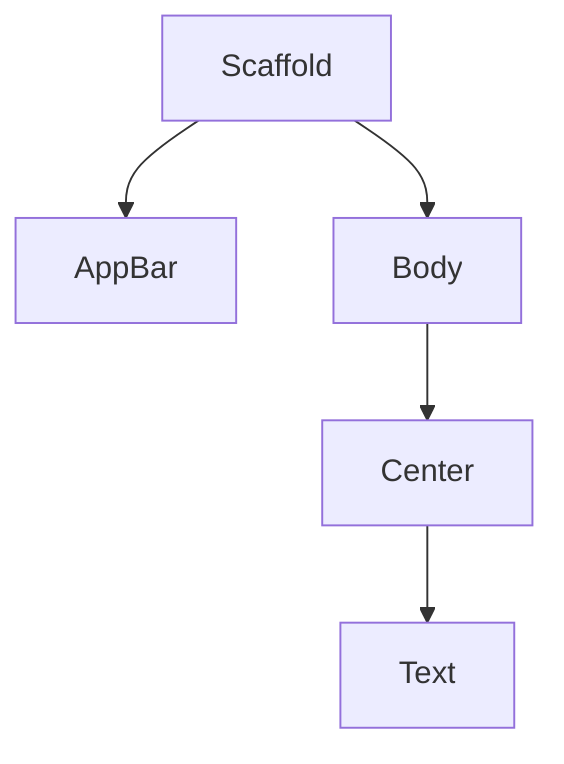

## 4.2.1 Designing the Layout

Designing the layout of your Flutter app's home screen is a crucial step in transforming your initial ideas into a functional and visually appealing user interface. In this section, we will guide you through the process of planning and designing the layout, using your earlier sketches or wireframes as a foundation. We'll cover everything from reviewing your wireframes to implementing responsive design, ensuring your app looks great on any device.

### Reviewing Wireframes

Before diving into code, it's essential to revisit your initial designs. Wireframes serve as the blueprint for your app's layout, providing a visual guide to the structure and flow of your user interface. By reviewing these wireframes, you can ensure that your design aligns with your app's goals and user needs.

#### Importance of Planning Before Coding

Planning your layout before coding is vital for several reasons:

- **Clarity**: It helps you clarify your design intentions and identify potential issues early on.
- **Efficiency**: A well-thought-out plan can save time during development by reducing the need for significant changes later.
- **Consistency**: It ensures a consistent user experience across different parts of your app.

Take a moment to examine your wireframes closely. Are there any elements that need adjustment? Are the navigation paths intuitive? Use this opportunity to refine your design before moving on to implementation.

### Identifying UI Components

Once you're satisfied with your wireframes, the next step is to break down the home screen into individual UI components. This process involves identifying the widgets and layout structures that will bring your design to life.

#### Breaking Down the Home Screen

Consider the main elements of your home screen. Typically, these might include:

- **App Bar**: The top bar that usually contains the app's title and navigation actions.
- **Navigation Elements**: Buttons or tabs that allow users to move between different sections of the app.
- **Main Content Area**: The central part of the screen where the primary content is displayed.

By identifying these components, you can begin to map out how they will be implemented using Flutter's widget system.

### Choosing Appropriate Widgets

Flutter offers a rich set of widgets that you can use to create your app's layout. Choosing the right widgets for your design is crucial for achieving the desired look and functionality.

#### Suggested Widgets for Common UI Elements

- **AppBar**: Use the `AppBar` widget to create a top bar with a title and actions.
- **Column**: For vertical alignment of widgets, the `Column` widget is ideal.
- **ListView**: If your main content area involves scrolling, consider using a `ListView` to display a list of items.

Each widget serves a specific purpose, and understanding their roles will help you build a cohesive layout.

### Responsive Design Considerations

In today's multi-device world, responsive design is essential. Your app should look and function well on various screen sizes and orientations.

#### Implementing Responsive Design

Flutter provides several tools to help you achieve responsive design:

- **MediaQuery**: Use `MediaQuery` to obtain information about the device's screen size and orientation.
- **LayoutBuilder**: The `LayoutBuilder` widget allows you to build widgets based on the parent widget's constraints.
- **Flexible and Expanded**: These widgets help you create flexible layouts that adjust to different screen sizes.

By incorporating these tools, you can ensure that your app provides a seamless experience across devices.

### Setting up the Scaffold

The `Scaffold` widget is a fundamental building block in Flutter, providing a basic material design visual layout structure for your app.

#### Basic Scaffold Structure

Here's a simple example of setting up a `Scaffold` for your home screen:

```dart
class HomePage extends StatelessWidget {
  @override
  Widget build(BuildContext context) {
    return Scaffold(
      appBar: AppBar(
        title: Text('Home'),
      ),
      body: Center(
        child: Text('Welcome to My First App'),
      ),
    );
  }
}
```

In this example, the `Scaffold` includes an `AppBar` with a title and a `Center` widget that contains a `Text` widget. This basic structure can be expanded to include additional components as needed.

### Visual Aids

To help you visualize the layout, let's look at a diagram showing the arrangement of widgets on the home screen.

#### Layout Diagram



This diagram represents the widget tree for the home screen, illustrating how each component fits into the overall layout.

### Writing Tips

As you design your layout, keep these tips in mind:

- **Focus on Structure First**: Concentrate on the structural layout before styling. This approach helps you establish a solid foundation for your UI.
- **Build Incrementally**: Develop your UI incrementally, testing changes frequently using Flutter's hot reload feature. This practice allows you to catch issues early and make adjustments as needed.
- **Test on Multiple Devices**: Regularly test your app on different devices to ensure a consistent experience across platforms.

By following these guidelines, you can create a well-designed home screen that serves as a strong foundation for your app.

### Conclusion

Designing the layout of your Flutter app's home screen is a critical step in the development process. By reviewing your wireframes, identifying UI components, choosing appropriate widgets, and considering responsive design, you can create a user-friendly interface that meets your app's goals. Remember to focus on the structural layout first, build incrementally, and test frequently to ensure a successful design.

## Quiz Time!



### What is the primary purpose of reviewing wireframes before coding?

- [x] To clarify design intentions and identify potential issues early on
- [ ] To start coding immediately
- [ ] To test the app on multiple devices
- [ ] To finalize the app's color scheme

> **Explanation:** Reviewing wireframes helps clarify design intentions and identify potential issues early, saving time during development.

### Which widget would you use to create a top bar with a title and actions in Flutter?

- [x] AppBar
- [ ] Column
- [ ] ListView
- [ ] Container

> **Explanation:** The `AppBar` widget is used to create a top bar with a title and actions.

### What is the role of the `Scaffold` widget in Flutter?

- [x] It provides a basic material design visual layout structure
- [ ] It is used for network requests
- [ ] It handles state management
- [ ] It is a type of animation

> **Explanation:** The `Scaffold` widget provides a basic material design visual layout structure for the app.

### Which widget is ideal for vertical alignment of widgets in Flutter?

- [x] Column
- [ ] Row
- [ ] Stack
- [ ] GridView

> **Explanation:** The `Column` widget is ideal for vertical alignment of widgets.

### How can you obtain information about the device's screen size and orientation in Flutter?

- [x] MediaQuery
- [ ] Navigator
- [ ] ThemeData
- [ ] GestureDetector

> **Explanation:** `MediaQuery` provides information about the device's screen size and orientation.

### What is the benefit of using the `LayoutBuilder` widget?

- [x] It allows you to build widgets based on the parent widget's constraints
- [ ] It provides a basic layout structure
- [ ] It is used for animations
- [ ] It handles user input

> **Explanation:** The `LayoutBuilder` widget allows you to build widgets based on the parent widget's constraints.

### Which widgets help create flexible layouts that adjust to different screen sizes?

- [x] Flexible
- [x] Expanded
- [ ] Container
- [ ] SizedBox

> **Explanation:** The `Flexible` and `Expanded` widgets help create flexible layouts that adjust to different screen sizes.

### What is the benefit of building your UI incrementally?

- [x] It helps manage complexity and catch issues early
- [ ] It speeds up the app's performance
- [ ] It reduces the app's size
- [ ] It improves the app's security

> **Explanation:** Building the UI incrementally helps manage complexity and catch issues early.

### Why is responsive design important in app development?

- [x] It ensures the app looks and functions well on various screen sizes and orientations
- [ ] It reduces the app's load time
- [ ] It simplifies the codebase
- [ ] It enhances the app's security

> **Explanation:** Responsive design ensures the app looks and functions well on various screen sizes and orientations.

### True or False: The `Scaffold` widget is used for network requests in Flutter.

- [ ] True
- [x] False

> **Explanation:** False. The `Scaffold` widget is used to provide a basic material design visual layout structure, not for network requests.


