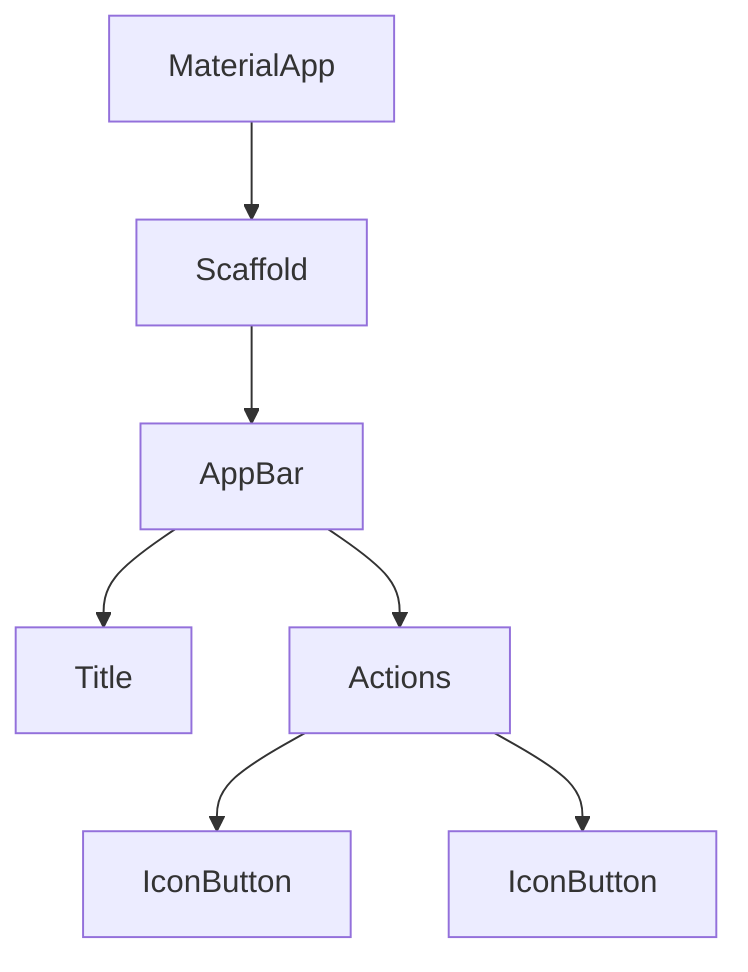

## 4.2.2 Implementing the AppBar

In the world of mobile app development, the `AppBar` is a fundamental component of the user interface, especially in apps following Material Design guidelines. It provides a consistent place for titles, navigation, and actions, making it an essential part of any Flutter app. In this section, we'll explore how to implement and customize the `AppBar` in your Flutter application, ensuring it enhances the user experience without overwhelming it.

### Understanding the AppBar Widget

The `AppBar` widget in Flutter is a versatile and powerful tool for creating a top navigation bar in your application. It serves multiple purposes:

- **Navigation**: Provides a consistent location for navigation controls.
- **Branding**: Displays the app's title or logo.
- **Actions**: Hosts action buttons for common tasks.

#### Common Properties of AppBar

Before diving into implementation, let's understand some of the common properties of the `AppBar`:

- **`title`**: A widget, usually a `Text`, that displays the title of the screen.
- **`actions`**: A list of widgets displayed at the end of the `AppBar`, typically `IconButton`s.
- **`backgroundColor`**: Sets the background color of the `AppBar`.
- **`leading`**: A widget displayed before the `title`, often used for navigation controls like a back button.
- **`elevation`**: Controls the shadow depth of the `AppBar`.
- **`flexibleSpace`**: A widget that can be used to create a more complex layout within the `AppBar`.

### Adding a Title

The most basic use of an `AppBar` is to display a title. This is typically a `Text` widget that succinctly describes the current screen.

```dart
appBar: AppBar(
  title: Text('Home'),
),
```

In this example, the `AppBar` displays a simple title, "Home". This title helps users understand the context of the screen they are viewing.

### Adding Action Buttons

Action buttons are an integral part of the `AppBar`, allowing users to perform common tasks quickly. These are typically added to the `actions` list as `IconButton` widgets.

```dart
appBar: AppBar(
  title: Text('Home'),
  actions: [
    IconButton(
      icon: Icon(Icons.search),
      onPressed: () {
        // Implement search functionality
      },
    ),
    IconButton(
      icon: Icon(Icons.more_vert),
      onPressed: () {
        // Implement more options
      },
    ),
  ],
),
```

In this example, two action buttons are added: a search button and a more options button. Each button has an `onPressed` callback where you can implement the desired functionality.

### Customizing the AppBar

Customization is key to making your app stand out. The `AppBar` can be customized in various ways to match your app's theme and functionality.

#### Modifying Appearance

You can change the appearance of the `AppBar` by adjusting properties like `backgroundColor` and `elevation`.

```dart
appBar: AppBar(
  title: Text('Home'),
  backgroundColor: Colors.green,
  elevation: 0.0,
),
```

Here, the `AppBar` is given a green background and no shadow, creating a flat design.

#### Adding a Leading Widget

The `leading` property allows you to add a widget before the title. This is commonly used for navigation controls.

```dart
appBar: AppBar(
  title: Text('Home'),
  leading: IconButton(
    icon: Icon(Icons.menu),
    onPressed: () {
      // Open navigation drawer
    },
  ),
),
```

In this example, a menu icon is added to the `leading` position, which can be used to open a navigation drawer.

#### Using FlexibleSpace

The `flexibleSpace` property allows for more complex layouts within the `AppBar`, such as adding a background image or gradient.

```dart
appBar: AppBar(
  title: Text('Home'),
  flexibleSpace: Container(
    decoration: BoxDecoration(
      gradient: LinearGradient(
        colors: [Colors.blue, Colors.purple],
        begin: Alignment.topLeft,
        end: Alignment.bottomRight,
      ),
    ),
  ),
),
```

This example demonstrates how to add a gradient background to the `AppBar`, enhancing its visual appeal.

### Handling Actions

Handling user interactions with action buttons is crucial for a responsive app. Each `IconButton` has an `onPressed` callback where you can define what happens when the button is tapped.

```dart
appBar: AppBar(
  title: Text('Home'),
  actions: [
    IconButton(
      icon: Icon(Icons.search),
      onPressed: () {
        // Navigate to search screen
      },
    ),
  ],
),
```

In this example, tapping the search icon could navigate the user to a search screen, providing a seamless user experience.

### Best Practices for Using AppBar

- **Keep it Uncluttered**: Avoid overloading the `AppBar` with too many actions. Focus on the most important tasks.
- **Consider User Experience**: Ensure that action buttons are intuitive and enhance the user's ability to navigate and interact with the app.
- **Test Action Buttons**: Always test the functionality of action buttons to ensure they perform as expected.

### Visualizing the AppBar in the Widget Tree

Understanding where the `AppBar` fits in the widget tree can help you design better layouts. Here's a simple diagram illustrating the `AppBar`'s place in a typical widget tree:



### Conclusion

The `AppBar` is a vital component of any Flutter app, providing a consistent place for navigation and actions. By understanding its properties and how to customize it, you can create a user-friendly interface that enhances your app's functionality and aesthetic appeal.

## Quiz Time!



### What is the primary purpose of the `AppBar` in a Flutter app?

- [x] To provide a consistent place for titles, navigation, and actions.
- [ ] To display advertisements.
- [ ] To manage app state.
- [ ] To handle user authentication.

> **Explanation:** The `AppBar` provides a consistent place for titles, navigation, and actions, adhering to Material Design guidelines.

### Which property of the `AppBar` is used to display the screen title?

- [x] `title`
- [ ] `actions`
- [ ] `leading`
- [ ] `flexibleSpace`

> **Explanation:** The `title` property is used to display the screen title, typically as a `Text` widget.

### How can you add action buttons to an `AppBar`?

- [x] By adding `IconButton` widgets to the `actions` list.
- [ ] By setting the `title` property.
- [ ] By modifying the `backgroundColor`.
- [ ] By using the `flexibleSpace` property.

> **Explanation:** Action buttons are added to the `AppBar` by including `IconButton` widgets in the `actions` list.

### What does the `leading` property in an `AppBar` typically contain?

- [x] Navigation controls like a back button or menu icon.
- [ ] The main content of the screen.
- [ ] A list of action buttons.
- [ ] The app's footer.

> **Explanation:** The `leading` property typically contains navigation controls, such as a back button or menu icon.

### Which property would you modify to change the `AppBar`'s background color?

- [x] `backgroundColor`
- [ ] `title`
- [ ] `actions`
- [ ] `elevation`

> **Explanation:** The `backgroundColor` property is used to change the `AppBar`'s background color.

### What is the purpose of the `flexibleSpace` property in an `AppBar`?

- [x] To allow for more complex layouts, such as adding a background image or gradient.
- [ ] To set the `AppBar`'s title.
- [ ] To add action buttons.
- [ ] To manage navigation controls.

> **Explanation:** The `flexibleSpace` property allows for more complex layouts within the `AppBar`, such as adding a background image or gradient.

### How can you remove the shadow from an `AppBar`?

- [x] By setting the `elevation` property to 0.0.
- [ ] By removing the `title`.
- [ ] By setting the `backgroundColor` to transparent.
- [ ] By disabling the `leading` property.

> **Explanation:** Setting the `elevation` property to 0.0 removes the shadow from the `AppBar`.

### What should you consider when adding action buttons to an `AppBar`?

- [x] Keep the `AppBar` uncluttered and focus on the most important tasks.
- [ ] Add as many buttons as possible for maximum functionality.
- [ ] Use only text buttons for actions.
- [ ] Avoid using any icons.

> **Explanation:** It's important to keep the `AppBar` uncluttered and focus on the most important tasks to ensure a good user experience.

### Which widget is commonly used to implement search functionality in an `AppBar`?

- [x] `IconButton` with `Icons.search`
- [ ] `Text`
- [ ] `Container`
- [ ] `Column`

> **Explanation:** An `IconButton` with `Icons.search` is commonly used to implement search functionality in an `AppBar`.

### True or False: The `AppBar` is only used for displaying the app's title.

- [x] False
- [ ] True

> **Explanation:** The `AppBar` is used for more than just displaying the app's title; it also provides navigation and hosts action buttons.


