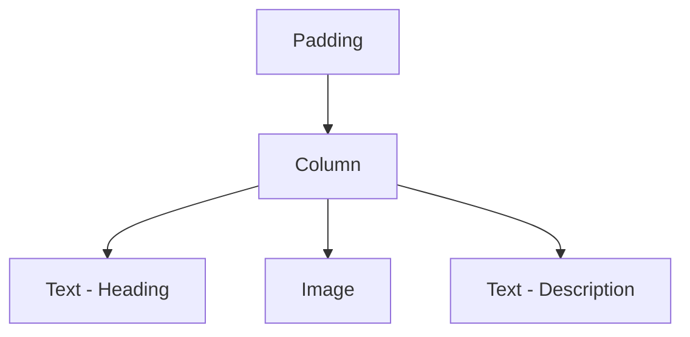

## 4.2.3 Displaying Content

In this section, we will explore how to display content on the home screen of your Flutter app using a variety of widgets. This includes adding text, images, and organizing them in a visually appealing manner. By the end of this chapter, you will have a solid understanding of how to use Flutter's core widgets to create a dynamic and engaging user interface.

### Choosing Core Widgets

Flutter provides a rich set of widgets that allow you to build complex UIs with ease. When it comes to displaying content, the following widgets are essential:

- **Text**: For displaying strings of text.
- **Image**: For displaying images from various sources.
- **ListView**: For displaying a scrollable list of widgets.
- **Column**: For arranging widgets vertically.
- **Row**: For arranging widgets horizontally.

These widgets form the building blocks of your app's UI. Let's dive deeper into each of these and see how they can be used to display content effectively.

### Adding Text Content

Text is a fundamental part of any app's UI. Flutter's `Text` widget allows you to display text with various styles and alignments. Here's how you can display different types of text content:

#### Displaying Paragraphs and Headings

To display paragraphs and headings, you can use the `Text` widget with different styles. Here's an example:

```dart
Column(
  crossAxisAlignment: CrossAxisAlignment.start,
  children: [
    Text(
      'Welcome to My First App',
      style: TextStyle(fontSize: 24, fontWeight: FontWeight.bold),
    ),
    SizedBox(height: 10),
    Text(
      'This is a paragraph of text that provides information about the app. It is styled to be readable and engaging for the user.',
      style: TextStyle(fontSize: 16),
    ),
  ],
)
```

In this example, we use a `Column` to arrange the text vertically. The `Text` widget for the heading uses a larger font size and bold weight to stand out, while the paragraph uses a smaller, regular font for readability.

#### Styling Text

Flutter's `TextStyle` class allows you to customize text appearance. You can change the font size, color, weight, and more. Here's an example of styled text:

```dart
Text(
  'Styled Text Example',
  style: TextStyle(
    fontSize: 20,
    color: Colors.blueAccent,
    fontWeight: FontWeight.w600,
    letterSpacing: 1.2,
  ),
)
```

This snippet demonstrates how to apply various styles to text, making it more visually appealing and fitting the app's design theme.

### Including Images

Images are crucial for creating visually engaging apps. Flutter's `Image` widget allows you to display images from assets, network, or memory. Let's focus on using asset images:

#### Adding Images from Assets

To include images from your app's assets, you need to:

1. Place the image files in the `assets/images` directory.
2. Update the `pubspec.yaml` file to include these assets:

```yaml
flutter:
  assets:
    - assets/images/welcome.png
```

3. Use the `Image.asset` widget to display the image:

```dart
Image.asset(
  'assets/images/welcome.png',
  width: 100,
  height: 100,
  fit: BoxFit.cover,
)
```

The `fit` property determines how the image should be resized to fit its container. Options include `BoxFit.cover`, `BoxFit.contain`, `BoxFit.fill`, etc.

#### Resizing and Fitting Images

Properly resizing and fitting images is essential for maintaining aspect ratio and ensuring images look good on different screen sizes. Here’s a breakdown of the `fit` options:

- **BoxFit.cover**: Scales the image to cover the entire widget, possibly cropping it.
- **BoxFit.contain**: Scales the image to fit within the widget, maintaining aspect ratio.
- **BoxFit.fill**: Stretches the image to fill the widget, possibly distorting it.

### Combining Widgets

To create a cohesive UI, you often need to combine text and images. Layout widgets like `Column`, `Row`, and `Stack` help you arrange these elements.

#### Using Layout Widgets

Here's an example of combining text and images using a `Column`:

```dart
Padding(
  padding: EdgeInsets.all(16.0),
  child: Column(
    children: [
      Text(
        'Welcome to My First App',
        style: TextStyle(fontSize: 24, fontWeight: FontWeight.bold),
      ),
      SizedBox(height: 20),
      Image.asset('assets/images/welcome.png'),
      SizedBox(height: 20),
      Text(
        'This is some descriptive text about the app. It explains what the app does and how it can benefit the user.',
      ),
    ],
  ),
)
```

In this example, we use `SizedBox` to add spacing between widgets, creating a clean and organized layout.

#### Visualizing Widget Hierarchy

Understanding the widget hierarchy is crucial for building complex UIs. Here's a diagram representing the hierarchy of the above layout:



This diagram shows how widgets are nested within each other, forming a tree structure.

### Scrollability

When content exceeds the screen size, you need to make it scrollable. `SingleChildScrollView` is perfect for this:

```dart
SingleChildScrollView(
  child: Padding(
    padding: EdgeInsets.all(16.0),
    child: Column(
      children: [
        Text(
          'Welcome to My First App',
          style: TextStyle(fontSize: 24, fontWeight: FontWeight.bold),
        ),
        SizedBox(height: 20),
        Image.asset('assets/images/welcome.png'),
        SizedBox(height: 20),
        Text(
          'This is some descriptive text about the app. It explains what the app does and how it can benefit the user.',
        ),
        // Add more content here
      ],
    ),
  ),
)
```

`SingleChildScrollView` allows the entire content to be scrollable, ensuring all elements are accessible.

### Best Practices for Displaying Content

1. **Use Padding and Spacing**: Ensure adequate padding and spacing between elements for a clean UI.
2. **Consider Readability**: Choose appropriate font sizes and styles for readability.
3. **Manage Assets Properly**: Keep your assets organized and update `pubspec.yaml` accordingly.
4. **Optimize Images**: Use the correct image format and size for performance.

### Troubleshooting Tips

- **Text Overflow**: Use the `overflow` property in `Text` to handle overflow issues.
- **Image Not Displaying**: Ensure the asset path is correct and included in `pubspec.yaml`.
- **Layout Issues**: Use `debugPrint` to log widget sizes and positions for debugging.

### Conclusion

Displaying content effectively is a crucial aspect of app development. By mastering Flutter's core widgets and understanding layout management, you can create engaging and user-friendly interfaces. Practice combining text and images, experiment with different layouts, and always consider the user's experience.

## Quiz Time!



### What widget is used to display a string of text in Flutter?

- [x] Text
- [ ] Image
- [ ] Column
- [ ] Row

> **Explanation:** The `Text` widget is used to display strings of text in Flutter.


### Which widget would you use to display a scrollable list of items?

- [ ] Column
- [x] ListView
- [ ] Row
- [ ] Stack

> **Explanation:** `ListView` is used to display a scrollable list of items in Flutter.


### How do you include an image from assets in your Flutter app?

- [x] Use Image.asset and update pubspec.yaml
- [ ] Use Image.network
- [ ] Use Image.memory
- [ ] Use Image.file

> **Explanation:** To include an image from assets, use `Image.asset` and ensure the asset is listed in `pubspec.yaml`.


### What property of the `Image` widget helps maintain the aspect ratio?

- [ ] alignment
- [ ] color
- [x] fit
- [ ] repeat

> **Explanation:** The `fit` property helps maintain the aspect ratio of the image.


### Which layout widget arranges its children vertically?

- [x] Column
- [ ] Row
- [ ] Stack
- [ ] GridView

> **Explanation:** `Column` arranges its children vertically.


### What widget would you use to make content scrollable when it exceeds screen size?

- [ ] Row
- [ ] Column
- [x] SingleChildScrollView
- [ ] Container

> **Explanation:** `SingleChildScrollView` is used to make content scrollable when it exceeds the screen size.


### How can you add spacing between widgets in a `Column`?

- [x] Use SizedBox
- [ ] Use Padding
- [ ] Use Margin
- [ ] Use Border

> **Explanation:** `SizedBox` can be used to add spacing between widgets in a `Column`.


### What is the purpose of the `TextStyle` class in Flutter?

- [ ] To display images
- [x] To style text
- [ ] To layout widgets
- [ ] To manage state

> **Explanation:** `TextStyle` is used to style text in Flutter.


### Which `BoxFit` option scales the image to cover the entire widget?

- [x] BoxFit.cover
- [ ] BoxFit.contain
- [ ] BoxFit.fill
- [ ] BoxFit.none

> **Explanation:** `BoxFit.cover` scales the image to cover the entire widget.


### True or False: The `Row` widget arranges its children vertically.

- [ ] True
- [x] False

> **Explanation:** The `Row` widget arranges its children horizontally, not vertically.


