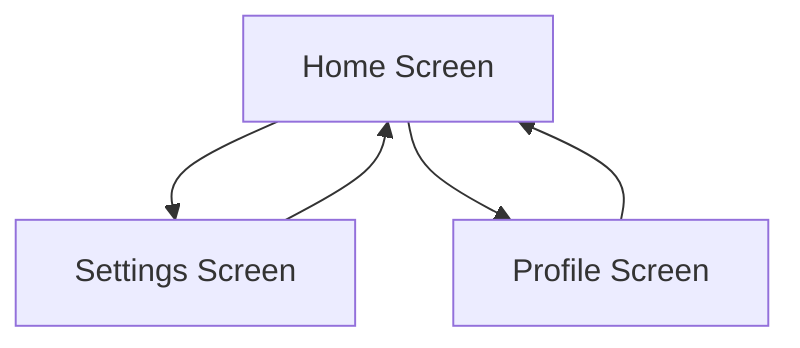

## 4.2.4 Adding Navigation Drawer or Bottom Navigation Bar

In the journey from zero to publishing your first Flutter app, understanding and implementing effective navigation is crucial. Navigation elements like a navigation drawer or a bottom navigation bar are fundamental in providing a seamless user experience. This section will guide you through the process of adding these navigation components to your Flutter app, ensuring that users can easily move between different screens.

### Understanding Navigation Patterns

Before diving into the implementation, it's essential to understand the purpose and appropriate use cases for navigation drawers and bottom navigation bars.

#### Navigation Drawer

A navigation drawer is a sliding panel that typically appears from the left side of the screen. It is ideal for apps with numerous navigation options or when you want to provide a secondary navigation menu. The drawer is hidden by default and can be accessed by swiping from the edge of the screen or tapping a menu icon.

**When to Use:**
- When your app has more than five navigation options.
- When you want to provide additional options without cluttering the main UI.
- For apps with a hierarchical navigation structure.

#### Bottom Navigation Bar

A bottom navigation bar is a horizontal bar at the bottom of the screen, displaying the most important navigation options. It is always visible and allows for quick access to top-level views.

**When to Use:**
- When your app has three to five primary navigation options.
- When you want to provide quick access to the most frequently used sections.
- For apps with a flat navigation structure.

### Adding a Navigation Drawer

Implementing a navigation drawer in Flutter is straightforward with the `Drawer` widget. It is typically used within a `Scaffold` widget, which provides the basic structure for your app's UI.

#### Step-by-Step Implementation

1. **Set Up the Scaffold:**

   Start by setting up a `Scaffold` widget in your main screen. The `Scaffold` provides a framework for implementing the drawer.

   ```dart
   Scaffold(
     appBar: AppBar(
       title: Text('My App'),
     ),
     drawer: Drawer(
       child: ListView(
         padding: EdgeInsets.zero,
         children: [
           DrawerHeader(
             decoration: BoxDecoration(color: Colors.blue),
             child: Text('Menu', style: TextStyle(color: Colors.white)),
           ),
           ListTile(
             leading: Icon(Icons.home),
             title: Text('Home'),
             onTap: () {
               // Navigate to home
             },
           ),
           ListTile(
             leading: Icon(Icons.settings),
             title: Text('Settings'),
             onTap: () {
               // Navigate to settings
             },
           ),
         ],
       ),
     ),
     body: Center(child: Text('Home Screen')),
   );
   ```

2. **Populate the Drawer:**

   Use `ListTile` widgets to add navigation options. Each `ListTile` can have an icon, a title, and an `onTap` callback to handle navigation.

3. **Handle Navigation:**

   Inside the `onTap` callback, use the `Navigator` class to navigate to different screens. For example:

   ```dart
   onTap: () {
     Navigator.push(
       context,
       MaterialPageRoute(builder: (context) => HomeScreen()),
     );
   }
   ```

   This code snippet navigates to a `HomeScreen` widget when the "Home" option is tapped.

### Adding a Bottom Navigation Bar

The `BottomNavigationBar` widget is used to implement a bottom navigation bar. It allows users to switch between different views or tabs.

#### Step-by-Step Implementation

1. **Create a Stateful Widget:**

   A stateful widget is necessary to manage the state of the selected tab.

   ```dart
   class MyHomePage extends StatefulWidget {
     @override
     _MyHomePageState createState() => _MyHomePageState();
   }

   class _MyHomePageState extends State<MyHomePage> {
     int _selectedIndex = 0;

     static const List<Widget> _widgetOptions = <Widget>[
       Text('Home Page'),
       Text('Business Page'),
       Text('School Page'),
     ];

     void _onItemTapped(int index) {
       setState(() {
         _selectedIndex = index;
       });
     }

     @override
     Widget build(BuildContext context) {
       return Scaffold(
         appBar: AppBar(
           title: Text('Bottom Navigation Bar Example'),
         ),
         body: Center(
           child: _widgetOptions.elementAt(_selectedIndex),
         ),
         bottomNavigationBar: BottomNavigationBar(
           items: const <BottomNavigationBarItem>[
             BottomNavigationBarItem(
               icon: Icon(Icons.home),
               label: 'Home',
             ),
             BottomNavigationBarItem(
               icon: Icon(Icons.business),
               label: 'Business',
             ),
             BottomNavigationBarItem(
               icon: Icon(Icons.school),
               label: 'School',
             ),
           ],
           currentIndex: _selectedIndex,
           selectedItemColor: Colors.amber[800],
           onTap: _onItemTapped,
         ),
       );
     }
   }
   ```

2. **Manage State:**

   Use a state variable `_selectedIndex` to keep track of the currently selected tab. The `_onItemTapped` function updates this index and refreshes the UI.

3. **Define Navigation Logic:**

   The `BottomNavigationBar` widget requires a list of `BottomNavigationBarItem` widgets, each representing a tab. The `onTap` callback updates the `_selectedIndex` state.

### Implementing Navigation Logic

In Flutter, navigation between screens is typically handled using the `Navigator` class. This class provides methods like `push` and `pop` to manage the navigation stack.

#### Basic Navigation

- **Push a New Screen:**

  Use `Navigator.push` to navigate to a new screen.

  ```dart
  Navigator.push(
    context,
    MaterialPageRoute(builder: (context) => NewScreen()),
  );
  ```

- **Pop the Current Screen:**

  Use `Navigator.pop` to return to the previous screen.

  ```dart
  Navigator.pop(context);
  ```

#### Named Routes

For more complex apps, you can define named routes in the `MaterialApp` widget. This approach allows for cleaner and more organized navigation logic.

1. **Define Routes:**

   ```dart
   MaterialApp(
     initialRoute: '/',
     routes: {
       '/': (context) => HomeScreen(),
       '/settings': (context) => SettingsScreen(),
     },
   );
   ```

2. **Navigate Using Named Routes:**

   ```dart
   Navigator.pushNamed(context, '/settings');
   ```

### Visualizing Navigation Flow

To better understand the navigation flow, consider the following flowchart that illustrates the transitions between different screens.



### Best Practices and Tips

- **Simplify Navigation Logic:**

  Keep your navigation logic simple and intuitive. Avoid deep navigation hierarchies unless necessary.

- **Ensure User-Friendly Navigation:**

  Test your navigation thoroughly to ensure a smooth user experience. Ensure that navigation elements are easily accessible and understandable.

- **Optimize for Different Devices:**

  Consider how your navigation elements appear on different screen sizes and orientations. Use responsive design techniques to adapt your UI accordingly.

### Conclusion

Adding navigation elements like a navigation drawer or a bottom navigation bar is crucial for enhancing the user experience in your Flutter app. By following the steps outlined in this section, you can implement these components effectively, allowing users to navigate seamlessly between different screens. Remember to test your navigation thoroughly and keep the user experience in mind at all times.

## Quiz Time!



### What is the primary purpose of a navigation drawer in a Flutter app?

- [x] To provide a hidden menu with multiple navigation options
- [ ] To display a fixed set of tabs at the bottom of the screen
- [ ] To replace the app's main content with a new screen
- [ ] To create a floating action button

> **Explanation:** A navigation drawer provides a hidden menu that can slide in from the side, offering multiple navigation options without cluttering the main UI.

### When is it most appropriate to use a bottom navigation bar?

- [x] When your app has three to five primary navigation options
- [ ] When your app has more than five navigation options
- [ ] When you want to provide a secondary navigation menu
- [ ] When your app has a hierarchical navigation structure

> **Explanation:** A bottom navigation bar is best used when your app has a limited number of primary navigation options, typically between three and five.

### How do you implement a navigation drawer in Flutter?

- [x] By using the `Drawer` widget within a `Scaffold`
- [ ] By using the `BottomNavigationBar` widget
- [ ] By using the `AppBar` widget
- [ ] By using the `TabBar` widget

> **Explanation:** The `Drawer` widget is used within a `Scaffold` to implement a navigation drawer in Flutter.

### What method is used to navigate to a new screen in Flutter?

- [x] `Navigator.push`
- [ ] `Navigator.pop`
- [ ] `Navigator.replace`
- [ ] `Navigator.remove`

> **Explanation:** `Navigator.push` is used to navigate to a new screen by adding a new route to the navigation stack.

### How can you manage state in a bottom navigation bar?

- [x] By using a stateful widget with a state variable to track the selected index
- [ ] By using a stateless widget with a constant index
- [ ] By using a global variable to track the selected index
- [ ] By using a separate class to manage the state

> **Explanation:** A stateful widget with a state variable is used to manage the selected index in a bottom navigation bar, allowing the UI to update based on user interaction.

### What is the purpose of the `onTap` callback in a `BottomNavigationBar`?

- [x] To update the selected index and refresh the UI
- [ ] To close the app
- [ ] To open a dialog
- [ ] To change the app's theme

> **Explanation:** The `onTap` callback is used to update the selected index and refresh the UI when a user taps on a navigation item.

### How do you define named routes in a Flutter app?

- [x] By using the `routes` property in the `MaterialApp` widget
- [ ] By using the `Navigator` widget
- [ ] By using the `Scaffold` widget
- [ ] By using the `AppBar` widget

> **Explanation:** Named routes are defined using the `routes` property in the `MaterialApp` widget, allowing for organized navigation logic.

### What is the function of `Navigator.pop` in Flutter?

- [x] To return to the previous screen by removing the current route from the stack
- [ ] To navigate to a new screen
- [ ] To close the app
- [ ] To open a dialog

> **Explanation:** `Navigator.pop` is used to return to the previous screen by removing the current route from the navigation stack.

### How can you visualize navigation flow in an app?

- [x] By using flowcharts or diagrams
- [ ] By using code comments
- [ ] By using print statements
- [ ] By using a debugger

> **Explanation:** Flowcharts or diagrams are effective tools for visualizing navigation flow, helping to understand the transitions between different screens.

### True or False: A navigation drawer is always visible on the screen.

- [ ] True
- [x] False

> **Explanation:** False. A navigation drawer is typically hidden and can be accessed by swiping from the edge of the screen or tapping a menu icon.


