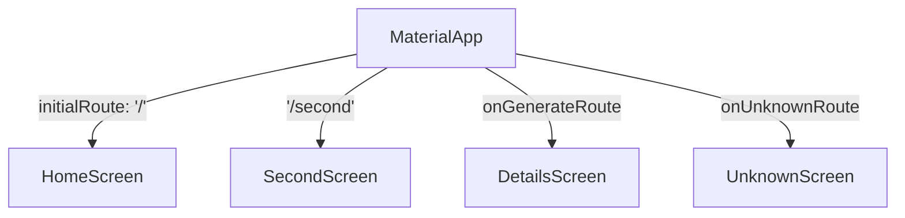

## 4.3.2 Defining Routes

In the journey of building a Flutter application, managing navigation efficiently is crucial, especially as your app grows in complexity. This section delves into defining named routes in Flutter, a practice that enhances the scalability and maintainability of your application. By the end of this chapter, you will have a solid understanding of how to implement named routes, utilize `onGenerateRoute` for dynamic routing, and navigate between screens using these routes.

### Named Routes Overview

Named routes in Flutter provide a way to navigate between screens using string identifiers. This approach abstracts the navigation logic from the widget tree, allowing for a cleaner and more organized codebase. Named routes are particularly beneficial in larger applications where multiple screens and complex navigation flows are involved.

#### Benefits of Named Routes

1. **Scalability**: As your app grows, managing navigation through named routes becomes more straightforward. You can easily add, remove, or modify routes without altering the core navigation logic.
   
2. **Maintainability**: Named routes centralize navigation logic, making it easier to understand and manage. This centralization reduces the risk of errors and simplifies debugging.

3. **Consistency**: Using named routes ensures consistent navigation patterns throughout your app, which is crucial for maintaining a coherent user experience.

4. **Flexibility**: Named routes allow for dynamic route generation, enabling you to handle complex navigation scenarios with ease.

### Defining Routes in MaterialApp

The `MaterialApp` widget in Flutter provides a `routes` property, which is a map of route names to widget builders. This map defines the available routes in your application and the corresponding screens they navigate to.

#### Example: Defining Routes

Here's a simple example of defining named routes in a Flutter app:

```dart
MaterialApp(
  initialRoute: '/',
  routes: {
    '/': (context) => HomeScreen(),
    '/second': (context) => SecondScreen(),
  },
);
```

In this example, the `initialRoute` is set to `'/'`, which means the app will start at the `HomeScreen`. The `routes` map defines two routes: `'/'` for `HomeScreen` and `'/second'` for `SecondScreen`.

#### Best Practices for Defining Routes

- **Consistent Naming**: Use a consistent naming convention for your routes. For instance, use lowercase with underscores for readability (`'/home_screen'`, `'/profile_screen'`).
  
- **Logical Organization**: Organize your route definitions logically, grouping related routes together. This organization aids in understanding the navigation flow and simplifies maintenance.

- **Avoid Hardcoding**: Define route names as constants to avoid hardcoding strings throughout your codebase. This practice reduces errors and simplifies updates.

### Using `onGenerateRoute`

While the `routes` table is suitable for static routes, `onGenerateRoute` provides a more flexible approach for dynamic route generation. This method allows you to handle complex navigation scenarios, such as passing arguments to routes or handling unknown routes.

#### Example: Using `onGenerateRoute`

```dart
MaterialApp(
  onGenerateRoute: (settings) {
    if (settings.name == '/details') {
      final args = settings.arguments;
      return MaterialPageRoute(
        builder: (context) {
          return DetailsScreen(data: args);
        },
      );
    }
    // Handle other routes or return null for unknown routes
  },
);
```

In this example, `onGenerateRoute` checks if the route name is `'/details'`. If so, it retrieves the arguments passed to the route and navigates to `DetailsScreen` with those arguments.

#### Handling Unknown Routes

To handle unknown routes gracefully, you can provide a fallback screen:

```dart
MaterialApp(
  onUnknownRoute: (settings) {
    return MaterialPageRoute(
      builder: (context) => UnknownScreen(),
    );
  },
);
```

This setup ensures that your app doesn't crash when an undefined route is accessed, enhancing the user experience.

### Navigating with Named Routes

Once you've defined your routes, navigating between screens using named routes is straightforward. The `Navigator` widget provides methods like `pushNamed` and `pop` for managing the navigation stack.

#### Example: Navigating to a Named Route

```dart
Navigator.pushNamed(context, '/second');
```

This line of code pushes the `SecondScreen` onto the navigation stack, transitioning the user to that screen.

#### Passing Arguments to Routes

To pass arguments to a named route, use the `arguments` parameter:

```dart
Navigator.pushNamed(
  context,
  '/details',
  arguments: {'id': 42},
);
```

In the receiving screen, retrieve the arguments using the `ModalRoute`:

```dart
final args = ModalRoute.of(context)!.settings.arguments as Map;
```

### Visualizing the Routing Table

To better understand the routing setup, consider the following diagram illustrating the mapping of route names to screens:



This diagram provides a visual representation of the routing logic, showing how different routes map to their respective screens.

### Best Practices and Tips

- **Centralize Route Definitions**: Keep all route definitions in a single file or a dedicated section of your codebase. This centralization simplifies navigation management and reduces the likelihood of errors.

- **Use Route Constants**: Define route names as constants to avoid typos and facilitate updates. For example:

  ```dart
  const String homeRoute = '/';
  const String secondRoute = '/second';
  ```

- **Test Navigation Flows**: Regularly test your navigation flows to ensure they work as expected. Automated tests can help catch navigation-related bugs early in the development process.

- **Consider Deep Linking**: If your app requires deep linking, ensure your routing setup can handle external links and navigate to the appropriate screens.

### Conclusion

Defining named routes in Flutter is a powerful technique for managing navigation in your app. By leveraging the `routes` table and `onGenerateRoute`, you can create a scalable and maintainable navigation system that enhances the user experience. Consistent naming conventions, logical organization, and centralized route definitions are key to effective navigation management.

As you continue developing your Flutter app, remember to test your navigation flows thoroughly and consider how your routing setup can accommodate future growth and complexity.

## Quiz Time!



### What is a primary benefit of using named routes in Flutter?

- [x] Scalability and maintainability of navigation logic
- [ ] Faster app performance
- [ ] Improved widget rendering
- [ ] Automatic state management

> **Explanation:** Named routes centralize and abstract navigation logic, making it easier to scale and maintain as the app grows.

### How do you define a route in the `MaterialApp` widget?

- [x] Using the `routes` property with a map of route names to widget builders
- [ ] By creating a new widget for each route
- [ ] Using the `Navigator` widget directly
- [ ] By defining routes in the `Scaffold` widget

> **Explanation:** The `routes` property in `MaterialApp` is used to define a map of route names to widget builders, setting up the navigation paths.

### What method is used for dynamic route generation in Flutter?

- [x] `onGenerateRoute`
- [ ] `pushNamed`
- [ ] `pop`
- [ ] `initialRoute`

> **Explanation:** `onGenerateRoute` allows for dynamic route generation, handling complex navigation scenarios.

### How can you handle unknown routes in a Flutter app?

- [x] Using the `onUnknownRoute` property in `MaterialApp`
- [ ] By defining a default route in the `routes` map
- [ ] By catching exceptions in the `Navigator`
- [ ] Using a try-catch block in the widget tree

> **Explanation:** `onUnknownRoute` provides a way to handle routes that are not defined in the `routes` map, ensuring a fallback screen is displayed.

### What is the correct way to navigate to a named route with arguments?

- [x] `Navigator.pushNamed(context, '/details', arguments: {'id': 42})`
- [ ] `Navigator.push(context, '/details', {'id': 42})`
- [ ] `Navigator.pushNamed(context, '/details')`
- [ ] `Navigator.push(context, '/details')`

> **Explanation:** `Navigator.pushNamed` with the `arguments` parameter is used to pass data to a named route.

### How can you retrieve arguments passed to a named route in Flutter?

- [x] Using `ModalRoute.of(context)!.settings.arguments`
- [ ] By accessing the `Navigator` directly
- [ ] Using a global variable
- [ ] By passing arguments through the widget constructor

> **Explanation:** `ModalRoute.of(context)!.settings.arguments` retrieves the arguments passed to a named route.

### What is a recommended practice for defining route names?

- [x] Define route names as constants
- [ ] Use random strings for each route
- [ ] Define routes directly in the widget tree
- [ ] Use numbers as route identifiers

> **Explanation:** Defining route names as constants helps avoid typos and simplifies updates across the codebase.

### Which method is used to navigate back to the previous screen?

- [x] `Navigator.pop(context)`
- [ ] `Navigator.pushNamed(context, '/')`
- [ ] `Navigator.push(context, '/')`
- [ ] `Navigator.replace(context)`

> **Explanation:** `Navigator.pop(context)` is used to remove the current screen from the navigation stack, returning to the previous screen.

### What should you do to ensure consistent navigation patterns?

- [x] Use named routes with a consistent naming convention
- [ ] Use anonymous routes for flexibility
- [ ] Avoid using the `Navigator` widget
- [ ] Define routes in multiple places for redundancy

> **Explanation:** Consistent naming conventions for named routes ensure a coherent navigation pattern throughout the app.

### True or False: Named routes can only be used for static navigation paths.

- [ ] True
- [x] False

> **Explanation:** Named routes can be used for both static and dynamic navigation paths, especially when combined with `onGenerateRoute`.


