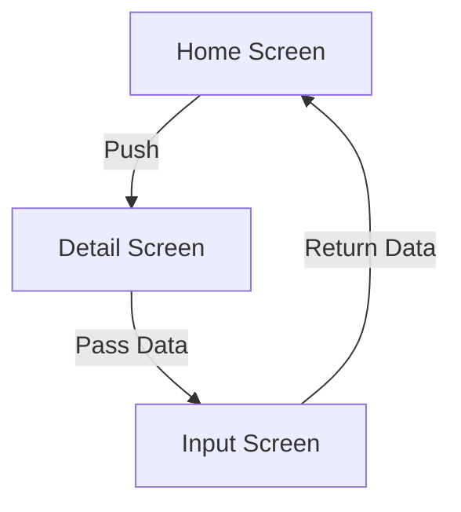

## 4.3.3 Navigating Between Screens

Navigating between screens is a fundamental aspect of mobile app development. In Flutter, the navigation system is both powerful and flexible, allowing developers to manage complex screen transitions with ease. This section will guide you through the process of navigating between screens using both anonymous and named routes, passing and returning data, and handling asynchronous operations with `Future` objects.

### Understanding Navigator Methods

Flutter's `Navigator` class provides several methods to manage the stack of routes. The most commonly used methods are `Navigator.push`, `Navigator.pop`, and `Navigator.pushReplacement`.

#### Navigator.push

The `Navigator.push` method adds a new route to the stack of routes managed by the `Navigator`. This is typically used to transition to a new screen.

```dart
Navigator.push(
  context,
  MaterialPageRoute(builder: (context) => SecondScreen()),
);
```

#### Navigator.pop

The `Navigator.pop` method removes the current route from the stack, effectively returning to the previous screen.

```dart
Navigator.pop(context);
```

#### Navigator.pushReplacement

The `Navigator.pushReplacement` method replaces the current route with a new one. This is useful when you want to remove the current screen from the stack and replace it with another.

```dart
Navigator.pushReplacement(
  context,
  MaterialPageRoute(builder: (context) => NewScreen()),
);
```

### Passing Data Between Screens

Passing data between screens is a common requirement in mobile apps. Flutter provides multiple ways to achieve this, including using constructors and route arguments.

#### Using Constructors

One of the simplest ways to pass data to a new screen is by using the constructor of the screen widget.

```dart
Navigator.push(
  context,
  MaterialPageRoute(
    builder: (context) => DetailScreen(data: 'Some Data'),
  ),
);
```

In the `DetailScreen`, you can access the passed data through the constructor:

```dart
class DetailScreen extends StatelessWidget {
  final String data;
  DetailScreen({required this.data});

  @override
  Widget build(BuildContext context) {
    return Scaffold(
      appBar: AppBar(title: Text('Detail')),
      body: Center(child: Text('Data: $data')),
    );
  }
}
```

#### Using Route Arguments

Another approach is to use route arguments, especially when using named routes. This involves passing a `Map` of arguments to the route.

```dart
Navigator.pushNamed(
  context,
  '/detail',
  arguments: {'data': 'Some Data'},
);
```

In the target screen, retrieve the arguments using `ModalRoute.of(context).settings.arguments`.

```dart
class DetailScreen extends StatelessWidget {
  @override
  Widget build(BuildContext context) {
    final args = ModalRoute.of(context)!.settings.arguments as Map;
    return Scaffold(
      appBar: AppBar(title: Text('Detail')),
      body: Center(child: Text('Data: ${args['data']}')),
    );
  }
}
```

### Returning Data from a Screen

Returning data from a screen is often necessary, such as when a user selects an item from a list and you want to pass that selection back to the previous screen.

#### Using Navigator.pop

You can return data from a screen by passing it to the `Navigator.pop` method.

```dart
// Pushing the screen
final result = await Navigator.push(
  context,
  MaterialPageRoute(builder: (context) => InputScreen()),
);
// Using the result
print('Received: $result');
```

In the `InputScreen`, return the data using `Navigator.pop`.

```dart
Navigator.pop(context, inputData);
```

### Handling Future Objects

Navigation methods in Flutter return `Future` objects, which can be awaited to perform actions after the navigation completes. This is particularly useful when you need to handle the result of a navigation operation.

```dart
Future<void> _navigateAndDisplaySelection(BuildContext context) async {
  final result = await Navigator.push(
    context,
    MaterialPageRoute(builder: (context) => SelectionScreen()),
  );

  if (result != null) {
    ScaffoldMessenger.of(context).showSnackBar(SnackBar(content: Text('You selected: $result')));
  }
}
```

### Best Practices and Common Pitfalls

#### Error Handling

When dealing with `Future` objects, always consider adding error handling to manage exceptions that may occur during navigation.

```dart
try {
  final result = await Navigator.push(
    context,
    MaterialPageRoute(builder: (context) => SomeScreen()),
  );
  // Handle result
} catch (e) {
  print('Error: $e');
}
```

#### Memory Management

Avoid keeping unnecessary screens on the stack to optimize memory usage. Use `Navigator.pushReplacement` or `Navigator.popUntil` to manage the stack efficiently.

```dart
Navigator.popUntil(context, ModalRoute.withName('/home'));
```

### Visualizing Navigation Flow

Understanding the flow of data and navigation paths can be enhanced with visual aids. Below is a flowchart illustrating a simple navigation scenario with data passing and returning.



### Practical Examples

#### Example 1: Navigating with Anonymous Routes

```dart
// Main Screen
class MainScreen extends StatelessWidget {
  @override
  Widget build(BuildContext context) {
    return Scaffold(
      appBar: AppBar(title: Text('Main Screen')),
      body: Center(
        child: ElevatedButton(
          onPressed: () {
            Navigator.push(
              context,
              MaterialPageRoute(builder: (context) => DetailScreen(data: 'Hello')),
            );
          },
          child: Text('Go to Detail'),
        ),
      ),
    );
  }
}

// Detail Screen
class DetailScreen extends StatelessWidget {
  final String data;
  DetailScreen({required this.data});

  @override
  Widget build(BuildContext context) {
    return Scaffold(
      appBar: AppBar(title: Text('Detail Screen')),
      body: Center(child: Text('Data: $data')),
    );
  }
}
```

#### Example 2: Navigating with Named Routes

```dart
// Define routes in MaterialApp
MaterialApp(
  initialRoute: '/',
  routes: {
    '/': (context) => MainScreen(),
    '/detail': (context) => DetailScreen(),
  },
);

// Navigate using named route
Navigator.pushNamed(
  context,
  '/detail',
  arguments: {'data': 'Hello'},
);

// Retrieve arguments in DetailScreen
class DetailScreen extends StatelessWidget {
  @override
  Widget build(BuildContext context) {
    final args = ModalRoute.of(context)!.settings.arguments as Map;
    return Scaffold(
      appBar: AppBar(title: Text('Detail Screen')),
      body: Center(child: Text('Data: ${args['data']}')),
    );
  }
}
```

### Conclusion

Mastering navigation in Flutter is crucial for building intuitive and user-friendly mobile applications. By understanding how to use `Navigator` methods, pass and return data, and handle asynchronous operations, you can create seamless transitions between screens. Remember to consider best practices such as error handling and memory management to ensure your app performs optimally.

## Quiz Time!



### What method is used to add a new route to the stack in Flutter?

- [x] Navigator.push
- [ ] Navigator.pop
- [ ] Navigator.pushReplacement
- [ ] Navigator.remove

> **Explanation:** `Navigator.push` is used to add a new route to the stack.

### How can you pass data to a new screen using a constructor?

- [x] By passing data as a parameter in the constructor
- [ ] By using Navigator.pop
- [ ] By using Navigator.pushReplacement
- [ ] By using a global variable

> **Explanation:** Data can be passed to a new screen by including it as a parameter in the screen's constructor.

### What method would you use to replace the current route with a new one?

- [ ] Navigator.push
- [ ] Navigator.pop
- [x] Navigator.pushReplacement
- [ ] Navigator.remove

> **Explanation:** `Navigator.pushReplacement` replaces the current route with a new one.

### How can you return data from a screen in Flutter?

- [x] By using Navigator.pop with a return value
- [ ] By using Navigator.push
- [ ] By using a global variable
- [ ] By using Navigator.pushReplacement

> **Explanation:** Data can be returned from a screen by passing it to `Navigator.pop`.

### What type of object do navigation methods return in Flutter?

- [x] Future
- [ ] Stream
- [ ] List
- [ ] Map

> **Explanation:** Navigation methods return `Future` objects, which can be awaited.

### Which method is used to remove the current route from the stack?

- [ ] Navigator.push
- [x] Navigator.pop
- [ ] Navigator.pushReplacement
- [ ] Navigator.remove

> **Explanation:** `Navigator.pop` removes the current route from the stack.

### How can you handle exceptions that occur during navigation?

- [x] By using try-catch blocks
- [ ] By ignoring them
- [ ] By using Navigator.pushReplacement
- [ ] By using global variables

> **Explanation:** Exceptions can be handled using try-catch blocks.

### What is a common way to optimize memory usage in navigation?

- [x] By using Navigator.pushReplacement
- [ ] By using Navigator.push
- [ ] By using global variables
- [ ] By using Navigator.pop

> **Explanation:** `Navigator.pushReplacement` helps optimize memory usage by replacing the current route.

### How can you retrieve route arguments in a screen?

- [x] By using ModalRoute.of(context).settings.arguments
- [ ] By using Navigator.pop
- [ ] By using a global variable
- [ ] By using Navigator.pushReplacement

> **Explanation:** Route arguments can be retrieved using `ModalRoute.of(context).settings.arguments`.

### True or False: Navigator methods can be awaited to perform actions after navigation completes.

- [x] True
- [ ] False

> **Explanation:** Navigator methods return `Future` objects, which can be awaited.


