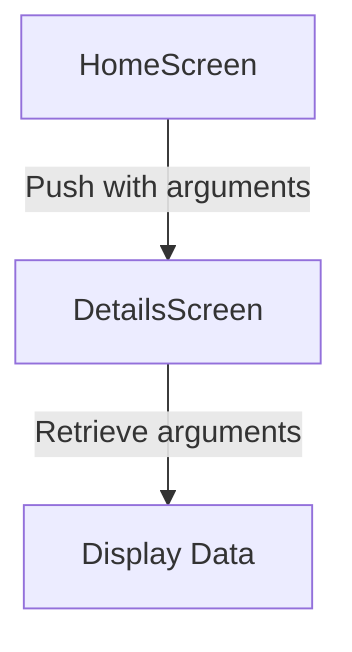

## 4.3.4 Passing Data Between Screens

In Flutter, navigating between screens is a common task, and often, you need to pass data from one screen to another. This section will delve into advanced methods of passing data between screens, including using constructors, route arguments, and shared state management. We will also cover best practices to ensure your app remains scalable and maintainable.

### Using Constructors

One of the simplest ways to pass data between screens in Flutter is by using constructors. This method involves passing data directly through the constructor when you instantiate a new widget.

#### Example: Passing Data via Constructors

Consider a scenario where you have a list of items, and you want to navigate to a detail screen when an item is tapped. You can pass the item data to the detail screen using its constructor.

```dart
class Item {
  final String title;
  final String description;

  Item(this.title, this.description);
}

class ItemListScreen extends StatelessWidget {
  final List<Item> items = [
    Item('Item 1', 'Description 1'),
    Item('Item 2', 'Description 2'),
  ];

  @override
  Widget build(BuildContext context) {
    return Scaffold(
      appBar: AppBar(title: Text('Items')),
      body: ListView.builder(
        itemCount: items.length,
        itemBuilder: (context, index) {
          return ListTile(
            title: Text(items[index].title),
            onTap: () {
              Navigator.push(
                context,
                MaterialPageRoute(
                  builder: (context) => ItemDetailScreen(item: items[index]),
                ),
              );
            },
          );
        },
      ),
    );
  }
}

class ItemDetailScreen extends StatelessWidget {
  final Item item;

  ItemDetailScreen({required this.item});

  @override
  Widget build(BuildContext context) {
    return Scaffold(
      appBar: AppBar(title: Text(item.title)),
      body: Padding(
        padding: const EdgeInsets.all(16.0),
        child: Text(item.description),
      ),
    );
  }
}
```

### Using Route Arguments

For more complex navigation scenarios, especially when using named routes, you can pass data using route arguments. This method leverages the `settings.arguments` property of the `RouteSettings` class.

#### Example: Passing Arguments with Named Routes

First, define your routes in the `MaterialApp` widget:

```dart
void main() {
  runApp(MaterialApp(
    initialRoute: '/',
    routes: {
      '/': (context) => HomeScreen(),
      '/details': (context) => DetailsScreen(),
    },
  ));
}

class HomeScreen extends StatelessWidget {
  @override
  Widget build(BuildContext context) {
    return Scaffold(
      appBar: AppBar(title: Text('Home')),
      body: Center(
        child: ElevatedButton(
          onPressed: () {
            Navigator.pushNamed(
              context,
              '/details',
              arguments: 'Data to pass',
            );
          },
          child: Text('Go to Details'),
        ),
      ),
    );
  }
}
```

In the target screen, retrieve the arguments:

```dart
class DetailsScreen extends StatelessWidget {
  @override
  Widget build(BuildContext context) {
    final args = ModalRoute.of(context)!.settings.arguments as String;

    return Scaffold(
      appBar: AppBar(title: Text('Details')),
      body: Center(
        child: Text('Received: $args'),
      ),
    );
  }
}
```

#### Visualizing Data Flow

To better understand how data flows through navigation calls, consider the following diagram:



### Shared State Management

For applications where multiple screens need access to the same data, shared state management becomes essential. Flutter offers several state management solutions, such as `InheritedWidget`, `Provider`, and others. While we will cover these in detail in later chapters, let's briefly introduce them here.

#### Using InheritedWidget

`InheritedWidget` is a base class for widgets that efficiently propagate information down the widget tree. It's a low-level approach to state management.

```dart
class MyInheritedWidget extends InheritedWidget {
  final int data;

  MyInheritedWidget({
    required this.data,
    required Widget child,
  }) : super(child: child);

  @override
  bool updateShouldNotify(MyInheritedWidget oldWidget) {
    return data != oldWidget.data;
  }

  static MyInheritedWidget of(BuildContext context) {
    return context.dependOnInheritedWidgetOfExactType<MyInheritedWidget>()!;
  }
}
```

#### Using Provider

`Provider` is a popular package that simplifies state management. It allows you to expose and consume data across your widget tree.

```dart
class Counter with ChangeNotifier {
  int _count = 0;

  int get count => _count;

  void increment() {
    _count++;
    notifyListeners();
  }
}

void main() {
  runApp(
    ChangeNotifierProvider(
      create: (context) => Counter(),
      child: MyApp(),
    ),
  );
}

class MyApp extends StatelessWidget {
  @override
  Widget build(BuildContext context) {
    return MaterialApp(
      home: CounterScreen(),
    );
  }
}

class CounterScreen extends StatelessWidget {
  @override
  Widget build(BuildContext context) {
    final counter = Provider.of<Counter>(context);

    return Scaffold(
      appBar: AppBar(title: Text('Counter')),
      body: Center(
        child: Text('Count: ${counter.count}'),
      ),
      floatingActionButton: FloatingActionButton(
        onPressed: counter.increment,
        child: Icon(Icons.add),
      ),
    );
  }
}
```

### Best Practices

When passing data between screens, it's important to follow best practices to ensure your app remains maintainable and scalable:

- **Keep It Simple**: Use the simplest method that meets your needs. For straightforward data passing, constructors are often sufficient.
- **Avoid Tight Coupling**: Screens should not be tightly coupled. Use interfaces or abstract classes to define contracts between screens if necessary.
- **Type Safety**: Always ensure type safety when retrieving arguments. Consider using assertions or type checks to handle unexpected types.
- **Handle Null Values**: Be prepared for cases where arguments may be null. Provide default values or handle null cases gracefully.
- **Document Data Flow**: For complex applications, document how data flows between screens to aid in maintenance and onboarding new developers.

### Troubleshooting Tips

- **Null Arguments**: If you encounter null arguments, ensure that the data is being passed correctly and that the receiving screen is set up to handle it.
- **Type Mismatches**: Use type checks and assertions to catch type mismatches early in development.
- **Navigation Errors**: Double-check route names and ensure they are correctly registered in your `MaterialApp` widget.

### Conclusion

Passing data between screens is a fundamental aspect of Flutter development. By understanding and utilizing constructors, route arguments, and shared state management, you can build robust and maintainable applications. As you continue to develop your Flutter skills, consider exploring more advanced state management solutions to handle complex data flows.

## Quiz Time!



### What is the simplest method to pass data between screens in Flutter?

- [x] Using constructors
- [ ] Using shared state management
- [ ] Using route arguments
- [ ] Using global variables

> **Explanation:** Constructors are the simplest way to pass data directly when creating a new widget instance.

### How can you pass data using named routes in Flutter?

- [ ] By using global variables
- [x] By using `settings.arguments`
- [ ] By using `InheritedWidget`
- [ ] By using `ChangeNotifier`

> **Explanation:** Named routes in Flutter can pass data using the `settings.arguments` property of the `RouteSettings` class.

### Which state management solution is NOT mentioned in this section?

- [ ] InheritedWidget
- [ ] Provider
- [x] Redux
- [ ] ChangeNotifier

> **Explanation:** Redux is not mentioned in this section; it focuses on `InheritedWidget` and `Provider`.

### What should you do to ensure type safety when retrieving arguments?

- [ ] Ignore type checks
- [x] Use assertions or type checks
- [ ] Use global variables
- [ ] Avoid using arguments

> **Explanation:** Using assertions or type checks ensures that the arguments are of the expected type.

### What is a potential issue when passing data between screens?

- [ ] Data duplication
- [x] Null arguments
- [ ] Excessive memory usage
- [ ] Slow performance

> **Explanation:** Null arguments can occur if data is not passed correctly or if the receiving screen is not set up to handle it.

### Which of the following is a best practice for passing data between screens?

- [x] Keep data passing simple
- [ ] Use complex data structures
- [ ] Avoid documentation
- [ ] Use global variables

> **Explanation:** Keeping data passing simple helps maintain the app's scalability and maintainability.

### What is a benefit of using `Provider` for state management?

- [ ] It increases app size
- [x] It simplifies state management
- [ ] It requires more code
- [ ] It is less efficient

> **Explanation:** `Provider` simplifies state management by allowing data to be exposed and consumed across the widget tree.

### How can you handle null values when passing data between screens?

- [ ] Ignore them
- [ ] Use global variables
- [x] Provide default values or handle them gracefully
- [ ] Avoid passing data

> **Explanation:** Providing default values or handling null cases gracefully ensures that the app remains robust.

### What is the role of `InheritedWidget` in state management?

- [ ] It complicates data flow
- [x] It efficiently propagates information down the widget tree
- [ ] It is used for navigation
- [ ] It is a UI component

> **Explanation:** `InheritedWidget` efficiently propagates information down the widget tree, making it useful for state management.

### True or False: Screens should be tightly coupled to facilitate data passing.

- [ ] True
- [x] False

> **Explanation:** Screens should not be tightly coupled; this practice ensures better maintainability and scalability.


