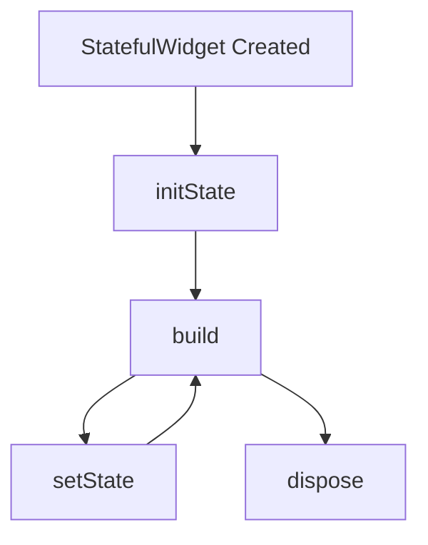

## 4.4.2 Implementing Stateful Widgets

In the world of Flutter development, understanding how to manage dynamic content is crucial for building interactive and responsive applications. Stateful widgets are the backbone of this functionality, allowing developers to create components that can change over time in response to user actions or other events. This section will delve into the anatomy of stateful widgets, explore their lifecycle, and provide best practices for using them effectively in your Flutter applications.

### Anatomy of a Stateful Widget

A stateful widget in Flutter is composed of two main classes:

1. **StatefulWidget**: This is the immutable part of the widget that defines the widget's configuration and properties.
2. **State**: This is the mutable part that holds the state information and contains the logic for building the widget's UI.

#### The StatefulWidget Class

The `StatefulWidget` class itself is relatively simple. It serves as a container for the state and provides a method to create the state object. Here's a basic example:

```dart
class CounterWidget extends StatefulWidget {
  @override
  _CounterWidgetState createState() => _CounterWidgetState();
}
```

In this example, `CounterWidget` is a stateful widget that creates an instance of `_CounterWidgetState`, which will manage the state for this widget.

#### The State Class

The `State` class is where the magic happens. It holds the state variables and contains the `build` method, which describes how to display the widget based on its current state.

```dart
class _CounterWidgetState extends State<CounterWidget> {
  int _counter = 0;

  void _incrementCounter() {
    setState(() {
      _counter++;
    });
  }

  @override
  Widget build(BuildContext context) {
    return Column(
      children: [
        Text('Counter: $_counter'),
        ElevatedButton(
          onPressed: _incrementCounter,
          child: Text('Increment'),
        ),
      ],
    );
  }
}
```

In this example, `_CounterWidgetState` manages a simple counter. The `_incrementCounter` method updates the counter and triggers a UI rebuild by calling `setState`.

### Lifecycle Methods

Understanding the lifecycle of a stateful widget is key to managing state effectively. Here are the primary lifecycle methods you need to know:

#### `initState`

The `initState` method is called once when the state object is created. It's the perfect place to initialize state variables or subscribe to streams.

```dart
@override
void initState() {
  super.initState();
  // Initialize state variables or subscriptions here
}
```

#### `build`

The `build` method is called whenever the state changes and needs to be re-rendered. It's important to keep this method pure, meaning it should only return a widget tree based on the current state and not perform any side effects.

```dart
@override
Widget build(BuildContext context) {
  return Column(
    children: [
      Text('Counter: $_counter'),
      ElevatedButton(
        onPressed: _incrementCounter,
        child: Text('Increment'),
      ),
    ],
  );
}
```

#### `dispose`

The `dispose` method is called when the state object is removed permanently. Use it to clean up resources, such as canceling timers or unsubscribing from streams.

```dart
@override
void dispose() {
  // Clean up resources here
  super.dispose();
}
```

### Updating State

State updates in Flutter are managed through the `setState` method. This method notifies the framework that the state has changed and triggers a rebuild of the widget.

#### Using `setState`

The `setState` method takes a function as an argument, which contains the logic for updating the state variables. Here's how you use it:

```dart
void _incrementCounter() {
  setState(() {
    _counter++;
  });
}
```

#### When to Call `setState`

- **Only when necessary**: Avoid calling `setState` unnecessarily, as it can lead to performance issues. Only call it when the state change affects the UI.
- **Keep it minimal**: The function passed to `setState` should be as short as possible, ideally just updating the state variables.

### Best Practices

To make the most out of stateful widgets, consider the following best practices:

#### Minimize `setState` Usage

Frequent calls to `setState` can degrade performance, especially in complex widgets. Strive to minimize its usage by batching state updates or using more advanced state management solutions for complex applications.

#### Keep the `build` Method Pure

Ensure that the `build` method is pure and free of side effects. It should only return a widget tree based on the current state and not perform any operations that modify the state or interact with external systems.

#### Use Keys Wisely

When dealing with lists of stateful widgets, use keys to preserve the state of widgets when they are reordered or removed. This helps Flutter identify and maintain the correct state for each widget.

### Code Examples

Let's revisit the complete example of a stateful widget that implements a simple counter:

```dart
import 'package:flutter/material.dart';

class CounterWidget extends StatefulWidget {
  @override
  _CounterWidgetState createState() => _CounterWidgetState();
}

class _CounterWidgetState extends State<CounterWidget> {
  int _counter = 0;

  void _incrementCounter() {
    setState(() {
      _counter++;
    });
  }

  @override
  Widget build(BuildContext context) {
    return Column(
      mainAxisAlignment: MainAxisAlignment.center,
      children: [
        Text(
          'Counter: $_counter',
          style: TextStyle(fontSize: 24),
        ),
        SizedBox(height: 20),
        ElevatedButton(
          onPressed: _incrementCounter,
          child: Text('Increment'),
        ),
      ],
    );
  }
}
```

In this example, the `CounterWidget` displays a counter and a button. Each time the button is pressed, the counter is incremented, and the UI is updated to reflect the new value.

### Visual Aids

To better understand the lifecycle of a stateful widget, let's visualize it using a diagram:



This diagram illustrates the lifecycle of a stateful widget, from creation to disposal. The `setState` method triggers a call to `build`, which updates the UI.

### Common Pitfalls

When working with stateful widgets, be aware of these common pitfalls:

- **Modifying State Without `setState`**: Always use `setState` to modify state variables. Failing to do so will not trigger a UI update.
- **Long Operations in `build`**: Avoid performing long operations or side effects in the `build` method. Keep it pure and focused on returning the widget tree.
- **Overusing Stateful Widgets**: Not every widget needs to be stateful. Use stateful widgets only when necessary, and consider using stateless widgets or other state management solutions for simpler cases.

### Hands-On Practice

To reinforce your understanding of stateful widgets, try building a simple interactive widget. For example, create a widget that changes its background color each time a button is pressed. Experiment with different state variables and UI updates to see how they affect the widget's behavior.

### Conclusion

Stateful widgets are a powerful tool in Flutter for managing dynamic content and creating interactive applications. By understanding their anatomy, lifecycle, and best practices, you can build efficient and responsive Flutter apps. Remember to keep the `build` method pure, minimize `setState` usage, and be mindful of common pitfalls. With practice and experimentation, you'll become proficient in using stateful widgets to enhance your Flutter applications.

## Quiz Time!



### What are the two main classes involved in a stateful widget?

- [x] StatefulWidget and State
- [ ] StatelessWidget and State
- [ ] StatefulWidget and StatelessWidget
- [ ] Widget and State

> **Explanation:** A stateful widget consists of a `StatefulWidget` class and its associated `State` class, which manages the widget's state.

### Which lifecycle method is called when a state object is created?

- [x] initState
- [ ] build
- [ ] dispose
- [ ] didChangeDependencies

> **Explanation:** The `initState` method is called once when the state object is created, allowing for initialization of state variables.

### What is the purpose of the `setState` method?

- [x] To notify the framework that the state has changed and trigger a UI rebuild
- [ ] To initialize state variables
- [ ] To clean up resources
- [ ] To build the widget tree

> **Explanation:** The `setState` method is used to notify the framework of a state change, prompting a rebuild of the widget.

### Which method should you override to clean up resources in a stateful widget?

- [x] dispose
- [ ] initState
- [ ] build
- [ ] setState

> **Explanation:** The `dispose` method is overridden to clean up resources, such as canceling timers or unsubscribing from streams.

### What is a best practice for using the `build` method?

- [x] Keep it pure and free of side effects
- [ ] Perform long operations
- [x] Return a widget tree based on the current state
- [ ] Modify state variables directly

> **Explanation:** The `build` method should be pure, returning a widget tree based on the current state without performing side effects.

### Why should you minimize the use of `setState`?

- [x] To optimize performance
- [ ] To avoid UI updates
- [ ] To prevent state changes
- [ ] To increase complexity

> **Explanation:** Minimizing `setState` usage helps optimize performance by reducing unnecessary UI rebuilds.

### What happens if you modify state variables without calling `setState`?

- [x] The UI will not update
- [ ] The state will not change
- [x] The widget will rebuild
- [ ] The app will crash

> **Explanation:** Modifying state variables without `setState` will not trigger a UI update, as the framework is not notified of the change.

### What should you use to preserve the state of widgets in a list?

- [x] Keys
- [ ] setState
- [ ] dispose
- [ ] initState

> **Explanation:** Using keys helps preserve the state of widgets in a list when they are reordered or removed.

### What is the role of the `State` class in a stateful widget?

- [x] To hold the state information and contain the logic for building the widget's UI
- [ ] To define the widget's configuration and properties
- [ ] To manage stateless widgets
- [ ] To initialize the widget

> **Explanation:** The `State` class holds the state information and contains the logic for building the widget's UI.

### True or False: Every widget in Flutter needs to be stateful.

- [x] False
- [ ] True

> **Explanation:** Not every widget needs to be stateful. Use stateful widgets only when necessary, and consider stateless widgets for simpler cases.


