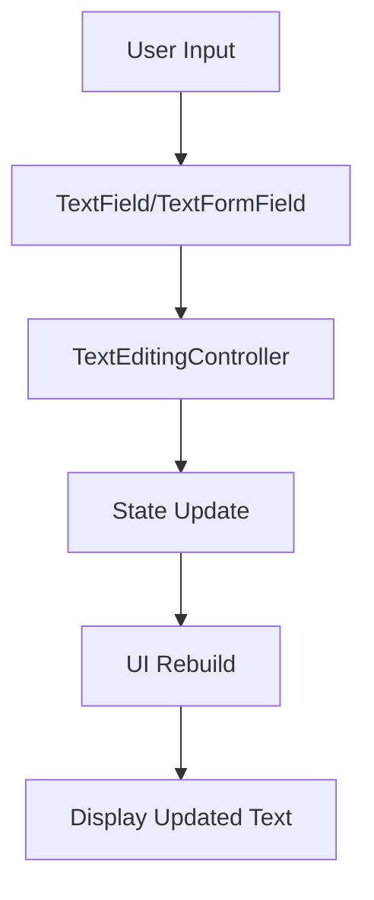

---

linkTitle: "4.4.3 Managing User Input"
title: "Managing User Input in Flutter: Capturing, Validating, and Responding to User Input"
description: "Learn how to effectively manage user input in Flutter applications using TextField, TextFormField, and state management techniques. Explore input validation, event handling, and best practices for creating responsive and user-friendly apps."
categories:
- Flutter Development
- Mobile App Development
- User Interface Design
tags:
- Flutter
- User Input
- TextField
- State Management
- Input Validation
date: 2024-10-25
type: docs
nav_weight: 443000
canonical: "https://fluttermasterylibrary.com/2/4/4/3"
license: "© 2023 Tokenizer Inc. CC BY-NC-SA 4.0"
---

## 4.4.3 Managing User Input

In the journey from zero to the App Store, managing user input is a critical skill for any Flutter developer. This section will guide you through capturing, validating, and responding to user input in your Flutter applications. We will explore how to use `TextField` and `TextFormField` widgets, manage state changes, and implement input validation to enhance user experience.

### Capturing Input

Capturing user input is the first step in creating interactive applications. Flutter provides several widgets for this purpose, with `TextField` and `TextFormField` being the most commonly used. These widgets allow users to enter text, which can be captured and processed within your app.

#### Using TextEditingController

To retrieve user input, we use a `TextEditingController`. This controller is linked to a `TextField` or `TextFormField` and allows us to access the text input by the user.

Here's a simple example of how to use a `TextEditingController`:

```dart
class InputWidget extends StatefulWidget {
  @override
  _InputWidgetState createState() => _InputWidgetState();
}

class _InputWidgetState extends State<InputWidget> {
  final TextEditingController _controller = TextEditingController();
  String _displayText = '';

  void _updateText() {
    setState(() {
      _displayText = _controller.text;
    });
  }

  @override
  Widget build(BuildContext context) {
    return Column(
      children: [
        TextField(
          controller: _controller,
          onChanged: (text) => _updateText(),
        ),
        Text('You typed: $_displayText'),
      ],
    );
  }

  @override
  void dispose() {
    _controller.dispose();
    super.dispose();
  }
}
```

In this example, the `TextEditingController` is used to capture text input from the `TextField`. The `_updateText` method updates the widget's state whenever the input changes, displaying the typed text below the input field.

### Updating State Based on Input

Managing state is crucial when dealing with user input. In Flutter, state management allows you to update the UI in response to user interactions. The `setState` method is commonly used to update the widget's state.

#### State Management with setState

The `setState` method is used to notify the framework that the internal state of the widget has changed. This triggers a rebuild of the widget, ensuring the UI reflects the current state.

```dart
void _updateText() {
  setState(() {
    _displayText = _controller.text;
  });
}
```

In the example above, `_updateText` is called whenever the text in the `TextField` changes. This updates `_displayText`, which is then displayed in the UI.

### Input Validation

Input validation is essential for ensuring that the data entered by users is correct and usable. Flutter provides several ways to validate input, from simple checks to complex validation logic.

#### Basic Validation Techniques

For basic validation, you can use the `TextFormField` widget, which provides a `validator` property. This property accepts a function that returns an error message if the input is invalid.

```dart
TextFormField(
  controller: _controller,
  decoration: InputDecoration(
    labelText: 'Enter your email',
  ),
  validator: (value) {
    if (value == null || value.isEmpty) {
      return 'Please enter some text';
    }
    if (!RegExp(r'^[^@]+@[^@]+\.[^@]+').hasMatch(value)) {
      return 'Please enter a valid email address';
    }
    return null;
  },
)
```

In this example, the `validator` checks if the input is empty or if it matches a regular expression for email validation. If the input is invalid, an error message is returned.

### Handling Input Events

Flutter provides several callbacks for handling input events, such as `onChanged` and `onSubmitted`. These callbacks allow you to respond to user actions in real-time.

#### Event Callbacks

- **onChanged**: Triggered whenever the text changes.
- **onSubmitted**: Triggered when the user submits the input, typically by pressing the enter key.

```dart
TextField(
  controller: _controller,
  onChanged: (text) {
    print('Text changed: $text');
  },
  onSubmitted: (text) {
    print('Text submitted: $text');
  },
)
```

In this example, `onChanged` prints the text whenever it changes, and `onSubmitted` prints the text when the user submits it.

### Best Practices for Managing User Input

1. **Dispose Controllers**: Always dispose of `TextEditingController` in the `dispose` method to free up resources.
2. **Validate Input**: Implement input validation to ensure data integrity and improve user experience.
3. **Update State Responsibly**: Use `setState` judiciously to avoid unnecessary rebuilds and maintain performance.
4. **Provide Feedback**: Use error messages and visual cues to guide users in correcting invalid input.

### Visualizing Input Flow

To better understand the flow of user input in a Flutter application, consider the following diagram:



This diagram illustrates the process from user input to state update and UI rebuild, highlighting the role of the `TextEditingController` and state management.

### Practice Exercise

To reinforce your understanding, try creating a simple form with multiple input fields, such as name, email, and password. Implement validation for each field and display error messages when the input is invalid. Use `TextEditingController` to manage the input and update the state accordingly.

### Troubleshooting Tips

- **Controller Not Updating**: Ensure the `TextEditingController` is correctly linked to the `TextField` or `TextFormField`.
- **State Not Updating**: Check if `setState` is being called correctly and that the state variable is being updated.
- **Validation Not Working**: Verify the validation logic and ensure the `validator` function returns a non-null value for invalid input.

By mastering user input management in Flutter, you can create responsive and user-friendly applications that handle input efficiently and effectively.

## Quiz Time!



### What is the primary purpose of a TextEditingController in Flutter?

- [x] To retrieve and manage the text input from a TextField or TextFormField.
- [ ] To style the text within a TextField.
- [ ] To handle touch events on a TextField.
- [ ] To animate the appearance of a TextField.

> **Explanation:** A `TextEditingController` is used to retrieve and manage the text input from a `TextField` or `TextFormField`, allowing developers to access and manipulate the input data.

### Which method is used to update the state of a widget in Flutter?

- [x] setState
- [ ] updateState
- [ ] changeState
- [ ] refreshState

> **Explanation:** The `setState` method is used to notify the framework that the internal state of a widget has changed, triggering a rebuild of the widget.

### How can you validate user input in a TextFormField?

- [x] By using the validator property.
- [ ] By using the onChanged callback.
- [ ] By using the onSubmitted callback.
- [ ] By using a TextEditingController.

> **Explanation:** The `validator` property of a `TextFormField` allows you to define a function that checks the validity of the input and returns an error message if the input is invalid.

### What does the onChanged callback do in a TextField?

- [x] It triggers whenever the text in the TextField changes.
- [ ] It triggers when the TextField gains focus.
- [ ] It triggers when the TextField loses focus.
- [ ] It triggers when the TextField is submitted.

> **Explanation:** The `onChanged` callback is triggered whenever the text in a `TextField` changes, allowing developers to respond to input changes in real-time.

### Why is it important to dispose of a TextEditingController?

- [x] To free up resources and prevent memory leaks.
- [ ] To reset the text in the TextField.
- [ ] To change the text color in the TextField.
- [ ] To animate the TextField.

> **Explanation:** Disposing of a `TextEditingController` in the `dispose` method is important to free up resources and prevent memory leaks in the application.

### Which callback is triggered when the user submits input in a TextField?

- [x] onSubmitted
- [ ] onChanged
- [ ] onEditingComplete
- [ ] onFocusChange

> **Explanation:** The `onSubmitted` callback is triggered when the user submits input in a `TextField`, typically by pressing the enter key.

### What is the role of the setState method in Flutter?

- [x] To notify the framework of state changes and trigger a widget rebuild.
- [ ] To initialize the state of a widget.
- [ ] To dispose of resources used by a widget.
- [ ] To style a widget.

> **Explanation:** The `setState` method is used to notify the framework of changes to the internal state of a widget, triggering a rebuild to update the UI.

### What happens if you forget to dispose of a TextEditingController?

- [x] It can lead to memory leaks and resource wastage.
- [ ] The TextField will not display any text.
- [ ] The TextField will not respond to user input.
- [ ] The application will crash immediately.

> **Explanation:** Forgetting to dispose of a `TextEditingController` can lead to memory leaks and resource wastage, as the controller continues to hold onto resources even when no longer needed.

### How can you provide feedback to users about invalid input?

- [x] By displaying error messages using the validator property.
- [ ] By changing the text color in the TextField.
- [ ] By disabling the TextField.
- [ ] By hiding the TextField.

> **Explanation:** You can provide feedback to users about invalid input by displaying error messages using the `validator` property of a `TextFormField`.

### True or False: The onChanged callback is used to validate input in a TextFormField.

- [ ] True
- [x] False

> **Explanation:** False. The `onChanged` callback is used to respond to changes in the text input, but input validation is typically handled using the `validator` property in a `TextFormField`.



By understanding and implementing these concepts, you can effectively manage user input in your Flutter applications, creating a seamless and intuitive user experience.
