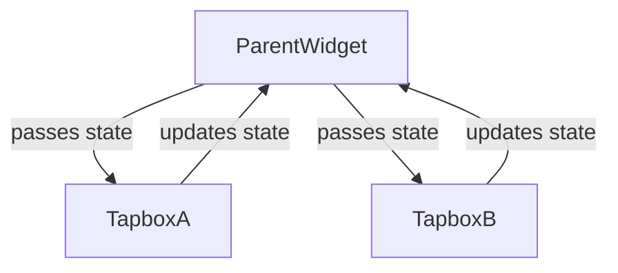

## 4.4.4 Simple State Management Techniques

In the journey of developing a Flutter app, managing state efficiently is crucial for creating responsive and dynamic user interfaces. In this section, we will explore some of the basic state management techniques available in Flutter, focusing on `setState`, state lifting, and `InheritedWidget`. These techniques are foundational and will prepare you for more advanced state management solutions covered in later chapters.

### Understanding State in Flutter

Before diving into specific techniques, it's essential to understand what "state" means in the context of Flutter. State refers to the information that can change over time and affect how a widget appears or behaves. In Flutter, there are two types of state:

1. **Ephemeral State**: This is the state that you can manage within a single widget, such as a checkbox's checked state.
2. **App State**: This is the state that affects multiple parts of the app and needs to be shared across different widgets, like user authentication status.

### Using `setState`

The simplest way to manage state in Flutter is by using the `setState` method. This method is used within StatefulWidgets to update the widget's state and rebuild the widget tree.

#### How `setState` Works

When you call `setState`, Flutter marks the widget as dirty, meaning it needs to be rebuilt. During the next frame, Flutter rebuilds the widget tree, and the UI reflects the updated state.

Here's a basic example of using `setState`:

```dart
import 'package:flutter/material.dart';

class CounterApp extends StatefulWidget {
  @override
  _CounterAppState createState() => _CounterAppState();
}

class _CounterAppState extends State<CounterApp> {
  int _counter = 0;

  void _incrementCounter() {
    setState(() {
      _counter++;
    });
  }

  @override
  Widget build(BuildContext context) {
    return Scaffold(
      appBar: AppBar(
        title: Text('Counter App'),
      ),
      body: Center(
        child: Column(
          mainAxisAlignment: MainAxisAlignment.center,
          children: <Widget>[
            Text(
              'You have pushed the button this many times:',
            ),
            Text(
              '$_counter',
              style: Theme.of(context).textTheme.headline4,
            ),
          ],
        ),
      ),
      floatingActionButton: FloatingActionButton(
        onPressed: _incrementCounter,
        tooltip: 'Increment',
        child: Icon(Icons.add),
      ),
    );
  }
}
```

In this example, the `_incrementCounter` method calls `setState`, which updates the `_counter` variable and triggers a rebuild of the widget tree, displaying the new counter value.

#### Limitations of `setState`

While `setState` is straightforward and effective for managing local state, it has limitations:

- **Scalability**: As your app grows, managing state with `setState` can become cumbersome, especially when state needs to be shared across multiple widgets.
- **Code Organization**: Using `setState` extensively can lead to tightly coupled code, making it harder to maintain and test.

### State Lifting

State lifting is a technique used when multiple widgets need to share the same state. The idea is to lift the state up to the nearest common ancestor widget, which can then pass the state down to its children.

#### Implementing State Lifting

Consider a scenario where two sibling widgets need to share the same state. You can lift the state up to their parent widget and pass it down as needed.

```dart
import 'package:flutter/material.dart';

class ParentWidget extends StatefulWidget {
  @override
  _ParentWidgetState createState() => _ParentWidgetState();
}

class _ParentWidgetState extends State<ParentWidget> {
  bool _isActive = false;

  void _handleTapboxChanged(bool newValue) {
    setState(() {
      _isActive = newValue;
    });
  }

  @override
  Widget build(BuildContext context) {
    return Container(
      child: Column(
        children: <Widget>[
          TapboxA(
            active: _isActive,
            onChanged: _handleTapboxChanged,
          ),
          TapboxB(
            active: _isActive,
            onChanged: _handleTapboxChanged,
          ),
        ],
      ),
    );
  }
}

class TapboxA extends StatelessWidget {
  final bool active;
  final ValueChanged<bool> onChanged;

  TapboxA({required this.active, required this.onChanged});

  void _handleTap() {
    onChanged(!active);
  }

  @override
  Widget build(BuildContext context) {
    return GestureDetector(
      onTap: _handleTap,
      child: Container(
        child: Center(
          child: Text(
            active ? 'Active' : 'Inactive',
            style: TextStyle(fontSize: 32.0, color: Colors.white),
          ),
        ),
        width: 200.0,
        height: 200.0,
        decoration: BoxDecoration(
          color: active ? Colors.lightGreen[700] : Colors.grey[600],
        ),
      ),
    );
  }
}

class TapboxB extends StatelessWidget {
  final bool active;
  final ValueChanged<bool> onChanged;

  TapboxB({required this.active, required this.onChanged});

  void _handleTap() {
    onChanged(!active);
  }

  @override
  Widget build(BuildContext context) {
    return GestureDetector(
      onTap: _handleTap,
      child: Container(
        child: Center(
          child: Text(
            active ? 'Active' : 'Inactive',
            style: TextStyle(fontSize: 32.0, color: Colors.white),
          ),
        ),
        width: 200.0,
        height: 200.0,
        decoration: BoxDecoration(
          color: active ? Colors.lightBlue[700] : Colors.grey[600],
        ),
      ),
    );
  }
}
```

In this example, `ParentWidget` manages the `_isActive` state and passes it down to both `TapboxA` and `TapboxB`. Each tap box can toggle the active state, and the change is reflected in both widgets.

#### Benefits and Challenges of State Lifting

- **Benefits**: State lifting helps in keeping the state centralized and reduces redundancy.
- **Challenges**: As the widget tree grows, lifting state can become complex, and it may not be the most efficient way to manage state across deeply nested widgets.

### Using `InheritedWidget`

`InheritedWidget` is a powerful feature in Flutter that allows you to share state efficiently down the widget tree without the need to pass it explicitly through constructors.

#### How `InheritedWidget` Works

An `InheritedWidget` is a special type of widget that can be accessed by its descendants. When the state within an `InheritedWidget` changes, it notifies all the widgets that depend on it, causing them to rebuild.

Here's a basic example of using `InheritedWidget`:

```dart
import 'package:flutter/material.dart';

class MyInheritedWidget extends InheritedWidget {
  final int data;

  MyInheritedWidget({required this.data, required Widget child})
      : super(child: child);

  @override
  bool updateShouldNotify(MyInheritedWidget oldWidget) {
    return data != oldWidget.data;
  }

  static MyInheritedWidget? of(BuildContext context) {
    return context.dependOnInheritedWidgetOfExactType<MyInheritedWidget>();
  }
}

class MyApp extends StatelessWidget {
  @override
  Widget build(BuildContext context) {
    return MyInheritedWidget(
      data: 42,
      child: MaterialApp(
        home: Scaffold(
          appBar: AppBar(
            title: Text('InheritedWidget Example'),
          ),
          body: Center(
            child: MyChildWidget(),
          ),
        ),
      ),
    );
  }
}

class MyChildWidget extends StatelessWidget {
  @override
  Widget build(BuildContext context) {
    final int data = MyInheritedWidget.of(context)!.data;
    return Text('Data from InheritedWidget: $data');
  }
}
```

In this example, `MyInheritedWidget` holds an integer `data`, which is accessed by `MyChildWidget` using the `of` method. This allows `MyChildWidget` to react to changes in the `data` without needing to pass it explicitly through constructors.

#### Limitations of `InheritedWidget`

While `InheritedWidget` is useful for sharing state across the widget tree, it has some limitations:

- **Complexity**: Implementing `InheritedWidget` can be complex for beginners, and it requires a good understanding of Flutter's widget lifecycle.
- **Performance**: If not used carefully, `InheritedWidget` can lead to unnecessary rebuilds, affecting app performance.

### Visualizing State Flow

To better understand how state flows between widgets, let's visualize the state flow using a diagram.



In this diagram, `ParentWidget` manages the state and passes it down to `TapboxA` and `TapboxB`. Both tap boxes can update the state, which is then reflected back in the parent widget.

### Preparing for Advanced State Management

As you continue to develop more complex Flutter apps, you will encounter scenarios where these basic techniques may not suffice. For instance, managing global state, handling asynchronous data, and optimizing performance can become challenging with `setState`, state lifting, and `InheritedWidget`.

In future chapters, we will explore more advanced state management solutions such as Provider, Bloc, and Riverpod, which offer more robust and scalable ways to manage state in Flutter apps.

### Conclusion

In this section, we've covered the basics of state management in Flutter using `setState`, state lifting, and `InheritedWidget`. These techniques provide a solid foundation for managing state in simple Flutter apps. However, as your app grows, you'll need to adopt more advanced state management solutions to handle complex state interactions efficiently.

By understanding the limitations of these basic techniques, you are now better prepared to explore and adopt more sophisticated state management patterns that will enhance your app's performance and maintainability.

## Quiz Time!



### What is the primary purpose of `setState` in Flutter?

- [x] To update the state of a widget and trigger a rebuild
- [ ] To manage global state across the app
- [ ] To handle asynchronous operations
- [ ] To create new widgets dynamically

> **Explanation:** `setState` is used to update the local state of a widget and trigger a rebuild of the widget tree to reflect changes in the UI.

### Which of the following is a limitation of using `setState`?

- [x] Scalability issues in large apps
- [ ] Inability to update UI
- [ ] Lack of support for asynchronous operations
- [ ] Incompatibility with StatelessWidgets

> **Explanation:** `setState` can become cumbersome in large apps where state needs to be shared across multiple widgets, leading to scalability issues.

### What is state lifting in Flutter?

- [x] Moving state up to a common ancestor widget
- [ ] Sharing state using global variables
- [ ] Using `InheritedWidget` to pass state
- [ ] Managing state with external libraries

> **Explanation:** State lifting involves moving the state up to a common ancestor widget so that it can be shared among multiple child widgets.

### How does `InheritedWidget` help in state management?

- [x] It allows sharing state down the widget tree without explicit passing
- [ ] It provides a global state management solution
- [ ] It handles asynchronous data fetching
- [ ] It automatically optimizes performance

> **Explanation:** `InheritedWidget` allows state to be shared efficiently down the widget tree, making it accessible to descendant widgets without explicit passing.

### What method is used to access data from an `InheritedWidget`?

- [x] `dependOnInheritedWidgetOfExactType`
- [ ] `setState`
- [ ] `liftState`
- [ ] `notifyListeners`

> **Explanation:** The method `dependOnInheritedWidgetOfExactType` is used to access data from an `InheritedWidget` in the widget tree.

### Which of the following is a benefit of state lifting?

- [x] Centralized state management
- [ ] Reduced code complexity
- [ ] Automatic UI updates
- [ ] Improved performance

> **Explanation:** State lifting centralizes state management by moving state to a common ancestor, making it easier to manage and share among child widgets.

### What is a potential drawback of using `InheritedWidget`?

- [x] Complexity in implementation
- [ ] Inability to share state
- [ ] Lack of support for local state
- [ ] Inefficient memory usage

> **Explanation:** Implementing `InheritedWidget` can be complex for beginners, and it requires a good understanding of Flutter's widget lifecycle.

### Which technique is best for managing local state within a single widget?

- [x] `setState`
- [ ] `InheritedWidget`
- [ ] State lifting
- [ ] Provider

> **Explanation:** `setState` is best suited for managing local state within a single widget, as it directly updates the widget's state and triggers a rebuild.

### What is the role of the `updateShouldNotify` method in `InheritedWidget`?

- [x] To determine if dependent widgets should be rebuilt
- [ ] To update the state of the widget
- [ ] To notify listeners of state changes
- [ ] To handle asynchronous operations

> **Explanation:** The `updateShouldNotify` method determines if dependent widgets should be rebuilt when the state within an `InheritedWidget` changes.

### True or False: `InheritedWidget` can be used to manage global state across an entire Flutter app.

- [x] True
- [ ] False

> **Explanation:** `InheritedWidget` can be used to manage and share global state across an entire Flutter app by providing a way to access shared data throughout the widget tree.


