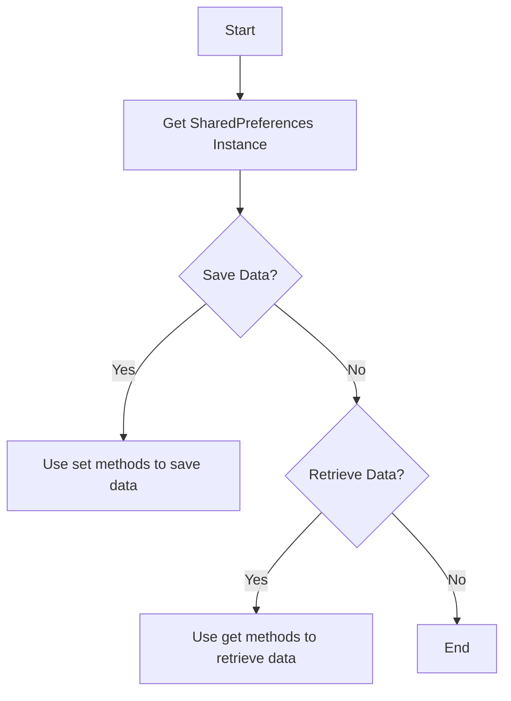

## 5.1.1 Using SharedPreferences

In the journey of developing a Flutter application, one of the essential aspects is managing user preferences and settings. This is where `SharedPreferences` comes into play. It provides a simple way to store and retrieve small pieces of data that need to persist between app launches. In this section, we'll delve into the details of using `SharedPreferences` in Flutter, covering everything from setup to practical use cases.

### Overview of SharedPreferences

`SharedPreferences` is a key-value storage system that allows you to store simple data types persistently on a user's device. It supports data types such as `int`, `double`, `bool`, `String`, and `List<String>`. This makes it ideal for storing user preferences, application settings, and other small pieces of data that need to be retained between app sessions.

#### Key Features:
- **Persistent Storage**: Data stored using `SharedPreferences` persists across app launches.
- **Simple API**: Provides a straightforward API for storing and retrieving data.
- **Asynchronous Operations**: Operations are asynchronous, ensuring they don't block the UI thread.

#### Use Cases:
- Storing user preferences like theme settings (light or dark mode).
- Saving user login states or authentication tokens.
- Retaining application settings such as language preferences or notification settings.

### Adding the Plugin to pubspec.yaml

To use `SharedPreferences` in your Flutter project, you need to add the `shared_preferences` package to your `pubspec.yaml` file. This package provides the necessary functionality to interact with the shared preferences storage.

```yaml
dependencies:
  flutter:
    sdk: flutter
  shared_preferences: ^2.0.13
```

> **Note**: Always check for the latest version of the `shared_preferences` package on [pub.dev](https://pub.dev/packages/shared_preferences) and update the version number accordingly.

After adding the dependency, run the following command to fetch the package:

```bash
flutter pub get
```

### Importing the Package

Once the package is added to your project, you can import it into your Dart files where you need to use shared preferences:

```dart
import 'package:shared_preferences/shared_preferences.dart';
```

### Storing Data

`SharedPreferences` provides several methods for storing data, each corresponding to a specific data type. These methods are asynchronous and return a `Future<bool>`, indicating whether the operation was successful.

#### Methods for Storing Data:

- `setInt(String key, int value)`: Stores an integer value.
- `setDouble(String key, double value)`: Stores a double value.
- `setBool(String key, bool value)`: Stores a boolean value.
- `setString(String key, String value)`: Stores a string value.
- `setStringList(String key, List<String> value)`: Stores a list of strings.

Here's an example of storing a user's theme preference:

```dart
Future<void> saveThemePreference(bool isDarkMode) async {
  final prefs = await SharedPreferences.getInstance();
  await prefs.setBool('isDarkMode', isDarkMode);
}
```

### Retrieving Data

Retrieving data from `SharedPreferences` is just as straightforward as storing it. You use the corresponding `get` methods to retrieve the data.

#### Methods for Retrieving Data:

- `getInt(String key)`: Retrieves an integer value.
- `getDouble(String key)`: Retrieves a double value.
- `getBool(String key)`: Retrieves a boolean value.
- `getString(String key)`: Retrieves a string value.
- `getStringList(String key)`: Retrieves a list of strings.

If the key does not exist, these methods return `null`. It's a good practice to handle these cases by providing default values.

Here's how you can retrieve the user's theme preference:

```dart
Future<bool> getThemePreference() async {
  final prefs = await SharedPreferences.getInstance();
  return prefs.getBool('isDarkMode') ?? false; // Return false if key doesn't exist
}
```

### Example Use Case: Managing Theme Preferences

Let's consider a practical example where you want to manage a user's theme preference (light or dark mode) in your Flutter app. This involves saving the user's choice and applying it when the app is launched.

#### Saving the Theme Preference

When the user selects a theme, you save their preference using `SharedPreferences`:

```dart
Future<void> saveThemePreference(bool isDarkMode) async {
  final prefs = await SharedPreferences.getInstance();
  await prefs.setBool('isDarkMode', isDarkMode);
}
```

#### Retrieving the Theme Preference

When the app is launched, you retrieve the saved preference and apply the theme accordingly:

```dart
Future<bool> getThemePreference() async {
  final prefs = await SharedPreferences.getInstance();
  return prefs.getBool('isDarkMode') ?? false; // Default to light mode if not set
}
```

#### Applying the Theme in the App

You can use the retrieved preference to set the theme when building your app's UI:

```dart
bool isDarkMode = await getThemePreference();
ThemeData theme = isDarkMode ? ThemeData.dark() : ThemeData.light();
```

### Limitations and Considerations

While `SharedPreferences` is a powerful tool for storing simple data, it's important to be aware of its limitations and considerations:

- **Not Suitable for Large Data**: `SharedPreferences` is not designed for storing large amounts of data or complex objects. For such use cases, consider using a database like SQLite or a cloud-based solution.
- **Plain Text Storage**: Data stored in `SharedPreferences` is stored in plain text. Avoid storing sensitive information such as passwords or personal data. For sensitive data, consider using secure storage solutions.
- **Asynchronous Operations**: Since `SharedPreferences` operations are asynchronous, ensure you handle them appropriately to avoid blocking the UI thread.

### Best Practices

- **Key Naming Conventions**: Use descriptive and consistent key names. This helps in managing and retrieving data efficiently.
- **Default Values**: Always provide default values when retrieving data to handle cases where the key might not exist.
- **Avoid Sensitive Data**: Do not store sensitive data in `SharedPreferences`. Use secure storage solutions for such data.

### Visual Aids

To better understand the process of saving and retrieving data with `SharedPreferences`, refer to the following flowchart:



### Conclusion

`SharedPreferences` is an essential tool in Flutter for managing user preferences and small pieces of persistent data. By understanding how to effectively use this plugin, you can enhance your app's user experience by retaining settings and preferences across sessions. Remember to consider its limitations and follow best practices to ensure your app remains efficient and secure.

## Quiz Time!



### What is the primary use of `SharedPreferences` in Flutter?

- [x] To store simple key-value pairs persistently on a user's device.
- [ ] To store large amounts of data like images and videos.
- [ ] To handle real-time data synchronization.
- [ ] To manage complex relational databases.

> **Explanation:** `SharedPreferences` is used for storing simple data types persistently, such as user preferences and settings.

### Which data types can `SharedPreferences` store?

- [x] int
- [x] double
- [x] bool
- [x] String
- [x] List<String>

> **Explanation:** `SharedPreferences` supports storing `int`, `double`, `bool`, `String`, and `List<String>` data types.

### How do you add the `shared_preferences` package to your Flutter project?

- [x] By adding it to the `dependencies` section of the `pubspec.yaml` file.
- [ ] By installing it via the Android SDK Manager.
- [ ] By downloading it from the Flutter website.
- [ ] By adding it to the `assets` section of the `pubspec.yaml` file.

> **Explanation:** You add the `shared_preferences` package by including it in the `dependencies` section of your `pubspec.yaml` file.

### What is the return type of the `setBool` method in `SharedPreferences`?

- [x] Future<bool>
- [ ] bool
- [ ] void
- [ ] Future<void>

> **Explanation:** The `setBool` method returns a `Future<bool>`, indicating whether the operation was successful.

### What does the `getBool` method return if the key does not exist?

- [x] null
- [ ] false
- [ ] true
- [ ] An empty string

> **Explanation:** If the key does not exist, the `getBool` method returns `null`.

### Which of the following is a limitation of `SharedPreferences`?

- [x] It is not suitable for storing large amounts of data.
- [ ] It cannot store boolean values.
- [ ] It requires an internet connection to function.
- [ ] It is only available on Android devices.

> **Explanation:** `SharedPreferences` is not suitable for storing large amounts of data or complex objects.

### What should you avoid storing in `SharedPreferences`?

- [x] Sensitive information like passwords.
- [ ] User preferences like theme settings.
- [ ] Application settings like language preferences.
- [ ] Simple configuration flags.

> **Explanation:** Sensitive information should not be stored in `SharedPreferences` as it is stored in plain text.

### How can you ensure a default value is used if a key does not exist in `SharedPreferences`?

- [x] By using the null-coalescing operator (`??`) to provide a default value.
- [ ] By using a try-catch block.
- [ ] By checking the key's existence with a separate method.
- [ ] By initializing all keys at app startup.

> **Explanation:** You can use the null-coalescing operator (`??`) to provide a default value if a key does not exist.

### What is the recommended way to handle `SharedPreferences` operations in Flutter?

- [x] Asynchronously, using `await` to prevent blocking the UI thread.
- [ ] Synchronously, to ensure immediate data retrieval.
- [ ] Using background services.
- [ ] Through a separate database management system.

> **Explanation:** `SharedPreferences` operations should be handled asynchronously using `await` to prevent blocking the UI thread.

### True or False: `SharedPreferences` can be used to store complex objects like custom classes.

- [ ] True
- [x] False

> **Explanation:** `SharedPreferences` is not designed to store complex objects like custom classes; it is intended for simple data types.


