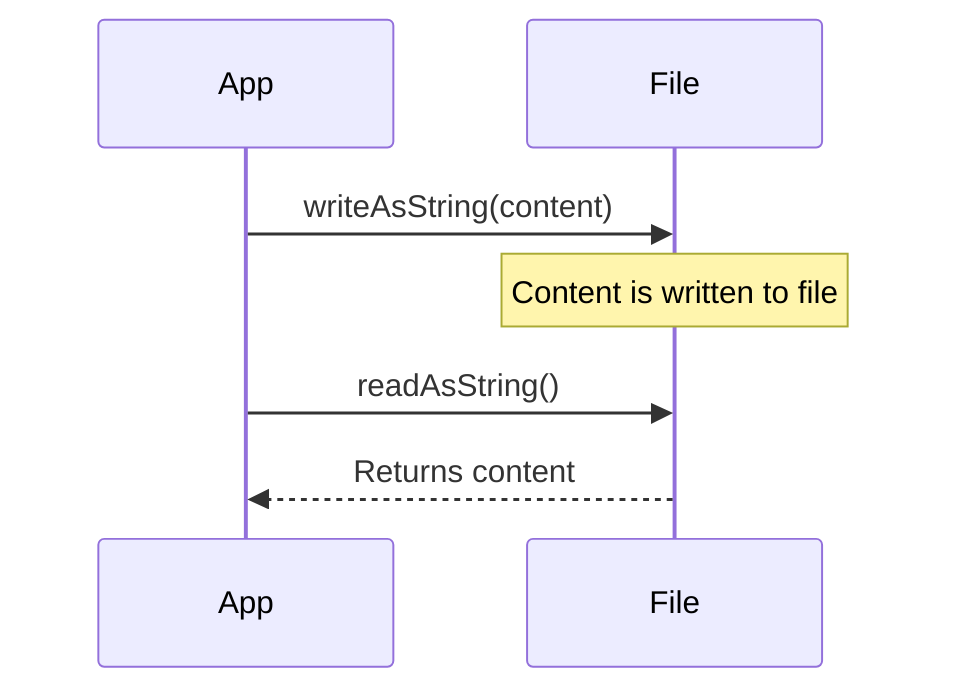

## 5.1.2 Reading and Writing Files

In the world of mobile app development, managing data efficiently is crucial. Whether you're storing user preferences, saving game states, or handling complex data structures, understanding how to read and write files in your Flutter application is essential. This section will guide you through the process of performing file operations using the `dart:io` library and the `path_provider` plugin, enabling you to handle data storage effectively.

### Introduction to File Operations

File operations are fundamental when dealing with larger amounts of data or complex data structures that cannot be efficiently managed through simple in-memory storage. In Flutter, you have the option to work with two types of storage:

- **Temporary Storage**: Used for storing data that doesn't need to persist between app sessions. This is ideal for cache files or temporary data.
- **Persistent Storage**: Used for data that needs to be retained across app launches, such as user preferences, saved documents, or application settings.

Understanding the difference between these storage types is crucial for making informed decisions about where and how to store your data.

### Adding the path_provider Plugin

To interact with the file system in a Flutter application, you'll need to use the `path_provider` plugin. This plugin provides a platform-agnostic way to access commonly used locations on the filesystem, such as the app's documents directory.

#### Adding path_provider to pubspec.yaml

To start using the `path_provider` plugin, add it to your project's `pubspec.yaml` file:

```yaml
dependencies:
  flutter:
    sdk: flutter
  path_provider: ^2.0.9
```

After adding the dependency, run the following command to install it:

```bash
flutter pub get
```

### Importing Necessary Libraries

Once the `path_provider` plugin is added, you need to import the necessary libraries in your Dart file:

```dart
import 'dart:io';
import 'package:path_provider/path_provider.dart';
```

These imports provide you with the tools needed to perform file operations and access the device's file system.

### Getting the File Path

Before you can read from or write to a file, you need to determine where the file will be stored. The `path_provider` plugin offers a convenient method to get the application's documents directory, which is a safe location for storing persistent data.

#### Using getApplicationDocumentsDirectory()

The `getApplicationDocumentsDirectory()` function returns the path to a directory where you can store application-specific data that should persist across app launches.

```dart
Future<String> get _localPath async {
  final directory = await getApplicationDocumentsDirectory();
  return directory.path;
}
```

This function is asynchronous and returns a `Future<String>`, which contains the path to the documents directory.

### Writing Data to a File

Writing data to a file involves creating a `File` object and using methods like `writeAsString` or `writeAsBytes` to save the data. It's essential to handle potential errors using try-catch blocks to prevent app crashes.

#### Creating a File and Writing Data

Here's how you can create a file and write data to it:

```dart
Future<File> get _localFile async {
  final path = await _localPath;
  return File('$path/notes.txt');
}

Future<File> writeContent(String content) async {
  final file = await _localFile;
  try {
    return file.writeAsString(content);
  } catch (e) {
    // Handle any errors
    print('Error writing to file: $e');
    return file;
  }
}
```

In this example, the `writeContent` function writes a string to a file named `notes.txt`. The `try-catch` block ensures that any errors encountered during the write operation are handled gracefully.

### Reading Data from a File

Reading data from a file is just as straightforward. You use methods like `readAsString` or `readAsBytes` to retrieve the data. Again, handling exceptions is crucial, especially when the file might not exist.

#### Reading Data from a File

Here's how you can read data from a file:

```dart
Future<String> readContent() async {
  try {
    final file = await _localFile;
    return await file.readAsString();
  } catch (e) {
    // If encountering an error, return an empty string
    print('Error reading from file: $e');
    return '';
  }
}
```

This function attempts to read the contents of `notes.txt`. If the file doesn't exist or another error occurs, it returns an empty string.

### Example Use Case: Saving User-Generated Content

Let's consider a practical example where you might want to save user-generated content, such as notes or preferences in JSON format. This example demonstrates how to serialize data to JSON, write it to a file, and read it back.

#### Writing JSON Data to a File

```dart
import 'dart:convert';

Future<File> writeJson(Map<String, dynamic> jsonData) async {
  final file = await _localFile;
  try {
    String jsonString = jsonEncode(jsonData);
    return file.writeAsString(jsonString);
  } catch (e) {
    print('Error writing JSON to file: $e');
    return file;
  }
}
```

#### Reading JSON Data from a File

```dart
Future<Map<String, dynamic>> readJson() async {
  try {
    final file = await _localFile;
    String jsonString = await file.readAsString();
    return jsonDecode(jsonString);
  } catch (e) {
    print('Error reading JSON from file: $e');
    return {};
  }
}
```

In this example, `writeJson` serializes a Dart map to a JSON string and writes it to a file, while `readJson` reads the JSON string from the file and deserializes it back to a Dart map.

### Permissions and Platform Considerations

When working with file storage on mobile devices, it's important to consider platform-specific permissions and best practices:

- **Android and iOS**: Accessing app-specific directories (like the documents directory) does not require additional permissions. This makes it a safe choice for storing sensitive data.
- **Public Directories**: Be cautious when storing data in public directories, as this may expose sensitive information to other apps or users.

### Visual Aids: Sequence Diagram

To better understand the flow of writing and reading files, consider the following sequence diagram:



This diagram illustrates the interaction between the app and the file system during write and read operations.

### Writing Tips

- **Break Down Steps**: Approach file operations step-by-step to avoid confusion.
- **Handle Exceptions**: Always use try-catch blocks to handle potential errors gracefully.
- **Test on Multiple Platforms**: Ensure your file operations work seamlessly on both Android and iOS devices or emulators.
- **Consider User Privacy**: Be mindful of user privacy and data security when storing sensitive information.

By following these guidelines and examples, you'll be well-equipped to manage file operations in your Flutter applications, ensuring efficient and secure data storage.

## Quiz Time!



### What is the primary use of the `path_provider` plugin in Flutter?

- [x] To access commonly used locations on the filesystem.
- [ ] To perform network operations.
- [ ] To manage in-memory data storage.
- [ ] To handle user authentication.

> **Explanation:** The `path_provider` plugin provides a platform-agnostic way to access commonly used locations on the filesystem, such as the app's documents directory.

### Which method is used to get the application's documents directory?

- [x] getApplicationDocumentsDirectory()
- [ ] getTemporaryDirectory()
- [ ] getExternalStorageDirectory()
- [ ] getAppDirectory()

> **Explanation:** The `getApplicationDocumentsDirectory()` method returns the path to a directory where you can store application-specific data that should persist across app launches.

### What is the purpose of using try-catch blocks in file operations?

- [x] To handle potential errors and prevent app crashes.
- [ ] To improve the performance of file operations.
- [ ] To encrypt the data being written to the file.
- [ ] To automatically back up the data to the cloud.

> **Explanation:** Try-catch blocks are used to handle potential errors during file operations, ensuring that the app doesn't crash if an error occurs.

### What does the `writeAsString` method do?

- [x] Writes a string to a file.
- [ ] Reads a string from a file.
- [ ] Deletes a file.
- [ ] Encrypts a file.

> **Explanation:** The `writeAsString` method writes a string to a file, allowing you to store text data.

### What should you do if a file doesn't exist when trying to read from it?

- [x] Handle the exception and return a default value.
- [ ] Create a new file automatically.
- [ ] Terminate the app.
- [ ] Ignore the error and proceed.

> **Explanation:** If a file doesn't exist, you should handle the exception and return a default value to prevent the app from crashing.

### What type of data is ideal for temporary storage?

- [x] Cache files or temporary data.
- [ ] User preferences.
- [ ] Saved documents.
- [ ] Application settings.

> **Explanation:** Temporary storage is ideal for cache files or temporary data that doesn't need to persist between app sessions.

### Which method is used to read a string from a file?

- [x] readAsString()
- [ ] writeAsString()
- [ ] readAsBytes()
- [ ] writeAsBytes()

> **Explanation:** The `readAsString()` method is used to read a string from a file, allowing you to retrieve text data.

### Why is it important to test file operations on both Android and iOS devices?

- [x] To ensure compatibility and functionality across platforms.
- [ ] To increase the speed of file operations.
- [ ] To reduce the size of the app.
- [ ] To automatically translate the app's content.

> **Explanation:** Testing file operations on both Android and iOS devices ensures that your app functions correctly and consistently across platforms.

### What is a potential risk of storing data in public directories?

- [x] Exposure of sensitive information to other apps or users.
- [ ] Slower file read and write operations.
- [ ] Increased app size.
- [ ] Automatic data encryption.

> **Explanation:** Storing data in public directories can expose sensitive information to other apps or users, posing a security risk.

### True or False: Accessing app-specific directories on Android and iOS requires additional permissions.

- [x] False
- [ ] True

> **Explanation:** Accessing app-specific directories on Android and iOS does not require additional permissions, making it a safe choice for storing sensitive data.


