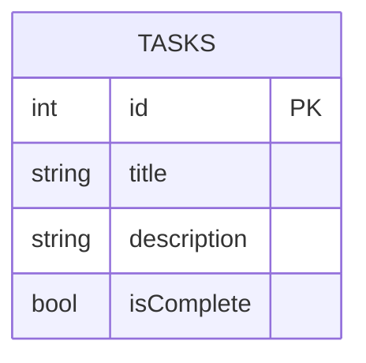
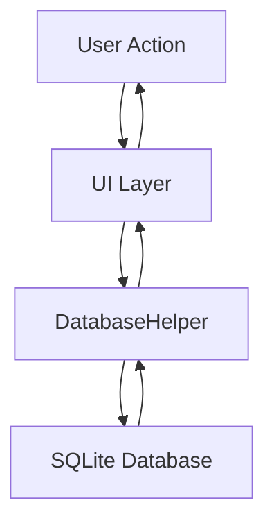

## 5.1.3 Data Persistence with SQLite

In the world of mobile application development, data persistence is a crucial aspect that ensures your app can store and retrieve data efficiently. For Flutter developers, SQLite is a popular choice for managing structured data locally. In this section, we will delve into how you can leverage SQLite in your Flutter applications using the `sqflite` plugin. We will cover everything from setting up your database to performing CRUD (Create, Read, Update, Delete) operations, all while adhering to best practices.

### Understanding SQLite and the sqflite Plugin

SQLite is a self-contained, high-reliability, embedded SQL database engine. It is a popular choice for local storage in mobile applications due to its lightweight nature and ease of use. SQLite databases are stored as files on the device, making them a perfect fit for mobile apps that require offline capabilities.

The `sqflite` plugin is the go-to solution for integrating SQLite into Flutter applications. It provides a robust API for interacting with SQLite databases, allowing developers to perform complex queries and manage data efficiently.

### Adding sqflite and path Packages

To get started with SQLite in your Flutter app, you need to add the `sqflite` and `path` packages to your `pubspec.yaml` file. The `path` package helps in constructing file paths, which is essential for locating the database file on the device.

```yaml
dependencies:
  flutter:
    sdk: flutter
  sqflite: ^2.0.2+1
  path: ^1.8.1
```

### Importing Packages

After adding the necessary dependencies, import the packages in your Dart files where you plan to use SQLite.

```dart
import 'package:sqflite/sqflite.dart';
import 'package:path/path.dart';
```

### Initializing the Database

Initializing the database involves setting up the database file path and opening the database. The `path` package is used to construct the file path, and the `sqflite` package provides the `openDatabase` function to open or create the database.

```dart
class DatabaseHelper {
  static final DatabaseHelper instance = DatabaseHelper._privateConstructor();
  static Database? _database;

  DatabaseHelper._privateConstructor();

  Future<Database> get database async {
    if (_database != null) return _database!;
    _database = await _initDatabase();
    return _database!;
  }

  Future<Database> _initDatabase() async {
    final documentsDirectory = await getApplicationDocumentsDirectory();
    final path = join(documentsDirectory.path, 'app_database.db');
    return await openDatabase(
      path,
      version: 1,
      onCreate: _onCreate,
    );
  }

  Future _onCreate(Database db, int version) async {
    await db.execute('''
      CREATE TABLE tasks (
        id INTEGER PRIMARY KEY AUTOINCREMENT,
        title TEXT NOT NULL,
        description TEXT,
        isComplete INTEGER NOT NULL
      )
    ''');
  }
}
```

### Defining Data Models

In Flutter, it's a good practice to use model classes to represent your data. This approach not only makes your code cleaner but also helps in converting between model objects and database maps.

```dart
class Task {
  final int? id;
  final String title;
  final String? description;
  final bool isComplete;

  Task({this.id, required this.title, this.description, this.isComplete = false});

  Map<String, dynamic> toMap() {
    return {
      'id': id,
      'title': title,
      'description': description,
      'isComplete': isComplete ? 1 : 0,
    };
  }

  factory Task.fromMap(Map<String, dynamic> map) {
    return Task(
      id: map['id'],
      title: map['title'],
      description: map['description'],
      isComplete: map['isComplete'] == 1,
    );
  }
}
```

### Performing CRUD Operations

CRUD operations are the backbone of any database interaction. Let's explore how to implement these operations using the `sqflite` plugin.

#### Create: Inserting Records

To insert a new record into the database, use the `insert` method provided by `sqflite`.

```dart
Future<int> insertTask(Task task) async {
  Database db = await instance.database;
  return await db.insert('tasks', task.toMap());
}
```

#### Read: Querying Data

To retrieve data from the database, use the `query` method. You can specify the table name and any conditions for filtering the results.

```dart
Future<List<Task>> getTasks() async {
  Database db = await instance.database;
  final List<Map<String, dynamic>> maps = await db.query('tasks');

  return List.generate(maps.length, (i) {
    return Task.fromMap(maps[i]);
  });
}
```

#### Update: Modifying Records

Updating existing records is done using the `update` method. You need to specify the table name, the updated data, and the condition for selecting the record to update.

```dart
Future<int> updateTask(Task task) async {
  Database db = await instance.database;
  return await db.update(
    'tasks',
    task.toMap(),
    where: 'id = ?',
    whereArgs: [task.id],
  );
}
```

#### Delete: Removing Records

To delete records, use the `delete` method. Similar to updating, you specify the table name and the condition for selecting the record to delete.

```dart
Future<int> deleteTask(int id) async {
  Database db = await instance.database;
  return await db.delete(
    'tasks',
    where: 'id = ?',
    whereArgs: [id],
  );
}
```

### Example Use Case: A Simple To-Do List App

To illustrate the use of SQLite in a real-world scenario, let's consider a simple to-do list app. This app will allow users to add, view, update, and delete tasks. Each task will have a title, an optional description, and a completion status.

#### Setting Up the UI

The UI will consist of a list view to display tasks and a form to add or edit tasks. You can use Flutter widgets such as `ListView`, `TextFormField`, and `ElevatedButton` to build the interface.

#### Integrating the Database

Use the `DatabaseHelper` class to manage database interactions. Call the appropriate CRUD methods when users perform actions like adding or deleting tasks.

### Best Practices

When working with SQLite in Flutter, consider the following best practices:

- **Indexing**: Create indexes on columns that are frequently used in queries to improve performance.
- **Database Versions**: Manage database versions carefully. Use the `onUpgrade` callback in `openDatabase` to handle schema changes.
- **Closing Connections**: Always close database connections when they are no longer needed to free up resources.

### Visual Aids

#### Entity-Relationship Diagram

Below is an ER diagram for the `tasks` table, illustrating the structure of the data.



#### Data Flow Diagram

The following flowchart shows how data flows from the app UI to the database and back.



### Writing Tips

- Break down complex concepts into easy-to-understand segments.
- Use clear and consistent naming conventions in code examples.
- Encourage readers to adhere to best practices such as closing database connections when appropriate.
- Suggest experimenting with database queries using the SQLite command-line tool or a database browser.

### Conclusion

SQLite, combined with the `sqflite` plugin, provides a powerful solution for data persistence in Flutter applications. By following the guidelines and examples provided in this section, you can effectively manage structured data in your apps, ensuring a seamless user experience even when offline.

## Quiz Time!



### What is SQLite?

- [x] A self-contained, high-reliability, embedded SQL database engine.
- [ ] A cloud-based database service.
- [ ] A NoSQL database.
- [ ] A programming language.

> **Explanation:** SQLite is a self-contained, high-reliability, embedded SQL database engine commonly used for local storage in mobile applications.

### What is the purpose of the `sqflite` plugin in Flutter?

- [x] To interface with SQLite databases.
- [ ] To provide cloud storage solutions.
- [ ] To manage user authentication.
- [ ] To handle network requests.

> **Explanation:** The `sqflite` plugin is used to interface with SQLite databases in Flutter applications, allowing for local data storage and retrieval.

### Which package is used to construct file paths for SQLite databases in Flutter?

- [x] path
- [ ] url_launcher
- [ ] http
- [ ] dio

> **Explanation:** The `path` package is used to construct file paths, which is essential for locating the SQLite database file on the device.

### How do you initialize a database in Flutter using `sqflite`?

- [x] By using the `openDatabase` function.
- [ ] By using the `createDatabase` function.
- [ ] By using the `initDatabase` function.
- [ ] By using the `setupDatabase` function.

> **Explanation:** The `openDatabase` function is used to open or create a database in Flutter using the `sqflite` plugin.

### What is the purpose of a model class in Flutter?

- [x] To represent data and convert between model objects and database maps.
- [ ] To manage user interface elements.
- [x] To encapsulate business logic.
- [ ] To handle network requests.

> **Explanation:** Model classes represent data and facilitate conversion between model objects and database maps, making code cleaner and more manageable.

### Which method is used to insert a record into an SQLite database in Flutter?

- [x] insert
- [ ] add
- [ ] create
- [ ] put

> **Explanation:** The `insert` method is used to add a new record to an SQLite database in Flutter using the `sqflite` plugin.

### How do you update a record in an SQLite database in Flutter?

- [x] By using the `update` method.
- [ ] By using the `modify` method.
- [x] By using the `change` method.
- [ ] By using the `edit` method.

> **Explanation:** The `update` method is used to modify existing records in an SQLite database in Flutter.

### What is the purpose of indexing in SQLite?

- [x] To improve query performance.
- [ ] To secure the database.
- [ ] To manage database versions.
- [ ] To backup data.

> **Explanation:** Indexing is used to improve query performance by creating indexes on columns frequently used in queries.

### How should database versions be managed in Flutter?

- [x] By using the `onUpgrade` callback in `openDatabase`.
- [ ] By manually deleting the database file.
- [ ] By using the `versionControl` package.
- [ ] By creating a new database for each version.

> **Explanation:** Database versions should be managed using the `onUpgrade` callback in `openDatabase` to handle schema changes.

### True or False: It is important to close database connections when they are no longer needed.

- [x] True
- [ ] False

> **Explanation:** Closing database connections when they are no longer needed is important to free up resources and prevent potential memory leaks.


