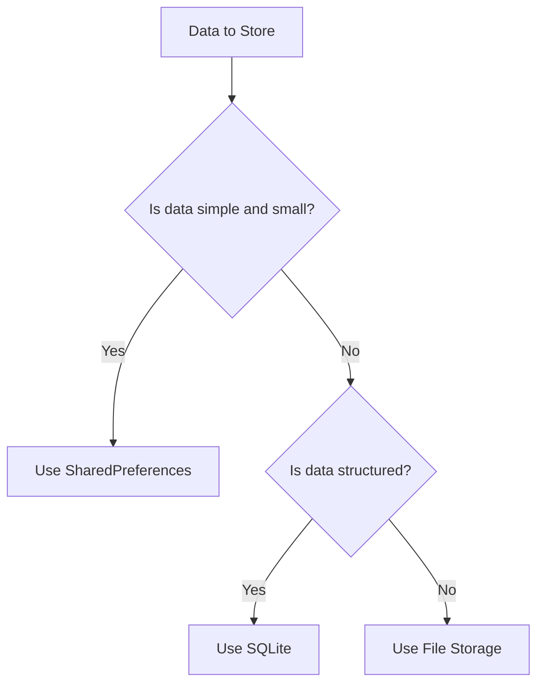

## 5.1.4 Choosing the Right Storage Solution

Choosing the right storage solution for your Flutter app is a critical decision that can significantly impact the app's performance, security, and user experience. This section will guide you through the process of selecting the most suitable local storage method based on your app's specific needs. We'll cover various criteria for selection, compare popular storage options, and provide practical examples and best practices.

### Criteria for Selection

When deciding on a storage solution, consider the following criteria:

#### Data Complexity

- **Simple Key-Value Pairs**: If your app needs to store simple data like user preferences or settings, a key-value storage solution may suffice.
- **Structured Data**: For more complex data structures, such as relational data, a more sophisticated storage solution is required.

#### Data Size

- **Small Preferences**: For small amounts of data, lightweight solutions are preferable.
- **Large Datasets**: Larger datasets require more robust storage solutions that can efficiently handle data retrieval and manipulation.

#### Performance Requirements

- **Read/Write Speed**: Consider how quickly your app needs to access and update data. Some storage solutions offer faster read/write speeds than others.

#### Security Needs

- **Data Sensitivity**: If your app handles sensitive data, you need a storage solution that offers adequate security measures to protect user information.

#### Persistence Duration

- **Temporary Storage**: For data that doesn't need to persist between sessions, temporary storage solutions are adequate.
- **Long-Term Storage**: For data that must persist across app launches, choose a solution that ensures data durability.

### Comparing Storage Options

Let's explore some popular storage options available in Flutter and their use cases.

#### SharedPreferences

SharedPreferences is a simple key-value storage solution that is ideal for storing small amounts of simple data.

- **Best for**: Small, simple data such as user settings and preferences.
- **Advantages**: Quick and easy to use, minimal setup required.
- **Limitations**: Not secure for sensitive data, limited to simple data types.

**Example Usage**:

```dart
import 'package:shared_preferences/shared_preferences.dart';

Future<void> saveUserPreference(String key, String value) async {
  final prefs = await SharedPreferences.getInstance();
  await prefs.setString(key, value);
}

Future<String?> getUserPreference(String key) async {
  final prefs = await SharedPreferences.getInstance();
  return prefs.getString(key);
}
```

#### File Storage

File storage is suitable for larger or more complex data structures and user-generated content.

- **Best for**: Storing user-generated files like images, documents, or logs.
- **Advantages**: Offers more control over data format and structure, suitable for larger data.
- **Limitations**: Requires manual management of file paths and formats.

**Example Usage**:

```dart
import 'dart:io';
import 'path_provider/path_provider.dart';

Future<File> _getLocalFile(String filename) async {
  final directory = await getApplicationDocumentsDirectory();
  return File('${directory.path}/$filename');
}

Future<void> writeToFile(String filename, String content) async {
  final file = await _getLocalFile(filename);
  await file.writeAsString(content);
}

Future<String> readFromFile(String filename) async {
  try {
    final file = await _getLocalFile(filename);
    return await file.readAsString();
  } catch (e) {
    return 'Error reading file: $e';
  }
}
```

#### SQLite (sqflite)

SQLite is a powerful relational database solution that supports complex queries and transactions.

- **Best for**: Complex relational data such as contacts, inventory, or other structured data.
- **Advantages**: Supports queries, sorting, and transactions, robust and reliable.
- **Limitations**: Requires more setup and understanding of SQL.

**Example Usage**:

```dart
import 'package:sqflite/sqflite.dart';
import 'path_provider/path_provider.dart';

Future<Database> openDatabase() async {
  final directory = await getApplicationDocumentsDirectory();
  final path = '${directory.path}/app.db';
  return openDatabase(path, version: 1, onCreate: (db, version) {
    return db.execute(
      'CREATE TABLE items(id INTEGER PRIMARY KEY, name TEXT, value INTEGER)',
    );
  });
}

Future<void> insertItem(Database db, Map<String, dynamic> item) async {
  await db.insert('items', item, conflictAlgorithm: ConflictAlgorithm.replace);
}

Future<List<Map<String, dynamic>>> fetchItems(Database db) async {
  return await db.query('items');
}
```

### Use Case Examples

- **Saving User Settings**: Use SharedPreferences for storing user preferences like theme selection or notification settings.
- **Storing User-Generated Content**: Use file storage for saving user-generated content such as notes, images, or documents.
- **Managing Relational Data**: Use SQLite for managing complex relational data like contacts, inventory, or product catalogs.

### Best Practices

- **Combine Storage Methods**: Use a combination of storage methods when appropriate to leverage the strengths of each.
- **Avoid Storing Sensitive Data in Plain Text**: Always encrypt sensitive data before storing it.
- **Regularly Back Up Important Data**: Implement a backup strategy to prevent data loss.

### Alternative Solutions

While SharedPreferences, File Storage, and SQLite are popular choices, there are alternative solutions worth considering:

- **Hive**: A lightweight and fast NoSQL database for Flutter, suitable for storing structured data without the complexity of SQL.
- **Cloud Storage Options**: Consider using cloud storage solutions like Firebase Firestore or AWS S3 for apps that require remote data access and synchronization.

### Visual Aids

#### Comparison Table

| Storage Solution  | Data Type        | Complexity | Examples                    |
|-------------------|------------------|------------|-----------------------------|
| SharedPreferences | Key-value pairs  | Simple     | Settings, preferences       |
| File Storage      | Files (text/json)| Moderate   | Logs, user files            |
| SQLite (sqflite)  | Relational data  | Complex    | Contacts, products          |

#### Decision-Making Flowchart



### Writing Tips

- **Assess Data Requirements**: Encourage readers to thoroughly assess their app's data requirements before choosing a storage solution.
- **Real-World Analogies**: Use analogies to help readers relate to the storage options. For example, compare SharedPreferences to a small notebook for jotting down quick notes, while SQLite is like a detailed ledger for managing complex records.
- **Consider Future Scalability**: Remind readers to consider future scalability when choosing a storage solution. As the app grows, the storage needs may change.
- **Consult Documentation and Community Resources**: Suggest consulting official documentation and community resources for in-depth comparisons and best practices.

## Quiz Time!



### What is the best storage solution for storing simple key-value pairs in a Flutter app?

- [x] SharedPreferences
- [ ] File Storage
- [ ] SQLite
- [ ] Hive

> **Explanation:** SharedPreferences is ideal for storing simple key-value pairs like user settings and preferences.

### Which storage solution is suitable for storing user-generated files like images or documents?

- [ ] SharedPreferences
- [x] File Storage
- [ ] SQLite
- [ ] Hive

> **Explanation:** File Storage is suitable for storing larger or more complex data structures, such as user-generated files.

### What is a key advantage of using SQLite in a Flutter app?

- [ ] It is the simplest storage solution.
- [x] It supports complex queries and transactions.
- [ ] It is the fastest storage solution.
- [ ] It requires no setup.

> **Explanation:** SQLite supports complex queries, sorting, and transactions, making it ideal for managing relational data.

### Which storage solution should be avoided for storing sensitive data in plain text?

- [x] SharedPreferences
- [ ] File Storage
- [ ] SQLite
- [ ] Hive

> **Explanation:** SharedPreferences is not secure for storing sensitive data in plain text.

### What is a best practice when combining storage methods in a Flutter app?

- [x] Leverage the strengths of each method.
- [ ] Use only one method for simplicity.
- [ ] Store all data in plain text.
- [ ] Avoid using SQLite.

> **Explanation:** Combining storage methods allows you to leverage the strengths of each, optimizing for performance, security, and complexity.

### Which alternative storage solution is a lightweight and fast NoSQL database for Flutter?

- [ ] SharedPreferences
- [ ] File Storage
- [ ] SQLite
- [x] Hive

> **Explanation:** Hive is a lightweight and fast NoSQL database suitable for structured data without the complexity of SQL.

### What should be considered when choosing a storage solution for future scalability?

- [x] The app's growth and changing storage needs.
- [ ] The current app version only.
- [ ] The cheapest storage solution.
- [ ] The most complex solution available.

> **Explanation:** Considering future scalability ensures that the chosen storage solution can accommodate the app's growth and changing needs.

### Which storage solution requires understanding of SQL for setup and usage?

- [ ] SharedPreferences
- [ ] File Storage
- [x] SQLite
- [ ] Hive

> **Explanation:** SQLite requires understanding of SQL for setup and usage, as it is a relational database.

### What is a common use case for using SharedPreferences in a Flutter app?

- [x] Saving user settings and preferences.
- [ ] Storing user-generated content.
- [ ] Managing relational data.
- [ ] Encrypting sensitive data.

> **Explanation:** SharedPreferences is commonly used for saving user settings and preferences due to its simplicity.

### True or False: File Storage offers more control over data format and structure compared to SharedPreferences.

- [x] True
- [ ] False

> **Explanation:** File Storage allows for more control over data format and structure, making it suitable for larger or more complex data.


