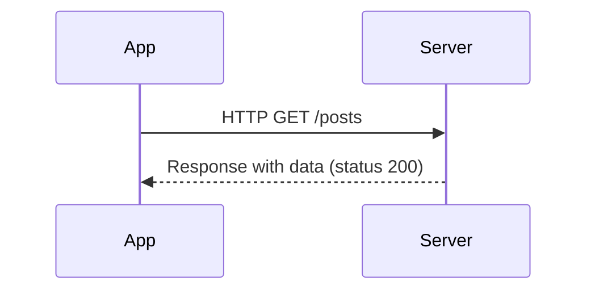

## 5.2.1 HTTP Requests with http Package

In the world of mobile app development, connecting your application to the internet is a crucial aspect that allows it to interact with web services, fetch data, and provide dynamic content. In Flutter, the `http` package is a powerful tool that simplifies making HTTP requests. This section will guide you through the process of using the `http` package to perform various HTTP operations, such as GET and POST requests, and handle responses effectively.

### Introduction to HTTP in Flutter

HTTP (Hypertext Transfer Protocol) is the foundation of any data exchange on the Web and a protocol used for fetching resources. It is the protocol used by the World Wide Web and this protocol defines how messages are formatted and transmitted, and what actions web servers and browsers should take in response to various commands.

#### The Role of HTTP Requests

HTTP requests are essential for connecting your Flutter app to external web services. They allow your app to:

- Fetch data from a server.
- Send data to a server.
- Update or delete resources on a server.

These operations are typically performed using different HTTP methods, each serving a specific purpose:

- **GET**: Retrieve data from a server.
- **POST**: Send data to a server to create a resource.
- **PUT**: Update an existing resource on a server.
- **DELETE**: Remove a resource from a server.

Understanding these methods is fundamental to interacting with web APIs.

### Adding the http Package

Before you can start making HTTP requests, you need to add the `http` package to your Flutter project. This package provides a simple way to perform HTTP requests and handle responses.

#### Step-by-Step Guide to Adding the http Package

1. **Open your Flutter project** in your preferred IDE or text editor.
2. **Locate the `pubspec.yaml` file** in the root directory of your project.
3. **Add the `http` package** under the dependencies section:

   ```yaml
   dependencies:
     flutter:
       sdk: flutter
     http: ^0.13.5
   ```

4. **Run `flutter pub get`** in the terminal to install the package.

This will download the `http` package and make it available for use in your project.

### Importing the Package

Once the `http` package is added to your project, you need to import it into your Dart files where you intend to use it. This is done by adding the following import statement at the top of your Dart file:

```dart
import 'package:http/http.dart' as http;
```

This import statement allows you to use the `http` package's functionalities by prefixing them with `http.`.

### Performing GET Requests

GET requests are used to retrieve data from a server. They are the most common type of HTTP request and are used to fetch resources such as JSON data, images, or HTML files.

#### Example: Fetching Data from an API

Let's demonstrate how to perform a GET request to fetch a list of posts from a public API, such as JSONPlaceholder.

```dart
Future<void> fetchPosts() async {
  final response = await http.get(Uri.parse('https://jsonplaceholder.typicode.com/posts'));

  if (response.statusCode == 200) {
    final data = response.body;
    // Process data
  } else {
    // Handle error
    throw Exception('Failed to load posts');
  }
}
```

In this example:

- We use `http.get` to perform a GET request.
- We pass the URL of the API endpoint as a `Uri` object.
- We check the `statusCode` of the response to determine if the request was successful.
- If successful, we process the `response.body`, which contains the data returned by the server.
- If unsuccessful, we throw an exception to handle the error.

#### Handling the Response and Status Codes

When handling HTTP responses, it's important to check the status code to determine the outcome of the request:

- **200**: OK - The request was successful, and the server returned the requested data.
- **404**: Not Found - The requested resource could not be found.
- **500**: Internal Server Error - The server encountered an error.

By checking the status code, you can implement appropriate error handling in your app.

### Performing POST Requests

POST requests are used to send data to a server, typically to create a new resource. They are commonly used in forms, where user input is sent to a server for processing.

#### Example: Sending Data to a Server

Let's see how to perform a POST request to send data to a server.

```dart
Future<void> createPost(String title, String body) async {
  final response = await http.post(
    Uri.parse('https://jsonplaceholder.typicode.com/posts'),
    headers: <String, String>{
      'Content-Type': 'application/json; charset=UTF-8',
    },
    body: jsonEncode(<String, String>{
      'title': title,
      'body': body,
    }),
  );

  if (response.statusCode == 201) {
    final data = response.body;
    // Process success
  } else {
    // Handle error
    throw Exception('Failed to create post');
  }
}
```

In this example:

- We use `http.post` to perform a POST request.
- We specify the `Content-Type` header to indicate that we are sending JSON data.
- We use `jsonEncode` to convert the data into a JSON string.
- We check the `statusCode` to determine if the request was successful.

#### Setting Headers and Encoding Body Data

When sending data to a server, it's important to set the appropriate headers and encode the body data correctly. Common headers include:

- **Content-Type**: Specifies the media type of the resource (e.g., `application/json`).
- **Authorization**: Used for authentication (e.g., `Bearer token`).

### Handling Responses

Handling responses involves parsing the data returned by the server and checking for errors.

#### Parsing JSON Data

Most APIs return data in JSON format, which needs to be parsed into Dart objects. You can use the `dart:convert` library to decode JSON data.

```dart
import 'dart:convert';

void parseJson(String responseBody) {
  final parsed = jsonDecode(responseBody);
  // Process parsed data
}
```

#### Error Checking Based on HTTP Status Codes

Always check the status code of the response to determine if the request was successful. Implement error handling to manage different scenarios, such as network errors or server issues.

### Asynchronous Programming

Network calls are inherently asynchronous, meaning they take time to complete. In Flutter, you use the `async` and `await` keywords to handle asynchronous operations.

#### Using async and await

```dart
Future<void> fetchData() async {
  try {
    final response = await http.get(Uri.parse('https://example.com/data'));
    if (response.statusCode == 200) {
      // Process data
    } else {
      // Handle error
    }
  } catch (e) {
    // Handle exception
  }
}
```

- **async**: Marks a function as asynchronous.
- **await**: Waits for an asynchronous operation to complete before proceeding.

### Example Use Case: Fetching Posts from JSONPlaceholder

Let's put everything together with a practical example of fetching a list of posts from JSONPlaceholder.

```dart
import 'dart:convert';
import 'package:http/http.dart' as http;

Future<List<Post>> fetchPosts() async {
  final response = await http.get(Uri.parse('https://jsonplaceholder.typicode.com/posts'));

  if (response.statusCode == 200) {
    final List<dynamic> jsonData = jsonDecode(response.body);
    return jsonData.map((json) => Post.fromJson(json)).toList();
  } else {
    throw Exception('Failed to load posts');
  }
}

class Post {
  final int id;
  final String title;
  final String body;

  Post({required this.id, required this.title, required this.body});

  factory Post.fromJson(Map<String, dynamic> json) {
    return Post(
      id: json['id'],
      title: json['title'],
      body: json['body'],
    );
  }
}
```

In this example:

- We define a `Post` class to represent the data structure.
- We fetch the posts using a GET request.
- We parse the JSON response into a list of `Post` objects.

### Visual Aids: HTTP GET Request Flow

To better understand the flow of an HTTP GET request, let's visualize it using a Mermaid.js sequence diagram.



This diagram illustrates the interaction between the app and the server during a GET request.

### Best Practices and Common Pitfalls

- **Error Handling**: Always check the status code and handle errors gracefully.
- **Security**: Use HTTPS to encrypt data in transit and protect user privacy.
- **Performance**: Minimize the number of network requests to reduce latency and improve performance.
- **Authentication**: Be mindful of authentication requirements, such as API keys or OAuth tokens.

### Conclusion

In this section, we've covered how to perform HTTP requests in Flutter using the `http` package. You've learned about different HTTP methods, handling responses, and asynchronous programming. By following these guidelines, you can effectively connect your Flutter app to web APIs and provide dynamic content to your users.

## Quiz Time!



### What is the primary purpose of HTTP requests in a Flutter app?

- [x] To connect the app to web services and fetch data.
- [ ] To handle user authentication.
- [ ] To manage app state.
- [ ] To render UI components.

> **Explanation:** HTTP requests are used to connect the app to web services and fetch data from servers.

### Which HTTP method is used to retrieve data from a server?

- [x] GET
- [ ] POST
- [ ] PUT
- [ ] DELETE

> **Explanation:** The GET method is used to retrieve data from a server.

### How do you add the http package to a Flutter project?

- [x] Add it to the dependencies section in pubspec.yaml and run flutter pub get.
- [ ] Import it directly in the Dart file.
- [ ] Download it from the internet.
- [ ] Use the Flutter package manager.

> **Explanation:** To add the http package, you need to include it in the dependencies section of pubspec.yaml and run flutter pub get.

### What is the correct way to import the http package in a Dart file?

- [x] import 'package:http/http.dart' as http;
- [ ] import 'http.dart';
- [ ] import 'package:http.dart';
- [ ] import 'http/http.dart';

> **Explanation:** The correct import statement is import 'package:http/http.dart' as http;.

### What should you check to determine if an HTTP request was successful?

- [x] The status code of the response.
- [ ] The length of the response body.
- [ ] The headers of the response.
- [ ] The URL of the request.

> **Explanation:** The status code of the response indicates whether the request was successful.

### How do you handle asynchronous operations in Dart?

- [x] Using async and await.
- [ ] Using try and catch.
- [ ] Using if and else.
- [ ] Using for and while loops.

> **Explanation:** Asynchronous operations in Dart are handled using async and await.

### What is the purpose of the Content-Type header in an HTTP request?

- [x] To specify the media type of the resource being sent.
- [ ] To authenticate the user.
- [ ] To indicate the size of the request.
- [ ] To specify the server address.

> **Explanation:** The Content-Type header specifies the media type of the resource being sent in the request.

### What should you do if an HTTP request fails?

- [x] Handle the error gracefully and provide feedback to the user.
- [ ] Ignore the error and continue.
- [ ] Retry the request indefinitely.
- [ ] Log the error and terminate the app.

> **Explanation:** If an HTTP request fails, you should handle the error gracefully and provide feedback to the user.

### Why is it important to use HTTPS for HTTP requests?

- [x] To encrypt data in transit and protect user privacy.
- [ ] To speed up the request.
- [ ] To reduce server load.
- [ ] To simplify code.

> **Explanation:** HTTPS encrypts data in transit, protecting user privacy and ensuring secure communication.

### True or False: The http package can be used for both GET and POST requests in Flutter.

- [x] True
- [ ] False

> **Explanation:** The http package supports both GET and POST requests, among other HTTP methods.


