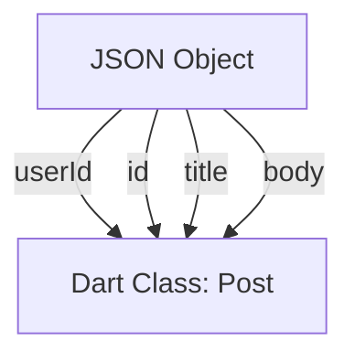

## 5.2.2 Parsing JSON Data

In the world of mobile app development, interacting with web services and APIs is a common task. JSON (JavaScript Object Notation) is the most widely used format for data interchange between clients and servers due to its simplicity and readability. In this section, we will delve into how to parse JSON data in Flutter, transforming HTTP responses into Dart objects that your app can work with.

### Introduction to JSON

JSON is a lightweight data interchange format that is easy for humans to read and write, and easy for machines to parse and generate. It is text-based and language-independent, making it a popular choice for APIs. JSON data is structured in a key-value pair format, similar to a dictionary in Python or an object in JavaScript.

Here’s a simple JSON example:

```json
{
  "userId": 1,
  "id": 1,
  "title": "Sample Post",
  "body": "This is a sample post body."
}
```

In the context of Flutter, JSON is commonly used to receive data from web services, which can then be parsed and used within the app.

### Using dart:convert Library

Flutter provides the `dart:convert` library to handle JSON data. This library includes the `jsonDecode` function, which is used to parse JSON strings into Dart objects.

#### Importing dart:convert

To start using the `dart:convert` library, you need to import it into your Dart file:

```dart
import 'dart:convert';
```

#### Parsing JSON Strings

The `jsonDecode` function takes a JSON string and converts it into a corresponding Dart object. For example:

```dart
String jsonString = '{"userId": 1, "id": 1, "title": "Sample Post", "body": "This is a sample post body."}';
Map<String, dynamic> jsonMap = jsonDecode(jsonString);

print(jsonMap['title']); // Output: Sample Post
```

### Creating Model Classes

While you can work directly with maps, it’s a best practice to create Dart classes that represent your JSON data. This approach provides type safety and makes your code more readable and maintainable.

#### Defining a Model Class

Let's create a `Post` class to represent the JSON data structure:

```dart
class Post {
  final int userId;
  final int id;
  final String title;
  final String body;

  Post({required this.userId, required this.id, required this.title, required this.body});

  factory Post.fromJson(Map<String, dynamic> json) {
    return Post(
      userId: json['userId'],
      id: json['id'],
      title: json['title'],
      body: json['body'],
    );
  }

  Map<String, dynamic> toJson() {
    return {
      'userId': userId,
      'id': id,
      'title': title,
      'body': body,
    };
  }
}
```

#### Factory Constructor: fromJson

The `fromJson` factory constructor is a common pattern in Dart for creating an instance of a class from a map. This constructor takes a `Map<String, dynamic>` as input and returns an instance of the `Post` class.

### Parsing JSON Arrays and Objects

APIs often return lists of JSON objects. To handle this, you can parse JSON arrays into lists of Dart objects.

#### Example: Parsing a JSON Array

Suppose you receive a JSON response containing a list of posts:

```json
[
  {
    "userId": 1,
    "id": 1,
    "title": "Sample Post 1",
    "body": "This is the body of sample post 1."
  },
  {
    "userId": 2,
    "id": 2,
    "title": "Sample Post 2",
    "body": "This is the body of sample post 2."
  }
]
```

You can parse this array into a list of `Post` objects as follows:

```dart
Future<List<Post>> fetchPosts() async {
  final response = await http.get(Uri.parse('https://jsonplaceholder.typicode.com/posts'));

  if (response.statusCode == 200) {
    final List jsonResponse = jsonDecode(response.body);
    return jsonResponse.map((post) => Post.fromJson(post)).toList();
  } else {
    throw Exception('Failed to load posts');
  }
}
```

### Serializing Objects to JSON

In addition to parsing JSON into Dart objects, you might need to convert Dart objects back into JSON strings. This is useful when sending data back to a server.

#### Implementing toJson Method

The `toJson` method converts a Dart object into a map, which can then be encoded into a JSON string using `jsonEncode`.

```dart
Post post = Post(userId: 1, id: 1, title: 'Sample Post', body: 'This is a sample post body.');
String jsonString = jsonEncode(post.toJson());

print(jsonString); // Output: {"userId":1,"id":1,"title":"Sample Post","body":"This is a sample post body."}
```

### Example Use Case: Parsing Posts

Let's put everything together with a practical example. Assume you have a Flutter app that fetches posts from an API and displays them in a list.

1. **Define the Post Model**: As shown earlier, create a `Post` class with `fromJson` and `toJson` methods.

2. **Fetch and Parse Data**: Use the `fetchPosts` function to retrieve and parse the JSON data.

3. **Display Data in UI**: Use Flutter widgets to display the list of posts.

```dart
import 'package:flutter/material.dart';
import 'package:http/http.dart' as http;
import 'dart:convert';

class Post {
  final int userId;
  final int id;
  final String title;
  final String body;

  Post({required this.userId, required this.id, required this.title, required this.body});

  factory Post.fromJson(Map<String, dynamic> json) {
    return Post(
      userId: json['userId'],
      id: json['id'],
      title: json['title'],
      body: json['body'],
    );
  }

  Map<String, dynamic> toJson() {
    return {
      'userId': userId,
      'id': id,
      'title': title,
      'body': body,
    };
  }
}

Future<List<Post>> fetchPosts() async {
  final response = await http.get(Uri.parse('https://jsonplaceholder.typicode.com/posts'));

  if (response.statusCode == 200) {
    final List jsonResponse = jsonDecode(response.body);
    return jsonResponse.map((post) => Post.fromJson(post)).toList();
  } else {
    throw Exception('Failed to load posts');
  }
}

void main() => runApp(MyApp());

class MyApp extends StatelessWidget {
  @override
  Widget build(BuildContext context) {
    return MaterialApp(
      title: 'Flutter JSON Parsing',
      home: Scaffold(
        appBar: AppBar(
          title: Text('Posts'),
        ),
        body: FutureBuilder<List<Post>>(
          future: fetchPosts(),
          builder: (context, snapshot) {
            if (snapshot.hasData) {
              return ListView.builder(
                itemCount: snapshot.data!.length,
                itemBuilder: (context, index) {
                  return ListTile(
                    title: Text(snapshot.data![index].title),
                    subtitle: Text(snapshot.data![index].body),
                  );
                },
              );
            } else if (snapshot.hasError) {
              return Center(child: Text('${snapshot.error}'));
            }
            return Center(child: CircularProgressIndicator());
          },
        ),
      ),
    );
  }
}
```

### Visual Aids

To better understand the mapping between JSON keys and Dart object properties, consider the following diagram:



### Best Practices and Tips

- **Error Handling**: Always check the status code of HTTP responses and handle exceptions appropriately.
- **JSON Structure**: Ensure that the structure of your Dart model classes matches the JSON structure exactly.
- **Code Generation**: For larger projects, consider using code generation tools like `json_serializable` to automate the creation of `fromJson` and `toJson` methods. This reduces boilerplate code and minimizes errors.

### Common Pitfalls

- **Type Mismatch**: Ensure that the types in your Dart model class match the types in the JSON data. For example, if a JSON field is an integer, the corresponding Dart field should also be an integer.
- **Null Safety**: With Dart's null safety feature, make sure to handle potential null values in JSON data appropriately.

### Optimization Tips

- **Lazy Loading**: For large datasets, consider implementing lazy loading to fetch and display data as needed, rather than all at once.
- **Caching**: Use caching strategies to reduce the number of network requests and improve app performance.

By following these guidelines and examples, you can effectively parse JSON data in your Flutter applications, enabling seamless integration with web services and APIs.

## Quiz Time!



### What is JSON commonly used for in mobile app development?

- [x] Data interchange between clients and servers
- [ ] Storing images
- [ ] Writing application code
- [ ] Compiling Dart code

> **Explanation:** JSON is a lightweight data interchange format that is commonly used to exchange data between clients and servers.

### Which Dart library is used for parsing JSON data?

- [x] dart:convert
- [ ] dart:core
- [ ] dart:async
- [ ] dart:io

> **Explanation:** The `dart:convert` library provides functions for encoding and decoding JSON data.

### What does the `jsonDecode` function do?

- [x] Converts a JSON string into a Dart object
- [ ] Converts a Dart object into a JSON string
- [ ] Reads JSON data from a file
- [ ] Writes JSON data to a file

> **Explanation:** The `jsonDecode` function takes a JSON string and converts it into a corresponding Dart object.

### What is the purpose of the `fromJson` factory constructor?

- [x] To create an instance of a class from a JSON map
- [ ] To convert a Dart object into a JSON map
- [ ] To initialize a class with default values
- [ ] To decode a JSON string into a Dart object

> **Explanation:** The `fromJson` factory constructor is used to create an instance of a class from a JSON map.

### How can you convert a Dart object back into a JSON string?

- [x] Using the `toJson` method and `jsonEncode`
- [ ] Using the `fromJson` method and `jsonDecode`
- [ ] Using the `jsonEncode` function directly
- [ ] Using the `jsonDecode` function directly

> **Explanation:** The `toJson` method converts a Dart object into a map, which can then be encoded into a JSON string using `jsonEncode`.

### What should you do if the JSON structure changes?

- [x] Update the Dart model class to match the new JSON structure
- [ ] Ignore the changes
- [ ] Use a different library
- [ ] Write a new app

> **Explanation:** It's important to update the Dart model class to match any changes in the JSON structure to ensure correct parsing.

### What is a common tool for generating `fromJson` and `toJson` methods in larger projects?

- [x] json_serializable
- [ ] dart:convert
- [ ] jsonEncode
- [ ] jsonDecode

> **Explanation:** The `json_serializable` package is a code generation tool that automates the creation of `fromJson` and `toJson` methods.

### Why is error handling important when parsing JSON data?

- [x] To handle unexpected data formats and network issues
- [ ] To increase the app size
- [ ] To slow down the app
- [ ] To make the app more complex

> **Explanation:** Error handling is crucial to manage unexpected data formats and network issues, ensuring the app remains stable.

### What is a potential pitfall when working with JSON data in Dart?

- [x] Type mismatch between JSON fields and Dart fields
- [ ] Using too many JSON fields
- [ ] Parsing JSON too quickly
- [ ] Using JSON for UI design

> **Explanation:** A common pitfall is a type mismatch between JSON fields and Dart fields, which can lead to runtime errors.

### True or False: JSON is language-independent and can be used with any programming language.

- [x] True
- [ ] False

> **Explanation:** JSON is language-independent, making it a versatile format for data interchange across different programming languages.


