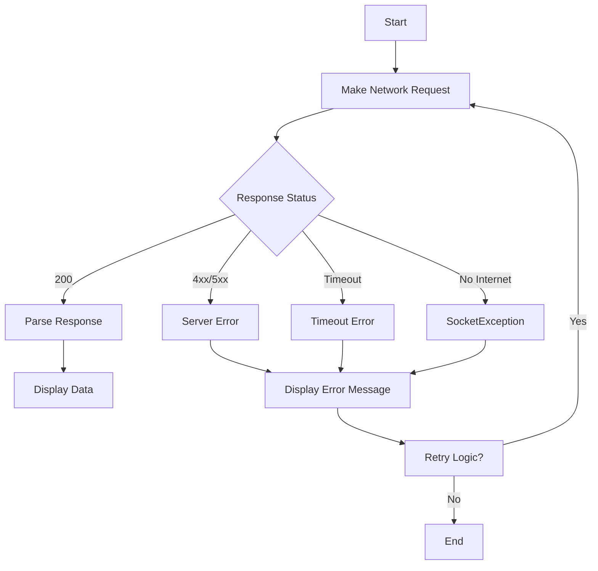

## 5.2.3 Handling Network Errors

In the world of mobile app development, network operations are a fundamental aspect of most applications. Whether fetching data from a server, sending user-generated content, or syncing information, network requests are ubiquitous. However, the network is inherently unreliable, and errors are inevitable. As a Flutter developer, it's crucial to implement robust error handling to ensure your app remains reliable and provides a seamless user experience even when things go wrong.

### Understanding Common Network Errors

Before diving into error handling strategies, it's essential to understand the types of network errors you might encounter:

1. **Timeout Errors**: These occur when a network request takes too long to complete. This can happen due to slow network conditions or unresponsive servers.

2. **No Internet Connection**: Users may be in areas with poor connectivity or have their devices in airplane mode, leading to failed network requests.

3. **Server Errors (HTTP Status Codes 4xx and 5xx)**: These errors indicate issues on the server side. 4xx errors are client-related (e.g., unauthorized access), while 5xx errors are server-related (e.g., server down).

### Using Try-Catch Blocks for Error Handling

In Flutter, the `try-catch` block is a powerful tool for handling exceptions that occur during network operations. It allows you to gracefully manage errors and provide meaningful feedback to users.

#### Catching Exceptions During HTTP Requests

When making HTTP requests, you can use `try-catch` blocks to handle exceptions. Here's an example of how to catch exceptions during a network call:

```dart
import 'dart:convert';
import 'dart:io';
import 'package:http/http.dart' as http;

Future<List<Post>> fetchPosts() async {
  try {
    final response = await http.get(Uri.parse('https://jsonplaceholder.typicode.com/posts'));

    if (response.statusCode == 200) {
      final List jsonResponse = jsonDecode(response.body);
      return jsonResponse.map((post) => Post.fromJson(post)).toList();
    } else {
      throw Exception('Failed to load posts');
    }
  } on SocketException {
    // Handle no internet connection
    throw Exception('No Internet connection');
  } catch (e) {
    // Handle other exceptions
    throw Exception('Failed to load posts: $e');
  }
}
```

In this example, we attempt to fetch posts from a server. If the request is successful (status code 200), we parse the response. If not, we throw an exception. We also catch `SocketException` to handle scenarios where there is no internet connection.

#### Catching Specific Exceptions

While the above example demonstrates general exception handling, it's often beneficial to catch specific exceptions to provide more precise error handling. For instance, you might want to handle `TimeoutException` separately from `SocketException`.

```dart
import 'dart:async';

Future<List<Post>> fetchPosts() async {
  try {
    final response = await http.get(Uri.parse('https://jsonplaceholder.typicode.com/posts')).timeout(Duration(seconds: 10));

    if (response.statusCode == 200) {
      final List jsonResponse = jsonDecode(response.body);
      return jsonResponse.map((post) => Post.fromJson(post)).toList();
    } else {
      throw Exception('Failed to load posts');
    }
  } on TimeoutException {
    // Handle timeout error
    throw Exception('Request timed out');
  } on SocketException {
    // Handle no internet connection
    throw Exception('No Internet connection');
  } catch (e) {
    // Handle other exceptions
    throw Exception('Failed to load posts: $e');
  }
}
```

In this updated example, we use the `timeout` method to set a limit on how long the request should take. If it exceeds this duration, a `TimeoutException` is thrown, which we handle separately.

### Displaying Error Messages

When errors occur, it's essential to inform users in a way that's clear and actionable. Here are some best practices for displaying error messages:

- **Use User-Friendly Language**: Avoid technical jargon. Instead of "SocketException," say "No internet connection."

- **Provide Actionable Feedback**: Where possible, suggest actions users can take, such as "Check your internet connection and try again."

- **Avoid Overloading Users with Information**: Display concise messages and avoid overwhelming users with too much detail.

#### Example of Displaying Error Messages

```dart
void showError(BuildContext context, String message) {
  showDialog(
    context: context,
    builder: (BuildContext context) {
      return AlertDialog(
        title: Text('Error'),
        content: Text(message),
        actions: <Widget>[
          TextButton(
            child: Text('OK'),
            onPressed: () {
              Navigator.of(context).pop();
            },
          ),
        ],
      );
    },
  );
}
```

This function displays an error message in a dialog box. You can call this function with a specific error message when an error occurs.

### Implementing Retry Logic

Sometimes, network errors are transient and can be resolved by retrying the request. Implementing retry logic can improve the reliability of your app.

#### Basic Retry Strategy

A simple retry strategy involves retrying the request a fixed number of times with a delay between attempts. Here's a basic implementation:

```dart
Future<List<Post>> fetchPostsWithRetry({int retries = 3}) async {
  int attempt = 0;
  while (attempt < retries) {
    try {
      return await fetchPosts();
    } catch (e) {
      attempt++;
      if (attempt >= retries) {
        rethrow;
      }
      await Future.delayed(Duration(seconds: 2)); // Wait before retrying
    }
  }
  return [];
}
```

In this example, we attempt to fetch posts up to three times. If an error occurs, we wait for two seconds before retrying.

### Example Implementation

Let's put everything together in a complete example that includes error handling, displaying error messages, and retry logic:

```dart
import 'dart:async';
import 'dart:convert';
import 'dart:io';
import 'package:flutter/material.dart';
import 'package:http/http.dart' as http;

class Post {
  final int id;
  final String title;
  final String body;

  Post({required this.id, required this.title, required this.body});

  factory Post.fromJson(Map<String, dynamic> json) {
    return Post(
      id: json['id'],
      title: json['title'],
      body: json['body'],
    );
  }
}

Future<List<Post>> fetchPosts() async {
  try {
    final response = await http.get(Uri.parse('https://jsonplaceholder.typicode.com/posts')).timeout(Duration(seconds: 10));

    if (response.statusCode == 200) {
      final List jsonResponse = jsonDecode(response.body);
      return jsonResponse.map((post) => Post.fromJson(post)).toList();
    } else {
      throw Exception('Failed to load posts');
    }
  } on TimeoutException {
    throw Exception('Request timed out');
  } on SocketException {
    throw Exception('No Internet connection');
  } catch (e) {
    throw Exception('Failed to load posts: $e');
  }
}

void showError(BuildContext context, String message) {
  showDialog(
    context: context,
    builder: (BuildContext context) {
      return AlertDialog(
        title: Text('Error'),
        content: Text(message),
        actions: <Widget>[
          TextButton(
            child: Text('OK'),
            onPressed: () {
              Navigator.of(context).pop();
            },
          ),
        ],
      );
    },
  );
}

Future<List<Post>> fetchPostsWithRetry({int retries = 3}) async {
  int attempt = 0;
  while (attempt < retries) {
    try {
      return await fetchPosts();
    } catch (e) {
      attempt++;
      if (attempt >= retries) {
        rethrow;
      }
      await Future.delayed(Duration(seconds: 2));
    }
  }
  return [];
}

class MyApp extends StatelessWidget {
  @override
  Widget build(BuildContext context) {
    return MaterialApp(
      home: Scaffold(
        appBar: AppBar(title: Text('Posts')),
        body: PostsList(),
      ),
    );
  }
}

class PostsList extends StatefulWidget {
  @override
  _PostsListState createState() => _PostsListState();
}

class _PostsListState extends State<PostsList> {
  late Future<List<Post>> futurePosts;

  @override
  void initState() {
    super.initState();
    futurePosts = fetchPostsWithRetry();
  }

  @override
  Widget build(BuildContext context) {
    return FutureBuilder<List<Post>>(
      future: futurePosts,
      builder: (context, snapshot) {
        if (snapshot.connectionState == ConnectionState.waiting) {
          return Center(child: CircularProgressIndicator());
        } else if (snapshot.hasError) {
          showError(context, snapshot.error.toString());
          return Center(child: Text('Error loading posts'));
        } else if (!snapshot.hasData || snapshot.data!.isEmpty) {
          return Center(child: Text('No posts available'));
        } else {
          return ListView.builder(
            itemCount: snapshot.data!.length,
            itemBuilder: (context, index) {
              final post = snapshot.data![index];
              return ListTile(
                title: Text(post.title),
                subtitle: Text(post.body),
              );
            },
          );
        }
      },
    );
  }
}

void main() => runApp(MyApp());
```

### Visualizing the Network Request Flow

To better understand the flow of a network request and where errors might occur, let's visualize it using a flowchart:



### Best Practices and Common Pitfalls

- **Do Not Expose Technical Error Messages**: Avoid showing raw error messages to users. Instead, provide user-friendly messages.

- **Log Errors for Debugging**: Use logging libraries to record errors for later analysis. This can help you identify and fix issues.

- **Test Error Handling Thoroughly**: Simulate different network conditions and errors to ensure your error handling is robust.

### Conclusion

Handling network errors effectively is crucial for building reliable Flutter apps. By understanding common network errors, using try-catch blocks, displaying user-friendly error messages, and implementing retry logic, you can significantly enhance the user experience. Remember to test your error handling thoroughly and log errors for debugging purposes.

## Quiz Time!



### What is a common cause of timeout errors in network requests?

- [x] Slow network conditions
- [ ] Incorrect URL
- [ ] User input error
- [ ] Server overload

> **Explanation:** Timeout errors often occur due to slow network conditions or unresponsive servers.

### Which exception should you catch to handle no internet connection in Flutter?

- [x] SocketException
- [ ] TimeoutException
- [ ] HttpException
- [ ] FormatException

> **Explanation:** `SocketException` is used to handle scenarios where there is no internet connection.

### What is the recommended way to inform users about network errors?

- [x] Use user-friendly language
- [ ] Show raw error messages
- [ ] Use technical jargon
- [ ] Ignore the error

> **Explanation:** It's best to use user-friendly language to inform users about network errors.

### How can you implement retry logic for network requests?

- [x] Retry the request a fixed number of times with a delay
- [ ] Ignore the error and move on
- [ ] Show a loading spinner indefinitely
- [ ] Use a different API endpoint

> **Explanation:** Implementing retry logic involves retrying the request a fixed number of times with a delay between attempts.

### What should you do if a network request fails due to a server error (5xx)?

- [x] Display an error message and consider retrying
- [ ] Ignore the error
- [ ] Show a success message
- [ ] Terminate the app

> **Explanation:** Display an error message to inform the user and consider retrying the request.

### Why is it important to log errors in your app?

- [x] For debugging and analysis
- [ ] To show users technical details
- [ ] To increase app size
- [ ] To slow down the app

> **Explanation:** Logging errors is important for debugging and analyzing issues in your app.

### What should you avoid when displaying error messages to users?

- [x] Exposing technical error messages
- [ ] Using user-friendly language
- [ ] Providing actionable feedback
- [ ] Keeping messages concise

> **Explanation:** Avoid exposing technical error messages to users; instead, use user-friendly language.

### Which HTTP status codes indicate client-related errors?

- [x] 4xx
- [ ] 5xx
- [ ] 3xx
- [ ] 2xx

> **Explanation:** HTTP status codes in the 4xx range indicate client-related errors.

### What is a potential downside of implementing retry logic?

- [x] Increased network traffic
- [ ] Improved user experience
- [ ] Reduced error rates
- [ ] Faster response times

> **Explanation:** Implementing retry logic can lead to increased network traffic if not managed properly.

### True or False: It's okay to ignore network errors in a production app.

- [ ] True
- [x] False

> **Explanation:** Ignoring network errors in a production app is not advisable as it can lead to a poor user experience.


