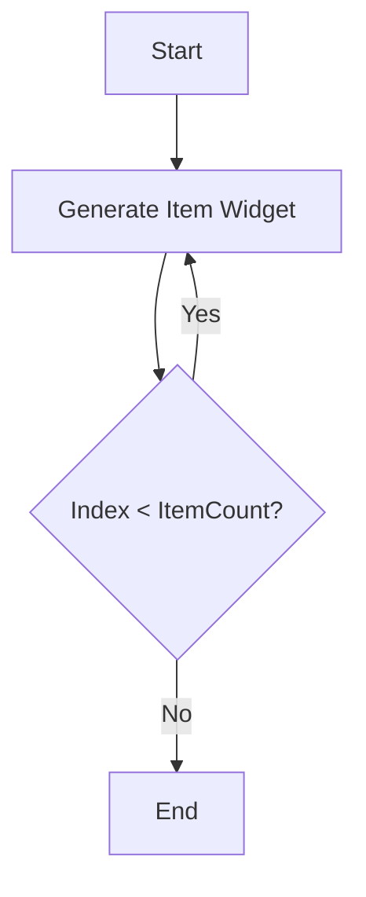

## 5.3.1 Using ListView Widget

In the world of mobile app development, presenting data in a user-friendly manner is paramount. One of the most common ways to display a collection of items in a mobile app is through a scrollable list. Flutter, a popular framework for building cross-platform mobile applications, provides a powerful widget for this purpose: `ListView`. This section will guide you through the intricacies of using the `ListView` widget, ensuring you can efficiently display dynamic data in your apps.

### Introduction to ListView

The `ListView` widget in Flutter is a versatile and powerful tool for creating scrollable lists of widgets. It arranges its children linearly, either vertically or horizontally, and provides built-in scrolling capabilities. This makes it an ideal choice for displaying lists of data that exceed the available screen space.

#### When to Use ListView

`ListView` is particularly useful when you need to display a list of items that may not fit within the constraints of a single screen. It is a go-to widget for scenarios where:

- You have a dynamic list of items that can grow or shrink.
- You need to display a large dataset efficiently.
- You want to provide a seamless scrolling experience for the user.

While there are other scrolling widgets in Flutter, such as `SingleChildScrollView` and `CustomScrollView`, `ListView` is often preferred for its simplicity and ease of use when dealing with lists of items.

### Types of ListView Constructors

Flutter's `ListView` widget comes with several constructors, each tailored for specific use cases. Understanding these constructors will help you choose the right one for your needs.

#### ListView.builder

The `ListView.builder` constructor is ideal for large or potentially infinite lists. It uses a lazy loading approach, meaning it only builds widgets that are visible on the screen. This is crucial for performance, especially when dealing with extensive datasets.

```dart
ListView.builder(
  itemCount: items.length,
  itemBuilder: (context, index) {
    return ListTile(
      leading: Icon(Icons.label),
      title: Text(items[index]),
    );
  },
);
```

**Key Points:**

- **itemBuilder:** A function that returns a widget for each item in the list. It is called lazily as the user scrolls.
- **itemCount:** The total number of items in the list. This parameter helps prevent infinite lists when the number of items is known.

#### ListView

The default `ListView` constructor is suitable for a small, finite number of children. It requires an explicit `children` parameter, which is a list of widgets to display.

```dart
ListView(
  children: <Widget>[
    ListTile(
      leading: Icon(Icons.map),
      title: Text('Map'),
    ),
    ListTile(
      leading: Icon(Icons.photo_album),
      title: Text('Album'),
    ),
    ListTile(
      leading: Icon(Icons.phone),
      title: Text('Phone'),
    ),
  ],
);
```

**Use Case:** When you have a fixed number of items that do not change dynamically.

#### ListView.separated

The `ListView.separated` constructor is similar to `ListView.builder` but allows you to specify a separator widget between items. This is useful for adding dividers or other visual elements between list items.

```dart
ListView.separated(
  itemCount: items.length,
  itemBuilder: (context, index) {
    return ListTile(
      leading: Icon(Icons.label),
      title: Text(items[index]),
    );
  },
  separatorBuilder: (context, index) => Divider(),
);
```

**Key Points:**

- **separatorBuilder:** A function that returns a widget to display between each pair of items.

### Building a Simple ListView

Creating a basic list using the default `ListView` constructor is straightforward. This approach is best suited for small lists where performance is not a concern.

```dart
ListView(
  children: <Widget>[
    ListTile(
      leading: Icon(Icons.map),
      title: Text('Map'),
    ),
    ListTile(
      leading: Icon(Icons.photo_album),
      title: Text('Album'),
    ),
    ListTile(
      leading: Icon(Icons.phone),
      title: Text('Phone'),
    ),
  ],
);
```

**Visual Aid:**

Imagine a simple list with three items: Map, Album, and Phone. Each item is represented by a `ListTile` widget, which is a common choice for list items in Flutter due to its built-in support for leading icons and titles.

### Using ListView.builder

The `ListView.builder` is a powerful tool for creating efficient, scrollable lists. It is particularly useful when dealing with large datasets or when the list items are generated dynamically.

#### How itemBuilder Works

The `itemBuilder` function is called for each visible item in the list. It receives the current `BuildContext` and the index of the item being built. This function should return a widget that represents the list item.

```dart
ListView.builder(
  itemCount: items.length,
  itemBuilder: (context, index) {
    return ListTile(
      leading: Icon(Icons.label),
      title: Text(items[index]),
    );
  },
);
```

#### Importance of itemCount

The `itemCount` parameter tells the `ListView.builder` how many items to build. This is crucial for performance, as it prevents the list from attempting to build an infinite number of items.

**Best Practice:** Always provide an `itemCount` when the number of items is known to avoid performance issues.

### Understanding Scroll Physics and Control

Flutter provides several options for customizing the scrolling behavior of a `ListView` through the `ScrollPhysics` property. This allows you to fine-tune how the list responds to user interactions.

#### ScrollPhysics Options

- **NeverScrollableScrollPhysics:** Disables scrolling entirely. Useful when you want to control scrolling programmatically.
- **BouncingScrollPhysics:** Provides a bouncing effect at the edges of the list, commonly seen in iOS apps.

```dart
ListView(
  physics: BouncingScrollPhysics(),
  children: <Widget>[
    // List items here
  ],
);
```

**Tip:** Experiment with different `ScrollPhysics` options to achieve the desired scrolling behavior for your app.

### Example Use Case: Displaying a List of Fetched Data

Let's consider a practical example where you need to display a list of contacts fetched from a remote server. This scenario is common in many apps, such as messaging or social media applications.

#### Step-by-Step Guide

1. **Fetch Data:** Use a package like `http` to fetch data from an API.
2. **Parse Data:** Convert the fetched data into a list of objects.
3. **Display Data:** Use `ListView.builder` to display the list of contacts.

```dart
import 'package:flutter/material.dart';
import 'package:http/http.dart' as http;
import 'dart:convert';

class ContactsList extends StatefulWidget {
  @override
  _ContactsListState createState() => _ContactsListState();
}

class _ContactsListState extends State<ContactsList> {
  List<String> contacts = [];

  @override
  void initState() {
    super.initState();
    fetchContacts();
  }

  Future<void> fetchContacts() async {
    final response = await http.get(Uri.parse('https://api.example.com/contacts'));
    if (response.statusCode == 200) {
      setState(() {
        contacts = List<String>.from(json.decode(response.body));
      });
    } else {
      throw Exception('Failed to load contacts');
    }
  }

  @override
  Widget build(BuildContext context) {
    return ListView.builder(
      itemCount: contacts.length,
      itemBuilder: (context, index) {
        return ListTile(
          leading: Icon(Icons.person),
          title: Text(contacts[index]),
        );
      },
    );
  }
}
```

**Explanation:**

- **Data Fetching:** The `fetchContacts` function uses the `http` package to fetch data from an API.
- **Data Parsing:** The response is parsed into a list of strings representing contact names.
- **Displaying Data:** The `ListView.builder` displays each contact using a `ListTile`.

### Visual Aids

To further illustrate the flow of `ListView.builder`, consider the following Mermaid.js flowchart:



This flowchart demonstrates how `ListView.builder` generates items on-demand, ensuring efficient use of resources.

### Best Practices and Optimization Tips

- **Use `ListView.builder` for Large Lists:** This constructor is optimized for performance and should be your default choice for lists that can grow large.
- **Provide an `itemCount`:** Always specify the `itemCount` when the number of items is known to prevent performance issues.
- **Experiment with Scroll Physics:** Customize the scrolling behavior to match the platform's native feel or your app's design requirements.
- **Test with Varying Data Sizes:** Ensure your list performs well with different data sizes to avoid surprises in production.

### Troubleshooting Common Issues

- **Performance Lag:** If your list is lagging, ensure you are using `ListView.builder` and that your `itemBuilder` function is efficient.
- **Infinite Scrolling:** If your list keeps scrolling indefinitely, check that you have provided a correct `itemCount`.
- **Scroll Behavior:** If the scroll behavior is not as expected, verify your `ScrollPhysics` settings.

By mastering the `ListView` widget, you can create dynamic, efficient, and user-friendly lists in your Flutter applications. Whether you're displaying a simple list of items or fetching data from a remote server, `ListView` provides the tools you need to build robust mobile interfaces.

## Quiz Time!



### What is the primary use of the `ListView` widget in Flutter?

- [x] To display a scrollable list of widgets arranged linearly.
- [ ] To manage complex animations.
- [ ] To handle user input events.
- [ ] To create non-scrollable layouts.

> **Explanation:** The `ListView` widget is designed to display a scrollable list of widgets arranged linearly, either vertically or horizontally.

### Which `ListView` constructor is best for large or infinite lists?

- [x] ListView.builder
- [ ] ListView
- [ ] ListView.separated
- [ ] ListView.custom

> **Explanation:** `ListView.builder` is optimized for large or infinite lists as it uses lazy loading to build only the visible items.

### What parameter in `ListView.builder` helps prevent infinite lists?

- [x] itemCount
- [ ] itemBuilder
- [ ] separatorBuilder
- [ ] scrollDirection

> **Explanation:** The `itemCount` parameter specifies the total number of items, preventing the list from attempting to build an infinite number of items.

### What does the `separatorBuilder` function do in `ListView.separated`?

- [x] It returns a widget to display between each pair of items.
- [ ] It determines the scroll direction of the list.
- [ ] It sets the physics for the list's scrolling behavior.
- [ ] It initializes the list with default items.

> **Explanation:** The `separatorBuilder` function in `ListView.separated` returns a widget to display between each pair of items, such as a divider.

### Which `ScrollPhysics` option provides a bouncing effect at the edges of the list?

- [x] BouncingScrollPhysics
- [ ] NeverScrollableScrollPhysics
- [ ] ClampingScrollPhysics
- [ ] AlwaysScrollableScrollPhysics

> **Explanation:** `BouncingScrollPhysics` provides a bouncing effect at the edges of the list, commonly seen in iOS apps.

### What is the role of the `itemBuilder` function in `ListView.builder`?

- [x] It returns a widget for each item in the list.
- [ ] It sets the initial scroll position.
- [ ] It determines the list's orientation.
- [ ] It configures the list's padding.

> **Explanation:** The `itemBuilder` function returns a widget for each item in the list and is called lazily as the user scrolls.

### Why is it important to test lists with varying data sizes?

- [x] To ensure the list performs well with different data sizes.
- [ ] To verify the list's color scheme.
- [ ] To check the list's alignment.
- [ ] To confirm the list's font size.

> **Explanation:** Testing lists with varying data sizes ensures the list performs well under different conditions, avoiding performance issues in production.

### What should you do if your list is lagging?

- [x] Ensure you are using `ListView.builder` and that your `itemBuilder` function is efficient.
- [ ] Increase the number of items in the list.
- [ ] Disable scrolling.
- [ ] Use a different font.

> **Explanation:** If your list is lagging, using `ListView.builder` and optimizing the `itemBuilder` function can improve performance.

### What does `NeverScrollableScrollPhysics` do?

- [x] Disables scrolling entirely.
- [ ] Enables infinite scrolling.
- [ ] Provides a bouncing effect.
- [ ] Sets the scroll direction to horizontal.

> **Explanation:** `NeverScrollableScrollPhysics` disables scrolling entirely, useful when you want to control scrolling programmatically.

### True or False: `ListView` is the best choice for non-scrollable layouts.

- [ ] True
- [x] False

> **Explanation:** `ListView` is designed for scrollable layouts. For non-scrollable layouts, other widgets like `Column` or `Row` are more appropriate.


