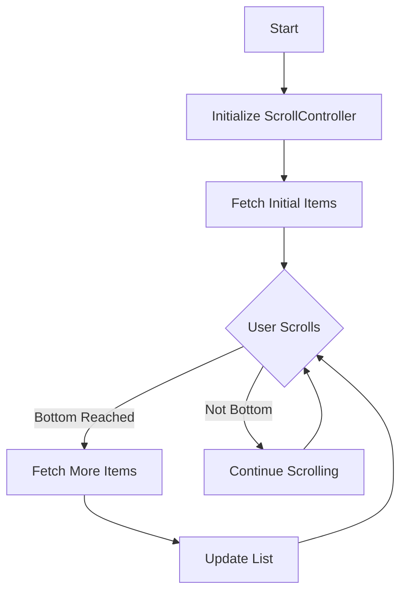

## 5.3.3 Infinite Scrolling and Pagination

In the world of mobile app development, managing large datasets efficiently is crucial for creating smooth and responsive user experiences. Infinite scrolling and pagination are two techniques that allow developers to load data incrementally, reducing the initial load time and memory usage. In this section, we will explore how to implement these techniques in Flutter, focusing on practical examples and best practices.

### Understanding Infinite Scrolling

Infinite scrolling is a design pattern used to load content continuously as the user scrolls down a list. This approach is particularly useful for applications that handle large datasets, such as social media feeds, news articles, or product catalogs. Infinite scrolling enhances user engagement by providing a seamless browsing experience without the need for pagination controls.

#### When to Use Infinite Scrolling

Infinite scrolling is ideal for scenarios where users are likely to browse through a large amount of content without a specific endpoint. However, it may not be suitable for all applications. Consider using infinite scrolling when:

- The content is dynamic and frequently updated.
- Users are expected to explore content rather than search for specific items.
- The dataset is too large to load all at once without affecting performance.

### Detecting Scroll Events

To implement infinite scrolling in Flutter, we need to detect when the user has scrolled to the bottom of the list. This is achieved using the `ScrollController` class, which provides listeners for scroll events.

#### Setting Up the ScrollController

The `ScrollController` allows us to monitor the scroll position and trigger actions when certain conditions are met. Here's a basic setup for detecting when the user reaches the end of the list:

```dart
class InfiniteListView extends StatefulWidget {
  @override
  _InfiniteListViewState createState() => _InfiniteListViewState();
}

class _InfiniteListViewState extends State<InfiniteListView> {
  ScrollController _scrollController = ScrollController();
  List<Item> _items = [];
  bool _isLoading = false;
  int _currentPage = 1;

  @override
  void initState() {
    super.initState();
    _fetchItems();
    _scrollController.addListener(() {
      if (_scrollController.position.pixels == _scrollController.position.maxScrollExtent && !_isLoading) {
        _fetchMoreItems();
      }
    });
  }

  Future<void> _fetchItems() async {
    setState(() {
      _isLoading = true;
    });
    // Fetch initial items...
    setState(() {
      _items.addAll(newItems);
      _isLoading = false;
    });
  }

  Future<void> _fetchMoreItems() async {
    setState(() {
      _isLoading = true;
    });
    _currentPage++;
    // Fetch more items...
    setState(() {
      _items.addAll(newItems);
      _isLoading = false;
    });
  }

  @override
  Widget build(BuildContext context) {
    return ListView.builder(
      controller: _scrollController,
      itemCount: _items.length + 1, // Add one for the loading indicator
      itemBuilder: (context, index) {
        if (index == _items.length) {
          return _isLoading ? Center(child: CircularProgressIndicator()) : SizedBox.shrink();
        }
        return ListTile(
          title: Text(_items[index].title),
        );
      },
    );
  }

  @override
  void dispose() {
    _scrollController.dispose();
    super.dispose();
  }
}
```

### Implementing Pagination Logic

Pagination involves dividing a dataset into discrete pages, which are loaded one at a time. This technique is often used in conjunction with infinite scrolling to manage large datasets efficiently.

#### Determining When to Load More Data

In the example above, we use the `ScrollController` to determine when the user has scrolled to the bottom of the list. When this occurs, we call the `_fetchMoreItems` method to load additional data.

#### Fetching Additional Data

Fetching additional data typically involves making an API call to retrieve the next set of items. It's important to manage the loading state and handle any errors that may occur during this process.

```dart
Future<void> _fetchMoreItems() async {
  setState(() {
    _isLoading = true;
  });
  _currentPage++;
  try {
    // Simulate API call
    final newItems = await fetchItemsFromApi(_currentPage);
    setState(() {
      _items.addAll(newItems);
      _isLoading = false;
    });
  } catch (error) {
    // Handle error
    setState(() {
      _isLoading = false;
    });
    print('Error fetching more items: $error');
  }
}
```

### Handling Asynchronous Data Loading

Asynchronous data loading is a key aspect of infinite scrolling and pagination. When fetching data from an API, it's important to consider the following:

- **Loading States:** Indicate to the user that data is being loaded, typically using a loading indicator.
- **Error Handling:** Gracefully handle any errors that occur during data fetching, such as network issues or API errors.
- **Performance Considerations:** Ensure that the app remains responsive by managing the number of concurrent API calls and optimizing data processing.

#### Example Use Case: Loading Items from a Web API

Let's consider an example where we load a list of items from a web API, fetching 20 items per page. We'll use a mock API function to simulate data fetching:

```dart
Future<List<Item>> fetchItemsFromApi(int page) async {
  await Future.delayed(Duration(seconds: 2)); // Simulate network delay
  return List.generate(20, (index) => Item(title: 'Item ${index + 1 + (page - 1) * 20}'));
}
```

### Using State Management

Managing the state of the list data and loading indicators is crucial for a smooth user experience. Flutter provides several state management solutions, such as `setState`, `Provider`, and `Bloc`.

#### Using `setState`

For simple use cases, `setState` can be used to manage the state of the list and loading indicators. This approach is straightforward but may become cumbersome as the app grows in complexity.

#### Using `Provider`

For more complex applications, consider using `Provider` or another state management solution to separate business logic from UI code. This approach makes the code more modular and easier to maintain.

```dart
class ItemProvider with ChangeNotifier {
  List<Item> _items = [];
  bool _isLoading = false;
  int _currentPage = 1;

  List<Item> get items => _items;
  bool get isLoading => _isLoading;

  Future<void> fetchItems() async {
    _isLoading = true;
    notifyListeners();
    try {
      final newItems = await fetchItemsFromApi(_currentPage);
      _items.addAll(newItems);
      _isLoading = false;
      notifyListeners();
    } catch (error) {
      _isLoading = false;
      notifyListeners();
      print('Error fetching items: $error');
    }
  }
}
```

### Visual Aids: Data Fetching Process Flowchart

To better understand the data fetching process, let's visualize the flow using a flowchart:



### Best Practices and Optimization Tips

- **Debouncing:** Implement debouncing to prevent excessive API calls when the user scrolls rapidly. This can be achieved by adding a delay before triggering the data fetch.
- **Testing on Devices:** Test the implementation on real devices to ensure smooth scrolling and responsive UI.
- **Performance Optimization:** Optimize the list rendering by using `ListView.builder` and avoiding unnecessary rebuilds.

### Common Pitfalls

- **Memory Usage:** Loading too many items at once can lead to high memory usage. Use pagination to limit the number of items in memory.
- **Error Handling:** Ensure that errors are handled gracefully to prevent the app from crashing.
- **Loading Indicators:** Always provide feedback to the user when data is being loaded to improve the user experience.

### Conclusion

Infinite scrolling and pagination are powerful techniques for managing large datasets in Flutter applications. By understanding the concepts and implementing best practices, you can create responsive and engaging user experiences. Remember to test your implementation thoroughly and optimize for performance to ensure a smooth scrolling experience.

## Quiz Time!



### What is infinite scrolling?

- [x] A design pattern that loads content continuously as the user scrolls down.
- [ ] A method to load all data at once.
- [ ] A technique to paginate content with buttons.
- [ ] A way to display content in a grid layout.

> **Explanation:** Infinite scrolling is a design pattern used to load content continuously as the user scrolls down a list, enhancing user engagement.

### Which Flutter class is used to detect scroll events?

- [x] ScrollController
- [ ] ScrollView
- [ ] ScrollNotifier
- [ ] ScrollListener

> **Explanation:** The `ScrollController` class is used to monitor scroll events and trigger actions when certain conditions are met.

### What is the purpose of pagination?

- [x] To divide a dataset into discrete pages for efficient loading.
- [ ] To load all data at once.
- [ ] To display data in a grid format.
- [ ] To create a static list of items.

> **Explanation:** Pagination involves dividing a dataset into discrete pages, which are loaded one at a time, reducing memory usage and improving performance.

### How can you prevent excessive API calls when implementing infinite scrolling?

- [x] Implement debouncing
- [ ] Increase the page size
- [ ] Use a different API
- [ ] Load all data at once

> **Explanation:** Debouncing helps prevent excessive API calls by adding a delay before triggering the data fetch when the user scrolls rapidly.

### What is a common pitfall when implementing infinite scrolling?

- [x] High memory usage due to loading too many items at once.
- [ ] Loading data too slowly.
- [ ] Displaying too few items.
- [ ] Using too many loading indicators.

> **Explanation:** Loading too many items at once can lead to high memory usage, which is a common pitfall when implementing infinite scrolling.

### Which state management solution is suitable for simple use cases?

- [x] setState
- [ ] Provider
- [ ] Bloc
- [ ] Redux

> **Explanation:** `setState` is suitable for managing state in simple use cases, but may become cumbersome as the app grows in complexity.

### What should you do to ensure smooth scrolling in your app?

- [x] Test on real devices
- [ ] Use a simulator only
- [ ] Ignore performance issues
- [ ] Load all data at once

> **Explanation:** Testing on real devices ensures that the app provides smooth scrolling and a responsive UI.

### What should you do if an error occurs during data fetching?

- [x] Handle the error gracefully
- [ ] Ignore the error
- [ ] Retry the fetch immediately
- [ ] Display a generic error message

> **Explanation:** Handling errors gracefully prevents the app from crashing and improves the user experience.

### What is the benefit of using `Provider` for state management?

- [x] It separates business logic from UI code.
- [ ] It makes the code more complex.
- [ ] It reduces the app's performance.
- [ ] It is only suitable for small apps.

> **Explanation:** Using `Provider` or another state management solution separates business logic from UI code, making the app more modular and maintainable.

### True or False: Infinite scrolling is suitable for all applications.

- [ ] True
- [x] False

> **Explanation:** Infinite scrolling is not suitable for all applications. It is ideal for scenarios where users are likely to browse through a large amount of content without a specific endpoint.


