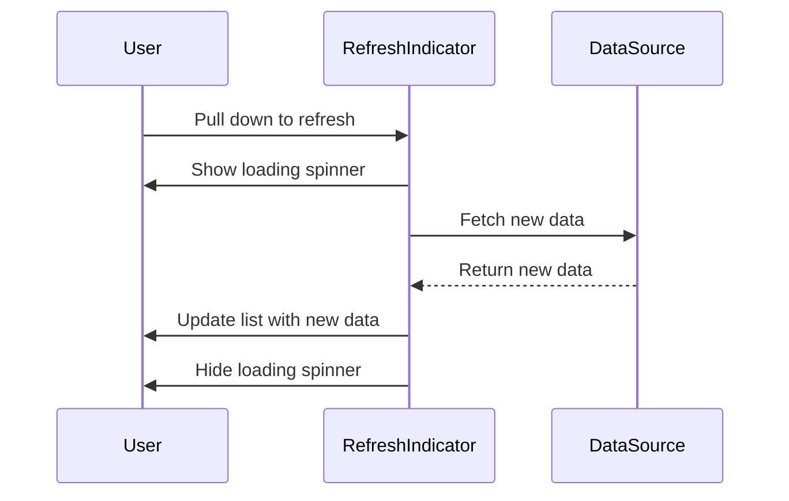

## 5.3.4 Pull-to-Refresh Feature

In today's fast-paced digital world, users expect real-time updates and seamless interactions within mobile applications. One of the most intuitive and user-friendly features that cater to this expectation is the pull-to-refresh mechanism. This feature allows users to refresh the content of a list or feed by simply pulling down on the screen. In this section, we will explore how to implement this functionality in your Flutter applications using the `RefreshIndicator` widget.

### Introducing the RefreshIndicator Widget

The `RefreshIndicator` widget in Flutter is a powerful tool that provides the pull-to-refresh functionality with minimal setup. It is designed to work with scrollable widgets, such as `ListView`, `GridView`, or any other widget that implements the `Scrollable` interface. The `RefreshIndicator` widget displays a circular progress indicator to inform users that a refresh operation is in progress.

#### Key Features of RefreshIndicator

- **Ease of Use:** Integrates seamlessly with existing scrollable widgets.
- **Visual Feedback:** Provides a built-in loading spinner to indicate refresh status.
- **Customizable:** Allows customization of the refresh indicator's appearance and behavior.

### Implementing Pull-to-Refresh

To implement the pull-to-refresh feature, you need to wrap your scrollable widget with a `RefreshIndicator`. The `onRefresh` callback is a crucial part of this setup, as it defines the action to be taken when the user triggers a refresh. This callback must return a `Future<void>`, indicating the asynchronous nature of the refresh operation.

#### Step-by-Step Implementation

1. **Wrap Your Scrollable Widget:**
   Begin by wrapping your `ListView` or any other scrollable widget with a `RefreshIndicator`.

   ```dart
   RefreshIndicator(
     onRefresh: _refreshData,
     child: ListView.builder(
       itemCount: _items.length,
       itemBuilder: (context, index) {
         return ListTile(
           title: Text(_items[index].title),
         );
       },
     ),
   );
   ```

2. **Define the onRefresh Callback:**
   Implement the `_refreshData` method to fetch new data and update the list. This method should perform asynchronous operations and update the state of the widget.

   ```dart
   Future<void> _refreshData() async {
     try {
       // Fetch new data
       final newData = await fetchData();
       setState(() {
         _items = newData;
       });
     } catch (error) {
       // Handle exceptions
       print('Error refreshing data: $error');
     }
   }
   ```

3. **Provide User Feedback:**
   The `RefreshIndicator` automatically provides a loading spinner, but you can enhance user feedback by displaying messages or animations during the refresh process.

### Updating Data on Refresh

The primary goal of the pull-to-refresh feature is to update the displayed data with the latest information. This often involves making network requests to fetch new data from a server or database. It's crucial to handle these operations efficiently to ensure a smooth user experience.

#### Fetching New Data

When implementing the `_refreshData` method, consider the following best practices:

- **Asynchronous Operations:** Use asynchronous functions to fetch data without blocking the UI thread.
- **Error Handling:** Implement robust error handling to manage network failures or data parsing errors.
- **Optimistic UI Updates:** Consider updating the UI optimistically to provide immediate feedback to users, even before the data is fully loaded.

### Example Use Case: Refreshing a News Feed

Let's consider a practical example where you implement the pull-to-refresh feature in a news application. The goal is to refresh the list of articles to display the latest news.

#### Code Example

```dart
class NewsFeed extends StatefulWidget {
  @override
  _NewsFeedState createState() => _NewsFeedState();
}

class _NewsFeedState extends State<NewsFeed> {
  List<Article> _articles = [];

  @override
  void initState() {
    super.initState();
    _loadInitialData();
  }

  Future<void> _loadInitialData() async {
    final initialData = await fetchInitialData();
    setState(() {
      _articles = initialData;
    });
  }

  Future<void> _refreshData() async {
    try {
      final newData = await fetchLatestArticles();
      setState(() {
        _articles = newData;
      });
    } catch (error) {
      print('Error fetching latest articles: $error');
    }
  }

  @override
  Widget build(BuildContext context) {
    return RefreshIndicator(
      onRefresh: _refreshData,
      child: ListView.builder(
        itemCount: _articles.length,
        itemBuilder: (context, index) {
          return ListTile(
            title: Text(_articles[index].title),
            subtitle: Text(_articles[index].summary),
          );
        },
      ),
    );
  }
}
```

### Visual Aids: Understanding the Pull-to-Refresh Action

To better understand the pull-to-refresh mechanism, let's visualize the process using a sequence diagram. This diagram illustrates the interactions between the user, the `RefreshIndicator`, and the data source.



### Best Practices and Optimization Tips

Implementing the pull-to-refresh feature effectively requires attention to detail and adherence to best practices. Here are some tips to optimize your implementation:

- **Minimize Network Requests:** Avoid excessive network requests by implementing caching strategies or debouncing techniques.
- **Optimize Data Parsing:** Use efficient data parsing methods to reduce processing time and improve performance.
- **User Experience:** Ensure that the refresh operation is quick and responsive to maintain a positive user experience.

### Troubleshooting Common Issues

While implementing the pull-to-refresh feature, you may encounter some common issues. Here are a few troubleshooting tips:

- **RefreshIndicator Not Triggering:** Ensure that the scrollable widget is wrapped correctly and that the `onRefresh` callback is properly defined.
- **Data Not Updating:** Verify that the state is being updated correctly within the `setState` method.
- **Error Handling:** Implement comprehensive error handling to manage network failures or data parsing errors gracefully.

### Conclusion

The pull-to-refresh feature is a powerful tool for enhancing the user experience in mobile applications. By leveraging the `RefreshIndicator` widget in Flutter, you can implement this functionality with ease and efficiency. Remember to follow best practices, provide user feedback, and handle exceptions to ensure a seamless and responsive application.

## Quiz Time!



### What widget provides the pull-to-refresh functionality in Flutter?

- [x] RefreshIndicator
- [ ] ListView
- [ ] GridView
- [ ] ScrollView

> **Explanation:** The `RefreshIndicator` widget provides the pull-to-refresh functionality in Flutter applications.

### What must the onRefresh callback return?

- [x] Future<void>
- [ ] void
- [ ] Future<bool>
- [ ] bool

> **Explanation:** The `onRefresh` callback must return a `Future<void>` to indicate the asynchronous nature of the refresh operation.

### Which widget is typically wrapped by the RefreshIndicator?

- [x] ListView
- [ ] Container
- [ ] Column
- [ ] Row

> **Explanation:** The `RefreshIndicator` is typically used to wrap a `ListView` or any other scrollable widget.

### What is a key feature of the RefreshIndicator widget?

- [x] Provides a built-in loading spinner
- [ ] Automatically fetches data
- [ ] Displays a dialog box
- [ ] Sends notifications

> **Explanation:** The `RefreshIndicator` provides a built-in loading spinner to indicate the refresh status to users.

### How can you enhance user feedback during a refresh?

- [x] Display messages or animations
- [ ] Disable the UI
- [ ] Hide the loading spinner
- [ ] Increase the refresh duration

> **Explanation:** Displaying messages or animations can enhance user feedback during the refresh process.

### What should you consider when fetching new data?

- [x] Asynchronous operations
- [ ] Synchronous operations
- [ ] Blocking the UI
- [ ] Ignoring errors

> **Explanation:** Asynchronous operations should be used to fetch data without blocking the UI thread.

### What is a common issue when implementing pull-to-refresh?

- [x] RefreshIndicator not triggering
- [ ] Data always updating
- [ ] Loading spinner not visible
- [ ] UI freezing

> **Explanation:** A common issue is the `RefreshIndicator` not triggering, often due to incorrect setup.

### How can you optimize data parsing?

- [x] Use efficient data parsing methods
- [ ] Use inefficient methods
- [ ] Ignore data parsing
- [ ] Use synchronous parsing

> **Explanation:** Using efficient data parsing methods can reduce processing time and improve performance.

### What is the purpose of the sequence diagram?

- [x] Illustrate the pull-to-refresh process
- [ ] Display UI elements
- [ ] Show code structure
- [ ] List application features

> **Explanation:** The sequence diagram illustrates the interactions and process of the pull-to-refresh feature.

### True or False: The RefreshIndicator widget can only be used with ListView.

- [ ] True
- [x] False

> **Explanation:** False. The `RefreshIndicator` can be used with any scrollable widget, not just `ListView`.


