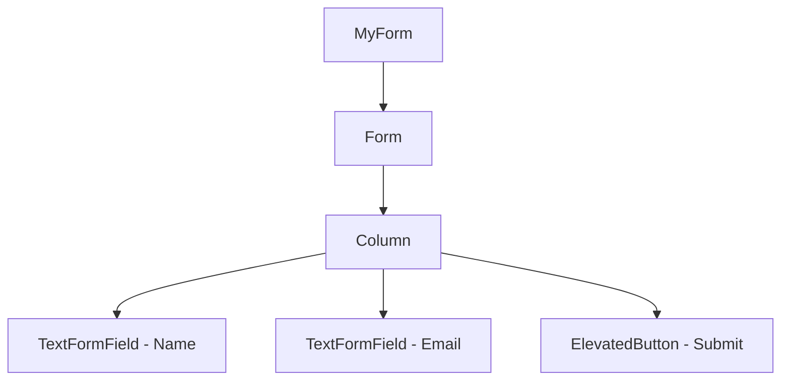

---

linkTitle: "5.4.1 Creating Forms with Form Widget"
title: "Creating Forms with Form Widget in Flutter"
description: "Learn how to create and manage forms in Flutter using the Form widget, including validation and state management."
categories:
- Flutter Development
- Mobile App Development
- User Interface Design
tags:
- Flutter
- Form Widget
- User Input
- Mobile Development
- Form Validation
date: 2024-10-25
type: docs
nav_weight: 541000
canonical: "https://fluttermasterylibrary.com/2/5/4/1"
license: "© 2023 Tokenizer Inc. CC BY-NC-SA 4.0"
---

## 5.4.1 Creating Forms with Form Widget

Creating forms is a fundamental aspect of mobile app development, allowing users to input data that your app can process. In Flutter, the `Form` widget provides a powerful and flexible way to build forms with ease. This section will guide you through the process of creating forms using the `Form` widget, managing form state, and validating user input.

### Understanding the Form Widget

The `Form` widget in Flutter acts as a container for grouping and validating multiple form fields. It provides a structure for managing the state of form fields and facilitates validation and data submission. By using a `Form`, you can ensure that all form fields are validated and saved in a consistent manner.

#### Key Features of the Form Widget

- **State Management:** The `Form` widget manages the state of its child form fields, allowing you to easily validate and save their values.
- **Validation:** You can define validation logic for each form field, ensuring that user input meets the required criteria before submission.
- **Submission:** The `Form` widget provides methods to save and submit form data, making it easy to process user input.

### Using FormFields

Form fields are the building blocks of a form. Flutter provides several form field widgets, with `TextFormField` being the most commonly used. These widgets extend the functionality of regular input fields by integrating validation and state management features.

#### TextFormField vs. TextField

- **TextFormField:** Designed specifically for use within a `Form`, it includes built-in support for validation and state management.
- **TextField:** A basic input field without form-specific features. Use `TextFormField` when you need validation and state management.

### Managing Form State

Managing the state of a form is crucial for handling user input effectively. In Flutter, you use a `GlobalKey<FormState>` to manage the form's state. This key allows you to access the form's state and perform actions like validation and saving.

#### Using GlobalKey<FormState>

- **Initialization:** Create a `GlobalKey<FormState>` and assign it to your `Form` widget.
- **Accessing State:** Use the key to access the form's state and call methods like `validate()` and `save()`.

### Organizing Form Fields

Arranging form fields in a user-friendly layout is essential for creating an intuitive user interface. Flutter provides several layout widgets, such as `Column` and `ListView`, to help you organize form fields effectively.

#### Layout Widgets

- **Column:** Use a `Column` to arrange form fields vertically. It's suitable for simple forms with a small number of fields.
- **ListView:** Use a `ListView` for forms with many fields, allowing users to scroll through the form.

### Basic Form Implementation

Let's implement a basic form using the concepts discussed above. We'll create a form with two fields: Name and Email. We'll also include a submit button to process the form data.

```dart
class MyForm extends StatefulWidget {
  @override
  _MyFormState createState() => _MyFormState();
}

class _MyFormState extends State<MyForm> {
  final _formKey = GlobalKey<FormState>();
  String _name = '';
  String _email = '';

  @override
  Widget build(BuildContext context) {
    return Form(
      key: _formKey,
      child: Padding(
        padding: EdgeInsets.all(16.0),
        child: Column(
          children: <Widget>[
            TextFormField(
              decoration: InputDecoration(labelText: 'Name'),
              onSaved: (value) {
                _name = value ?? '';
              },
            ),
            TextFormField(
              decoration: InputDecoration(labelText: 'Email'),
              onSaved: (value) {
                _email = value ?? '';
              },
            ),
            SizedBox(height: 20),
            ElevatedButton(
              onPressed: _submitForm,
              child: Text('Submit'),
            ),
          ],
        ),
      ),
    );
  }

  void _submitForm() {
    if (_formKey.currentState!.validate()) {
      _formKey.currentState!.save();
      // Process the data
    }
  }
}
```

### Visualizing the Form

To help you visualize the form structure, let's use a Mermaid diagram to represent the widget hierarchy.



### Best Practices for Form Design

1. **Labeling:** Ensure all form fields have clear and descriptive labels. This improves accessibility and helps users understand what information is required.
2. **Validation:** Implement validation logic for each field to prevent invalid data submission. Use `TextFormField`'s `validator` property to define validation rules.
3. **Input Types:** Use appropriate input types for each field. For example, use `TextInputType.emailAddress` for email fields to provide a better user experience.
4. **Focus Management:** Handle focus and keyboard actions to improve form navigation. Use `FocusNode` to manage focus programmatically.

### Advanced Form Techniques

#### Custom Validators

You can create custom validators to enforce specific validation rules. A validator is a function that returns a string if the input is invalid or `null` if it's valid.

```dart
String? _validateEmail(String? value) {
  if (value == null || value.isEmpty) {
    return 'Email is required';
  }
  if (!RegExp(r'^[^@]+@[^@]+\.[^@]+').hasMatch(value)) {
    return 'Enter a valid email';
  }
  return null;
}
```

#### Handling Focus

Managing focus between form fields enhances user experience. Use `FocusNode` to control focus programmatically.

```dart
final _nameFocusNode = FocusNode();
final _emailFocusNode = FocusNode();

TextFormField(
  focusNode: _nameFocusNode,
  onFieldSubmitted: (_) {
    FocusScope.of(context).requestFocus(_emailFocusNode);
  },
  decoration: InputDecoration(labelText: 'Name'),
  onSaved: (value) {
    _name = value ?? '';
  },
),
```

#### Asynchronous Validation

For complex validation scenarios, such as checking username availability, you might need asynchronous validation. Use `FutureBuilder` or similar techniques to handle asynchronous operations.

### Conclusion

Creating forms in Flutter using the `Form` widget is a powerful way to collect and manage user input. By understanding the `Form` widget, using `TextFormField`, managing form state, and organizing form fields, you can build robust and user-friendly forms. Remember to follow best practices for form design and validation to ensure a seamless user experience.

## Quiz Time!



### What is the primary purpose of the Form widget in Flutter?

- [x] To group and validate multiple form fields
- [ ] To create a single input field
- [ ] To manage app navigation
- [ ] To handle animations

> **Explanation:** The `Form` widget acts as a container for grouping and validating multiple form fields, providing a structure for managing their state.

### Which widget is specifically designed for use within a Form?

- [x] TextFormField
- [ ] TextField
- [ ] Container
- [ ] ListView

> **Explanation:** `TextFormField` is designed for use within a `Form`, providing built-in support for validation and state management.

### How do you manage the state of a form in Flutter?

- [x] Using GlobalKey<FormState>
- [ ] Using a StatefulWidget
- [ ] Using a StatelessWidget
- [ ] Using a StreamBuilder

> **Explanation:** A `GlobalKey<FormState>` is used to manage the state of a form, allowing access to validation and saving methods.

### Which layout widget is suitable for a form with many fields?

- [ ] Column
- [x] ListView
- [ ] Row
- [ ] Stack

> **Explanation:** `ListView` is suitable for forms with many fields, as it allows users to scroll through the form.

### What is the purpose of the validator property in TextFormField?

- [x] To define validation logic for the field
- [ ] To set the initial value of the field
- [ ] To style the field
- [ ] To handle focus changes

> **Explanation:** The `validator` property is used to define validation logic for a form field, ensuring that user input meets the required criteria.

### How can you manage focus between form fields?

- [x] Using FocusNode
- [ ] Using a StatefulWidget
- [ ] Using a StatelessWidget
- [ ] Using a StreamBuilder

> **Explanation:** `FocusNode` is used to manage focus programmatically between form fields, enhancing user experience.

### What is a custom validator in Flutter?

- [x] A function that returns a string if the input is invalid
- [ ] A widget that displays error messages
- [ ] A method to save form data
- [ ] A property to style form fields

> **Explanation:** A custom validator is a function that returns a string if the input is invalid or `null` if it's valid, allowing for specific validation rules.

### How can you handle asynchronous validation in Flutter forms?

- [x] Using FutureBuilder
- [ ] Using a StatefulWidget
- [ ] Using a StatelessWidget
- [ ] Using a StreamBuilder

> **Explanation:** `FutureBuilder` or similar techniques can be used to handle asynchronous operations, such as checking username availability.

### What is the benefit of using appropriate input types for form fields?

- [x] It provides a better user experience
- [ ] It increases app performance
- [ ] It reduces code complexity
- [ ] It enhances security

> **Explanation:** Using appropriate input types, such as `TextInputType.emailAddress` for email fields, provides a better user experience by offering relevant keyboard layouts.

### True or False: The Form widget automatically saves form data.

- [ ] True
- [x] False

> **Explanation:** The `Form` widget does not automatically save form data. You must call the `save()` method on the form's state to save the data.


