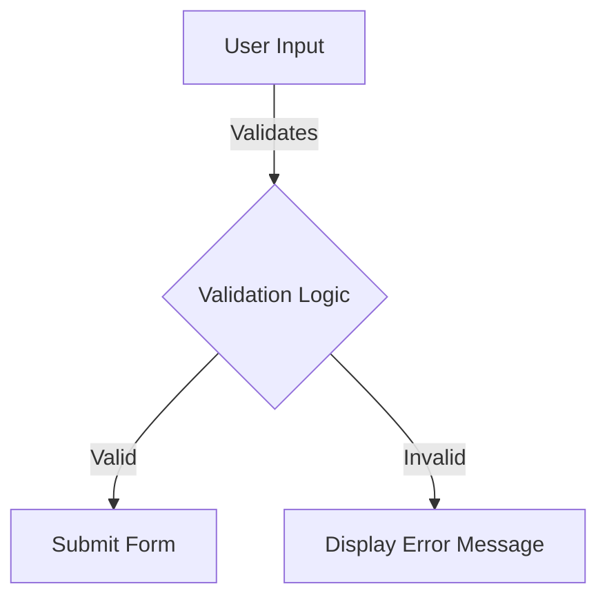

## 5.4.2 Validating Input Data

In the journey from zero to app store, one of the critical aspects of app development is ensuring that the data entered by users is valid and meaningful. This section will guide you through the process of validating input data in Flutter forms, ensuring data integrity, and providing immediate feedback to users. By the end of this section, you will have a solid understanding of how to implement robust validation logic in your Flutter applications.

### Understanding the Importance of Input Validation

Input validation is a crucial step in any application that collects data from users. It helps to:

- **Ensure Data Integrity:** By validating inputs, you prevent invalid data from being processed or stored, which can lead to application errors or data corruption.
- **Enhance User Experience:** Providing immediate feedback to users about their input errors improves the overall user experience and reduces frustration.
- **Improve Security:** Proper validation can help protect your application from malicious inputs, such as SQL injection or cross-site scripting attacks.

### Using the Validator Property in Flutter

Flutter provides a convenient way to validate form fields using the `validator` property of the `TextFormField` widget. The `validator` is a function that takes the current value of the field as input and returns an error message if the validation fails, or `null` if the input is valid.

#### Example: Implementing a Basic Validator

Here's a simple example of how to use the `validator` property to ensure that an email field is not empty and contains a valid email address:

```dart
TextFormField(
  decoration: InputDecoration(labelText: 'Email'),
  validator: (value) {
    if (value == null || value.isEmpty) {
      return 'Please enter your email';
    }
    if (!RegExp(r'^[^@]+@[^@]+\.[^@]+').hasMatch(value)) {
      return 'Please enter a valid email address';
    }
    return null;
  },
);
```

In this example, the `validator` checks if the input is empty or if it does not match a basic email pattern, returning an appropriate error message in each case.

### Defining Common Validation Logic

When building forms, you'll often need to apply common validation rules. Here are some typical scenarios:

#### Required Fields

To ensure a field is not left empty, you can use a simple check:

```dart
validator: (value) {
  if (value == null || value.isEmpty) {
    return 'This field is required';
  }
  return null;
}
```

#### Email Format

To validate an email address, use a regular expression:

```dart
validator: (value) {
  if (value == null || value.isEmpty) {
    return 'Please enter your email';
  }
  if (!RegExp(r'^[^@]+@[^@]+\.[^@]+').hasMatch(value)) {
    return 'Please enter a valid email address';
  }
  return null;
}
```

#### Password Strength

For password fields, you might want to ensure a certain level of complexity:

```dart
validator: (value) {
  if (value == null || value.isEmpty) {
    return 'Please enter your password';
  }
  if (value.length < 8) {
    return 'Password must be at least 8 characters long';
  }
  if (!RegExp(r'(?=.*?[#?!@$%^&*-])').hasMatch(value)) {
    return 'Passwords must have at least one special character';
  }
  return null;
}
```

### Displaying Validation Messages

Flutter automatically displays validation messages below the input fields when the form is validated. To trigger validation, you typically call the `validate()` method on the `FormState` object, which checks all fields and displays any error messages.

#### Example: Validating a Form

Here's how you can validate an entire form and display error messages:

```dart
final _formKey = GlobalKey<FormState>();

Form(
  key: _formKey,
  child: Column(
    children: <Widget>[
      TextFormField(
        decoration: InputDecoration(labelText: 'Email'),
        validator: (value) {
          if (value == null || value.isEmpty) {
            return 'Please enter your email';
          }
          if (!RegExp(r'^[^@]+@[^@]+\.[^@]+').hasMatch(value)) {
            return 'Please enter a valid email address';
          }
          return null;
        },
      ),
      ElevatedButton(
        onPressed: () {
          if (_formKey.currentState!.validate()) {
            // Process data.
          }
        },
        child: Text('Submit'),
      ),
    ],
  ),
);
```

In this example, when the user presses the "Submit" button, the form is validated, and error messages are displayed for any invalid fields.

### Custom Validators

While the built-in validation logic covers many common scenarios, you may need to implement custom validators for specific use cases. Custom validators allow you to define complex validation logic tailored to your application's needs.

#### Example: Creating a Custom Validator

Suppose you need to validate a username field to ensure it is unique within a list of existing usernames:

```dart
List<String> existingUsernames = ['user1', 'user2', 'user3'];

validator: (value) {
  if (value == null || value.isEmpty) {
    return 'Please enter a username';
  }
  if (existingUsernames.contains(value)) {
    return 'This username is already taken';
  }
  return null;
}
```

### Form Submission Considerations

When submitting a form, it's essential to re-validate inputs to ensure no invalid data is processed. This is particularly important if the form data is being sent to a server or used in critical operations.

#### Example: Re-validating on Submission

```dart
ElevatedButton(
  onPressed: () {
    if (_formKey.currentState!.validate()) {
      // Re-validate inputs and process data.
    }
  },
  child: Text('Submit'),
);
```

### Best Practices for Input Validation

- **Keep Validation Messages Clear:** Ensure that error messages are concise and informative, guiding users to correct their inputs.
- **Avoid Revealing Sensitive Criteria:** For security reasons, avoid providing detailed validation criteria for sensitive fields like passwords.
- **Provide Real-time Feedback:** Consider using Flutter's `onChanged` property to provide real-time validation feedback as users type.
- **Test Validation Logic Thoroughly:** Ensure that all validation logic is thoroughly tested to handle edge cases and unexpected inputs.

### Visual Aids: Form with Validation Messages

To better understand how validation messages appear in a Flutter form, consider the following diagram:



This flowchart illustrates the process of user input being validated and either submitted if valid or displaying an error message if invalid.

### Conclusion

Validating input data is a fundamental aspect of building robust Flutter applications. By leveraging the `validator` property, defining common and custom validation logic, and providing clear feedback to users, you can ensure data integrity and enhance user experience. Remember to re-validate inputs on form submission and adhere to best practices to maintain security and usability.

## Quiz Time!



### What is the primary purpose of input validation in Flutter forms?

- [x] To ensure data integrity and provide immediate feedback to users
- [ ] To improve the aesthetic appearance of the form
- [ ] To reduce the size of the application
- [ ] To increase the speed of form submission

> **Explanation:** Input validation ensures that the data entered by users is valid and meaningful, providing immediate feedback to enhance user experience and prevent invalid data processing.

### Which property is used in `TextFormField` to define validation logic?

- [x] validator
- [ ] decoration
- [ ] controller
- [ ] onChanged

> **Explanation:** The `validator` property is used in `TextFormField` to define a function that validates the input and returns an error message if the input is invalid.

### How can you ensure a field is not left empty in a Flutter form?

- [x] Use a validator that checks if the value is null or empty
- [ ] Set a default value for the field
- [ ] Disable the field
- [ ] Use a placeholder text

> **Explanation:** To ensure a field is not left empty, use a validator function that checks if the value is null or empty and returns an appropriate error message.

### What is a common method to validate an email address in Flutter?

- [x] Use a regular expression in the validator function
- [ ] Check if the input contains the "@" symbol
- [ ] Limit the input length to a maximum of 20 characters
- [ ] Convert the input to lowercase

> **Explanation:** A common method to validate an email address is to use a regular expression in the validator function to ensure the input matches a valid email pattern.

### When should you re-validate inputs in a Flutter form?

- [x] On form submission
- [ ] Only when the form is first loaded
- [ ] After every keystroke
- [ ] When the form is closed

> **Explanation:** Inputs should be re-validated on form submission to ensure no invalid data is processed, especially when sending data to a server or performing critical operations.

### What is a benefit of providing real-time validation feedback?

- [x] It enhances user experience by guiding users as they type
- [ ] It reduces the amount of code needed for validation
- [ ] It prevents any form errors from occurring
- [ ] It automatically corrects user input

> **Explanation:** Providing real-time validation feedback enhances user experience by guiding users to correct their inputs as they type, reducing frustration and improving usability.

### Why should you avoid revealing detailed validation criteria for passwords?

- [x] For security reasons, to prevent malicious users from exploiting the criteria
- [ ] To make the form look cleaner
- [ ] To reduce the amount of text on the screen
- [ ] To speed up form submission

> **Explanation:** Avoid revealing detailed validation criteria for passwords to maintain security and prevent malicious users from exploiting the criteria to guess or crack passwords.

### What should a custom validator return if the input is valid?

- [x] null
- [ ] An empty string
- [ ] A success message
- [ ] The input value

> **Explanation:** A custom validator should return `null` if the input is valid, indicating that there are no errors with the input.

### Which of the following is a best practice for writing validation messages?

- [x] Keep them clear and user-friendly
- [ ] Use technical jargon
- [ ] Make them as brief as possible, even if unclear
- [ ] Include detailed validation criteria

> **Explanation:** Validation messages should be clear and user-friendly to effectively guide users in correcting their inputs.

### True or False: The `validate()` method on the `FormState` object checks all fields and displays any error messages.

- [x] True
- [ ] False

> **Explanation:** True. The `validate()` method on the `FormState` object checks all fields in the form and displays error messages for any invalid fields.


