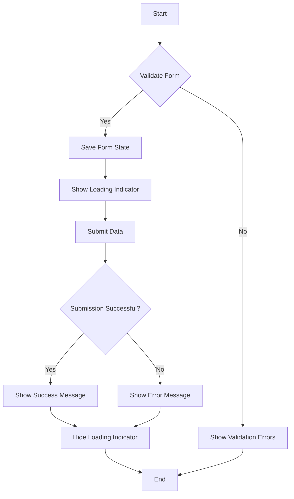

---

linkTitle: "5.4.3 Handling Form Submission"
title: "Handling Form Submission in Flutter: From Data Extraction to Server Communication"
description: "Learn how to handle form submission in Flutter, including saving form state, validating inputs, submitting data, and managing asynchronous operations with feedback mechanisms."
categories:
- Flutter Development
- Mobile App Development
- Form Handling
tags:
- Flutter
- Form Submission
- Data Validation
- Asynchronous Programming
- User Feedback
date: 2024-10-25
type: docs
nav_weight: 5430

---

## 5.4.3 Handling Form Submission

In the journey of building a Flutter application, handling form submissions is a critical aspect that can significantly impact user experience. This section will guide you through the process of managing form data upon submission, ensuring data integrity, and providing a seamless user experience. We will cover saving form state, validating inputs, submitting data, handling asynchronous operations, and providing user feedback.

### Saving Form State

When dealing with forms in Flutter, maintaining the state of form fields is essential. Flutter provides a robust mechanism for managing form state using the `Form` widget and its associated `FormField` widgets, such as `TextFormField`. The `onSaved` callback is a key feature that allows you to save the form state when the form is submitted.

#### Using `onSaved` Callback

The `onSaved` callback is triggered when the `save()` method is called on the `FormState`. This is where you can extract and store the data from each form field.

```dart
final GlobalKey<FormState> _formKey = GlobalKey<FormState>();
String _username = '';
String _email = '';

void _saveForm() {
  if (_formKey.currentState!.validate()) {
    _formKey.currentState!.save();
    // Now _username and _email contain the form data
  }
}

@override
Widget build(BuildContext context) {
  return Form(
    key: _formKey,
    child: Column(
      children: <Widget>[
        TextFormField(
          decoration: InputDecoration(labelText: 'Username'),
          onSaved: (value) {
            _username = value!;
          },
        ),
        TextFormField(
          decoration: InputDecoration(labelText: 'Email'),
          onSaved: (value) {
            _email = value!;
          },
        ),
        ElevatedButton(
          onPressed: _saveForm,
          child: Text('Submit'),
        ),
      ],
    ),
  );
}
```

### Validating Before Submission

Validation is crucial to ensure that the data being submitted meets the required criteria. Flutter provides a `validate()` method on the `FormState` which checks all the form fields and returns `true` if they are valid.

#### Implementing Validation

Each `FormField` widget has a `validator` property where you can define your validation logic. Here's an example:

```dart
TextFormField(
  decoration: InputDecoration(labelText: 'Email'),
  validator: (value) {
    if (value == null || value.isEmpty) {
      return 'Please enter your email';
    }
    if (!RegExp(r'^[^@]+@[^@]+\.[^@]+').hasMatch(value)) {
      return 'Please enter a valid email address';
    }
    return null;
  },
  onSaved: (value) {
    _email = value!;
  },
)
```

### Submitting Data

Once the form is validated and the data is saved, the next step is to submit the data. This often involves sending the data to a server or processing it locally.

#### Collecting and Submitting Data

Here's a complete example of collecting data from a form and simulating a submission process:

```dart
void _submitForm() async {
  if (_formKey.currentState!.validate()) {
    _formKey.currentState!.save();
    // Show loading indicator
    setState(() {
      _isLoading = true;
    });
    try {
      // Simulate a network request
      await Future.delayed(Duration(seconds: 2));
      // Handle successful submission
      ScaffoldMessenger.of(context).showSnackBar(
        SnackBar(content: Text('Form submitted successfully!')),
      );
    } catch (error) {
      // Handle submission error
      ScaffoldMessenger.of(context).showSnackBar(
        SnackBar(content: Text('Submission failed. Please try again.')),
      );
    } finally {
      // Hide loading indicator
      setState(() {
        _isLoading = false;
      });
    }
  }
}
```

### Asynchronous Operations

Handling asynchronous operations is a common requirement during form submissions, especially when interacting with remote servers. Flutter's `async` and `await` keywords make it easy to manage asynchronous tasks.

#### Managing Asynchronous Tasks

In the example above, `Future.delayed` simulates a network request. In a real-world scenario, you would replace this with an actual API call using packages like `http` or `dio`.

```dart
import 'package:http/http.dart' as http;

Future<void> _submitData() async {
  final response = await http.post(
    Uri.parse('https://example.com/submit'),
    body: {'username': _username, 'email': _email},
  );

  if (response.statusCode == 200) {
    // Handle success
  } else {
    // Handle error
  }
}
```

### Providing Feedback

Providing feedback to users during form submission is crucial for a good user experience. This includes showing loading indicators while the submission is in progress and displaying messages upon success or failure.

#### Showing Loading Indicators

You can use a `CircularProgressIndicator` to indicate that a submission is in progress:

```dart
bool _isLoading = false;

@override
Widget build(BuildContext context) {
  return Stack(
    children: <Widget>[
      Form(
        key: _formKey,
        child: Column(
          children: <Widget>[
            // Form fields
            ElevatedButton(
              onPressed: _submitForm,
              child: Text('Submit'),
            ),
          ],
        ),
      ),
      if (_isLoading)
        Center(
          child: CircularProgressIndicator(),
        ),
    ],
  );
}
```

### Error Handling and Best Practices

Error handling is an essential part of form submission, especially when dealing with network requests. Always anticipate potential failures and provide meaningful feedback to the user.

#### Common Pitfalls

- **Ignoring Validation:** Always validate form data before submission to prevent invalid data from being processed.
- **Blocking UI:** Avoid blocking the UI during long-running tasks. Use asynchronous programming to keep the UI responsive.
- **Multiple Submissions:** Prevent multiple submissions by disabling the submit button or using a loading indicator.

#### Best Practices

- **Use Global Keys:** Use a `GlobalKey<FormState>` to manage the form state effectively.
- **Provide Feedback:** Always inform users about the status of their submission.
- **Error Messages:** Display clear and concise error messages to guide users in correcting their input.

### Visualizing the Submission Process

To better understand the flow of form submission, let's visualize the process using a flowchart:



### Conclusion

Handling form submissions in Flutter involves several steps, from validating and saving form data to managing asynchronous operations and providing user feedback. By following the best practices outlined in this section, you can ensure a smooth and efficient form submission process in your Flutter applications.

---

## Quiz Time!



### What is the purpose of the `onSaved` callback in a form field?

- [x] To save the form field's value when the form is submitted
- [ ] To validate the form field's input
- [ ] To display an error message
- [ ] To reset the form field's value

> **Explanation:** The `onSaved` callback is used to save the form field's value when the form's `save()` method is called.

### Which method is used to validate all form fields in a Flutter form?

- [ ] save()
- [x] validate()
- [ ] submit()
- [ ] check()

> **Explanation:** The `validate()` method is used to check if all form fields are valid.

### How can you prevent multiple submissions of a form?

- [x] Disable the submit button during submission
- [ ] Use a `TextField` instead of `TextFormField`
- [ ] Avoid using a `GlobalKey`
- [x] Show a loading indicator during submission

> **Explanation:** Disabling the submit button and showing a loading indicator are effective ways to prevent multiple submissions.

### What should you do if a network request fails during form submission?

- [ ] Ignore the error
- [x] Display an error message to the user
- [ ] Retry the request indefinitely
- [ ] Log the error and continue

> **Explanation:** Displaying an error message helps inform the user about the failure and allows them to take corrective action.

### Which package can be used for making HTTP requests in Flutter?

- [x] http
- [ ] dio
- [x] Both http and dio
- [ ] flutter_http

> **Explanation:** Both `http` and `dio` are popular packages for making HTTP requests in Flutter.

### What is the role of `CircularProgressIndicator` in form submission?

- [x] To indicate that a submission is in progress
- [ ] To validate form data
- [ ] To reset the form
- [ ] To display error messages

> **Explanation:** `CircularProgressIndicator` is used to show that a submission is in progress, providing feedback to the user.

### How can you handle asynchronous operations in Flutter?

- [x] Using `async` and `await` keywords
- [ ] Using `sync` keyword
- [ ] Using `future` keyword
- [x] Using `Future` and `Stream` classes

> **Explanation:** Asynchronous operations in Flutter are handled using `async` and `await` along with `Future` and `Stream` classes.

### What is a common pitfall when handling form submissions?

- [x] Ignoring validation
- [ ] Using `TextFormField`
- [ ] Showing a success message
- [ ] Using a `GlobalKey`

> **Explanation:** Ignoring validation can lead to processing invalid data, which is a common pitfall.

### What is the benefit of using a `GlobalKey<FormState>`?

- [x] It allows you to manage the form state effectively
- [ ] It automatically validates the form
- [ ] It displays error messages
- [ ] It resets the form fields

> **Explanation:** A `GlobalKey<FormState>` is used to manage the form state, allowing you to validate and save the form.

### True or False: The `validate()` method returns `true` if all form fields are valid.

- [x] True
- [ ] False

> **Explanation:** The `validate()` method returns `true` if all form fields pass their validation checks.


