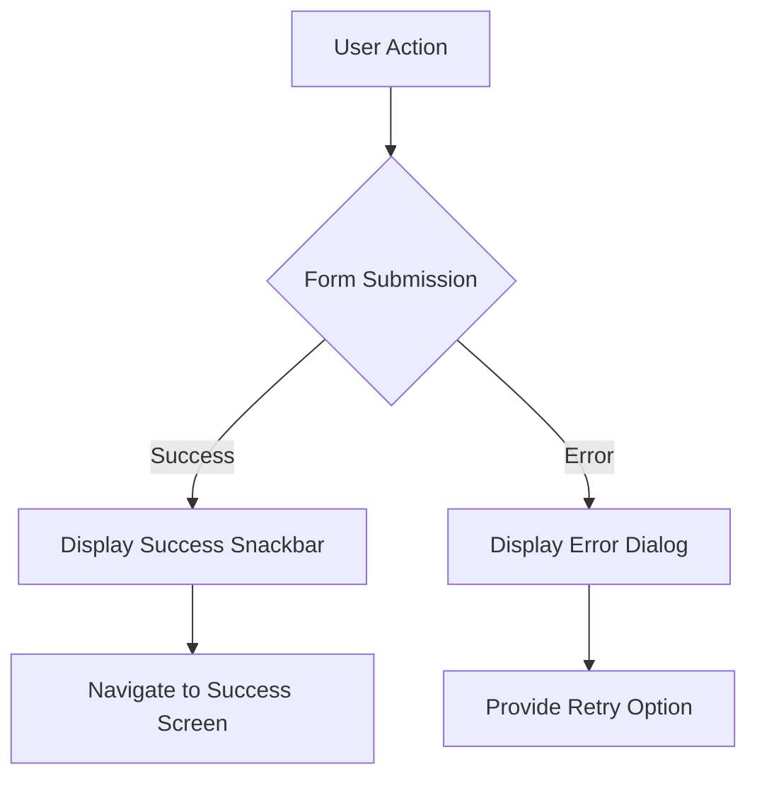

## 5.4.4 Providing User Feedback

In the journey of developing a Flutter app, one of the critical aspects of user experience is how we provide feedback to users. Feedback can significantly enhance user satisfaction and engagement by ensuring users feel informed and in control of their interactions with your app. This section will guide you through the best practices for providing feedback after form submissions, including success and error messages, navigation strategies, and form resetting techniques.

### Importance of User Feedback

User feedback is an essential component of user interface design. It helps users understand the outcome of their actions, whether successful or erroneous. Without proper feedback, users may feel lost or frustrated, leading to a poor user experience. Effective feedback should be timely, clear, and aligned with the app's overall design and tone.

### Success Messages

Success messages inform users that their actions have been completed successfully. In Flutter, success messages can be displayed using dialogs or snackbars. Let's explore these options in detail.

#### Using Snackbars for Success Messages

Snackbars are a lightweight and non-intrusive way to provide feedback. They appear at the bottom of the screen and disappear automatically after a short duration, making them ideal for brief messages like form submission confirmations.

**Example: Displaying a Snackbar**

```dart
ScaffoldMessenger.of(context).showSnackBar(
  SnackBar(content: Text('Form submitted successfully')),
);
```

In this example, `ScaffoldMessenger` is used to display a `SnackBar` with a simple success message. The `SnackBar` widget is highly customizable, allowing you to adjust its duration, action buttons, and more.

#### Using Dialogs for Success Messages

Dialogs are more prominent than snackbars and require user interaction to dismiss, making them suitable for more critical or detailed messages.

**Example: Displaying a Dialog**

```dart
showDialog(
  context: context,
  builder: (BuildContext context) {
    return AlertDialog(
      title: Text('Success'),
      content: Text('Your form has been submitted successfully.'),
      actions: <Widget>[
        TextButton(
          child: Text('OK'),
          onPressed: () {
            Navigator.of(context).pop();
          },
        ),
      ],
    );
  },
);
```

In this example, an `AlertDialog` is used to display a success message. The dialog includes a title, content, and an action button to close the dialog.

### Error Messages

Error messages are crucial for guiding users when something goes wrong. They should be clear, concise, and provide actionable information to help users correct their mistakes.

#### Displaying Error Messages with Snackbars

Similar to success messages, error messages can also be displayed using snackbars. However, it's essential to differentiate them visually, perhaps by using a different color scheme.

**Example: Displaying an Error Snackbar**

```dart
ScaffoldMessenger.of(context).showSnackBar(
  SnackBar(
    content: Text('Error: Please check your input and try again.'),
    backgroundColor: Colors.red,
  ),
);
```

In this example, the `SnackBar` is styled with a red background to indicate an error, making it easily distinguishable from success messages.

#### Providing Detailed Error Information with Dialogs

For more complex errors, dialogs can be used to provide detailed information and possible solutions.

**Example: Displaying an Error Dialog**

```dart
showDialog(
  context: context,
  builder: (BuildContext context) {
    return AlertDialog(
      title: Text('Submission Error'),
      content: Text('There was an error submitting your form. Please try again later.'),
      actions: <Widget>[
        TextButton(
          child: Text('Retry'),
          onPressed: () {
            Navigator.of(context).pop();
            // Retry logic here
          },
        ),
        TextButton(
          child: Text('Cancel'),
          onPressed: () {
            Navigator.of(context).pop();
          },
        ),
      ],
    );
  },
);
```

This dialog provides users with options to retry the action or cancel, offering a more interactive error handling approach.

### Navigation After Submission

After a successful form submission, you might want to redirect users to a different screen, such as a confirmation page or the main dashboard. This can be achieved using Flutter's navigation system.

**Example: Navigating to Another Screen**

```dart
Navigator.pushReplacement(
  context,
  MaterialPageRoute(builder: (context) => SuccessScreen()),
);
```

In this example, `Navigator.pushReplacement` is used to navigate to a new screen, replacing the current one in the navigation stack. This is useful when you don't want users to return to the form screen after submission.

### Resetting Forms

Resetting form fields after submission is a good practice to ensure users start with a clean slate for new entries. This can be done by resetting the form's state.

**Example: Resetting a Form**

```dart
final _formKey = GlobalKey<FormState>();

void _resetForm() {
  _formKey.currentState?.reset();
}

// Usage in a form widget
Form(
  key: _formKey,
  child: Column(
    children: <Widget>[
      // Form fields here
      ElevatedButton(
        onPressed: () {
          if (_formKey.currentState?.validate() ?? false) {
            // Process data
            _resetForm();
            ScaffoldMessenger.of(context).showSnackBar(
              SnackBar(content: Text('Form submitted successfully')),
            );
          }
        },
        child: Text('Submit'),
      ),
    ],
  ),
);
```

In this example, a form is reset using the `reset` method of the form's state. This is typically done after successful validation and processing of the form data.

### Best Practices for User Feedback

1. **Timeliness:** Provide feedback immediately after the user's action to avoid confusion.
2. **Clarity:** Use simple and clear language to communicate the message.
3. **Consistency:** Ensure feedback messages are consistent in style and tone with the rest of the app.
4. **Actionable:** When displaying error messages, provide guidance on how to resolve the issue.
5. **Visual Cues:** Use color and icons to differentiate between different types of messages (e.g., success, error).

### Common Pitfalls and Optimization Tips

- **Overloading Users with Feedback:** Avoid overwhelming users with too many messages. Prioritize critical information.
- **Ignoring Accessibility:** Ensure feedback is accessible to all users, including those using screen readers.
- **Inconsistent Feedback Styles:** Maintain a consistent design language across all feedback messages to avoid confusing users.

### Visual Aids

To enhance understanding, consider using visual aids such as images or diagrams to show how feedback messages appear in your app. This can help readers visualize the implementation and design choices.



### Conclusion

Providing effective user feedback is a vital aspect of app development that can significantly improve user experience. By implementing success and error messages, navigating users appropriately, and resetting forms, you can create a more intuitive and satisfying app experience. Remember to keep feedback timely, clear, and consistent with your app's design.

## Quiz Time!



### What is the primary purpose of providing user feedback in an app?

- [x] To inform users about the outcome of their actions
- [ ] To increase app complexity
- [ ] To make the app look more professional
- [ ] To reduce app performance

> **Explanation:** User feedback helps inform users about the results of their actions, enhancing their understanding and satisfaction.

### Which widget is commonly used in Flutter to display brief messages at the bottom of the screen?

- [ ] Dialog
- [x] Snackbar
- [ ] Tooltip
- [ ] AlertDialog

> **Explanation:** Snackbars are used for brief, non-intrusive messages that appear at the bottom of the screen.

### How can you differentiate error messages from success messages in a Snackbar?

- [x] By using different colors
- [ ] By using different fonts
- [ ] By changing the position of the Snackbar
- [ ] By using a different widget

> **Explanation:** Using different colors helps users quickly identify the nature of the message (e.g., red for errors).

### What method is used to navigate to a new screen while replacing the current one in Flutter?

- [ ] Navigator.push
- [x] Navigator.pushReplacement
- [ ] Navigator.pop
- [ ] Navigator.pushNamed

> **Explanation:** `Navigator.pushReplacement` replaces the current screen with a new one in the navigation stack.

### What is a good practice after successfully submitting a form?

- [x] Resetting the form fields
- [ ] Keeping the form data intact
- [ ] Closing the app
- [ ] Logging out the user

> **Explanation:** Resetting the form fields ensures users can start fresh for new entries.

### What is the role of the `GlobalKey<FormState>` in a Flutter form?

- [x] To manage the form's state
- [ ] To provide a unique identifier for the form
- [ ] To store form data
- [ ] To handle form validation

> **Explanation:** `GlobalKey<FormState>` is used to manage and access the form's state for operations like validation and resetting.

### Why is it important to provide actionable error messages?

- [x] To help users correct their mistakes
- [ ] To increase app complexity
- [ ] To make the app look more professional
- [ ] To reduce app performance

> **Explanation:** Actionable error messages guide users on how to resolve issues, improving the user experience.

### How can you ensure feedback messages are accessible to all users?

- [x] By considering accessibility features like screen readers
- [ ] By using complex language
- [ ] By minimizing feedback messages
- [ ] By using small font sizes

> **Explanation:** Ensuring feedback messages are compatible with accessibility features like screen readers makes them accessible to all users.

### What is a common pitfall when providing user feedback?

- [x] Overloading users with too many messages
- [ ] Using consistent feedback styles
- [ ] Providing timely feedback
- [ ] Using clear language

> **Explanation:** Overloading users with too many messages can overwhelm them and reduce the effectiveness of feedback.

### True or False: Dialogs are more suitable for brief messages than snackbars.

- [ ] True
- [x] False

> **Explanation:** Snackbars are more suitable for brief messages, while dialogs are better for more detailed or critical information.


